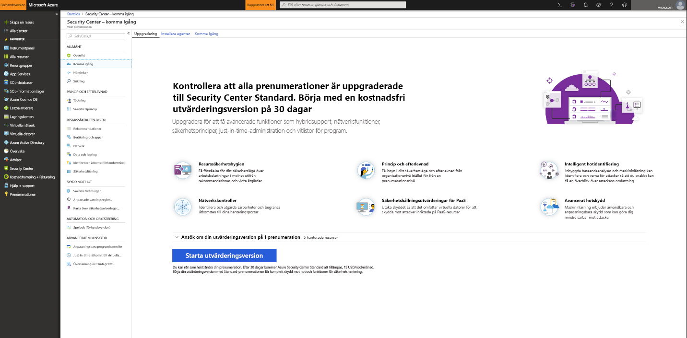
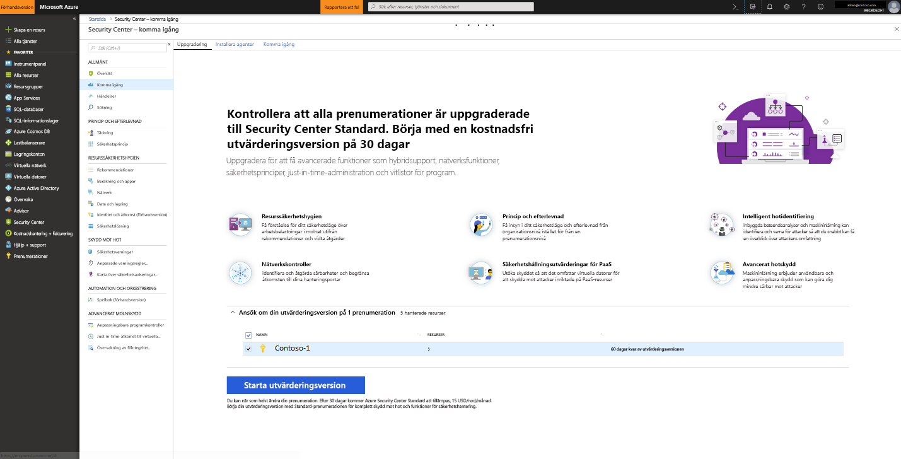

# Kom igång med Azure Security Center Standard för ökad säkerhet
Uppgradera till Security Center Standard att dra nytta av förbättrad säkerhetshantering och skydd mot hot i dina hybridmolnarbetsbelastningar.  Du kan prova Standard kostnadsfritt under 60 dagar. Se de Säkerhetscenter [prissättningssidan](https://azure.microsoft.com/pricing/details/security-center/) för mer information.

Security Center Standard omfattar:

- **Hybridsäkerhet** – få en enhetlig vy över säkerheten i alla dina lokala och molnbaserade arbetsbelastningar. Tillämpa säkerhetsprinciper och utvärdera säkerheten för dina hybridmolnarbetsbelastningar för att säkerställa att säkerhetsstandarder kontinuerligt. Samla in, sök efter och analysera säkerhetsdata från flera olika källor, till exempel brandväggar och andra partnerlösningar.
- **Avancerad hotidentifiering** -Använd avancerade analyser och Microsoft Intelligent Security Graph för att få en kant med utvecklas cyberattacker.  Utnyttja inbyggda beteendeanalyser och maskinlärning för att identifiera attacker och nolldagarshot. Övervaka nätverk, datorer och molntjänster för att se inkommande attacker och aktiviteter efter intrång. Effektiviseras undersökningen med interaktiva verktyg och kontextbaserad hotinformation.
- **Åtkomst- och programkontroll** – blockera skadliga och andra oönskade program genom att tillämpa rekommendationer anpassas efter dina specifika arbetsbelastningar och drivs av maskininlärning. Minska nätverkskontakter med just-in-time och kontrollerad åtkomst till hanteringsportar på virtuella Azure-datorer drastiskt minska exponeringen för råstyrkeattacker och andra nätverksattacker.

## Identifiera oskyddade resurser     
Security Center identifierar automatiskt eventuella Azure-prenumerationer eller arbetsytor som inte är aktiverade för Security Center Standard. Det inkluderar Azure-prenumerationer med Security Center – Kostnadsfri och arbetsytor som inte har någon aktiverad säkerhetslösning.

Du kan uppgradera en hel Azure-prenumeration till standardnivån som ärvs av alla resurser i prenumerationen, eller du kan definiera en unik princip för att uppgradera en specifik resursgrupp endast. Om resursen grupprincipinställningar är unika, åsidosätter inte Security Center prissättning principerna när du uppgraderar prenumerationen till standardnivån. Tillämpning av standarden nivå till en prenumeration gäller endast för de virtuella datorer i prenumerationen som rapporterar till arbetsytor som skapats av Security Center. Tillämpning av standarden nivån till arbetsytan som gäller för alla resurser som rapporterar till arbetsytan.

> [!NOTE]
> Du kanske vill hantera dina kostnader och begränsa mängden data som samlas in för en lösning genom att begränsa den till en viss uppsättning med agenter. [Lösningsmål](../operations-management-suite/operations-management-suite-solution-targeting.md) kan du använda ett omfång till lösningen och rikta en delmängd av datorerna i arbetsytan.  Om du använder lösningsmål visas arbetsytan som inte har en lösning i Security Center.
>
>

## Uppgradera ett Azure-prenumeration eller arbetsyta
Uppgradera en prenumeration eller en arbetsyta till Standard:
1. Huvudmenyn i Security Center, Välj **komma igång**.
  
2. Under **uppgradera**, listar Security Center prenumerationer och arbetsytor som är behöriga för registrering. 
   - Du kan klicka på den expanderbara **gäller din utvärderingsversion** att se en lista över alla prenumerationer och arbetsytor med deras utvärderingsversion berättigande status.
   -    Du kan uppgradera prenumerationer och arbetsytor som inte är berättigade till utvärderingsversionen.
   -    Du kan välja berättigade arbetsytor och prenumerationer Påbörja din utvärderingsperiod.
3.  Klicka på **starta utvärdering** Påbörja din utvärderingsperiod på de valda prenumerationerna.
  

   > [!NOTE]
   > Security Centers kostnadsfria funktioner som tillämpas på virtuella datorer i Azure endast. De kostnadsfria funktionerna tillämpas inte på icke-Azure-datorer. Om du väljer Standard tillämpas Standard-funktionerna på alla virtuella Azure-datorer och icke-Azure-datorer som rapporterar till arbetsytan. Vi rekommenderar att du tillämpar Standard för att tillhandahålla avancerad säkerhet för Azure- och icke-Azure-resurser.
   >
   >

## Publicera icke-Azure-datorer
Security Center kan övervaka säkerhetsstatusen för icke-Azure-datorer men du måste först publicera dessa resurser. Du kan lägga till icke-Azure-datorer från den **komma igång** bladet eller från den **Compute** bladet. Vi gå igenom båda metoderna.

### Lägga till nya Azure-datorer från **komma igång**

1. Gå tillbaka till **komma igång**.   
2. Välj den **börjar** fliken.

  

3. Klicka på **konfigurera** under **lägga till nya Azure-datorer**. En lista över dina logganalysarbetsytor visas. Om det är tillämpligt innehåller listan standardarbetsytan som har skapats för dig av Security Center när automatisk etablering aktiverades. Välj den här arbetsytan eller någon annan arbetsyta som du vill använda.

  ![Lägga till en dator som inte är en Azure-dator][7]

Om du har befintliga arbetsytor kan de visas under **lägga till nya icke-Azure-datorer**. Du kan lägga till datorer till en befintlig arbetsyta eller skapa en ny arbetsyta. Klicka på länken om du vill skapa en ny arbetsyta **lägga till en ny arbetsyta**.

### Lägga till nya Azure-datorer från **Compute**

**Skapa en ny arbetsyta och lägger till datorn**

1. Under **lägga till nya Azure-datorer**väljer **lägga till en ny arbetsyta**.

   ![Lägg till en ny arbetsyta][4]

2. Under **säkerhet och granskning**väljer **OMS-arbetsyta** att skapa en ny arbetsyta.
3. Under **OMS-arbetsyta**, anger du informationen för din arbetsyta.
4. Under **OMS-arbetsyta**väljer **OK**.  När du väljer OK, du får en länk för att hämta en Windows- eller Linux-agent och nycklar för arbetsyte-ID för användning vid konfigureringen av agenten.
5. Under **säkerhet och granskning**väljer **OK**.

**Välj en befintlig arbetsyta och Lägg till dator**

Du kan lägga till en dator genom att följa arbetsflödet från **Onboarding**, enligt ovan. Du kan också lägga till en dator genom att följa arbetsflödet från **Compute**. I det här exemplet använder vi **Compute**.

1. Återgå till huvudmenyn i Security Center och **översikt** instrumentpanelen.

   ![Översikt][5]

2. Välj **Compute och appar**.
3. Under **Compute och appar**väljer **lägga till datorer**.

   ![Compute-bladet][6]

4. Under **lägga till nya Azure-datorer**, Välj en arbetsyta för att ansluta datorn till och klicka på **Lägg till datorer**.

   ![Lägga till datorer][7]

 Den **Direktagent** bladet innehåller en länk för att ladda ned en Windows- eller Linux-agent och nycklar för arbetsyte-ID för användning vid konfigureringen av agenten.   

## Nästa steg
I den här artikeln beskrivs hur du integrera Azure och icke-Azure-resurser för att kunna dra nytta av avancerad säkerhet i Security Center.  Om du vill göra mer med din integrerade resurser finns i

- [Aktivera datainsamling](security-center-enable-data-collection.md)
- [Hotinformationsrapport](security-center-threat-report.md)
- [Just-in-time-åtkomst till virtuell dator](security-center-just-in-time.md)

<!--Image references-->
[1]: ./media/security-center-onboarding/onboard.png
[2]: ./media/security-center-onboarding/onboard-subscription.png
[3]: ./media/security-center-onboarding/get-started.png
[4]: ./media/security-center-onboarding/create-workspace.png
[5]: ./media/security-center-onboarding/overview.png
[6]: ./media/security-center-onboarding/compute-blade.png
[7]: ./media/security-center-onboarding/add-computer.png
[8]: ./media/security-center-onboarding/onboard-workspace.png
