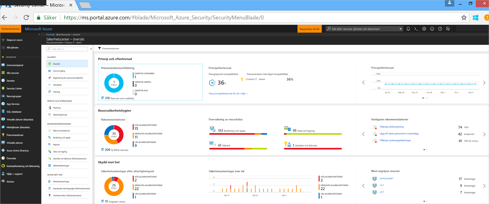
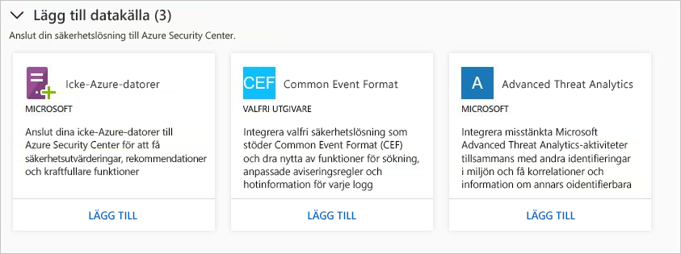
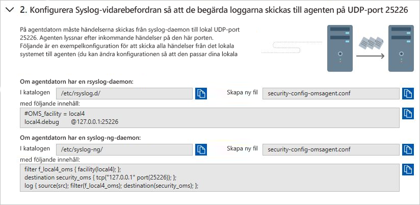
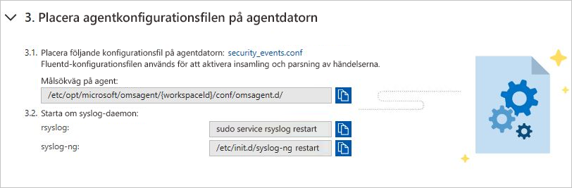
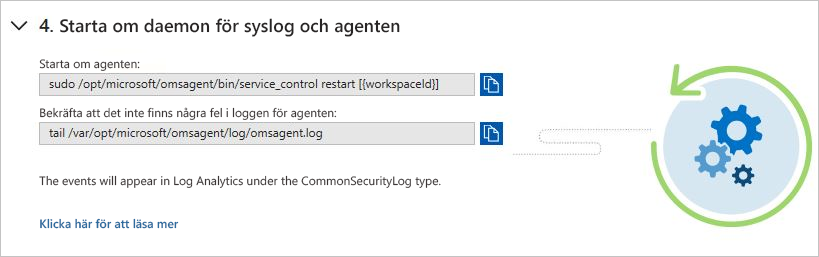
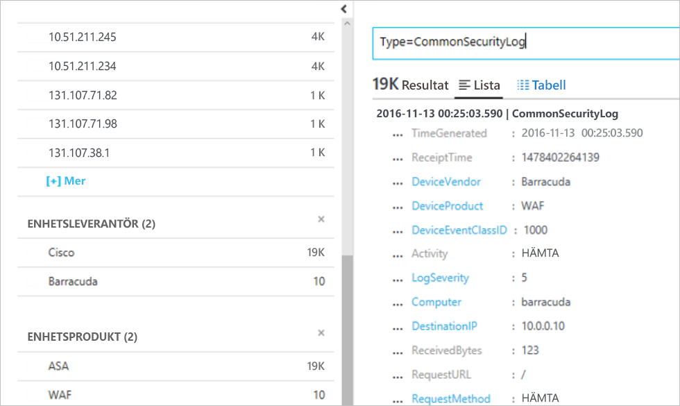

# Integrera säkerhetslösningar i Azure Security Center
Det här dokumentet hjälper dig att hantera säkerhetslösningar som redan är anslutna till Azure Security Center och lägga till nya.

## Integrerade Azure-säkerhetslösningar
Med Security Center är det enkelt att aktivera integrerade säkerhetslösningar i Azure. Fördelarna innefattar:

- **Förenklad distribution**: Security Center erbjuder effektiviserad etablering av integrerade partnerlösningar. Security Center kan etablera den nödvändiga agenten på dina virtuella datorer för lösningar som program mot skadlig kod och utvärdering av säkerhetsrisker. Security Center kan även hantera många nätverkskonfigurationer som krävs för brandväggsinstallationer.
- **Integrerade identifieringar**: Säkerhetshändelser från partnerlösningar samlas in, aggregeras och visas automatiskt som en del av aviseringarna och incidenterna i Security Center. Dessa händelser kombineras också med identifieringar från andra källor för att tillhandahålla funktioner för avancerad hotidentifiering.
- **Enhetlig hälsoövervakning och hantering**: Kunder kan använda integrerade hälsohändelser för att få en snabbövervakning av alla partnerlösningar. Grundläggande hantering finns tillgängligt med enkel åtkomst till avancerad konfiguration med hjälp av partnerlösningen.

Integrerade säkerhetslösningar omfattar för närvarande följande:

- Brandvägg för webbaserade program ([Barracuda](https://www.barracuda.com/products/webapplicationfirewall), [F5](https://support.f5.com/kb/en-us/products/big-ip_asm/manuals/product/bigip-ve-web-application-firewall-microsoft-azure-12-0-0.html), [Imperva](https://www.imperva.com/Products/WebApplicationFirewall-WAF), [Fortinet](https://www.fortinet.com/products.html) och [Azure Application Gateway](https://azure.microsoft.com/blog/azure-web-application-firewall-waf-generally-available/))
- Nästa generations brandvägg ([Check Point](https://www.checkpoint.com/products/vsec-microsoft-azure/), [Barracuda](https://campus.barracuda.com/product/nextgenfirewallf/article/NGF/AzureDeployment/), [Fortinet](https://docs.fortinet.com/d/fortigate-fortios-handbook-the-complete-guide-to-fortios-5.2) och [Cisco](https://www.cisco.com/c/en/us/td/docs/security/firepower/quick_start/azure/ftdv-azure-qsg.html) och [Palo Alto Networks](https://www.paloaltonetworks.com/products))
- Sårbarhetsbedömning ([Qualys](https://www.qualys.com/public-clouds/microsoft-azure/) och [Rapid7](https://www.rapid7.com/products/insightvm/))

> [!NOTE]
> Security Center installerar inte Microsoft Monitoring Agent på virtuella partnerenheter eftersom de flesta säkerhetsleverantörer inte tillåter att externa agenter körs på deras enhet.
>
>

## Så här integreras säkerhetslösningar
Azure-säkerhetslösningar som distribueras från Security Center ansluts automatiskt. Du kan även ansluta andra datakällor för säkerhet, till exempel:

- Azure AD Identity Protection
- Datorer som körs lokalt eller i andra moln
- Säkerhetslösning som stöder Common Event Format (CEF)
- Microsoft Advanced Threat Analytics

## Hantera integrerade Azure-säkerhetslösningar och andra datakällor

1. Logga in på [Azure Portal](https://azure.microsoft.com/features/azure-portal/).

2. På menyn **Microsoft Azure** väljer du **Security Center**. **Security Center – Översikt** öppnas.

3. På menyn i Security Center väljer du **Säkerhetslösningar**.

   

Under **Säkerhetslösningar** kan du se information om hälsostatus för integrerade Azure-säkerhetslösningar och utföra grundläggande hanteringsåtgärder. Du kan även ansluta andra typer av datakällor för säkerhet, t.ex. Azure Active Directory Identity Protection-aviseringar och brandväggsloggar i Common Event Format (CEF).

### Anslutna lösningar

Avsnittet **Anslutna lösningar** innehåller säkerhetslösningar som för närvarande är anslutna till Security Center samt information om hälsostatusen för varje lösning.  

Status för en partnerlösning kan vara:

* Felfritt (grönt) - det finns inga problem.
* Inte väl skyddad (röd): Det finns säkerhetsproblem som måste åtgärdas omedelbart.
* Problem med hälsotillstånd (orange) - lösningen har slutat rapportera dess hälsa.
* Inga rapporter (grå) - lösningen har inte rapporterat något ännu, status för en lösning kan vara orapporterad om den nyligen har anslutits och fortfarande pågår eller inga health-data är tillgängliga.

> [!NOTE]
> Om hälsodata status inte är tillgänglig visar Security Center datum och tid för senaste händelsen togs emot för att indikera om lösningen rapporterar eller inte. Om inga health-data är tillgängliga och inga aviseringar tas emot inom de senaste 14 dagarna, anger Security Center att lösningen är defekt eller inte reporting.
>
>

1. Välj **visa** för ytterligare information och alternativ, vilket inkluderar:

   - **Lösningskonsol**. Öppnar hanteringsupplevelse för den här lösningen.
   - **Länka VM**. Öppnas bladet länka program. Här kan du ansluta resurser till partnerlösningen.
   - **Ta bort lösningen**.
   - **Konfigurera**.

   

### Identifierade lösningar

Security Center identifierar automatiskt säkerhetslösningar som körs i Azure men som inte är anslutna till Security Center. Lösningarna visas i avsnittet **Identifierade lösningar**. Detta omfattar Azure-lösningar som [Azure AD Identity Protection](https://docs.microsoft.com/azure/active-directory/active-directory-identityprotection) samt partnerlösningar.

> [!NOTE]
> Standardnivån av Security Center krävs på prenumerationsnivån för funktionen identifierade lösningar. Mer information om prisalternativen för Security finns i [Priser](security-center-pricing.md).
>
>

Välj **ANSLUT** under en lösning om du vill integrera den med Security Center och få säkerhetsaviseringar.

Security Center identifierar också lösningar som distribueras i prenumerationen och som kan vidarebefordra CEF-loggar (Common Event Format). Läs om hur du [ansluter en säkerhetslösning](quick-security-solutions.md) som använder CEF-loggar till Security Center.

### Lägg till datakällor

Avsnittet **Lägg till datakällor** innehåller andra tillgängliga datakällor som kan anslutas. Om du vill få anvisningar om att lägga till data från någon av dessa källor klickar du på **LÄGG TILL**.

### Ansluta externa lösningar

Förutom att samla in säkerhetsdata från datorerna kan du integrer säkerhetsdata från en mängd andra säkerhetslösningar, däribland alla som stöder Common Event Format (CEF). CEF är ett branschstandardformat ovanpå Syslog-meddelanden som används av många säkerhetsleverantörer för att händelser ska kunna integreras mellan olika plattformar.

I den här snabbstarten får du veta hur du:
- Ansluter en säkerhetslösning till Security Center med CEF-loggar
- Verifierar anslutningen med säkerhetslösningen

#### Nödvändiga komponenter
Du måste ha en prenumeration på Microsoft Azure för att komma igång med Security Center. Om du inte har någon prenumeration kan du registrera dig för ett [kostnadsfritt konto](https://azure.microsoft.com/free/).

För att gå igenom den här självstudien måste du ha standardnivån i Security Center. Du kan prova Security Center Standard utan kostnad. Snabbstarten för att [registrera Azure-prenumerationen till Security Center Standard](security-center-get-started.md) vägleder dig genom uppgraderingen till Standard. Mer information finns på [prissidan](https://azure.microsoft.com/pricing/details/security-center/).

Du behöver också en [Linux-dator](https://docs.microsoft.com/azure/log-analytics/log-analytics-agent-linux) med en Syslog-tjänst som redan är ansluten till Security Center.

#### Ansluta lösning med CEF

1. Logga in på [Azure-portalen](https://azure.microsoft.com/features/azure-portal/).
2. På menyn **Microsoft Azure** väljer du **Security Center**. **Security Center – Översikt** öppnas.

      

3. På huvudmenyn i Security Center väljer du **Säkerhetslösningar**.
4. På sidan Security Solutions, under **Lägg till datakällor (3)** klickar du på **Lägg till** under **Common Event Format**.

    

5. På sidan Common Event Format-loggar expanderar du det andra steget, **Konfigurera Syslog-vidarebefordran så att de begärda loggarna skickas till agenten på UDP-port 25226**, och följer instruktionerna nedan på Linux-datorn:

    

6. Expandera det tredje steget, **Placera agentkonfigurationsfilen på agentdatorn**, och följ instruktionerna nedan på Linux-datorn:

    

7. Expandera det fjärde steget, **Starta om syslog-daemon och agenten**, och följ instruktionerna nedan på Linux-datorn:

    

#### Verifiera anslutningen

Innan du fortsätter med stegen nedan måste du vänta tills syslog-enheten börjar rapportera till Security Center. Det kan ta lite tid och varierar beroende på miljöns storlek.

1.  I den vänstra rutan i Security Center-instrumentpanelen klickar du på **Sök**.
2.  Välj arbetsytan som Syslog-enheten (Linux-dator) är ansluten till.
3.  Skriv *CommonSecurityLog* och klicka på knappen **Sök**.

I följande exempel visar resultatet av de här stegen: 

#### Rensa resurser
De andra snabbstarterna och självstudierna i den här samlingen bygger på den här snabbstarten. Om du tänker fortsätta med att arbeta med efterföljande snabbstarter och självstudier ska du fortsätta att köra Standard-nivån och ha automatisk etablering aktiverad. Om du inte tänker fortsätta eller vill återgå till den kostnadsfria nivån:

1. Återgå till huvudmenyn i Security Center och välj **Säkerhetsprincip**.
2. Välj den prenumeration eller princip du vill ska återgå till den kostnadsfria nivån. **Säkerhetsprincip** öppnas.
3. Under **PRINCIPKOMPONENTER** väljer du **Prisnivå**.
4. Välj **Kostnadsfri** om du vill byta prenumeration från Standard-nivån till den kostnadsfria nivån.
5. Välj **Spara**.

Om du vill avaktivera automatisk etablering:

1. Återgå till huvudmenyn i Security Center och välj **Säkerhetsprincip**.
2. Välj den prenumeration du vill avaktivera automatisk etablering för.
3. Under **Säkerhetsprincip – Datainsamling** väljer du **Av** under **Registrering** för att inaktivera automatisk etablering.
4. Välj **Spara**.

>[!NOTE]
> Inaktivering av automatisk etablering tar inte bort Microsoft Monitoring Agent från virtuella Azure-datorer där agenten har etablerats. Inaktivering av automatisk etablering begränsar säkerhetsövervakningen för dina resurser.
>

## Exporterar data till en SIEM

Bearbetade händelser som genereras av Azure Security Center publiceras till Azure [aktivitetsloggen](../monitoring-and-diagnostics/monitoring-overview-activity-logs.md), någon av loggen skriver tillgängliga i Azure Monitor. Azure Monitor erbjuder en konsoliderad pipeline för routning någon av dina övervakade data i ett SIEM-verktyg. Detta görs genom att dessa data till en Händelsehubb där det kan sedan hämtas för direktuppspelning i ett partner-verktyg.

Den här pipe använder den [Azure Monitoring enkel rörledning](../azure-monitor/platform/stream-monitoring-data-event-hubs.md) för att få åtkomst till övervakningsdata från Azure-miljön. På så sätt kan du enkelt konfigurera Siem och övervakningsverktyg för att använda data.

I nästa avsnitt beskrivs hur du kan konfigurera data strömmas till en händelsehubb. Förutsätter vi att du redan har konfigurerats i din Azure-prenumeration för Azure Security Center.

Översikt på hög nivå

### Vad är Azure-säkerhetsdata som är exponerade för SIEM?

I den här versionen vi exponerar den [säkerhetsaviseringar.](../security-center/security-center-managing-and-responding-alerts.md) Vi kommer berika datauppsättningen med säkerhetsrekommendationer i kommande versioner.

### Så här konfigurerar du pipelinen

#### Skapa en händelsehubb

Innan du börjar måste du [skapa ett namnområde för Event Hubs](../event-hubs/event-hubs-create.md). Den här namnområde och en Händelsehubb är målet för alla dina övervakningsdata.

#### Stream Azure-aktivitetsloggen till Event Hubs

Se följande artikel [strömma aktivitetsloggen till Event Hubs](../azure-monitor/platform/activity-logs-stream-event-hubs.md)

#### Installera en partneranslutningsapp 

Routning övervakningsdata till en Event Hub med Azure Monitor kan du lätt kan integrera med partner SIEM och övervakningsverktyg.

Finns på följande länk för att se en lista över [SIEMs som stöds](../azure-monitor/platform/stream-monitoring-data-event-hubs.md#what-can-i-do-with-the-monitoring-data-being-sent-to-my-event-hub)

### Exempel för att fråga efter data 

Här är några Splunk frågor som du kan använda för att hämta aviseringsdata:

| **Beskrivning av fråga** | **Fråga** |
|----|----|
| Alla aviseringar| index = huvudsakliga Microsoft.Security/locations/alerts|
| Sammanfatta antalet åtgärder efter deras namn| index = huvudsakliga sourcetype = ”amal: säkerhet” \| tabell operationName \| stats antal efter operationName|
| Få aviseringar information: Tid, namn, status, ID och prenumeration | index=main Microsoft.Security/locations/alerts \| table \_time, properties.eventName, State, properties.operationId, am_subscriptionId |

## Nästa steg

Den här artikeln berättade om hur man integrerar partnerlösningar i Security Center. I följande artiklar kan du lära dig mer om Security Center:

* [Ansluta Microsoft Advanced Threat Analytics till Azure Security Center](security-center-ata-integration.md)
* [Ansluta Azure Active Directory Identity Protection till Azure Security Center](security-center-aadip-integration.md)
* [Övervakning av säkerhetshälsa i Security Center](security-center-monitoring.md). Lär dig att övervaka hälsotillståndet för dina Azure-resurser.
* [Övervaka partnerlösningar med Security Center](security-center-partner-solutions.md). Lär dig att övervaka hälsotillståndet för dina partnerlösningar.
* [Vanliga frågor och svar om Azure Security Center](security-center-faq.md). Få svar på vanliga frågor om användningen av Security Center.
* [Azure säkerhetsblogg](https://blogs.msdn.com/b/azuresecurity/). Här hittar du blogginlägg om säkerhet och regelefterlevnad i Azure.
