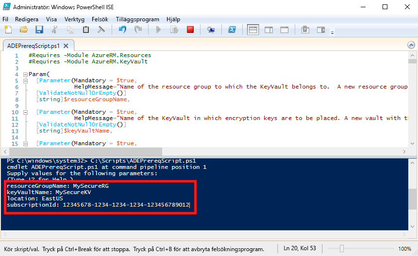

# <a name="quickstart-encrypt-a-windows-iaas-vm-with-azure-powershell"></a>Snabbstart: Kryptera en virtuell Windows IaaS-dator med Azure PowerShell

Med Azure Disk Encryption kan du kryptera IaaS-diskar för virtuella Windows- och Linux-datorer. Lösningen är även integrerad med Azure Key Vault så att du kan kontrollera och hantera diskkrypteringsnycklar och hemligheter. Med Azure Disk-kryptering kan du skydda virtuella datorer i vila med branschstandardkrypteringsteknik. I den här snabbstarten får du skapa en virtuell Windows Server 2016-dator och kryptera OS-disken.

Om du inte har en Azure-prenumeration kan du skapa ett [kostnadsfritt konto](https://azure.microsoft.com/free/?WT.mc_id=A261C142F) innan du börjar.

## <a name="prerequisites"></a>Nödvändiga komponenter

- Windows PowerShell ISE
- Installera eller uppdatera till den [senaste versionen av AzureRM PowerShell-modulen](/powershell/azure/azurerm/install-azurerm-ps?view=azurermps-6.13.0)
    - AzureRM-modulversionen måste vara 6.0.0 eller senare. `Get-Module AzureRM -ListAvailable | Select-Object -Property Name,Version,Path`
- En kopia av [Azure Disk Encryption-skriptet om förhandskrav](https://raw.githubusercontent.com/Azure/azure-powershell/master/src/Compute/Compute/Extension/AzureDiskEncryption/Scripts/AzureDiskEncryptionPreRequisiteSetup.ps1).
    - Om du redan har det här skriptet kan du ladda ned en ny kopia som nyligen har ändrats. 
    - Markera all text med **CTRL + A** och kopiera sedan all text till anteckningar med **CTRL + C**.
    - Spara filen som **ADEPrereqScript.ps1**


## <a name="sign-in-to-azure"></a>Logga in på Azure

1. Högerklicka på **Windows PowerShell ISE** och klicka på **Kör som administratör**.
1. I fönstret **Administratör: Windows PowerShell ISE** klickar du på **Visa** och sedan på **Visa skriptfönster**.
1. I skriptfönstret skriver du följande cmdlet: 

     ```azurepowershell
      Connect-AzureRMAccount
     ```

1. Klicka på den gröna pilen för **Kör skript** eller använd F5. 
2. Slutför anslutningen till Azure-kontot med den interaktiva inloggningen.
3. Kopiera **prenumerations-ID:t** som returneras så att du kan använda det när du kör nästa PowerShell-skript. 

## <a name="bkmk_PrereqScript"></a> Kör Azure Disk Encryption-skriptet om förhandskrav
 **ADEPrereqScript.ps1** skapar en resursgrupp, ett nyckelvalv och anger nyckelvalvets åtkomstprincip. Skriptet skapar även ett resurslås på nyckelvalvet för att skydda det mot oavsiktlig borttagning.  

1. I fönstret **Administratör: Windows PowerShell ISE** klickar du på **Arkiv** och sedan på **Öppna**. Navigera till filen **ADEPrereqScript.ps1** och dubbelklicka på den. Skriptet öppnas i skriptfönstret.
2. Klicka på den gröna pilen för **Kör skript** eller klicka på F5. 
3. Ange namn för en ny **resursgrupp** och ett nytt **nyckelvalv**. Använd inte redan befintliga resursgrupper eller nyckelvalv för den här snabbstarten. Vi ska ta bort resursgruppen senare. 
4. Ange var du vill skapa resurserna, exempelvis **EastUS**. Hämta en innehållsplatslista med `Get-AzureRMLocation`.
5. Kopiera in ditt **prenumerations-ID**. Du kan hämta ditt prenumerations-ID med `Get-AzureRMSubscription`.  
6. Klicka på den gröna pilen för **Kör skript**. 
7. Kopiera returnerade **DiskEncryptionKeyVaultUrl** och **DiskEncryptionKeyVaultId** som ska användas senare.




## <a name="create-a-virtual-machine"></a>Skapa en virtuell dator 
Nu behöver du skapa en virtuell dator så att du kan kryptera disken. Skriptet du använder skapar en virtuell Windows Server 2016-dator med 8 GB RAM-minne och en OS-disk på 30 GB. 

1. Kopiera skriptet till skriptfönstret **administratör: Windows PowerShell ISE** och ändra de tre översta variablerna. Resursgruppen och platsen måste vara desamma som du använde för [skriptet om förhandskrav](#bkmk_PrereqScript).  

   ```azurepowershell
    # Variables for common values
    $resourceGroup = "MySecureRG"
    $location = "EastUS"
    $vmName = "MySecureVM"
    
    # Create user object
    $cred = Get-Credential -Message "Enter a username and password for the virtual machine."
    
    # Create a resource group
    #New-AzureRmResourceGroup -Name $resourceGroup -Location $location
    
    # Create a subnet configuration
    $subnetConfig = New-AzureRmVirtualNetworkSubnetConfig -Name mySubnet -AddressPrefix 192.168.1.0/24
    
    # Create a virtual network
    $vnet = New-AzureRmVirtualNetwork -ResourceGroupName $resourceGroup -Location $location `
      -Name MYvNET -AddressPrefix 192.168.0.0/16 -Subnet $subnetConfig
    
    # Create a public IP address and specify a DNS name
    $pip = New-AzureRmPublicIpAddress -ResourceGroupName $resourceGroup -Location $location `
      -Name "mypublicdns$(Get-Random)" -AllocationMethod Static -IdleTimeoutInMinutes 4
    
    # Create an inbound network security group rule for port 3389
    $nsgRuleRDP = New-AzureRmNetworkSecurityRuleConfig -Name myNetworkSecurityGroupRuleRDP  -Protocol Tcp `
      -Direction Inbound -Priority 1000 -SourceAddressPrefix * -SourcePortRange * -DestinationAddressPrefix * `
      -DestinationPortRange 3389 -Access Allow
    
    # Create a network security group
    $nsg = New-AzureRmNetworkSecurityGroup -ResourceGroupName $resourceGroup -Location $location `
      -Name myNetworkSecurityGroup -SecurityRules $nsgRuleRDP
    
    # Create a virtual network card and associate with public IP address and NSG
    $nic = New-AzureRmNetworkInterface -Name myNic -ResourceGroupName $resourceGroup -Location $location `
      -SubnetId $vnet.Subnets[0].Id -PublicIpAddressId $pip.Id -NetworkSecurityGroupId $nsg.Id
    
    # Create a virtual machine configuration
    $vmConfig = New-AzureRmVMConfig -VMName $vmName -VMSize Standard_D2_v3 | `
    Set-AzureRmVMOperatingSystem -Windows -ComputerName $vmName -Credential $cred | `
    Set-AzureRmVMSourceImage -PublisherName MicrosoftWindowsServer -Offer WindowsServer -Skus 2016-Datacenter-smalldisk -Version latest | `
    Add-AzureRmVMNetworkInterface -Id $nic.Id
    
    # Create a virtual machine
    New-AzureRmVM -ResourceGroupName $resourceGroup -Location $location -VM $vmConfig
   ```

2. Klicka på den gröna pilen för **Kör skript** och bygga den virtuella datorn.  


## <a name="encrypt-the-disk-of-the-vm"></a>Kryptera disken för den virtuella datorn
Nu när du har skapat och konfigurerat ett nyckelvalv och en virtuell dator kan du kryptera disken med cmdlet:en **Set-AzureRmVmDiskEncryptionExtension**. 
 
1. Kör följande cmdlet för att kryptera den virtuella datorns disk:

    ```azurepowershell
     Set-AzureRmVmDiskEncryptionExtension -ResourceGroupName "MySecureRG" -VMName "MySecureVM" `
     -DiskEncryptionKeyVaultId "<Returned by the prerequisites script>" -DiskEncryptionKeyVaultUrl "<Returned by the prerequisites script>"
     ```


1. När krypteringen är klar kan du kontrollera att disken är krypterad med följande cmdlet: 

     ```azurepowershell
     Get-AzureRmVmDiskEncryptionStatus -ResourceGroupName "MySecureRG" -VMName "MySecureVM"
     ```
    
    
## <a name="clean-up-resources"></a>Rensa resurser
 **ADEPrereqScript.ps1** skapar ett resurslås på nyckelvalvet. Om du vill rensa resurser från den här snabbstarten måste du först ta bort resurslåset och sedan ta bort resursgruppen. 

1. Ta bort resurslåset från nyckelvalvet

     ```azurepowershell
     $LockId =(Get-AzureRMResourceLock -ResourceGroupName "MySecureRG" -ResourceName "MySecureVault" -ResourceType "Microsoft.KeyVault/vaults").LockID 
     Remove-AzureRmResourceLock -LockID $LockId
      ```
    
2. Ta bort resursgruppen. Det tar bort alla resurser i gruppen också. 
     ```azurepowershell
      Remove-AzureRmResourceGroup -Name "MySecureRG"
      ```

## <a name="next-steps"></a>Nästa steg
Gå vidare till nästa artikel om du vill veta mer om Azure Disk Encryption-förhandskrav för virtuella IaaS-datorer.

> [!div class="nextstepaction"]
> [Förhandskrav för Azure-diskkryptering](azure-security-disk-encryption-prerequisites.md)