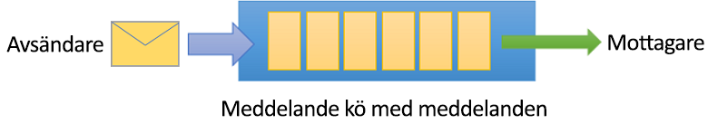
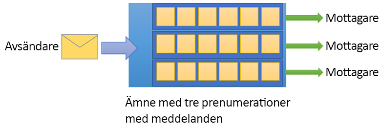

# Vad är Azure Service Bus?

Microsoft Azure Service Bus är en helt hanterad integrerad meddelandekoordinator för företag. Service Bus kan frikoppla program och tjänster. Service Bus erbjuder en tillförlitlig och säker plattform för asynkron överföring av data och tillstånd.

Data överförs mellan olika program och tjänster med *meddelanden*. Ett meddelande är i binärformat och kan innehålla JSON, XML eller bara text. Mer information finns i [integrerings tjänster](https://azure.com/integration).

Några vanliga scenarier för meddelanden är:

* *Meddelanden*. Överför affärs data, till exempel försäljnings-eller inköps order, journaler eller lager förflyttningar.
* Frikopplade *program*. Förbättra tillförlitligheten och skalbarheten för program och tjänster. Klienten och tjänsten behöver inte vara online samtidigt.
* *Ämnen och prenumerationer*. Aktivera 1:*n* relationer mellan utgivare och prenumeranter.
* *Message-sessioner*. Implementera arbets flöden som kräver meddelande ordning eller meddelande avstängning.

## Namnrymder

Ett namn område är en behållare för alla meddelande komponenter. Flera köer och ämnen kan finnas i ett enda namn område och namn områden fungerar ofta som program behållare.

## Köer

Meddelanden skickas till och tas emot från *köer*. Köer lagrar meddelanden tills det mottagande programmet är tillgängligt för att ta emot och bearbeta dem.

Meddelanden i köer ordnas och tidsstämplas vid ankomsten. När de har godkänts lagras meddelanden på ett säkert sätt i redundant lagring. Meddelanden levereras i *pull* -läge och levererar bara meddelanden när de begärs.

## Ämnen

Du kan också använda *ämnen* för att skicka och ta emot meddelanden. Medan en kö oftast används för kommunikation från punkt till punkt är ämnen användbara i scenarier med publicering/prenumeration.

Ämnen kan ha flera oberoende prenumerationer. En prenumerant på ett ämne får en kopia av varje meddelande. Prenumerationer kallas entiteter. Prenumerationerna är kvar, men kan förfalla eller autota bort.

Du kanske inte vill att enskilda prenumerationer ska ta emot alla meddelanden som skickas till ett ämne. I så fall kan du använda *regler* och *filter* för att definiera villkor som utlöser valfria *åtgärder*. Du kan filtrera angivna meddelanden och ange eller ändra meddelande egenskaper. Mer information finns i [avsnittet filter och åtgärder](topic-filters.md).

## Avancerade funktioner

Service Bus innehåller avancerade funktioner som gör att du kan lösa mer komplexa meddelande problem. I följande avsnitt beskrivs flera av de här funktionerna.

### Meddelandesessioner

Om du vill skapa en första in-och utgångs-(FIFO) garanti i Service Bus använder du sessioner. Meddelandesessioner aktiverar gemensamma och organiserad hantering av frigjorda sekvenser av relaterade meddelanden. Mer information finns i [meddelande sessioner: först in, först ut (FIFO)](message-sessions.md).

### Vidarebefordrar

Funktionen vidarebefordran länkar en kö eller en prenumeration till en annan kö eller ämne. De måste ingå i samma namnrymd. Med automatisk vidarebefordran tar Service Bus automatiskt bort meddelanden från en kö eller prenumeration och placerar dem i en annan kö eller ett annat ämne. Mer information finns i [länkning Service Bus entiteter med vidarebefordran](service-bus-auto-forwarding.md).

### Kö för obeställbara meddelanden

Service Bus stöder en kö för obeställbara meddelanden (DLQ). En DLQ innehåller meddelanden som inte kan levereras till någon mottagare. Den innehåller meddelanden som inte kan bearbetas. Med Service Bus kan du ta bort meddelanden från DLQ och granska dem. Mer information finns i [Översikt över Service Bus köer för obeställbara meddelanden](service-bus-dead-letter-queues.md).

### Schemalagd leverans

Du kan skicka meddelanden till en kö eller ett ämne för fördröjd bearbetning. Du kan schemalägga att ett jobb ska bli tillgängligt för bearbetning av ett system vid en viss tidpunkt. Mer information finns i [schemalagda meddelanden](message-sequencing.md#scheduled-messages).

### Skjut upp meddelanden

En kö-eller prenumerations klient kan skjuta upp hämtningen av ett meddelande till ett senare tillfälle. Detta kan bero på särskilda omständigheter i programmet. Meddelandet finns kvar i kön eller prenumerationen, men det har tagits bort. Mer information finns i [meddelande avstängning](message-deferral.md).

### Batchbearbetning

Med klientsidans batchbearbetning förhindras en kö- eller ämnesklient från att skicka ett meddelande under en viss tidsperiod. Om klienten skickar ytterligare meddelanden under den här tiden överförs dessa meddelanden i en enskild batch. Mer information finns i [batching av klient sidan](service-bus-performance-improvements.md#client-side-batching).

### Transaktioner

En transaktion grupper två eller flera åtgärder tillsammans i ett *körnings område*. Service Bus stöder gruppering av åtgärder mot en enskild meddelande enhet inom omfånget för en enskild transaktion. En Message-entitet kan vara en kö, ett ämne eller en prenumeration. Mer information finns i [Översikt över Service Bus transaktions bearbetning](service-bus-transactions.md).

### Filtrering och åtgärder

Prenumeranter kan definiera vilka meddelanden som de vill ta emot från ett ämne. Dessa meddelanden anges i form av en eller flera namngivna prenumerationsregler. För varje matchande regel villkor skapar prenumerationen en kopia av meddelandet, som kan vara olika kommenterade för varje matchande regel. Mer information finns i [avsnittet filter och åtgärder](topic-filters.md).

### Ta bort vid inaktivitet

Vid borttagning vid inaktivitet kan du ange ett inaktivt intervall efter vilket en kö tas bort automatiskt. Minimilängden är 5 minuter. Mer information finns i [egenskapen QueueDescription. AutoDeleteOnIdle](/dotnet/api/microsoft.servicebus.messaging.queuedescription.autodeleteonidle).

### Dubblettidentifiering

Ett fel kan orsaka att klienten tvekar om resultatet av en skicka-åtgärd. Dubblettidentifiering gör att avsändaren kan skicka samma meddelande igen. Ett annat alternativ är för kön eller ämnet att ignorera dubbletter av kopior. Mer information finns i [dubblettidentifiering](duplicate-detection.md).

### Geohaveriberedskap

När Azure-regioner eller data Center upplever drift stopp gör den geo-distribuerade haveri beredskap-funktionen att data bearbetningen fortsätter att fungera i en annan region eller data Center. Mer information finns i [Azure Service Bus geo-Disaster Recovery](service-bus-geo-dr.md).

### Säkerhet

Service Bus stöder standard [AMQP 1,0](service-bus-amqp-overview.md) och [http/rest-](/rest/api/servicebus/) protokoll och deras respektive säkerhetsfunktioner, inklusive TLS (Transport Level Security). Klienter kan auktoriseras för åtkomst med hjälp av den Service Bus inbyggda signatur modellen för [delad åtkomst](service-bus-sas.md) eller med [Azure Active Directory](service-bus-authentication-and-authorization.md) rollbaserad säkerhet, antingen med hjälp av reguljära tjänst konton eller Azure Managed identiteter. 

För skydd mot oönskad trafik tillhandahåller Service Bus en mängd [funktioner för nätverks säkerhet](network-security.md), inklusive en IP-filtrerings brand vägg och integrering med Azure och lokala virtuella nätverk.

## Klientbibliotek

Fullständigt stöd för Service Bus klient bibliotek är tillgängliga via Azure SDK.

- [Azure Service Bus för .NET](https://docs.microsoft.com/dotnet/api/overview/azure/service-bus?view=azure-dotnet&preserve-view=true)
- [Azure Service Bus bibliotek för Java](https://docs.microsoft.com/java/api/overview/azure/servicebus?view=azure-java-stable&preserve-view=true)
- [Azure Service Bus Provider för Java JMS 2,0](how-to-use-java-message-service-20.md)
- [Azure Service Bus moduler för Java Script och TypeScript](https://docs.microsoft.com/javascript/api/overview/azure/service-bus?view=azure-node-latest&preserve-view=true)
- [Azure Service Bus bibliotek för python](https://docs.microsoft.com/python/api/overview/azure/servicebus?view=azure-python&preserve-view=true)

[Azure Service Bus primärt protokoll är AMQP 1,0](service-bus-amqp-overview.md) och kan användas från valfri AMQP 1,0-kompatibel protokoll klient. Flera AMQP-klienter med öppen källkod har exempel som tydligt demonstrerar Service Bus samverkan. I [AMQP 1,0-protokoll guiden](service-bus-amqp-protocol-guide.md) hittar du information om hur du använder Service Bus-funktioner med AMQP 1,0-klienter direkt.

| Språk | Bibliotek |
| --- | --- |
| Java | [Apache qpid Proton-J](https://qpid.apache.org/proton/index.html) |
| C/C++ |[Azure UAMQP C](https://github.com/azure/azure-uamqp-c/), [Apache qpid Proton-C](https://qpid.apache.org/proton/index.html) |
| Python |[Azure-uAMQP för python](https://github.com/azure/azure-uamqp-python/), [Apache qpid Proton python](https://qpid.apache.org/releases/qpid-proton-0.32.0/proton/python/docs/overview.html) |
| PHP | [Azure-uAMQP för PHP](https://github.com/vsouz4/azure-uamqp-php/) |
| Ruby | [Apache qpid Proton ruby](https://github.com/apache/qpid-proton/tree/master/ruby) |
| Go | [Azure go-AMQP](https://github.com/Azure/go-amqp), [Apache qpid Proton go](https://github.com/apache/qpid-proton/tree/master/go/examples)
| C#/F #/VB | [AMQP .net lite](https://github.com/Azure/amqpnetlite), [Apache NMS AMQP](https://github.com/apache/activemq-nms-amqp)|
| Java Script/Node | [Rhea](https://github.com/grs/rhea) |

## Integrering

Service Bus är fullständigt integrerat med många Microsoft-och Azure-tjänster, till exempel:

* [Event Grid](https://azure.microsoft.com/services/event-grid/)
* [Logic Apps](https://azure.microsoft.com/services/logic-apps/)
* [Azure Functions](https://azure.microsoft.com/services/functions/)
* [Power Platform](https://powerplatform.microsoft.com/)
* [Dynamics 365](https://dynamics.microsoft.com)
* [Azure Stream Analytics](https://azure.microsoft.com/services/stream-analytics/)

## Nästa steg

Om du vill komma igång med Service Bus-meddelanden, kan du läsa följande artiklar:

* Information om hur du jämför Azure Messaging-tjänster finns i [jämförelse av tjänster](../event-grid/compare-messaging-services.md?toc=%2fazure%2fservice-bus-messaging%2ftoc.json&bc=%2fazure%2fservice-bus-messaging%2fbreadcrumb%2ftoc.json).
* Försök att använda snabb starterna för [.net](service-bus-dotnet-get-started-with-queues.md), [Java](service-bus-java-how-to-use-queues.md)eller [JMS](service-bus-java-how-to-use-jms-api-amqp.md).
* Information om hur du hanterar Service Bus-resurser finns i [Service Bus Explorer](https://github.com/paolosalvatori/ServiceBusExplorer/releases).
* Mer information om standard-och Premium nivåerna och deras priser finns i [Service Bus priser](https://azure.microsoft.com/pricing/details/service-bus/).
* Läs mer om prestanda och svars tider för Premium-nivån i [Premium-meddelanden](https://techcommunity.microsoft.com/t5/Service-Bus-blog/Premium-Messaging-How-fast-is-it/ba-p/370722).
