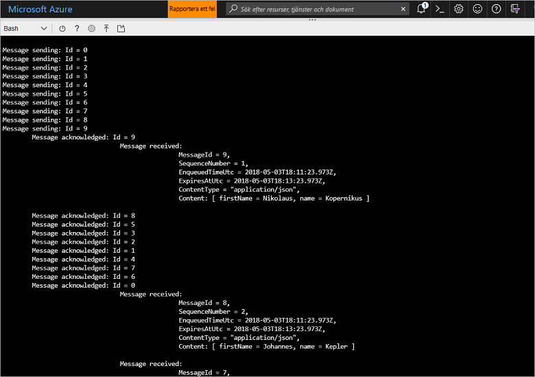

# <a name="quickstart-send-and-receive-messages-using-azure-cli-and-java"></a>Snabbstart: Skicka och ta emot meddelanden med Azure CLI och Java

Microsoft Azure Service Bus är en asynkron meddelandekö för företagsintegrering som erbjuder säkra meddelanden och tillförlitlighet. Ett typiskt scenario för Service Bus innefattar frikoppling av två eller flera program, tjänster eller processer från varandra (program behöver inte vara online samtidigt), överföring av status eller dataändringar och skicka meddelanden mellan programmen. 

En butikskedja kanske skickar sina försäljningsdata till ett backoffice eller regionalt distributionscenter för påfyllning och lageruppdateringar. I det här fallet, skickar klientappen till och tar emot meddelanden från en Service Bus-kö:


Den här snabbstarten beskriver hur du skickar och tar emot meddelanden med Service Bus med hjälp av Azure CLI och Service Bus Java-biblioteket. Slutligen, om du är intresserad av mer teknisk information, kan du [läsa en förklaring](#understand-the-sample-code) av de viktigaste beståndsdelarna i exempelkoden.

Om du inte har en Azure-prenumeration kan du skapa ett [kostnadsfritt konto][] innan du börjar.

[!INCLUDE [cloud-shell-try-it.md](../../includes/cloud-shell-try-it.md)]

## <a name="log-in-to-azure"></a>Logga in på Azure

Klicka på Cloud Shell-knappen på menyn i det övre högra hörnet i Azure-portalen och från listmenyn **Välj miljö**, väljer du **Bash**. 

## <a name="use-cli-to-create-resources"></a>Använd CLI för att skapa resurser

I Cloud Shell, från Bash-prompten, utfärdar du följande kommandon för att etablera Service Bus-resurserna. Tänk på att ersätta alla platshållare med lämpliga värden:

```azurecli-interactive
# Create a resource group
az group create --name myResourceGroup --location eastus

# Create a Service Bus messaging namespace with a unique name
namespaceName=myNameSpace$RANDOM
az servicebus namespace create \
   --resource-group myResourceGroup \
   --name $namespaceName \
   --location eastus

# Create a Service Bus queue
az servicebus queue create --resource-group myResourceGroup \
   --namespace-name $namespaceName \
   --name myQueue

# Get the connection string for the namespace
connectionString=$(az servicebus namespace authorization-rule keys list \
   --resource-group myResourceGroup \
   --namespace-name  $namespaceName \
   --name RootManageSharedAccessKey \
   --query primaryConnectionString --output tsv)
```

Efter att det sista kommandot körts, kopierar och klistrar du in anslutningssträngen och det könamn som du valde till en tillfällig plats, till exempel Anteckningar. Du behöver den i nästa steg.

## <a name="send-and-receive-messages"></a>Skicka och ta emot meddelanden

Efter att du skapat namnområdet och kön och du har de behörigheter som krävs, är du redo att skicka och ta emot meddelanden. Du kan granska koden i [den här GitHub-exempelmappen](https://github.com/Azure/azure-service-bus/tree/master/samples/Java/quickstarts-and-tutorials/quickstart-java/src/main/java/samples/quickstart/SendAndReceiveMessages.java).

1. Se till att Cloud Shell är öppet och visar Bash-prompten.

2. Klona [Service Bus GitHub-lagringsplatsen](https://github.com/Azure/azure-service-bus/) genom att utfärda följande kommando:

   ```bash
   git clone https://github.com/Azure/azure-service-bus.git
   ```

2. Ändra din aktuella katalog till exempelmappen med snedstreck som sökvägsavgränsare:

   ```bash
   cd azure-service-bus/samples/Java/quickstarts-and-tutorials/quickstart-java 
   ```

3. Utfärda följande kommando för att skapa programmet:
   
   ```bash
   mvn clean package -DskipTests
   ```

4. Utfärda följande kommando för att köra programmet. Så länge du inte startade om bash-gränssnittet, ersätts variabeln som innehåller anslutningssträngvärdet automatiskt:

   ```bash
   java -jar ./target/samples.quickstart-1.0.0-jar-with-dependencies.jar -c $connectionString -q myQueue
   ```

6. Observera hur 10 meddelanden skickas till kön. Observera att beställning av meddelanden inte garanteras, men du kan se meddelandena skickas och därefter bekräftas och mottas tillsammans med nyttolastdata:

   

## <a name="clean-up-resources"></a>Rensa resurser

Kör följande kommando för att ta bort resursgruppen, namnområdet och alla relaterade resurser:

```azurecli-interactive
az group delete --resource-group myResourceGroup
```

## <a name="understand-the-sample-code"></a>Förstå exempelkoden

Det här avsnittet innehåller mer information om nyckelavsnitt av exempelkoden. Du kan bläddra koden som finns i GitHub-lagret [här](https://github.com/Azure/azure-service-bus/blob/master/samples/Java/quickstarts-and-tutorials/quickstart-java/src/main/java/samples/quickstart/SendAndReceiveMessages.java).

### <a name="get-connection-string-and-queue"></a>Hämta anslutningssträngen och kön

Koden deklarerar först två strängvariabler som skickas till programmet som argument på kommandoraden:

```java
String ConnectionString = null;
String QueueName = null;
```

Dessa värden läggs till via parametrar och tilldelas i `runApp()`-metoden:

```java
public static void main(String[] args) {
    SendAndReceiveMessages app = new SendAndReceiveMessages();
    try {
        app.runApp(args);
        app.run();
    } catch (Exception e) {
        System.out.printf("%s", e.toString());
    }
    System.exit(0);
}

public void runApp(String[] args) {
    try {
        // parse connection string from command line             
        Options options = new Options();
        options.addOption(new Option("c", true, "Connection string"));
        options.addOption(new Option("q", true, "Queue Name"));
        CommandLineParser clp = new DefaultParser();
        CommandLine cl = clp.parse(options, args);
        if (cl.getOptionValue("c") != null && cl.getOptionValue("q") != null) {
            ConnectionString = cl.getOptionValue("c");
            QueueName =  cl.getOptionValue("q");
        }
        else
        {
            HelpFormatter formatter = new HelpFormatter();
            formatter.printHelp("run jar with", "", options, "", true);
        }

    } catch (Exception e) {
        System.out.printf("%s", e.toString());
    }
}
```

### <a name="create-queue-clients-to-send-and-receive"></a>Skapa köklienter för att skicka och ta emot

För att skicka och ta emot meddelanden, skapar `run()`-metoden instanser av köklienten som skapats från anslutningssträngen och könamnet. Den här koden skapar två köklienter, en för att skicka och en för att ta emot:

```java
public void run() throws Exception {
// Create a QueueClient instance for receiving using the connection string builder
// We set the receive mode to "PeekLock", meaning the message is delivered
// under a lock and must be acknowledged ("completed") to be removed from the queue
QueueClient receiveClient = new QueueClient(new ConnectionStringBuilder(ConnectionString, QueueName), ReceiveMode.PEEKLOCK);
this.registerReceiver(receiveClient);

// Create a QueueClient instance for sending and then asynchronously send messages.
QueueClient sendClient = new QueueClient(new ConnectionStringBuilder(ConnectionString, QueueName), ReceiveMode.PEEKLOCK);
```

`run()`-metoden startar även den asynkrona meddelandesändningsåtgärden och stänger avsändaren när sändningsåtgärden har slutförts:

```java
this.sendMessagesAsync(sendClient).thenRunAsync(() -> sendClient.closeAsync());
``` 

### <a name="construct-and-send-messages"></a>Skapa och skicka meddelanden

`sendMessagesAsync()`-metoden skapar en uppsättning med 10 meddelanden och skickar dem asynkront med hjälp av köklienten:

```java
CompletableFuture<Void> sendMessagesAsync(QueueClient sendClient) {
List<HashMap<String, String>> data =
        GSON.fromJson(
                "[" +
                        "{'name' = 'Einstein', 'firstName' = 'Albert'}," +
                        "{'name' = 'Heisenberg', 'firstName' = 'Werner'}," +
                        "{'name' = 'Curie', 'firstName' = 'Marie'}," +
                        "{'name' = 'Hawking', 'firstName' = 'Steven'}," +
                        "{'name' = 'Newton', 'firstName' = 'Isaac'}," +
                        "{'name' = 'Bohr', 'firstName' = 'Niels'}," +
                        "{'name' = 'Faraday', 'firstName' = 'Michael'}," +
                        "{'name' = 'Galilei', 'firstName' = 'Galileo'}," +
                        "{'name' = 'Kepler', 'firstName' = 'Johannes'}," +
                        "{'name' = 'Kopernikus', 'firstName' = 'Nikolaus'}" +
                        "]",
                new TypeToken<List<HashMap<String, String>>>() {}.getType());

List<CompletableFuture> tasks = new ArrayList<>();
for (int i = 0; i < data.size(); i++) {
    final String messageId = Integer.toString(i);
    Message message = new Message(GSON.toJson(data.get(i), Map.class).getBytes(UTF_8));
    message.setContentType("application/json");
    message.setLabel("Scientist");
    message.setMessageId(messageId);
    message.setTimeToLive(Duration.ofMinutes(2));
    System.out.printf("\nMessage sending: Id = %s", message.getMessageId());
    tasks.add(
            sendClient.sendAsync(message).thenRunAsync(() -> {
                System.out.printf("\n\tMessage acknowledged: Id = %s", message.getMessageId());
            }));
}
return CompletableFuture.allOf(tasks.toArray(new CompletableFuture<?>[tasks.size()]));
```

### <a name="receive-messages"></a>Ta emot meddelanden

`registerReceiver()`-metoden registrerar `RegisterMessageHandler`-motringningen och anger även vissa alternativ för meddelandehanteraren:

```java
void registerReceiver(QueueClient queueClient) throws Exception {
    // register the RegisterMessageHandler callback
    queueClient.registerMessageHandler(new IMessageHandler() {
                           // callback invoked when the message handler loop has obtained a message
                           public CompletableFuture<Void> onMessageAsync(IMessage message) {
                               // receives message is passed to callback
                               if (message.getLabel() != null &&
                                       message.getContentType() != null &&
                                       message.getLabel().contentEquals("Scientist") &&
                                       message.getContentType().contentEquals("application/json")) {
                                    byte[] body = message.getBody();
                                   Map scientist = GSON.fromJson(new String(body, UTF_8), Map.class);

                                   System.out.printf(
                                           "\n\t\t\t\tMessage received: \n\t\t\t\t\t\tMessageId = %s, \n\t\t\t\t\t\tSequenceNumber = %s, \n\t\t\t\t\t\tEnqueuedTimeUtc = %s," +
                                                   "\n\t\t\t\t\t\tExpiresAtUtc = %s, \n\t\t\t\t\t\tContentType = \"%s\",  \n\t\t\t\t\t\tContent: [ firstName = %s, name = %s ]\n",
                                           message.getMessageId(),
                                           message.getSequenceNumber(),
                                           message.getEnqueuedTimeUtc(),
                                           message.getExpiresAtUtc(),
                                           message.getContentType(),
                                           scientist != null ? scientist.get("firstName") : "",
                                           scientist != null ? scientist.get("name") : "");
                               }
                               return CompletableFuture.completedFuture(null);
                           }

                           // callback invoked when the message handler has an exception to report
                           public void notifyException(Throwable throwable, ExceptionPhase exceptionPhase) {
                               System.out.printf(exceptionPhase + "-" + throwable.getMessage());
                           }
                       },
    // 1 concurrent call, messages are auto-completed, auto-renew duration
    new MessageHandlerOptions(1, true, Duration.ofMinutes(1)));

}
```

## <a name="next-steps"></a>Nästa steg

I den här artikeln skapade du ett Service Bus-namnområde och andra resurser som krävs för att skicka och ta emot meddelanden från en kö. Om du vill läsa mer om att skriva kod för att skicka och ta emot meddelanden, fortsätter du till följande självstudier för Service Bus:

> [!div class="nextstepaction"]
> [Uppdatera lagringsplatsen med CLI och Java](./service-bus-tutorial-topics-subscriptions-cli.md)

[kostnadsfritt konto]: https://azure.microsoft.com/free/?ref=microsoft.com&utm_source=microsoft.com&utm_medium=docs&utm_campaign=visualstudio
[fully qualified domain name]: https://wikipedia.org/wiki/Fully_qualified_domain_name
[Install Azure CLI 2.0]: /cli/azure/install-azure-cli
[az group create]: /cli/azure/group#az_group_create