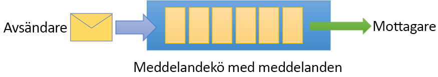
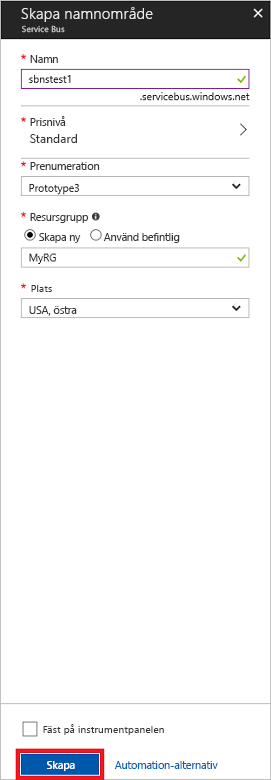

# <a name="quickstart-send-and-receive-messages-using-the-azure-portal-and-net"></a>Snabbstart: Skicka och ta emot meddelanden med Azure-portalen och .NET

Microsoft Azure Service Bus är en asynkron meddelandekö för företagsintegrering som erbjuder säkra meddelanden och absolut tillförlitlighet. Ett typiskt Service Bus-scenario innefattar vanligen frikoppling av två eller flera program, tjänster eller processer från varandra och överföring av status- eller dataförändringar. Sådana scenarier kan handla om schemaläggning av flera batchjobb i ett annat program eller tjänster eller att utlösa beställningsuppfyllelse. En butikskedja kanske skickar sina försäljningsdata till ett backoffice eller regionalt distributionscenter för påfyllning och lageruppdateringar. I det här scenariot, skickar klientappen och tar emot meddelanden från en Service Bus-kö.  



Den här snabbstarten beskriver hur man skickar och tar emot meddelanden till och från en Service Bus-kö med [Azure-portalen][Azure portal] för att skapa ett namnområde för meddelanden och en kö inom det namnområdet och för att få auktoriseringsuppgifter på det namnområdet. Proceduren visar därefter hur du skickar och tar emot meddelanden från den här kön med [.NET standardbiblioteket](https://www.nuget.org/packages/Microsoft.Azure.ServiceBus).

Om du inte har en Azure-prenumeration kan du skapa ett [kostnadsfritt konto][] innan du börjar.

## <a name="prerequisites"></a>Nödvändiga komponenter

För att kunna följa de här självstudierna ska du kontrollera att du har installerat:

- [Visual Studio 2017 Update 3 (version 15.3, 26730.01)](https://www.visualstudio.com/vs) eller senare.
- [NET Core SDK](https://www.microsoft.com/net/download/windows), version 2.0 eller senare.

## <a name="log-on-to-the-azure-portal"></a>Logga in på Azure-portalen

Först går du till [Azure-portalen][Azure portal] och loggar in med din Azure-prenumeration. Det första steget är att skapa ett Service Bus-namnområde av typen **Meddelanden**.

## <a name="create-a-service-bus-namespace"></a>Skapa ett namnområde för Service Bus

Ett namnområde för Service Bus-meddelanden innehåller en unik omfattningscontainer som refereras till av dess [fullständigt kvalificerade domännamn][], där du skapar en eller fler köer, ämnen och prenumerationer. I följande exempel skapas ett namnområde för Service Bus-meddelanden i en ny eller befintlig [resursgrupp](/azure/azure-resource-manager/resource-group-portal):

1. I det vänstra navigeringsfältet i portalen, klickar du på **+ Skapa en resurs**, därefter klickar du på **Enterprise-integration** och sedan på **Service Bus**.
2. I dialogrutan **Skapa namnområde** anger du ett namn för namnområdet. Systemet kontrollerar omedelbart om namnet är tillgängligt.
3. När du har kontrollerat att namnet för namnområdet är tillgängligt, väljer du prisnivå (Standard eller Premium).
4. I fältet **Prenumeration** väljer du en Azure-prenumeration för vilken du vill skapa namnområdet.
5. I fältet **Resursgrupp** väljer du en befintlig resursgrupp där namnområdet ska finnas eller skapar en ny.      
6. I **Plats** väljer du land eller region där namnområdet ska finnas.
7. Klicka på **Skapa**. Systemet skapar namnområdet och aktiverar det. Du kan behöva vänta några minuter medan systemet tilldelar resurser till ditt konto.



### <a name="obtain-the-management-credentials"></a>Hämta autentiseringsuppgifterna för hantering

Om du skapar ett nytt namnområde så genereras en automatiskt en ursprunglig regel för signatur för delad åtkomst (SAS) med ett kopplat par med primära och sekundära nycklar som ger fullständig kontroll över alla namnområdets aspekter. Gör så här om du vill kopiera den ursprungliga regeln: 

1.  Klicka på **Alla resurser**, sedan klickar du på den nyligen skapade namnrymden.
2. I namnområdesfönstret, klickar du på **Principer för delad åtkomst**.
3. I fönstret **Principer för delad åtkomst**, klickar du på **RootManageSharedAccessKey**.
4. I fönstret **Princip: RootManageSharedAccessKey**, klickar du på knappen **Kopiera** bredvid **Primär anslutningssträng** för att kopiera anslutningssträngen till dina urklipp för senare användning. Klistra in det här värdet i Anteckningar eller på en tillfällig plats. 

    ![connection-string][connection-string]
5. Upprepa föregående steg, kopiera och klistra in värdet för **Primärnyckeln** till en tillfällig plats för senare användning.

## <a name="create-a-queue"></a>Skapa en kö

Du skapar en Service Bus-kö genom att ange namnområdet som du vill skapa det under. Följande exempel visar hur du skapar en kö på portalen:

1. I det vänstra navigeringsfönstret i portalen klickar du på **Service Bus** (om du inte ser **Service Bus** klickar du på **More services** (Fler tjänster)).
2. Klicka på det namnområde du vill skapa kön i.
3. I namnområdesfönstret klickar du på **Köer**. I fönstret **Köer** klickar du sedan på **+ Kö**.
4. Ange ett **namn** för kön och lämna de andra värdena med standardvärdena.
5. Klicka på **Skapa** längst ned i fönstret.
6. Anteckna köns namn.

## <a name="send-and-receive-messages"></a>Skicka och ta emot meddelanden

Efter att namnområdet och kön har etablerats och du har de behörigheter som krävs, är du redo att skicka och ta emot meddelanden. Du kan granska koden i [den här GitHub-exempelmappen](https://github.com/Azure/azure-service-bus/tree/master/samples/Java/quickstarts-and-tutorials/quickstart-jms).

Om du vill köra koden gör du följande:

1. Klona [Service Bus GitHub-lagringsplatsen](https://github.com/Azure/azure-service-bus/) genom att utfärda följande kommando:

   ```shell
   git clone https://github.com/Azure/azure-service-bus.git
   ```

3. Navigera till exempelmappen `azure-service-bus\samples\DotNet\GettingStarted\BasicSendReceiveQuickStart\BasicSendReceiveQuickStart`.

4. Kopiera den anslutningssträng och det könamn som du fick i avsnittet [Hämta autentiseringsuppgifter](#obtain-the-management-credentials).

5.  Skriv följande kommando i kommandotolken:

   ```shell
   dotnet build
   ```

6.  Gå till mappen `bin\Debug\netcoreapp2.0`.

7.  Skriv följande kommando för att köra programmet. Se till att ersätta `myConnectionString` med det värde du tidigare fick och `myQueueName` med namnet på den kö som du skapade:

   ```shell
   dotnet BasicSendReceiveQuickStart.dll -ConnectionString "myConnectionString" -QueueName "myQueueName"
   ``` 

8. Observera hur 10 meddelanden skickas till kön och därefter tas emot från kön:

   

## <a name="clean-up-resources"></a>Rensa resurser

Du kan använda portalen för att ta bort resursgruppen, namnområdet och kön.

## <a name="understand-the-sample-code"></a>Förstå exempelkoden

Det här avsnittet innehåller mer information om vad exempelkoden gör. 

### <a name="get-connection-string-and-queue"></a>Hämta anslutningssträngen och kön

Anslutningssträngen och könamnet skickas till `Main()`-metoden som kommandoradsargument. `Main()` deklarerar två strängvariabler för att hålla dessa värden:

```csharp
static void Main(string[] args)
{
    string ServiceBusConnectionString = "";
    string QueueName = "";

    for (int i = 0; i < args.Length; i++)
    {
        var p = new Program();
        if (args[i] == "-ConnectionString")
        {
            Console.WriteLine($"ConnectionString: {args[i+1]}");
            ServiceBusConnectionString = args[i + 1]; 
        }
        else if(args[i] == "-QueueName")
        {
            Console.WriteLine($"QueueName: {args[i+1]}");
            QueueName = args[i + 1];
        }                
    }

    if (ServiceBusConnectionString != "" && QueueName != "")
        MainAsync(ServiceBusConnectionString, QueueName).GetAwaiter().GetResult();
    else
    {
        Console.WriteLine("Specify -Connectionstring and -QueueName to execute the example.");
        Console.ReadKey();
    }                            
}
```
 
`Main()`-metoden startar därefter den asynkrona meddelandeloopen `MainAsync()`.

### <a name="message-loop"></a>Meddelandeloop

MainAsync()-metoden skapar en köklient med kommandoradsargumenten, anropar en mottagande meddelandehanteraren med namnet `RegisterOnMessageHandlerAndReceiveMessages()` och skickar meddelandeuppsättningen:

```csharp
static async Task MainAsync(string ServiceBusConnectionString, string QueueName)
{
    const int numberOfMessages = 10;
    queueClient = new QueueClient(ServiceBusConnectionString, QueueName);

    Console.WriteLine("======================================================");
    Console.WriteLine("Press any key to exit after receiving all the messages.");
    Console.WriteLine("======================================================");

    // Register QueueClient's MessageHandler and receive messages in a loop
    RegisterOnMessageHandlerAndReceiveMessages();

    // Send Messages
    await SendMessagesAsync(numberOfMessages);

    Console.ReadKey();

    await queueClient.CloseAsync();
}
```

`RegisterOnMessageHandlerAndReceiveMessages()`-metoden anger ett antal alternativ för meddelandehanteraren och anropar sedan köklientens `RegisterMessageHandler()`-metod som startar mottagandet:

```csharp
static void RegisterOnMessageHandlerAndReceiveMessages()
{
    // Configure the MessageHandler Options in terms of exception handling, number of concurrent messages to deliver etc.
    var messageHandlerOptions = new MessageHandlerOptions(ExceptionReceivedHandler)
    {
        // Maximum number of Concurrent calls to the callback `ProcessMessagesAsync`, set to 1 for simplicity.
        // Set it according to how many messages the application wants to process in parallel.
        MaxConcurrentCalls = 1,

        // Indicates whether MessagePump should automatically complete the messages after returning from User Callback.
        // False below indicates the Complete will be handled by the User Callback as in `ProcessMessagesAsync` below.
        AutoComplete = false
    };

    // Register the function that will process messages
    queueClient.RegisterMessageHandler(ProcessMessagesAsync, messageHandlerOptions);
} 
```

### <a name="send-messages"></a>Skicka meddelanden

Åtgärderna skapa och skicka meddelanden uppstår i `SendMessagesAsync()`-metoden:

```csharp
static async Task SendMessagesAsync(int numberOfMessagesToSend)
{
    try
    {
        for (var i = 0; i < numberOfMessagesToSend; i++)
        {
            // Create a new message to send to the queue
            string messageBody = $"Message {i}";
            var message = new Message(Encoding.UTF8.GetBytes(messageBody));

            // Write the body of the message to the console
            Console.WriteLine($"Sending message: {messageBody}");

            // Send the message to the queue
            await queueClient.SendAsync(message);
        }
    }
    catch (Exception exception)
    {
        Console.WriteLine($"{DateTime.Now} :: Exception: {exception.Message}");
    }
}
```

### <a name="process-messages"></a>Bearbeta meddelanden

`ProcessMessagesAsync()`-metoden bekräftar, bearbetar och är slutför mottagandet av meddelanden:

```csharp
static async Task ProcessMessagesAsync(Message message, CancellationToken token)
{
    // Process the message
    Console.WriteLine($"Received message: SequenceNumber:{message.SystemProperties.SequenceNumber} Body:{Encoding.UTF8.GetString(message.Body)}");

    // Complete the message so that it is not received again.
    await queueClient.CompleteAsync(message.SystemProperties.LockToken);
}
```

## <a name="next-steps"></a>Nästa steg

I den här artikeln skapade du ett Service Bus-namnområde och andra resurser som krävs för att skicka och ta emot meddelanden från en kö. Om du vill läsa mer om att skriva kod för att skicka och ta emot meddelanden, fortsätter du till följande självstudier för Service Bus:

> [!div class="nextstepaction"]
> [Uppdatera lagringsplatsen med Azure-portalen](./service-bus-tutorial-topics-subscriptions-portal.md)


[kostnadsfritt konto]: https://azure.microsoft.com/free/?ref=microsoft.com&utm_source=microsoft.com&utm_medium=docs&utm_campaign=visualstudio
[fullständigt kvalificerade domännamn]: https://wikipedia.org/wiki/Fully_qualified_domain_name
[Azure portal]: https://portal.azure.com/

[connection-string]: ./media/service-bus-quickstart-portal/connection-string.png
[service-bus-flow]: ./media/service-bus-quickstart-portal/service-bus-flow.png
