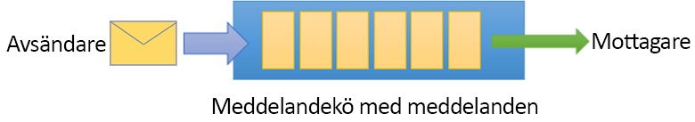

# <a name="quickstart-send-and-receive-messages-using-azure-powershell-and-net"></a>Snabbstart: Skicka och ta emot meddelanden med Azure PowerShell och .NET

Microsoft Azure Service Bus är en asynkron meddelandekö för företagsintegrering som erbjuder säkra meddelanden och absolut tillförlitlighet. Ett typiskt Service Bus-scenario innefattar vanligen frikoppling av två eller flera program, tjänster eller processer från varandra och överföring av status- eller dataförändringar. Sådana scenarier kan handla om schemaläggning av flera batchjobb i ett annat program eller tjänster eller att utlösa beställningsuppfyllelse. En butikskedja kanske skickar sina försäljningsdata till ett backoffice eller regionalt distributionscenter för påfyllning och lageruppdateringar. I det här scenariot, skickar klientappen och tar emot meddelanden från en Service Bus-kö.



Den här snabbstarten beskriver hur man skickar och tar emot meddelanden till och från en Service Bus-kö med PowerShell för att skapa ett namnområde för meddelanden och en kö inom det namnområdet och för att få auktoriseringsuppgifter på det namnområdet. Proceduren visar därefter hur du skickar och tar emot meddelanden från den här kön med [.NET standardbiblioteket](https://www.nuget.org/packages/Microsoft.Azure.ServiceBus).

Om du inte har en Azure-prenumeration kan du skapa ett [kostnadsfritt konto][] innan du börjar.

## <a name="prerequisites"></a>Nödvändiga komponenter

För att kunna följa de här självstudierna ska du kontrollera att du har installerat:

- [Visual Studio 2017 Update 3 (version 15.3, 26730.01)](http://www.visualstudio.com/vs) eller senare.
- [NET Core SDK](https://www.microsoft.com/net/download/windows), version 2.0 eller senare.

Den här snabbstarten kräver att du kör den senaste versionen av Azure PowerShell. Om du behöver installera eller uppgradera, kan du läsa [Installera och konfigurera Azure PowerShell][].

## <a name="log-in-to-azure"></a>Logga in på Azure

1. Installera först Service Bus PowerShell-modulen, om du inte redan gjort det:

   ```azurepowershell-interactive
   Install-Module AzureRM.ServiceBus
   ```

2. Kör följande kommando för att logga in i Azure:

   ```azurepowershell-interactive
   Login-AzureRmAccount
   ```

3. Utfärda följande kommandon för att ställa in den aktuella prenumerationskontexten eller för att se den aktiva prenumerationen:

   ```azurepowershell-interactive
   Select-AzureRmSubscription -SubscriptionName "MyAzureSubName" 
   Get-AzureRmContext
   ```

## <a name="provision-resources"></a>Etablera resurser

Från PowerShell-prompten, utfärdar du följande kommandon för att etablera Service Bus-resurserna. Tänk på att ersätta alla platshållare med lämpliga värden:

```azurepowershell-interactive
# Create a resource group 
New-AzureRmResourceGroup –Name my-resourcegroup –Location eastus

# Create a Messaging namespace
New-AzureRmServiceBusNamespace -ResourceGroupName my-resourcegroup -NamespaceName namespace-name -Location eastus

# Create a queue 
New-AzureRmServiceBusQueue -ResourceGroupName my-resourcegroup -NamespaceName namespace-name -Name queue-name -EnablePartitioning $False

# Get primary connection string (required in next step)
Get-AzureRmServiceBusKey -ResourceGroupName my-resourcegroup -Namespace namespace-name -Name RootManageSharedAccessKey
```

Efter att `Get-AzureRmServiceBusKey`-cmdleten körs, kopierar och klistrar du in anslutningssträngen och det könamn du valt, till en tillfällig plats som Anteckningar. Du behöver den i nästa steg.

## <a name="send-and-receive-messages"></a>Skicka och ta emot meddelanden

När namnområdet och kön skapas och du har de behörigheter som krävs, är du redo att skicka och ta emot meddelanden. Du kan granska koden i [den här GitHub-exempelmappen](https://github.com/Azure/azure-service-bus/tree/master/samples/DotNet/GettingStarted/BasicSendReceiveQuickStart).

Om du vill köra koden gör du följande:

1. Klona [Service Bus GitHub-lagringsplatsen](https://github.com/Azure/azure-service-bus/) genom att utfärda följande kommando:

   ```shell
   git clone https://github.com/Azure/azure-service-bus.git
   ```

3. Navigera till exempelmappen `azure-service-bus\samples\DotNet\GettingStarted\BasicSendReceiveQuickStart\BasicSendReceiveQuickStart`.

4. Om du inte redan har gjort det, kan du hämta anslutningssträngen med hjälp av följande PowerShell-cmdlet. Se till att ersätta `my-resourcegroup` och `namespace-name` med dina specifika värden: 

   ```azurepowershell-interactive
   Get-AzureRmServiceBusKey -ResourceGroupName my-resourcegroup -Namespace namespace-name -Name RootManageSharedAccessKey
   ```

5.  Vid PowerShell-prompten, skriver du följande kommando:

   ```shell
   dotnet build
   ```

6.  Gå till mappen `bin\Debug\netcoreapp2.0`.

7.  Skriv följande kommando för att köra programmet. Se till att ersätta `myConnectionString` med det värde du tidigare fick och `myQueueName` med namnet på den kö som du skapade:

   ```shell
   dotnet BasicSendReceiveQuickStart.dll -ConnectionString "myConnectionString" -QueueName "myQueueName"
   ``` 

8. Observera hur 10 meddelanden skickas till kön och därefter tas emot från kön:

   

## <a name="clean-up-resources"></a>Rensa resurser

Kör följande kommando för att ta bort resursgruppen, namnområdet och alla relaterade resurser:

```powershell-interactive
Remove-AzureRmResourceGroup -Name my-resourcegroup
```

## <a name="understand-the-sample-code"></a>Förstå exempelkoden

Det här avsnittet innehåller mer information om vad exempelkoden gör. 

### <a name="get-connection-string-and-queue"></a>Hämta anslutningssträngen och kön

Anslutningssträngen och könamnet skickas till `Main()`-metoden som kommandoradsargument. `Main()` deklarerar två strängvariabler för att hålla dessa värden:

```csharp
static void Main(string[] args)
{
    string ServiceBusConnectionString = "";
    string QueueName = "";

    for (int i = 0; i < args.Length; i++)
    {
        var p = new Program();
        if (args[i] == "-ConnectionString")
        {
            Console.WriteLine($"ConnectionString: {args[i+1]}");
            ServiceBusConnectionString = args[i + 1]; 
        }
        else if(args[i] == "-QueueName")
        {
            Console.WriteLine($"QueueName: {args[i+1]}");
            QueueName = args[i + 1];
        }                
    }

    if (ServiceBusConnectionString != "" && QueueName != "")
        MainAsync(ServiceBusConnectionString, QueueName).GetAwaiter().GetResult();
    else
    {
        Console.WriteLine("Specify -Connectionstring and -QueueName to execute the example.");
        Console.ReadKey();
    }                            
}
```
 
`Main()`-metoden startar därefter den asynkrona meddelandeloopen `MainAsync()`.

### <a name="message-loop"></a>Meddelandeloop

MainAsync()-metoden skapar en köklient med kommandoradsargumenten, anropar en mottagande meddelandehanteraren med namnet `RegisterOnMessageHandlerAndReceiveMessages()` och skickar meddelandeuppsättningen:

```csharp
static async Task MainAsync(string ServiceBusConnectionString, string QueueName)
{
    const int numberOfMessages = 10;
    queueClient = new QueueClient(ServiceBusConnectionString, QueueName);

    Console.WriteLine("======================================================");
    Console.WriteLine("Press any key to exit after receiving all the messages.");
    Console.WriteLine("======================================================");

    // Register QueueClient's MessageHandler and receive messages in a loop
    RegisterOnMessageHandlerAndReceiveMessages();

    // Send Messages
    await SendMessagesAsync(numberOfMessages);

    Console.ReadKey();

    await queueClient.CloseAsync();
}
```

`RegisterOnMessageHandlerAndReceiveMessages()`-metoden anger ett antal alternativ för meddelandehanteraren och anropar sedan köklientens `RegisterMessageHandler()`-metod som startar mottagandet:

```csharp
static void RegisterOnMessageHandlerAndReceiveMessages()
{
    // Configure the MessageHandler Options in terms of exception handling, number of concurrent messages to deliver etc.
    var messageHandlerOptions = new MessageHandlerOptions(ExceptionReceivedHandler)
    {
        // Maximum number of Concurrent calls to the callback `ProcessMessagesAsync`, set to 1 for simplicity.
        // Set it according to how many messages the application wants to process in parallel.
        MaxConcurrentCalls = 1,

        // Indicates whether MessagePump should automatically complete the messages after returning from User Callback.
        // False below indicates the Complete will be handled by the User Callback as in `ProcessMessagesAsync` below.
        AutoComplete = false
    };

    // Register the function that will process messages
    queueClient.RegisterMessageHandler(ProcessMessagesAsync, messageHandlerOptions);
} 
```

### <a name="send-messages"></a>Skicka meddelanden

Åtgärderna skapa och skicka meddelanden uppstår i `SendMessagesAsync()`-metoden:

```csharp
static async Task SendMessagesAsync(int numberOfMessagesToSend)
{
    try
    {
        for (var i = 0; i < numberOfMessagesToSend; i++)
        {
            // Create a new message to send to the queue
            string messageBody = $"Message {i}";
            var message = new Message(Encoding.UTF8.GetBytes(messageBody));

            // Write the body of the message to the console
            Console.WriteLine($"Sending message: {messageBody}");

            // Send the message to the queue
            await queueClient.SendAsync(message);
        }
    }
    catch (Exception exception)
    {
        Console.WriteLine($"{DateTime.Now} :: Exception: {exception.Message}");
    }
}
```

### <a name="process-messages"></a>Bearbeta meddelanden

`ProcessMessagesAsync()`-metoden bekräftar, bearbetar och är slutför mottagandet av meddelanden:

```csharp
static async Task ProcessMessagesAsync(Message message, CancellationToken token)
{
    // Process the message
    Console.WriteLine($"Received message: SequenceNumber:{message.SystemProperties.SequenceNumber} Body:{Encoding.UTF8.GetString(message.Body)}");

    // Complete the message so that it is not received again.
    await queueClient.CompleteAsync(message.SystemProperties.LockToken);
}
```

## <a name="next-steps"></a>Nästa steg

I den här artikeln skapade du ett Service Bus-namnområde och andra resurser som krävs för att skicka och ta emot meddelanden från en kö. Om du vill läsa mer om att skriva kod för att skicka och ta emot meddelanden, fortsätter du till följande självstudier för Service Bus:

> [!div class="nextstepaction"]
> [Uppdatera lagringsplatsen med Azure PowerShell](./service-bus-tutorial-topics-subscriptions-powershell.md)

[kostnadsfritt konto]: https://azure.microsoft.com/free/?ref=microsoft.com&utm_source=microsoft.com&utm_medium=docs&utm_campaign=visualstudio
[Installera och konfigurera Azure PowerShell]: /powershell/azure/install-azurerm-ps