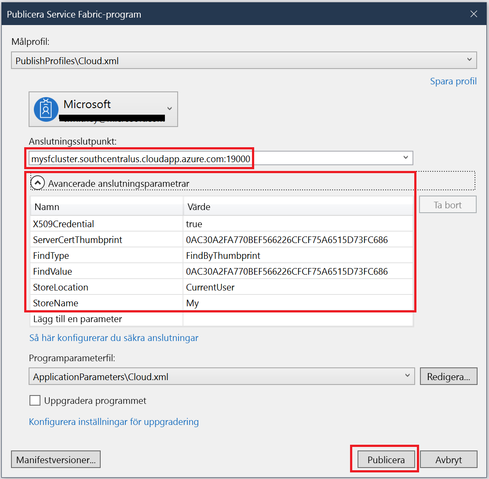

# <a name="quickstart-deploy-windows-containers-to-service-fabric"></a>Snabbstart: Distribuera Windows-containrar till Service Fabric

Azure Service Fabric är en plattform för distribuerade system för distribution och hantering av skalbara och tillförlitliga mikrotjänster och containrar.

Du behöver inga göra några ändringar i din app för att köra en befintlig app i en Windows-container i ett Service Fabric-kluster. Den här snabbstarten beskriver hur du distribuerar en fördefinierad Docker-containeravbildning i ett Service Fabric-program. När du har slutfört kursen har du en fungerande Windows Server 2016-baserad Nano Server- och IIS-container. Den här snabbstarten beskriver hur du distribuerar en Windows-container. Läs [den här snabbstarten](service-fabric-quickstart-containers-linux.md) om du vill distribuera en Linux-container.

![IIS-standardwebbsidan][iis-default]

I den här snabbstarten lär du dig att:

* Paketera en Docker-avbildningscontainer
* Konfigurera kommunikation
* Utveckla och distribuera ett Service Fabric-program
* Distribuera containerprogrammet till Azure

## <a name="prerequisites"></a>Förutsättningar

* En Azure-prenumeration (du kan skapa ett [kostnadsfritt konto](https://azure.microsoft.com/free/?WT.mc_id=A261C142F)).
* En utvecklingsdator som kör:
  * Visual Studio 2015 eller Visual Studio 2017.
  * [Service Fabric SDK och verktyg](service-fabric-get-started.md).

## <a name="package-a-docker-image-container-with-visual-studio"></a>Paketera en Docker-avbildningscontainer med Visual Studio

Service Fabric SDK och verktygen innehåller en tjänstmall som hjälper dig att distribuera en container till ett Service Fabric-kluster.

Starta Visual Studio som Administratör.  Välj **Arkiv** > **Nytt** > **Projekt**.

Välj **Service Fabric-programmet**, ge det namnet "MyFirstContainer" och klicka på **OK**.

Välj **Behållare** från mallarna **Hosted Containers and Applications** (Värdbaserade behållare och program).

I **Avbildningsnamn** anger du "microsoft/iis:nanoserver", [Windows Server Nano Server och IIS-avbildningsnamn](https://hub.docker.com/r/microsoft/iis/).

Konfigurera containerns portmappning från port till värd så att inkommande begäranden till tjänsten på port 80 mappas till port 80 i containern.  Ge **Containerport** värdet 80 och **Värdport** värdet 80.  

Ge tjänsten namnet ”MyContainerService” och klicka på **OK**.

![Dialogrutan Ny tjänst][new-service]

## <a name="specify-the-os-build-for-your-container-image"></a>Ange operativsystemets version för containeravbildningen

Containrar som skapats med en viss Windows Server-version kan kanske inte köras på en värd som kör en annan Windows Server-version. Containrar som t.ex. har skapats med version 1709 av Windows Server kan inte köras på värdar som kör Windows Server 2016. Mer information finns i [Kompatibilitet mellan operativsystem för Windows Server-containrar och värdoperativsystem](service-fabric-get-started-containers.md#windows-server-container-os-and-host-os-compatibility). 

Med version 6.1 och senare av Service Fabric Runtime kan du ange flera operativsystemsavbildningar per container och tagga var och en med den version av operativsystemet som de ska distribueras till. Detta hjälper dig att säkerställa att programmet kan köras på värdar som kör olika versioner av Windows operativsystem. Mer information finns i [Ange specifika containeravbildningar för operativsystemet](service-fabric-get-started-containers.md#specify-os-build-specific-container-images). 

Microsoft publicerar olika avbildningar för de olika versioner av IIS som har skapats på olika versioner av Windows Server. Om du vill säkerställa att Service Fabric distribuerar en container som är kompatibel med den version av Windows Server som körs på de klusternoder där dina program distribueras, så lägger du till följande rader i filen *ApplicationManifest.xml*. Versionen för Windows Server 2016 är 14393, och versionen för Windows Server version 1709 är 16299.

```xml
    <ContainerHostPolicies CodePackageRef="Code"> 
      <ImageOverrides> 
        ...
          <Image Name="microsoft/iis:nanoserverDefault" /> 
          <Image Name= "microsoft/iis:nanoserver" Os="14393" /> 
          <Image Name="microsoft/iis:windowsservercore-1709" Os="16299" /> 
      </ImageOverrides> 
    </ContainerHostPolicies> 
```

Tjänstmanifestet fortsätter att ange endast en avbildning för nanoservern, `microsoft/iis:nanoserver`.

I filen *ApplicationManifest.xml* ska du också ändra **PasswordEncrypted** till **false**. Kontot och lösenordet är tomma för den offentliga containeravbildningen i Docker Hub, så vi inaktiverar kryptering eftersom kryptering av ett tomt lösenord genererar ett kompileringsfel.

```xml
<RepositoryCredentials AccountName="" Password="" PasswordEncrypted="false" />
```

## <a name="create-a-cluster"></a>Skapa ett kluster

I följande exempelskript skapas ett Service Fabric-kluster med fem noder som skyddas med ett X.509-certifikat. Kommandot skapar ett självsignerat certifikat och laddar upp det till ett nytt nyckelvalv. Certifikatet kopieras även till en lokal katalog. Du kan läsa mer om hur du skapar ett kluster med det här skriptet i [Skapa ett Service Fabric-kluster](scripts/service-fabric-powershell-create-secure-cluster-cert.md).

Installera Azure PowerShell med hjälp av anvisningarna i [Azure PowerShell-guiden](/powershell/azure/overview) om det behövs.

Innan du kör följande skript i PowerShell ska du köra `Connect-AzureRmAccount` för att skapa en anslutning till Azure.

Kopiera följande skript till Urklipp och öppna **Windows PowerShell ISE**.  Klistra in innehållet i det tomma fönstret Untitled1.ps1. Ange värden för variablerna i skriptet, som `subscriptionId`, `certpwd`, `certfolder`, `adminuser` och `adminpwd`.  Katalogen du anger för `certfolder` måste finnas innan du kör skriptet.

[!code-powershell[main](../../powershell_scripts/service-fabric/create-secure-cluster/create-secure-cluster.ps1 "Create a Service Fabric cluster")]

När du har angett värden för variablerna trycker du på **F5** för att köra skriptet.

När skriptet har körts och klustret är skapat letar du reda på `ClusterEndpoint` i utdata. Exempel:

```powershell
...
ClusterEndpoint : https://southcentralus.servicefabric.azure.com/runtime/clusters/b76e757d-0b97-4037-a184-9046a7c818c0
```

### <a name="install-the-certificate-for-the-cluster"></a>Installera klustrets certifikat

Nu ska vi installera PFX i certifikatarkivet *CurrentUser\My*. PFX-filen finns i katalogen du angav i miljövariabeln `certfolder` i PowerShell-skriptet ovan.

Gå till den katalogen och kör sedan följande PowerShell-kommando, där du använder namnet på PFX-filen i katalogen `certfolder` och lösenordet du angav i variabeln `certpwd`. I det här exemplet sätts aktuell katalog till den katalog som anges i variabeln `certfolder` i PowerShell-skriptet. Därifrån körs kommandot `Import-PfxCertificate`:

```powershell
PS C:\mycertificates> Import-PfxCertificate -FilePath .\mysfclustergroup20190130193456.pfx -CertStoreLocation Cert:\CurrentUser\My -Password (ConvertTo-SecureString Password#1234 -AsPlainText -Force)
```

Kommandot returnerar tumavtrycket:

```powershell
  ...
  PSParentPath: Microsoft.PowerShell.Security\Certificate::CurrentUser\My

Thumbprint                                Subject
----------                                -------
0AC30A2FA770BEF566226CFCF75A6515D73FC686  CN=mysfcluster.SouthCentralUS.cloudapp.azure.com
```

Kom ihåg tumavtrycksvärdet till nästa steg.

## <a name="deploy-the-application-to-azure-using-visual-studio"></a>Distribuera programmet till Azure med hjälp av Visual Studio

Nu när programmet är redo kan du distribuera det till ett kluster direkt från Visual Studio.

Högerklicka på **MyFirstContainer** i Solution Explorer och välj **Publicera**. Dialogrutan Publicera visas.

Kopiera innehållet efter **CN=** i PowerShell-fönstret när du körde kommandot `Import-PfxCertificate` ovan och lägg till port `19000`. Till exempel `mysfcluster.SouthCentralUS.cloudapp.azure.com:19000`. Kopiera värdet till fältet **Slutpunkt för anslutningen**. Kom ihåg det här värdet eftersom du behöver det i ett kommande steg.

Klicka på **Avancerade anslutningsparametrar** och kontrollera anslutningsinformationen för parametern.  Värdena *FindValue* och *ServerCertThumbprint* måste matcha tumavtrycket för certifikatet som installerades när du körde `Import-PfxCertificate` i föregående steg.



Klicka på **Publicera**.

Varje program i klustret måste ha ett unikt namn. Om det finns en namnkonflikt byter du namn på Visual Studio-projektet och distribuerar igen.

Öppna en webbläsare och navigera till adressen du angav i fältet **Slutpunkt för anslutningen** i föregående steg. Alternativt kan du lägga till schemaidentifierare `http://` innan och lägga till porten `:80` efter i URL:en. Exempel: http:\//mysfcluster.SouthCentralUS.cloudapp.azure.com:80.

 Du borde se standardwebbsidan för IIS: ![IIS-standardwebbsidan][iis-default]

## <a name="clean-up"></a>Rensa

Du debiteras så länge klustret körs. Överväg att [ta bort klustret](service-fabric-cluster-delete.md).

## <a name="next-steps"></a>Nästa steg

I den här snabbstarten har du lärt dig att:

* Paketera en Docker-avbildningscontainer
* Konfigurera kommunikation
* Utveckla och distribuera ett Service Fabric-program
* Distribuera containerprogrammet till Azure

Om du vill veta mer om att arbeta med Windows-containrar i Service Fabric, kan du fortsätta till självstudien om Windows-containerappar.

> [!div class="nextstepaction"]
> [Skapa en Windows-containerapp](./service-fabric-host-app-in-a-container.md)

[iis-default]: ./media/service-fabric-quickstart-containers/iis-default.png
[publish-dialog]: ./media/service-fabric-quickstart-containers/publish-dialog.png
[new-service]: ./media/service-fabric-quickstart-containers/NewService.png
