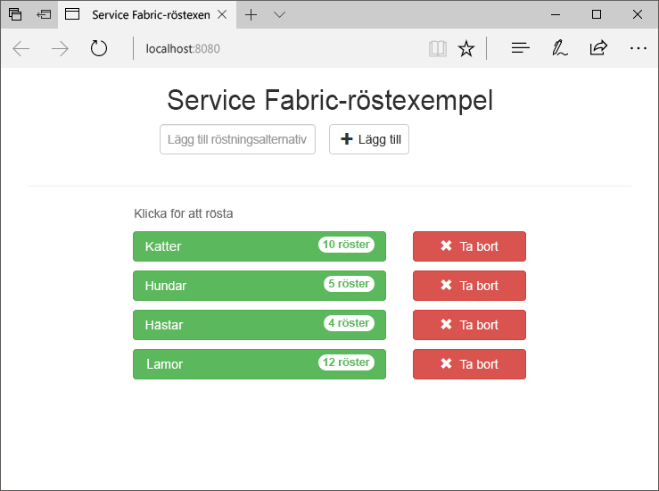
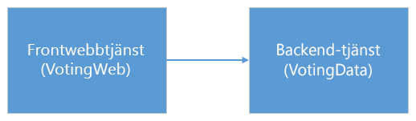
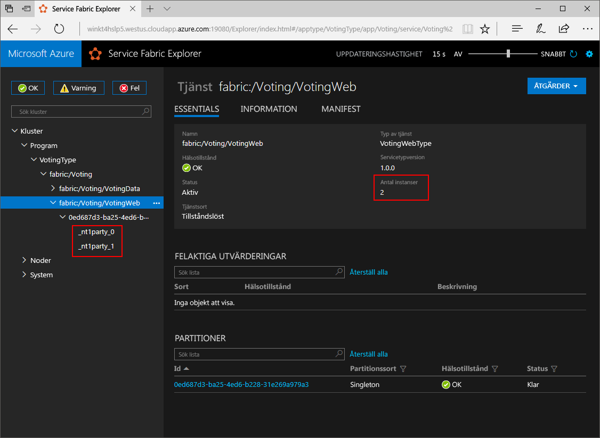
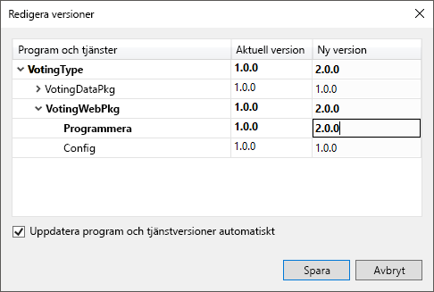
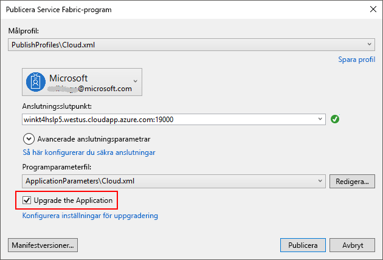
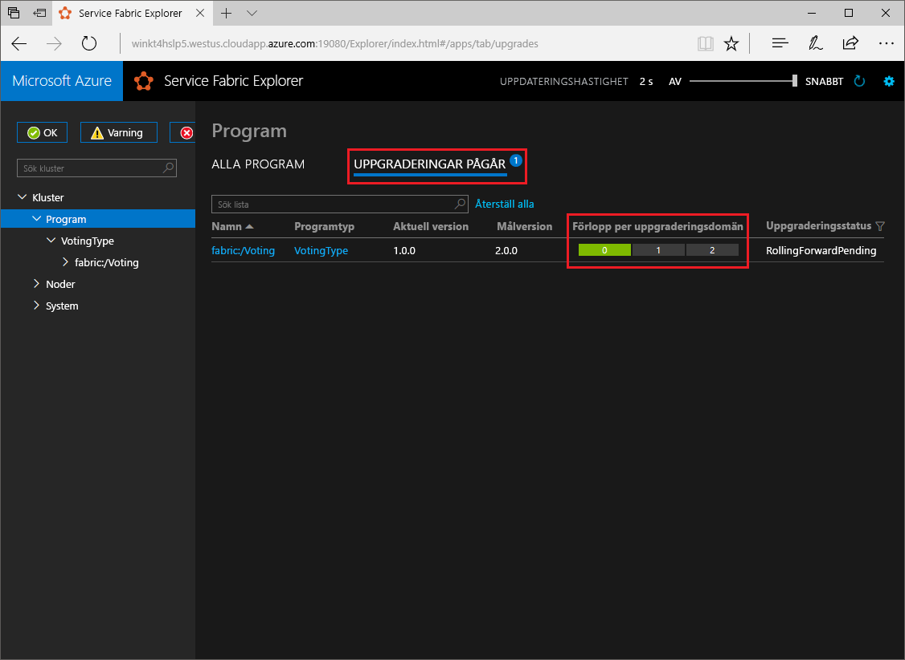

# <a name="create-a-net-service-fabric-application-in-azure"></a>Skapa ett .NET Service Fabric-program i Azure
Azure Service Fabric är en plattform för distribuerade system för distribution och hantering av skalbara och tillförlitliga mikrotjänster och behållare. 

Den här snabbstarten visar hur du distribuerar din första .NET-program till Service Fabric. När du är klar har du röstningsapp med en ASP.NET Core webbklientdelen som sparar röstning resultat i en tillståndskänslig backend-tjänst i klustret.



Med det här programmet som du lär dig hur du:
> [!div class="checklist"]
> * Skapa ett program med .NET och Service Fabric
> * Använda ASP.NET core som en webbklientdel
> * Lagra programdata i en tillståndskänslig service
> * Felsöka programmet lokalt
> * Distribuera programmet till ett kluster i Azure
> * Skalbara program över flera noder
> * Utföra en uppgradering av programmet

## <a name="prerequisites"></a>Krav
För att slutföra den här snabbstarten behöver du:
1. [Installera Visual Studio 2017](https://www.visualstudio.com/) med den **Azure-utveckling** och **ASP.NET och web development** arbetsbelastningar.
2. [Installera Git](https://git-scm.com/)
3. [Installera Microsoft Azure Service Fabric SDK](http://www.microsoft.com/web/handlers/webpi.ashx?command=getinstallerredirect&appid=MicrosoftAzure-ServiceFabric-CoreSDK)
4. Kör följande kommando för att aktivera Visual Studio för att distribuera till det lokala Service Fabric-klustret:
    ```powershell
    Set-ExecutionPolicy -ExecutionPolicy Unrestricted -Force -Scope CurrentUser
    ```

## <a name="download-the-sample"></a>Hämta exemplet
Kör följande kommando för att klona exempel app lagringsplatsen till den lokala datorn i ett kommandofönster.
```
git clone https://github.com/Azure-Samples/service-fabric-dotnet-quickstart
```

## <a name="run-the-application-locally"></a>Kör programmet lokalt
Högerklicka på ikonen Visual Studio i Start-menyn och välj **kör som administratör**. Du behöver köra Visual Studio som administratör för att kunna koppla felsökaren till dina tjänster.

Öppna den **Voting.sln** Visual Studio-lösning från databasen som du har klonat.

Distribuera programmet genom att trycka på **F5**.

> [!NOTE]
> Första gången du kör och distribuera programmet, skapar Visual Studio ett kluster som är lokala för felsökning. Den här åtgärden kan ta lite tid. Statusen för klustergenereringen visas i utdatafönstret i Visual Studio.

När installationen är klar, öppnar en webbläsare och öppna den här sidan: `http://localhost:8080` -webbklientdelen av programmet.


Du kan nu lägga till en uppsättning röstning alternativ och starta tar röster. Programmet körs och lagrar alla data i din Service Fabric-klustret utan att behöva en separat databas.

## <a name="walk-through-the-voting-sample-application"></a>Gå igenom röstning exempelprogrammet
Röstning program består av två tjänster:
- Web frontend-tjänst (VotingWeb) – en ASP.NET Core web frontend-tjänst som används på webbsidan och visar webb-API: er för att kommunicera med serverdelstjänsten.
- Backend-tjänst (VotingData)-ett ASP.NET Core webbtjänsten som Exponerar en API för att lagra rösten resultat i en tillförlitlig ordlista kvar på disken.



När du rösta i programmet händer följande:
1. En JavaScript skickar röstningsbegäran till webb-API i Frontend webbtjänsten som ett HTTP PUT-begäran.

2. Frontend webbtjänsten använder en proxyserver för att leta upp och vidarebefordra en HTTP PUT-begäran till backend-tjänst.

3. Backend-tjänst tar den inkommande begäranden och lagrar det uppdaterade resultat i en tillförlitlig ordlista som hämtar replikeras till flera noder i klustret och kvar på disken. Alla programdata lagras i klustret, så det behövs ingen databas.

## <a name="debug-in-visual-studio"></a>Felsökning i Visual Studio
När du felsöker programmet i Visual Studio använder du en lokal utveckling Service Fabric-klustret. Du har möjlighet att anpassa upplevelsen felsökning för ditt scenario. I det här programmet lagrar vi data i vår backend-tjänst med hjälp av en tillförlitlig ordlista. Visual Studio tar bort programmet per standard när du stoppar felsökningsprogrammet. Ta bort programmet gör att data i backend-tjänsten också att tas bort. För att bevara data mellan felsökning sessioner, du kan ändra den **programmet felsökningsläge** som en egenskap på den **Röstningsdatabasen** projekt i Visual Studio.

Om du vill titta på vad som händer i koden, gör du följande:
1. Öppna den **VotesController.cs** fil och anger en brytpunkt i webb-API: er **placera** metod (rad 47) – du kan söka efter filen i Solution Explorer i Visual Studio.

2. Öppna den **VoteDataController.cs** fil och anger en brytpunkt i den här web API **placera** metod (rad 50).

3. Gå tillbaka till webbläsaren och klicka på röstning alternativet eller lägga till ett nytt alternativ för röstning. Du har nått den första brytpunkten i web front-slutets api-kontrollanten.
    - Detta är där JavaScript i webbläsaren skickar en begäran till web API-kontrollanten i frontend-tjänsten.
    
    

    - Först skapar vi URL till ReverseProxy för vår backend-tjänst **(1)**.
    - Skickar vi den HTTP PUT-begäran till ReverseProxy **(2)**.
    - Slutligen den returnerar vi svaret från backend-tjänst till klienten **(3)**.

4. Tryck på **F5** fortsätta
    - Du är nu på break punkt i backend-tjänst.
    
    

    - I den första raden i metoden **(1)** vi använder den `StateManager` att hämta eller lägga till en tillförlitlig ordlista som heter `counts`.
    - All interaktion med värden i en tillförlitlig ordlista kräver en transaktion detta med hjälp av instruktionen **(2)** skapar den aktuella transaktionen.
    - I transaktionen, vi sedan uppdatera värdet för den aktuella nyckeln för alternativet röstning och genomför åtgärden **(3)**. När commit-metoden returnerar data uppdateras i ordlistan och replikeras till andra noder i klustret. Data lagras nu på ett säkert sätt i klustret och backend-tjänst kan växla över till andra noder som fortfarande har data som är tillgängliga.
5. Tryck på **F5** fortsätta

Om du vill stoppa felsökningssessionen trycker du på **SKIFT + F5**.

## <a name="deploy-the-application-to-azure"></a>Distribuera programmet till Azure
Om du vill distribuera programmet till ett kluster i Azure, kan du antingen välja att skapa ditt eget kluster, eller Använd ett kluster part.

Partykluster är kostnadsfria, tidsbegränsade Service Fabric-kluster i Azure som körs av Service Fabric-teamet där vem som helst kan distribuera program och lära sig mer om plattformen. [Följ dessa instruktioner](http://aka.ms/tryservicefabric) för att få åtkomst till ett partykluster. 

Information om hur du skapar ett eget kluster finns i [Skapa ditt första Service Fabric-kluster i Azure](service-fabric-get-started-azure-cluster.md).

> [!Note]
> Webbtjänsten front-end konfigureras så att den lyssnar på port 8080 för inkommande trafik. Se till att den porten är öppen i ditt kluster. Om du använder part klustret är den här porten öppen.
>

### <a name="deploy-the-application-using-visual-studio"></a>Distribuera programmet med hjälp av Visual Studio
Nu när programmet är redo kan du distribuera det till ett kluster direkt från Visual Studio.

1. Högerklicka på **Röstningsdatabasen** i Solution Explorer och välj **publicera**. Dialogrutan Publicera visas.

    

2. Ange anslutningsslutpunkten för klustret i fältet **Connection Endpoint** (Anslutningsslutpunkt) och klicka på **Publicera**. När du registrerar dig för klustret part har Anslutningens slutpunkt angetts i webbläsaren. – till exempel `winh1x87d1d.westus.cloudapp.azure.com:19000`.

3. Öppna en webbläsare och Skriv i klustret adress foolowed av ': 8080' till program i klustret – till exempel `http://winh1x87d1d.westus.cloudapp.azure.com:8080`. Du bör nu se det program som körs i klustret i Azure.


## <a name="scale-applications-and-services-in-a-cluster"></a>Skala program och tjänster i ett kluster
Service Fabric-tjänster kan enkelt skalas över ett kluster kan utföra en ändring i belastningen på tjänsterna. Du kan skala en tjänst genom att ändra antalet instanser som körs i klustret. Du har flera olika sätt att skala dina tjänster kan du använda skript eller kommandon från PowerShell eller CLI för Service Fabric (sfctl). I det här exemplet använder vi Service Fabric Explorer.

Service Fabric Explorer körs i alla Service Fabric-kluster och kan nås från en webbläsare genom att bläddra till kluster HTTP Hanteringsport (19080), till exempel `http://winh1x87d1d.westus.cloudapp.azure.com:19080`.

Gör så här om du vill skala frontwebbtjänsten:

1. Öppna Service Fabric Explorer i ditt kluster, till exempel `http://winh1x87d1d.westus.cloudapp.azure.com:19080`.
2. Klicka på ellipsknappen (tre punkter) bredvid den **fabric: / Röstningsdatabasen/VotingWeb** noder i trädvyn och välj **skala Service**.

    

    Du kan nu välja att skala antalet instanser av frontwebbtjänsten.

3. Ändra antalet till **2** och klicka på **Scale Service** (Skala tjänst).
4. Klicka på den **fabric: / Röstningsdatabasen/VotingWeb** noden i trädvyn och expandera noden partition (representerade av GUID).

    

    Du kan nu se att tjänsten har två instanser och i trädvyn du se vilka noder instanserna körs på.

Med den här enkla hanteringsåtgärden har vi dubblerat resurserna för bearbetning av användarbelastning för frontwebbtjänsten. Det är viktigt att veta att du inte behöver flera instanser av en tjänst för att den ska köras på ett tillförlitligt sätt. Om en tjänst misslyckas ser Service Fabric till att en ny tjänstinstans körs i klustret.

## <a name="perform-a-rolling-application-upgrade"></a>Utföra en uppgradering av programmet
När du distribuerar nya uppdateringar till tillämpningsprogrammet, samlar Service Fabric ut uppdateringen på ett säkert sätt. Rullande uppgraderingar får du inget driftstopp medan uppgraderas samt automatisk återställning fel uppstår.

Om du vill uppgradera programmet gör du följande:

1. Öppna den **Index.cshtml** filen i Visual Studio – du kan söka efter filen i Solution Explorer i Visual Studio.
2. Ändra rubriken på sidan genom att lägga till text - till exempel.
    ```html
        <div class="col-xs-8 col-xs-offset-2 text-center">
            <h2>Service Fabric Voting Sample v2</h2>
        </div>
    ```
3. Spara filen.
4. Högerklicka på **Röstningsdatabasen** i Solution Explorer och välj **publicera**. Dialogrutan Publicera visas.
5. Klicka på den **Manifest Version** om du vill ändra versionen av tjänst och program.
6. Ändra versionen av den **kod** elementet under **VotingWebPkg** till ”2.0.0”, till exempel och klicka på **spara**.

    
7. I den **publicera Fabric tjänstprogrammet** dialogrutan, kontrollera uppgraderingen programmet kryssrutan och klickar på **publicera**.

    
8. Öppna webbläsaren och bläddra till klusteradress på port 19080 - exempelvis `http://winh1x87d1d.westus.cloudapp.azure.com:19080`.
9. Klicka på den **program** nod i trädvyn och sedan **uppgraderingar pågår** i den högra rutan. Du ser hur uppgraderingen samlas via uppgraderingsdomäner i klustret, kontrollera att varje domän är felfri innan du fortsätter till nästa.
    

    Service Fabric är uppgraderingar säker väntar på två minuter efter en uppgradering till tjänsten på varje nod i klustret. Förvänta dig hela uppdateringen tar ungefär åtta minuter.

10. När uppgraderingen är igång kan du fortfarande använda programmet. Eftersom du har två instanser av tjänsten som körs i klustret, kan vissa av dina begäranden få en uppgraderad version av programmet, medan andra kan fortfarande få den gamla versionen.

## <a name="next-steps"></a>Nästa steg
I den här snabbstarten har du lärt dig att:

> [!div class="checklist"]
> * Skapa ett program med .NET och Service Fabric
> * Använda ASP.NET core som en webbklientdel
> * Lagra programdata i en tillståndskänslig service
> * Felsöka programmet lokalt
> * Distribuera programmet till ett kluster i Azure
> * Skalbara program över flera noder
> * Utföra en uppgradering av programmet

Om du vill veta mer om Service Fabric och .NET kan ta en titt på den här kursen:
> [!div class="nextstepaction"]
> [.NET-program på Service Fabric](service-fabric-tutorial-create-dotnet-app.md)