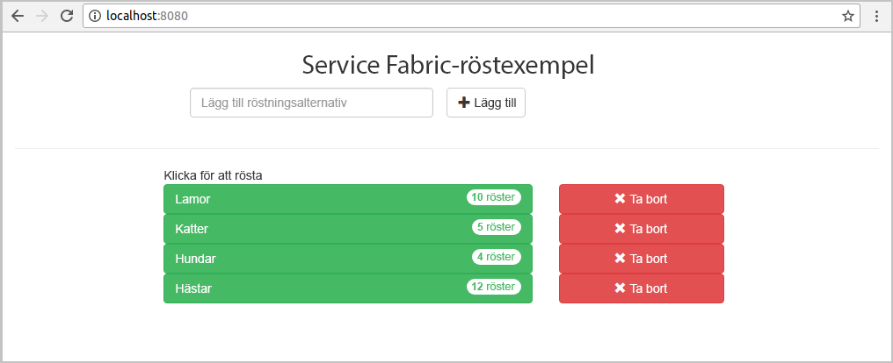
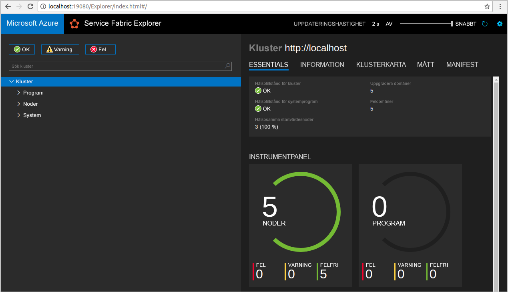
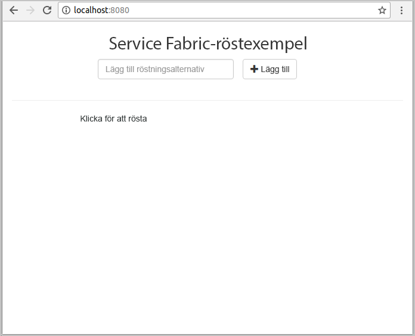
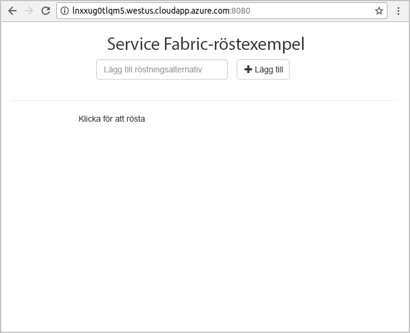
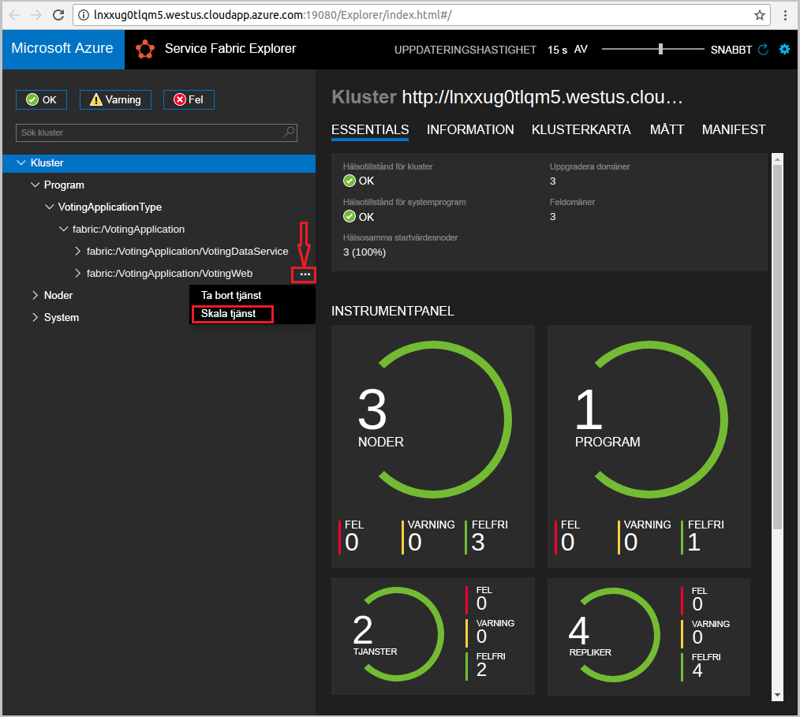
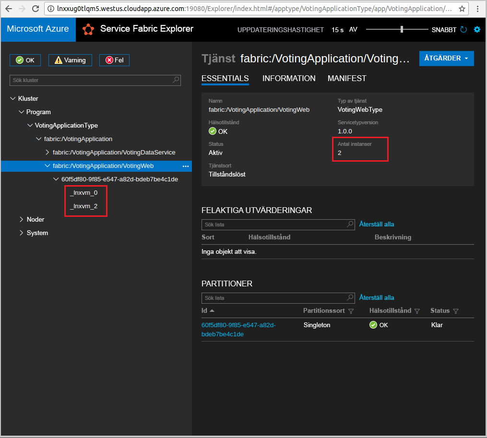

# <a name="quickstart-deploy-a-java-reliable-services-application-to-service-fabric"></a>Snabbstart: Distribuera en Java-app (tillförlitliga tjänster) till Service Fabric

Azure Service Fabric är en plattform för distribuerade system för distribution och hantering av mikrotjänster och containrar.

I den här snabbstarten får du lära dig att distribuera ditt första Java-program till Service Fabric med hjälp av Eclipse Integrated Development Environment på en Linux-utvecklarmaskin. När du är klar har du ett röstningsprogram med en Java-webbklient som sparar röstningsresultat i en tillståndskänslig backend-tjänst i klustret.



I den här snabbstarten lär du dig att:

* Använda Eclipse som ett verktyg för Service Fabric Java-program
* Distribuera programmet till ditt lokala kluster
* Distribuera programmet till ett kluster i Azure
* Skala ut programmet över flera noder

## <a name="prerequisites"></a>Nödvändiga komponenter

För att slutföra den här snabbstarten behöver du:

1. [Installera Service Fabric SDK och Service Fabric Command Line Interface (CLI)](https://docs.microsoft.com/azure/service-fabric/service-fabric-get-started-linux#installation-methods)
2. [Installera Git](https://git-scm.com/)
3. [Installera Eclipse](https://www.eclipse.org/downloads/)
4. [Konfigurera en Java-miljö](https://docs.microsoft.com/azure/service-fabric/service-fabric-get-started-linux#set-up-java-development) och kontrollera att du följer de valfria stegen för att installera plugin-programmet Eclipse

## <a name="download-the-sample"></a>Hämta exemplet

Kör följande kommando i ett kommandofönster för att klona databasen för exempelappen till den lokala datorn.

```git
git clone https://github.com/Azure-Samples/service-fabric-java-quickstart.git
```

## <a name="run-the-application-locally"></a>Kör programmet lokalt

1. Starta ditt lokala kluster genom att köra följande kommando:

    ```bash
    sudo /opt/microsoft/sdk/servicefabric/common/clustersetup/devclustersetup.sh
    ```
    Det kan ta lite tid att starta det lokala klustret. För att bekräfta att klustret är helt aktiverat öppnar du Service Fabric Explorer på **http://localhost:19080**. När du ser fem felfria noder vet du att det lokala klustret är igång och redo.

    

2. Öppna Eclipse.
3. Klicka på File (Arkiv) -> Import (Importera) -> Gradle -> Existing Gradle Project (Befintligt Gradle-projekt) och följ anvisningarna i guiden.
4. Klicka på Directory (Katalog) och välj katalogen `Voting` från mappen `service-fabric-java-quickstart` som du klonade från Github. Klicka på Slutför. 

    

5. Nu finns projektet `Voting` i Package Explorer (Paketutforskaren) för Eclipse.
6. Högerklicka på projektet och välj **Publish Application...** (Publicera program) under listrutan **Service Fabric**. Välj **PublishProfiles/Local.json** som Target Profile (Målprofil) och klicka på Publish (Publicera).

    

7. Öppna valfri webbläsare och öppna programmet genom att gå till **http://localhost:8080**.

    

Du kan nu lägga till en uppsättning röstningsalternativ och börja ta emot röster. Programmet körs och lagrar alla data i Service Fabric-klustret, utan att en separat databas krävs.

## <a name="deploy-the-application-to-azure"></a>Distribuera programmet till Azure

### <a name="set-up-your-azure-service-fabric-cluster"></a>Konfigurera ett Azure Service Fabric-kluster

Om du vill distribuera programmet till ett kluster i Azure kan du skapa ett eget kluster.

Partkluster är kostnadsfria och tidsbegränsade Service Fabric-kluster som finns i Azure och som körs av Service Fabric-teamet. Du kan använda partkluster till att distribuera program och lära dig mer om plattformen. Klustret använder ett enda självsignerat certifikat för nod-till-nod- och klient-till-nod-säkerhet.

Logga in och anslut till ett [Linux-kluster](http://aka.ms/tryservicefabric). Hämta PFX-certifikatet till datorn genom att klicka på **PFX**-länken. Klicka på **Viktigt**-länken för att hitta certifikatlösenordet och anvisningar om hur du konfigurerar olika miljöer till att använda certifikatet. Behåll både sidan **Välkommen** och sidan **Viktigt** öppna så att du kan använda några av instruktionerna i följande steg.

> [!Note]
> Det finns ett begränsat antal tillgängliga partykluster per timme. Om du får ett felmeddelande när du försöker registrera dig för ett partkluster kan du vänta en stund och försöka igen, eller följa stegen i [Skapa ett Service Fabric-kluster i Azure](service-fabric-tutorial-create-vnet-and-linux-cluster.md) för att skapa ett kluster i din prenumeration.
>
> Spring Boot-tjänsten är konfigurerad för att lyssna efter inkommande trafik på port 8080. Se till att den porten är öppen i ditt kluster. Porten är öppen om du använder ett partykluster.
>

I Service Fabric finns flera verktyg för att hantera kluster och dess program:

* Service Fabric Explorer, ett webbläsarbaserat verktyg.
* Service Fabric CLI (kommandoradsgränssnitt) som körs ovanpå Azure CLI.
* PowerShell-kommandon.

I den här snabbstarten använder du Service Fabric CLI och Service Fabric Explorer.

Om du vill använda CLI:n måste du skapa en PEM-fil som baseras på PFX-filen som du hämtade. Konvertera en fil med hjälp av följande kommando. (För partkluster kan du kopiera ett specifikt kommando till PFX-filen från instruktionerna på sidan **Viktigt**.)

    ```bash
    openssl pkcs12 -in party-cluster-1486790479-client-cert.pfx -out party-cluster-1486790479-client-cert.pem -nodes -passin pass:1486790479
    ```

Om du vill använda Service Fabric Explorer måste du importera certifikatets PFX-fil som du hämtade från partklustrets webbplats till certifikatarkivet (Windows eller Mac) eller till själva webbläsaren (Ubuntu). Du behöver lösenordet för den privata nyckeln i PFX, som du kan hämta på sidan **Viktigt**.

Använd den metod som du är mest bekväm med till att importera certifikatet på datorn. Exempel:

* I Windows: Dubbelklicka på PFX-filen och följ anvisningarna för att installera certifikatet i ditt personliga arkiv `Certificates - Current User\Personal\Certificates`. Du kan också använda PowerShell-kommandot i **Viktigt**-instruktionerna.
* I Mac: Dubbelklicka på PFX-filen och följ anvisningarna för att installera certifikatet i din nyckelring.
* Ubuntu: Mozilla Firefox är standardwebbläsare i Ubuntu 16.04. Klicka på menyknappen i det övre högra hörnet i webbläsaren om du vill importera certifikatet till Firefox. Klicka sedan på **Alternativ**. På sidan **Inställningar** söker du efter ”certifikat” i sökrutan. Klicka på **Visa certifikat** och välj fliken **Dina certifikat**. Klicka på **Importera** och följ anvisningarna för att importera certifikatet.

   

### <a name="add-certificate-information-to-your-application"></a>Lägg till certifikatinformation i ditt program

Certifikattumavtrycket måste läggas till i ditt program eftersom det använder Service Fabrics programmeringsmodeller.

1. Du kommer att behöva tumavtrycket för certifikatet i `Voting/VotingApplication/ApplicationManifest.xml`-filen när du kör på ett säkert kluster. Kör följande kommando för att extrahera tumavtrycket för certifikatet.

    ```bash
    openssl x509 -in [CERTIFICATE_PEM_FILE] -fingerprint -noout
    ```

2. I filen `Voting/VotingApplication/ApplicationManifest.xml` lägger du till följande kodavsnitt under taggen **ApplicationManifest**. **X509FindValue** ska vara tumavtrycket från föregående steg (inga semikolon). 

    ```xml
    <Certificates>
        <SecretsCertificate X509FindType="FindByThumbprint" X509FindValue="0A00AA0AAAA0AAA00A000000A0AA00A0AAAA00" />
    </Certificates>
    ```

### <a name="deploy-the-application-using-eclipse"></a>Distribuera programmet med Eclipse

Nu när programmet är redo kan du distribuera det till ett kluster direkt från Visual Studio.

1. Öppna filen **Cloud.json** som finns i katalogen **PublishProfiles** och fyll i uppgifter i fälten `ConnectionIPOrURL` och `ConnectionPort`. Exempel:

    ```bash
    {
         "ClusterConnectionParameters":
         {
            "ConnectionIPOrURL": "lnxxug0tlqm5.westus.cloudapp.azure.com",
            "ConnectionPort": "19080",
            "ClientKey": "[path_to_your_pem_file_on_local_machine]",
            "ClientCert": "[path_to_your_pem_file_on_local_machine]"
         }
    }
    ```

2. Högerklicka på projektet och välj **Publish Application...** (Publicera program) under listrutan **Service Fabric**. Välj **PublishProfiles/Cloud.json** som Target Profile (Målprofil) och klicka på Publish (Publicera).

    

3. Öppna valfri webbläsare. Öppna programmet genom att navigera till **http://\<ConnectionIPOrURL>:8080**.

    

## <a name="scale-applications-and-services-in-a-cluster"></a>Skala program och tjänster i ett kluster

Tjänsterna kan enkelt skalas över ett kluster när belastningen på tjänsterna ändras. Du kan skala en tjänst genom att ändra antalet instanser som körs i klustret. Det går att skala tjänsterna på flera sätt. Du kan till exempel använda skript eller kommandon från Service Fabric CLI (sfctl). I följande steg använder du Service Fabric Explorer.

Service Fabric Explorer körs i alla Service Fabric-kluster och kan nås från en webbläsare genom att du bläddrar till klustrets HTTP-hanteringsport (19080), till exempel `http://lnxxug0tlqm5.westus.cloudapp.azure.com:19080`.

Så här skalar du webbklienttjänsten:

1. Öppna Service Fabric Explorer i ditt kluster, till exempel `https://lnxxug0tlqm5.westus.cloudapp.azure.com:19080`.
2. Klicka på ellipsknappen (tre punkter) bredvid noden **fabric:/Voting/VotingWeb** i trädvyn och välj **Scale Service** (Skala tjänst).

    

    Du kan nu välja att skala antalet instanser av frontwebbtjänsten.

3. Ändra antalet till **2** och klicka på **Scale Service** (Skala tjänst).
4. Klicka på noden **fabric:/Voting/VotingWeb** i trädvyn och utöka partitionsnoden (som representeras av en globalt unik identifierare).

    

    Du kan nu se att tjänsten har två instanser och i trädvyn du se vilka noder instanserna körs på.

Med den här enkla hanteringsåtgärden har du dubblerat tillgängliga resurser för bearbetning av användarbelastningen i frontwebbtjänsten. Det är viktigt att förstå att du inte behöver flera instanser av en tjänst för att den ska kunna köras på ett tillförlitligt sätt. Om ett fel uppstår för en tjänst ser Service Fabric till att en ny tjänstinstans körs i klustret.

## <a name="next-steps"></a>Nästa steg

I den här snabbstarten har du lärt dig att:

* Använda Eclipse som ett verktyg för Service Fabric Java-program
* Distribuera Java-program till ditt lokala kluster
* Distribuera Java-program till ett kluster i Azure
* Skala ut programmet över flera noder

I självstudien för Java-appar finns mer information om hur du arbetar med Java-appar i Service Fabric.

> [!div class="nextstepaction"]
> [Distribuera en Java-app](./service-fabric-tutorial-create-java-app.md)
