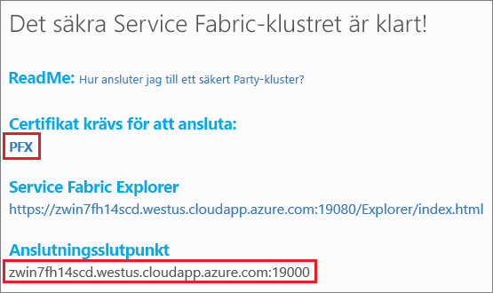
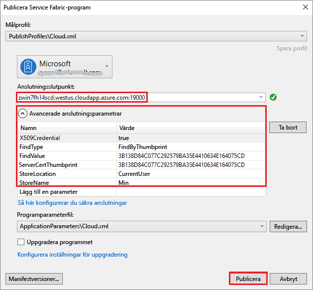

# <a name="tutorial-deploy-a-service-fabric-application-to-a-cluster-in-azure"></a>Självstudie: Distribuera en Service Fabric-app till ett kluster i Azure

Den här självstudien är del två i en serie. Här får du se hur du distribuerar ett Azure Service Fabric-program till ett nytt kluster i Azure.

I den här självstudiekursen får du lära du dig att:
> [!div class="checklist"]
> * skapa ett partkluster
> * distribuera ett program till ett fjärrkluster med Visual Studio.

I den här självstudieserien får du lära du dig att:
> [!div class="checklist"]
> * [Skapa ett .NET Service Fabric-program](service-fabric-tutorial-create-dotnet-app.md)
> * Distribuera programmet till ett fjärrkluster
> * [Lägga till en HTTPS-slutpunkt i en klienttjänst i ASP.NET Core](service-fabric-tutorial-dotnet-app-enable-https-endpoint.md)
> * [Konfigurera CI/CD med hjälp av Visual Studio Team Services](service-fabric-tutorial-deploy-app-with-cicd-vsts.md)
> * [Konfigurera övervakning och diagnostik för programmet](service-fabric-tutorial-monitoring-aspnet.md)

## <a name="prerequisites"></a>Nödvändiga komponenter

Innan du börjar den här självstudien:

* Om du inte har någon Azure-prenumeration kan du skapa ett [kostnadsfritt konto](https://azure.microsoft.com/free/?WT.mc_id=A261C142F).
* [Installera Visual Studio 2017](https://www.visualstudio.com/) och installera **Azure Development** och arbetsbelastningarna **ASP.NET och webbutveckling**.
* [Installera Service Fabric SDK](service-fabric-get-started.md).

## <a name="download-the-voting-sample-application"></a>Ladda ned exempelprogrammet för röstning

Om du inte skapade exempelprogrammet för röstning i [del ett av självstudieserien](service-fabric-tutorial-create-dotnet-app.md) kan du ladda ned det. Kör följande kommando i ett kommandofönster för att klona databasen för exempelappen till den lokala datorn.

```git
git clone https://github.com/Azure-Samples/service-fabric-dotnet-quickstart
```

## <a name="publish-to-a-service-fabric-cluster"></a>Publicera i ett Service Fabric-kluster

Nu när programmet är redo kan du distribuera det till ett kluster direkt från Visual Studio. Ett [Service Fabric-kluster](/service-fabric/service-fabric-deploy-anywhere.md) är en nätverksansluten uppsättning virtuella eller fysiska datorer som dina mikrotjänster distribueras till och hanteras från.

För den här självstudien får du två alternativ för distribution av röstningsprogrammet till ett Service Fabric-kluster med Visual Studio:

* Publicera till ett utvärderingskluster (part).
* Publicera till ett befintligt kluster i din prenumeration.  Du kan skapa Service Fabric-kluster via [Azure Portal](https://portal.azure.com)med hjälp av [PowerShell](./scripts/service-fabric-powershell-create-secure-cluster-cert.md)- eller [Azure CLI](./scripts/cli-create-cluster.md)-skript, eller från en [Azure Resource Manager-mall](service-fabric-tutorial-create-vnet-and-windows-cluster.md).

> [!NOTE]
> Många tjänster använder omvänd proxy när de kommunicerar med varandra. Kluster som skapas från Visual Studio och partkluster har en omvänd proxy som är aktiverad som standard.  Om du använder ett befintligt kluster måste du [aktivera omvänd proxy i klustret](service-fabric-reverseproxy.md#setup-and-configuration).


### <a name="find-the-votingweb-service-endpoint-for-your-azure-subscription"></a>Hitta VotingWeb-tjänstslutpunkten för Azure-prenumerationen

Om du ska publicera röstningsprogrammet till din egen Azure-prenumeration identifierar du slutpunkten för klientdelen av webbtjänsten. Om du använder ett partkluster är port 8080 med röstningsexemplet automatiskt öppen och du behöver inte konfigurera den i partklustrets belastningsutjämnare.

Frontend-webbtjänsten lyssnar på en viss port.  När programmet distribueras till ett kluster i Azure, körs både klustret och programmet bakom en Azure-lastbalanserare.  Programporten måste vara öppen med en regel i Azure-lastbalanseraren för det här klustret så att inkommande trafik kan nå webbtjänsten.  Porten (t.ex. 8080) hittar du i filen *VotingWeb/PackageRoot/ServiceManifest.xml* i elementet **Endpoint**:

```xml
<Endpoint Protocol="http" Name="ServiceEndpoint" Type="Input" Port="8080" />
```

För Azure-prenumerationen öppnar du den här porten med en belastningsutjämningsregel i Azure via ett [PowerShell-skript](./scripts/service-fabric-powershell-open-port-in-load-balancer.md) eller via belastningsutjämnaren för det här klustret i [Azure-portalen](https://portal.azure.com).

### <a name="join-a-party-cluster"></a>Ansluta till ett partkluster

> [!NOTE]
> Hoppa till Distribuera programmet med hjälp av Visual Studio i nästa avsnitt om du ska publicera programmet i ditt eget kluster inom en Azure-prenumeration.

Partykluster är kostnadsfria, tidsbegränsade Service Fabric-kluster i Azure som körs av Service Fabric-teamet där vem som helst kan distribuera program och lära sig mer om plattformen. Klustret använder ett enda självsignerat certifikat för nod-till nod- samt klient-till-nod-säkerhet.

Logga in och [ansluta till ett Windows-kluster](http://aka.ms/tryservicefabric). Hämta PFX-certifikatet till datorn genom att klicka på **PFX**-länken. Klicka på länken **Hur ansluter man till ett säkert partkluster?** och kopiera lösenordet för certifikatet. Certifikatet, certifikatlösenordet och värdet **Anslutningsslutpunkt** används i följande steg.



> [!Note]
> Det finns ett begränsat antal tillgängliga partkluster per timme. Om du får ett felmeddelande när du försöker registrera dig för ett partkluster kan du vänta en stund och försöka igen, eller följa stegen i självstudien [Distribuera en .NET-app](https://docs.microsoft.com/azure/service-fabric/service-fabric-tutorial-deploy-app-to-party-cluster#deploy-the-sample-application) som hjälper dig att skapa ett Service Fabric-kluster i din Azure-prenumeration och distribuera programmet där. Om du inte redan har en Azure-prenumeration kan du skapa ett [kostnadsfritt konto](https://azure.microsoft.com/free/?WT.mc_id=A261C142F).
>

På en Windows-dator installerar du PFX i certifikatarkivet *CurrentUser\My*.

```powershell
PS C:\mycertificates> Import-PfxCertificate -FilePath .\party-cluster-873689604-client-cert.pfx -CertStoreLocation Cert:\CurrentUser\My -Password (ConvertTo-SecureString 873689604 -AsPlainText -Force)


   PSParentPath: Microsoft.PowerShell.Security\Certificate::CurrentUser\My

Thumbprint                                Subject
----------                                -------
3B138D84C077C292579BA35E4410634E164075CD  CN=zwin7fh14scd.westus.cloudapp.azure.com
```

Kom ihåg tumavtrycket för följande steg.

> [!Note]
> Frontwebbtjänsten är som standard konfigurerad för att lyssna efter inkommande trafik på port 8080. Port 8080 är öppen i partklustret.  Om du behöver ändra programporten ändrar du den till en av de portar som är öppna i partklustret.
>

### <a name="publish-the-application-using-visual-studio"></a>Publicera programmet med hjälp av Visual Studio

Nu när programmet är redo kan du distribuera det till ett kluster direkt från Visual Studio.

1. Högerklicka på **Röstning** i Solution Explorer och välj **Publicera**. Dialogrutan Publicera visas.

2. Kopiera **anslutningsslutpunkten** från partklustersidan eller från Azure-prenumerationen till fältet **Anslutningsslutpunkt**. Till exempel `zwin7fh14scd.westus.cloudapp.azure.com:19000`. Klicka på **Avancerade anslutningsparametrar** och kontrollera att värdena *FindValue* och *ServerCertThumbprint* matchar tumavtrycket för certifikatet som installerades i föregående steg för ett partkluster eller certifikatet som matchar Azure-prenumerationen.

    

    Varje program i klustret måste ha ett unikt namn.  Partkluster är en offentlig, delad miljö men det kan finnas en konflikt med ett befintligt program.  Om det finns en namnkonflikt byter du namn på Visual Studio-projektet och distribuerar igen.

3. Klicka på **Publicera**.

4. Öppna en webbläsare och ange klusteradressen följt av :8080 (eller eventuell annan konfigurerad port) för att komma till röstningsprogrammet i klustret, exempelvis `http://zwin7fh14scd.westus.cloudapp.azure.com:8080`. Du bör nu se det program som körs i klustret i Azure. Prova att lägga till och ta bort röstningsalternativ och rösta för ett eller flera av dessa alternativ på röstningswebbplatsen.

    


## <a name="next-steps"></a>Nästa steg

I den här självstudiekursen lärde du dig att:

> [!div class="checklist"]
> * Skapa ett partkluster.
> * distribuera ett program till ett fjärrkluster med Visual Studio.

Gå vidare till nästa kurs:
> [!div class="nextstepaction"]
> [Aktivera HTTPS](service-fabric-tutorial-dotnet-app-enable-https-endpoint.md)
