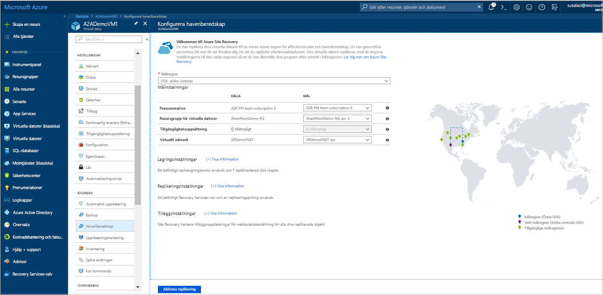
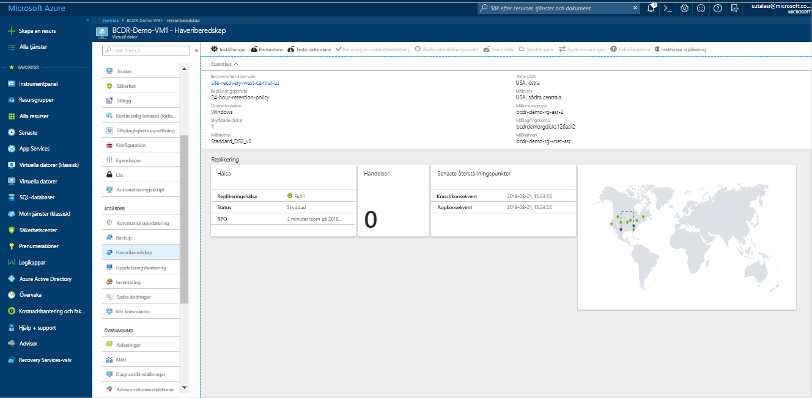
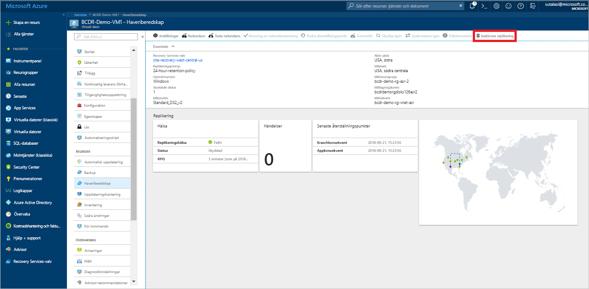

# Replikera en virtuell Azure-dator till en annan Azure-region (förhandsgranskning)

Den [Azure Site Recovery](site-recovery-overview.md) tjänsten bidrar till din affärskontinuitet och haveriberedskap (BCDR) strategi genom att hålla dina appar och köra tillgängliga under planerade och oplanerade avbrott. Site Recovery samordnar haveriberedskap för lokala datorer och virtuella Azure-datorer (VM), inklusive replikering, redundans och återställning hanterar.

Denna Snabbstart beskriver hur du replikera en virtuell Azure-dator till en annan Azure-region.

Om du inte har en Azure-prenumeration kan du skapa ett [kostnadsfritt konto](https://azure.microsoft.com/free/?WT.mc_id=A261C142F) innan du börjar.

## Logga in på Azure

Logga in på Azure Portal på http://portal.azure.com.

## Aktivera replikering för den virtuella Azure-datorn

1. I Azure-portalen klickar du på **virtuella datorer**, och välj den virtuella datorn som du vill replikera.

2. I **inställningar**, klickar du på **Disaster recovery (förhandsgranskning)**.
3. I **konfigurera katastrofåterställning** > **målregionen** väljer du den mål-region som du replikerar.
4. Acceptera de andra standardinställningarna för denna Snabbstart.
5. Klicka på **Aktivera replikering**. Detta startar ett jobb för att aktivera replikering för den virtuella datorn.

    

## Kontrollera inställningarna

När replikeringen jobbet har slutförts måste du kontrollera replikeringsstatus, ändra inställningar för replikering och testa distributionen.

1. VM-menyn klickar du på **Disaster recovery (förhandsgranskning)**.
2. Du kan verifiera replikeringshälsa återställningspunkter som har skapats och källa och mål-regioner på kartan.

   

## Rensa resurser

Den virtuella datorn i den primära regionen stoppar replikera när du inaktivera replikering för den:

- Inställningar för datakälla replikering rensas automatiskt.
- Site Recovery-faktureringen för den virtuella datorn också stoppar.

Stoppa replikeringen på följande sätt:

1. Välj den virtuella datorn.
2. I **Disaster recovery (förhandsgranskning)**, klickar du på **mer**.
3. Klicka på **inaktivera replikering**.

   

## Nästa steg

I den här snabbstarten replikeras en enda virtuell dator till en sekundär region.

> [!div class="nextstepaction"]
> [Konfigurera katastrofåterställning för virtuella Azure-datorer](azure-to-azure-tutorial-enable-replication.md)
