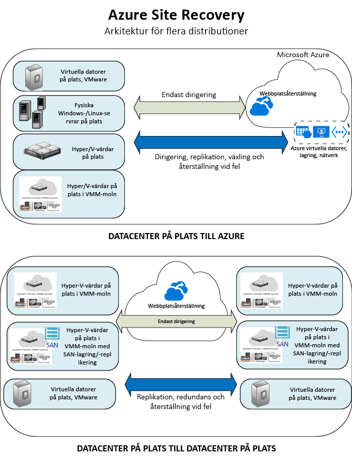

<properties
    pageTitle="Vad är Site Recovery? | Microsoft Azure"
    description="Ger en översikt över Azure Site Recovery-tjänsten och sammanfattar distributionsscenarier."
    services="site-recovery"
    documentationCenter=""
    authors="rayne-wiselman"
    manager="cfreeman"
    editor=""/>

<tags
    ms.service="site-recovery"
    ms.devlang="na"
    ms.topic="get-started-article"
    ms.tgt_pltfrm="na"
    ms.workload="storage-backup-recovery"
    ms.date="10/13/2016"
    ms.author="raynew"/>

#  Vad är Site Recovery?

Välkommen till Azure Site Recovery! Den här artikeln ger en snabb överblick över Site Recovery-tjänsten och hur den bidrar till din verksamhet.

Din organisation behöver ha en strategi för affärskontinuitet och haveriberedskap (BCDR) som ser till att appar, arbetsbelastningar och data är säkert och tillgängligt under planerade såväl som oplanerade avbrott och ser till att det återställs till vanliga driftsförhållanden så snart som möjligt. Site Recovery är en Azure-tjänst som bidrar till den här strategin.

Site Recovery samordnar replikering av arbetsbelastningar som kör lokala fysiska servrar och virtuella datorer. Du kan replikera servrar och VM:ar från ett primärt datacenter till molnet (Azure), eller till ett sekundärt datacenter. Vid avbrott på den primära platsen så växlar du över till den sekundära platsen så att appar och arbetsbelastningar fortsätter att vara åtkomliga och tillgängliga. Du växlar tillbaka till den primära platsen när den har återgått till normal drift.

## Site Recovery på Azure Portal

Azure har två olika [distributionsmodeller](../resource-manager-deployment-model.md) för att skapa och arbeta med resurser. Azure Resource Manager-modellen och den klassiska tjänstehanteringsmodellen. Azure har också två portaler – den [klassiska Azure-portalen](https://manage.windowsazure.com/) som stöder den klassiska distributionsmodellen samt [Azure Portal](https://portal.azure.com) med stöd för både den klassiska- och Resource Manager-modellen.

- Site Recovery är tillgängligt både på den klassiska portalen och på Azure Portal.
- I den klassiska Azure-portalen, har du stöd för Site Recovery med den klassiska tjänsthanteringsmodellen.
- I Azure Portal, har du stöd för den klassiska modellen eller Resource Manager-distributioner. 

Informationen i den här artikeln gäller både klassiska distributioner och distributioner via Azure Portal. Skillnaderna beskrivs i förekommande fall.

## Varför ska jag distribuera Site Recovery?

Här är exempel på hur Site Recovery kan hjälpa ditt företag:

- **Förenkla BCDR**– Du kan hantera replikering, redundans och återställning av flera arbetsbelastningar på en enda plats i Azure Portal. Site Recovery samordnar replikering och redundans men kan inte komma åt dina programdata och har inte någon information om dem.
- **Tillhandahåll flexibel replikering** – Med Site Recovery, kan du replikera arbetsbelastningar som körs på stödda Hyper-V-VM:ar, VMware-VM:ar och fysiska Windows och Linux-servrar.
- **Utför enkel replikeringstestning** – Site Recovery erbjuder redundanstestning för att stödja tester av haveriberedskap, utan att påverka driftsmiljön.
- **Redundans och återställning**– Du kan köra planerade redundanser för förväntade avbrott med noll dataförlust, eller oplanerade redundanser med minimal dataförlust (beroende på replikeringsfrekvensen) för oväntade haverier. Efter en redundans så kan du återställa till dina primära platser. Site Recovery erbjuder återställningsplaner som kan inkludera skript och Azure Automation-arbetsböcker så att du kan anpassa redundans och återställning av program med flera nivåer.
- **Ta bort ett sekundärt datacenter**–Du kan replikera arbetsbelastningar till Azure istället för till en sekundär plats. Därmed kan du göra dig av med kostnaden och komplexiteten med att underhålla ett sekundärt datacenter. Replikerad data lagras i Azure Storage, med all flexibilitet som det innebär. VM:ar skapas med den replikerade datan när återställning sker.
- **Integrerar med befintlig BCDR-teknik** – Site Recovery integrerar sig med andra BCDR-funktioner. Du kan exempelvis använda Site Recovery för att skydda serverdelen för SQL Server för företagets arbetsbelastningar, inklusive inbyggt stöd för SQL Server AlwaysOn, för att hantera redundans för tillgänglighetsgrupper.

## Vad kan jag replikera?

Här är en sammanfattning av vad du kan replikera med Site Recovery.

**Replikera** | **Repliker till** 
---|---
Arbetsbelastningar som körs på lokala VMware-VM:ar | [Azure](site-recovery-vmware-to-azure-classic.md)   [Sekundär plats](site-recovery-vmware-to-vmware.md)
Arbetsbelastningar som körs på lokala Hyper-V-VM:ar som hanteras i VMM-moln  | [Azure](site-recovery-vmm-to-azure.md)   [Sekundär plats](site-recovery-vmm-to-vmm.md) 
Arbetsbelastning som körs på lokala Hyper-V-VM:ar som hanteras i VMM-moln med SAN-lagring|  [Sekundär plats](site-recovery-vmm-san.md)
Arbetsbelastningar som körs på lokala Hyper-V-VM:ar utan VMM | [Azure](site-recovery-hyper-v-site-to-azure.md)
Arbetsbelastningar som körs på lokala fysiska Windows-/Linux-servrar | [Azure](site-recovery-vmware-to-azure-classic.md)   [Sekundär plats](site-recovery-vmware-to-vmware.md)

## Vilka arbetsbelastningar kan jag skydda?

Site Recovery tillåter programmedveten BCDR, vilket gör att arbetsbelastningar och appar kan fortsätta att köra på ett konsekvent sätt vid avbrott. Site Recovery tillhandahåller:

- **Programkonsekventa ögonblicksbilder** – Datorer replikerar sig med programkonsekventa ögonblicksbilder, för appar på en eller flera nivåer. Förutom att samla in diskdata så samlar programkonsekventa ögonblicksbilder in all data i minnet och alla pågående transaktioner.
- **I princip synkron replikering** – Site Recovery erbjuder replikeringsfrekvenser så låga som 30 sekunder för Hyper-V, samt kontinuerlig replikering för VMware.
- **Flexibla återställningsplaner**– du kan skapa och anpassa återställningsplaner med externa skript och manuella åtgärder. Integrering med Azure Automation-runbooks låter dig återställa en hel programstack med ett enda klick.
- **Integrering med SQL Server AlwaysOn** – Du kan hantera redundans för tillgänglighetsgrupper i Site Recovery-återställningsplaner.
- **Automation-bibliotek** – Ett omfattande Azure Automation-bibliotek med produktionsklara, programspecifika skript som kan hämtas och integrerats med Site Recovery.
- **Enkel nätverkshantering** – Avancerad nätverkshantering i Site Recovery och Azure förenklar nätverkskraven för program, inklusive reservation av IP-adresser, konfiguration av belastningsutjämnare och integration av Azure Traffic Manager för effektiv nätverksväxling.

## Nästa steg

- Läs mer i [Vilka arbetsbelastningar kan Site Recovery skydda?](site-recovery-workload.md)
- Mer information om Site Recovery-arkitekturen finns i [Hur fungerar Site Recovery?](site-recovery-components.md)
 

<!--HONumber=Oct16_HO3-->

