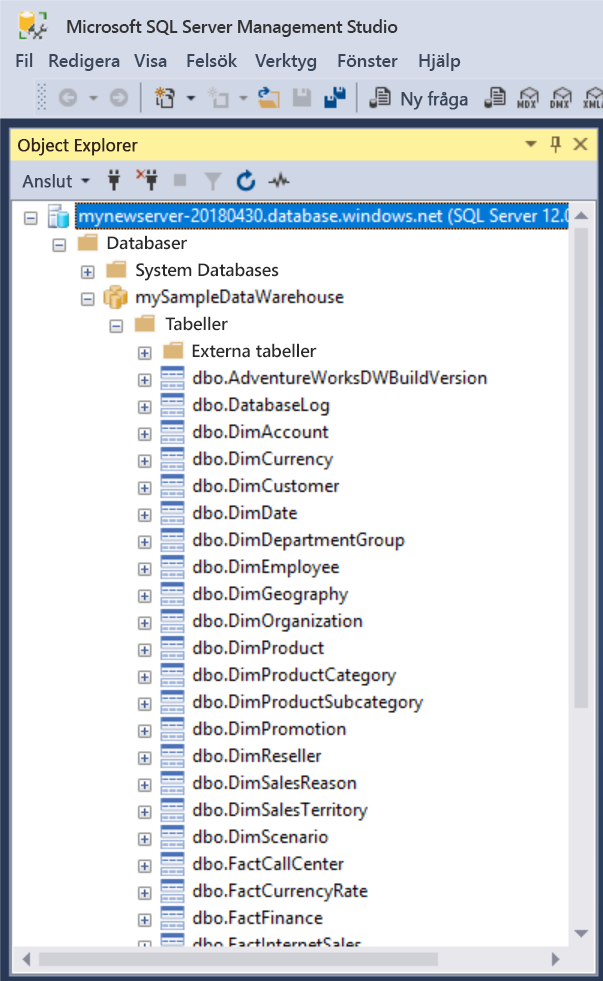
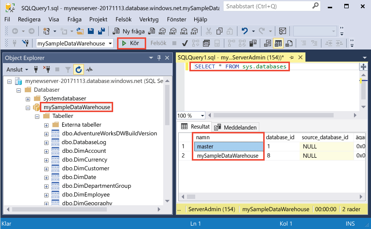
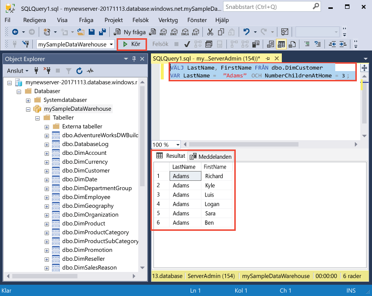

# <a name="quickstart-create-and-query-an-azure-sql-data-warehouse-in-the-azure-portal"></a>Snabbstart:Skapa och skicka frågor till ett Azure SQL informationslager i Azure-portalen

Skapa snabbt och skicka frågor till ett Azure SQL Data Warehouse med hjälp av Azure Portal.

Om du inte har en Azure-prenumeration kan du skapa ett [kostnadsfritt](https://azure.microsoft.com/free/) konto innan du börjar.

## <a name="before-you-begin"></a>Innan du börjar

Ladda ned och installera den senaste versionen av [SQL Server Management Studio](/sql/ssms/download-sql-server-management-studio-ssms.md) (SSMS).

## <a name="sign-in-to-the-azure-portal"></a>Logga in på Azure Portal

Logga in på [Azure-portalen](https://portal.azure.com/).

## <a name="create-a-data-warehouse"></a>Skapa ett datalager

Ett Azure SQL Data Warehouse skapas med en definierad uppsättning [beräkningsresurser](performance-tiers.md). Databasen skapas inom en [Azure-resursgrupp](../azure-resource-manager/resource-group-overview.md) och i en [logisk Azure SQL-server](../sql-database/sql-database-features.md). 

Följ de här stegen för att skapa ett SQL Data Warehouse som innehåller exempeldatabasen AdventureWorksDW. 

1. Klicka på knappen **Ny** längst upp till vänster i Azure Portal.

2. Välj **Databases** (Databaser) på sidan **New** (nytt) och välj **SQL Data Warehouse** under **Featured** (aktuella) på sidan **New** (nytt).

    

3. Fyll i formuläret SQL Data Warehouse med följande information:   

    | Inställning | Föreslaget värde | Beskrivning | 
    | ------- | --------------- | ----------- | 
    | **Databasnamn** | mySampleDataWarehouse | För giltiga databasnamn, se [databasidentifierare](/sql/relational-databases/databases/database-identifiers). Observera att ett informationslager är en typ av databas.| 
    | **Prenumeration** | Din prenumeration  | Mer information om dina prenumerationer finns i [Prenumerationer](https://account.windowsazure.com/Subscriptions). |
    | **Resursgrupp** | myResourceGroup | Giltiga resursgruppnamn finns i [Namngivningsregler och begränsningar](https://docs.microsoft.com/azure/architecture/best-practices/naming-conventions). |
    | **Välj källa** | Exempel | Anger att exempeldatabas ska läsas in. Observera att ett informationslager är en typ av databas. |
    | **Välj exempel** | AdventureWorksDW | Anger att exempeldatabasen AdventureWorksDW ska läsas in.  |

    

4. Klicka på **Server** för att skapa och konfigurera en ny server för den nya databasen. Fyll i formuläret **Ny server** med följande information: 

    | Inställning | Föreslaget värde | Beskrivning | 
    | ------------ | ------------------ | ------------------------------------------------- | 
    | **Servernamn** | Valfritt globalt unikt namn | Giltiga servernamn finns i [Namngivningsregler och begränsningar](https://docs.microsoft.com/azure/architecture/best-practices/naming-conventions). | 
    | **Inloggning för serveradministratör** | Valfritt giltigt namn | För giltiga inloggningsnamn, se [Databasidentifierare](https://docs.microsoft.com/sql/relational-databases/databases/database-identifiers).|
    | **Lösenord** | Valfritt giltigt lösenord | Lösenordet måste innehålla minst åtta tecken och måste innehålla tecken från tre av följande kategorier: versaler, gemener, siffror och icke-alfanumeriska tecken. |
    | **Plats** | Valfri giltig plats | För information om regioner, se [Azure-regioner](https://azure.microsoft.com/regions/). |

    

5. Klicka på **Välj**.

6. Klicka på **Prestandanivå** för att ange prestandakonfigurationen för informationslagret.

7. För den här kursen ska du välja prestandanivån **Optimerad för Elasticity**. Skjutreglaget är som standard är inställt på **DW400**.  Prova att flytta det uppåt och nedåt för att se hur det fungerar. 

    

8. Klicka på **Använd**.

9. Nu när du har fyllt i SQL Database-formuläret klickar du på **Skapa** så att databasen etableras. Etableringen tar några minuter. 

    

10. Klicka på **Aviseringar** i verktygsfältet för att övervaka distributionsprocessen.
    
     

## <a name="create-a-server-level-firewall-rule"></a>Skapa en brandväggsregel på servernivå

Tjänsten SQL Database Warehouse skapar en brandvägg på servernivå som hindrar externa program och verktyg från att ansluta till servern eller databaser på servern. Om du vill kan du lägga till brandväggsregler som tillåter anslutningar för specifika IP-adresser.  Följ dessa steg för att skapa en [brandväggsregel på servernivå](../sql-database/sql-database-firewall-configure.md) för klientens IP-adress. 

> [!NOTE]
> SQL Database Warehouse kommunicerar via port 1433. Om du försöker ansluta inifrån ett företagsnätverk kanske utgående trafik via port 1433 inte tillåts av nätverkets brandvägg. I så fall kommer du inte att kunna ansluta till din Azure SQL Database-server om inte din IT-avdelning öppnar port 1433.
>

1. När distributionen är klar klickar du på **SQL-databaser** på menyn till vänster och klickar sedan på **mySampleDatabase** på sidan **SQL-databaser**. Översiktssidan för databasen öppnas, där du kan se det fullständigt kvalificerade servernamnet (som **mynewserver-20171113.database.windows.net**) och alternativ för ytterligare konfiguration. 

2. Kopiera det här fullständiga servernamnet för anslutning till servern och databaserna i efterföljande snabbstarter. Öppna serverinställningarna genom att klicka på servernamnet.

    

3. Öppna serverinställningarna 
4. genom att klicka på servernamnet.

    

5. Klicka på **Visa brandväggsinställningar**. Sidan **Brandväggsinställningar** för SQL Database-servern öppnas. 

    

4. Klicka på **Lägg till klient-IP** i verktygsfältet och lägg till din aktuella IP-adress i en ny brandväggsregel. Med en brandväggsregel kan du öppna port 1433 för en enskild IP-adress eller för IP-adressintervall.

5. Klicka på **Spara**. En brandväggsregel på servernivå för att öppna port 1433 på den logiska servern skapas för din aktuella IP-adress.

6. Klicka på **OK** och stäng sedan sidan **Brandväggsinställningar**.

Nu kan du ansluta till SQL-servern och dess informationslager med den här IP-adress. Anslutningen fungerar från SQL Server Management Studio eller något annat verktyg du väljer. När du ansluter kan du använda ServerAdmin-kontot som du skapade tidigare.  

> [!IMPORTANT]
> Som standard är åtkomst genom SQL Database-brandväggen aktiverad för alla Azure-tjänster. Klicka på **AV** på den här sidan och klicka sedan på **Spara** för att inaktivera brandväggen för alla Azure-tjänster.

## <a name="get-the-fully-qualified-server-name"></a>Hämta det fullständigt kvalificerade servernamnet

Hämta det fullständigt kvalificerade servernamnet för SQL-servern i Azure Portal. Du använder det fullständigt kvalificerade namnet senare när du ska ansluta till servern.

1. Logga in på [Azure-portalen](https://portal.azure.com/).
2. Välj **SQL-databaser** på den vänstra menyn och klicka på databasen på sidan **SQL-databaser**. 
3. I rutan **Essentials** på sidan för Azure Portal för databasen letar du reda på och kopierar **servernamnet**. I det här exemplet är det fullständigt kvalificerade namnet mynewserver 20171113.database.windows.net. 

      

## <a name="connect-to-the-server-as-server-admin"></a>Ansluta till servern som serveradministratör

I det här avsnittet används [SQL Server Management Studio](/sql/ssms/download-sql-server-management-studio-ssms.md) (SSMS) för att upprätta en anslutning till Azure SQL-servern.

1. Öppna SQL Server Management Studio.

2. I dialogrutan **Anslut till server** anger du följande information:

   | Inställning       | Föreslaget värde | Beskrivning | 
   | ------------ | ------------------ | ------------------------------------------------- | 
   | Servertyp | Databasmotor | Det här värdet är obligatoriskt |
   | servernamn | Fullständigt kvalificerat servernamn | Här är ett exempel: **mynewserver 20171113.database.windows.net**. |
   | Autentisering | SQL Server-autentisering | SQL-autentisering är den enda autentiseringstypen som vi konfigurerar i den här självstudiekursen. |
   | Inloggning | Serveradministratörskontot | Detta är det konto som du angav när du skapade servern. |
   | Lösenord | Lösenordet för serveradministratörskontot | Detta är det lösenord som du angav när du skapade servern. |

    

4. Klicka på **Anslut**. Fönstret Object Explorer öppnas i SSMS. 

5. Expandera **Databaser** i Object Explorer. Expandera **mySampleDatabase** så visas objekten i den nya databasen.

     

## <a name="run-some-queries"></a>Köra några frågor

SQL Data Warehouse använder T-SQL som frågespråk. Använd följande steg om du vill öppna ett frågefönster och köra några T-SQL-frågor:

1. Högerklicka på **mySampleDataWarehouse** och välj **Ny fråga**.  Ett nytt frågefönster öppnas.
2. Ange följande kommando i frågefönstret för att visa en lista över databaser.

    ```sql
    SELECT * FROM sys.databases
    ```

3. Klicka på **Kör**.  Resultatet av frågan visar två databaser: **master** och **mySampleDataWarehouse**.

    

4. Vi kan titta på vissa data genom att använda följande kommando för att se hur många kunder med efternamnet Adams som har tre barn hemma. I resultatlistan finns sex kunder. 

    ```sql
    SELECT LastName, FirstName FROM dbo.dimCustomer
    WHERE LastName = 'Adams' AND NumberChildrenAtHome = 3;
    ```

    

## <a name="clean-up-resources"></a>Rensa resurser

Du debiteras för informationslagerenheter och data som lagras i informationslagret. Dessa beräknings- och lagringsresurser debiteras separat. 

- Om du vill behålla data i lagringsutrymmet kan du pausa beräkningarna när du inte använder informationslagret. Genom att pausa beräkningarna debiteras du endast för lagringen av data. Du kan återuppta beräkningarna när du är redo att arbeta med data.
- Om du vill undvika framtida avgifter kan du ta bort informationslagret. 

Följ dessa steg för att rensa resurser enligt dina önskemål.

1. Logga in på [Azure Portal](https://portal.azure.com) och klicka på ditt informationslager.

    

1. Om du vill pausa beräkningarna klickar du på knappen **Pausa**. När informationslagret har pausats visas knappen **Starta**.  Klicka på **Starta** om du vill återuppta beräkningarna.

2. Om du vill ta bort informationslagret så att du varken debiteras för beräkning eller lagring klickar du på **Ta bort**.

3. Om du vill ta bort den SQL-server som du har skapat klickar du på **mynewserver 20171113.database.windows.net** i föregående bild och sedan på **Ta bort**.  Var försiktig med den här borttagningen eftersom du även tar bort alla databaser som har tilldelats servern.

4. Om du vill ta bort resursgruppen klickar du på **myResourceGroup** och sedan på **Ta bort resursgrupp**.


## <a name="next-steps"></a>Nästa steg
Du har nu skapat ett informationslager och en brandväggsregel, anslutit till ditt informationslager och kört några frågor. Om du vill veta mer om Azure SQL Data Warehouse kan fortsätta med självstudiekursen om att läsa in data.
> [!div class="nextstepaction"]
>[Läsa in data i ett SQL Data Warehouse](load-data-from-azure-blob-storage-using-polybase.md)