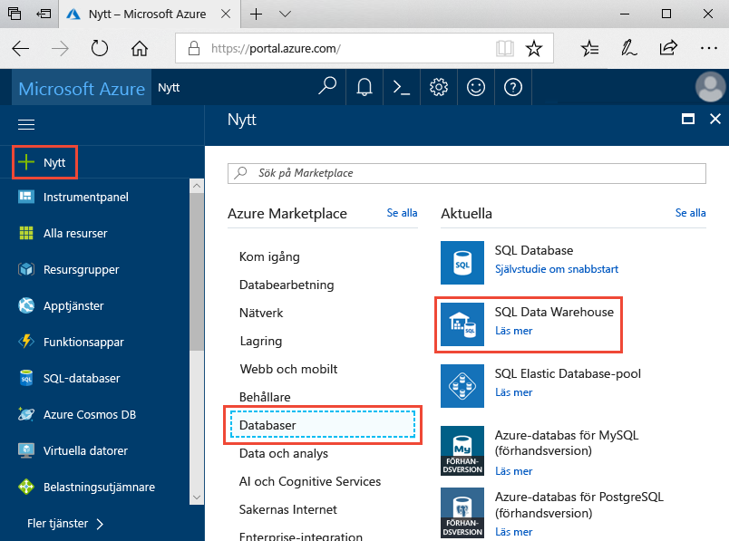
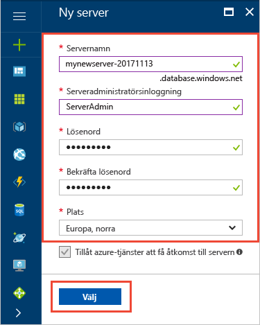
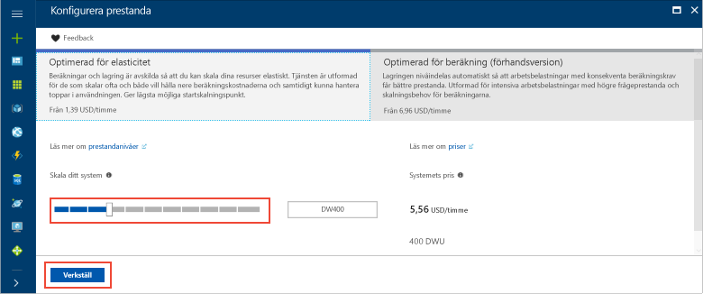
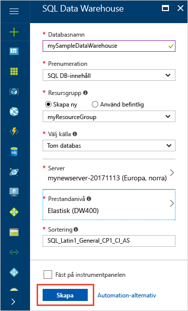
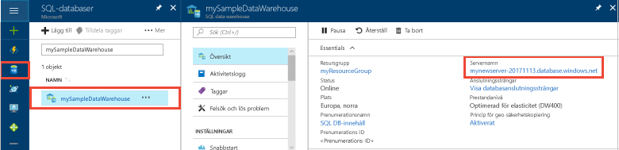
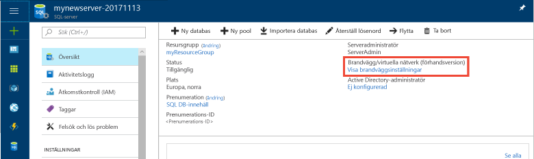
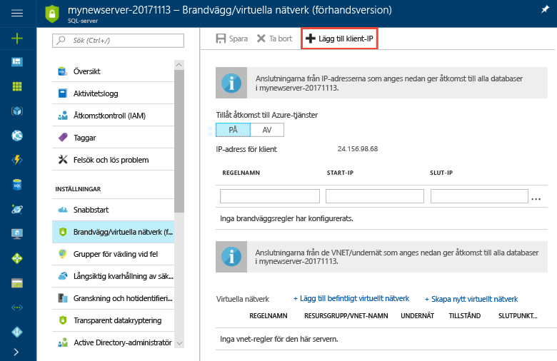
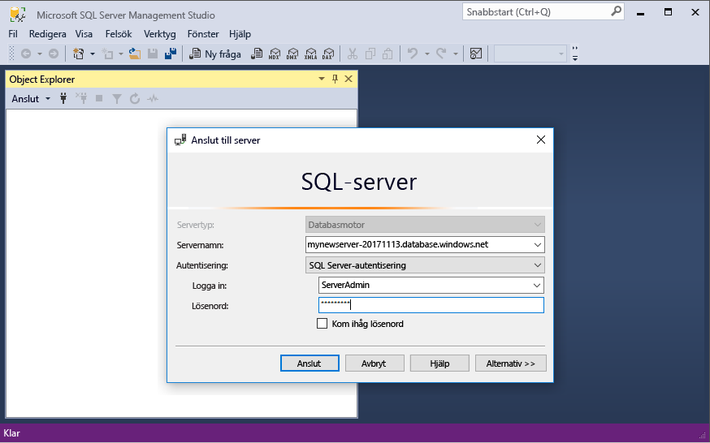
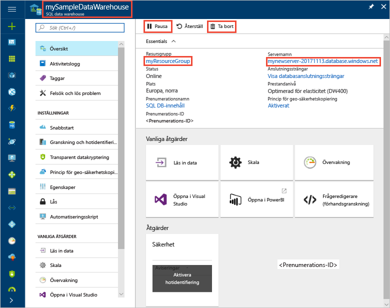

# <a name="tutorial-load-new-york-taxicab-data-to-azure-sql-data-warehouse"></a>Självstudier: Läs in New York tag taxi data till Azure SQL Data Warehouse

Den här självstudiekursen använder PolyBase för att läsa in New York tag taxi data från en offentlig Azure blob till Azure SQL Data Warehouse. I självstudierna används [Azure-portalen](https://portal.azure.com) och [SQL Server Management Studio](/sql/ssms/download-sql-server-management-studio-ssms) (SSMS) för att: 

> [!div class="checklist"]
> * Skapa ett informationslager på Azure-portalen
> * Skapa en brandväggsregel på servernivå på Azure-portalen
> * Ansluta till informationslagret med SSMS
> * Skapa en användare som utsetts för att läsa in data
> * Skapa externa tabeller för data i Azure blobblagring
> * Använda CTAS T-SQL-instruktionen för att läsa in data till informationslagret
> * Visa dataförloppet vid hämtning
> * Skapa statistik på nyligen inlästa data

Om du inte har en Azure-prenumeration kan du [skapa ett kostnadsfritt konto ](https://azure.microsoft.com/free/) innan du börjar.

## <a name="before-you-begin"></a>Innan du börjar

Innan du börjar med de här självstudierna ska du ladda ned och installera den senaste versionen av [SQL Server Management Studio](/sql/ssms/download-sql-server-management-studio-ssms) (SSMS).


## <a name="log-in-to-the-azure-portal"></a>Logga in på Azure Portal

Logga in på [Azure-portalen](https://portal.azure.com/).

## <a name="create-a-blank-sql-data-warehouse"></a>Skapa ett tomt SQL-informationslager

Ett Azure SQL Data Warehouse skapas med en definierad uppsättning [beräkningsresurser](memory-and-concurrency-limits.md). Databasen skapas inom en [Azure-resursgrupp](../azure-resource-manager/resource-group-overview.md) och i en [logisk Azure SQL-server](../sql-database/sql-database-features.md). 

Följ de här stegen om du vill skapa ett tomt SQL-informationslager. 

1. Klicka på **Skapa en resurs** längst upp till vänster i Azure Portal.

2. Välj **Databases** (Databaser) på sidan **New** (nytt) och välj **SQL Data Warehouse** under **Featured** (aktuella) på sidan **New** (nytt).

    

3. Fyll i formuläret SQL Data Warehouse med följande information:   

   | Inställning | Föreslaget värde | Beskrivning | 
   | ------- | --------------- | ----------- | 
   | **Databasnamn** | mySampleDataWarehouse | För giltiga databasnamn, se [databasidentifierare](/sql/relational-databases/databases/database-identifiers). | 
   | **Prenumeration** | Din prenumeration  | Mer information om dina prenumerationer finns i [Prenumerationer](https://account.windowsazure.com/Subscriptions). |
   | **Resursgrupp** | myResourceGroup | Giltiga resursgruppnamn finns i [Namngivningsregler och begränsningar](https://docs.microsoft.com/azure/architecture/best-practices/naming-conventions). |
   | **Välj källa** | Tom databas | Anger att en tom databas ska skapas. Observera att ett informationslager är en typ av databas.|

    

4. Klicka på **Server** för att skapa och konfigurera en ny server för den nya databasen. Fyll i formuläret **Ny server** med följande information: 

    | Inställning | Föreslaget värde | Beskrivning | 
    | ------- | --------------- | ----------- |
    | **Servernamn** | Valfritt globalt unikt namn | Giltiga servernamn finns i [Namngivningsregler och begränsningar](https://docs.microsoft.com/azure/architecture/best-practices/naming-conventions). | 
    | **Inloggning för serveradministratör** | Valfritt giltigt namn | För giltiga inloggningsnamn, se [Databasidentifierare](https://docs.microsoft.com/sql/relational-databases/databases/database-identifiers).|
    | **Lösenord** | Valfritt giltigt lösenord | Lösenordet måste innehålla minst åtta tecken och måste innehålla tecken från tre av följande kategorier: versaler, gemener, siffror och icke-alfanumeriska tecken. |
    | **Plats** | Valfri giltig plats | För information om regioner, se [Azure-regioner](https://azure.microsoft.com/regions/). |

    

5. Klicka på **Välj**.

6. Klicka på **Prestandanivå** för att ange om informationslagret har optimerats för elasticitet eller beräkning och antalet informationslagerenheter. 

7. För de här självstudierna ska du välja prestandanivån **Optimerad för elasticitet**. Skjutreglaget är som standard är inställt på **DW400**.  Prova att flytta det uppåt och nedåt för att se hur det fungerar. 

    

8. Klicka på **Använd**.
9. På sidan för SQL-informationslager väljer du en **Sortering** för den tomma databasen. I de här självstudierna ska du välja standardvärdet. Mer information om sorteringar finns i [Sorteringar](/sql/t-sql/statements/collations).

11. Nu när du har fyllt i SQL Database-formuläret klickar du på **Skapa** så att databasen etableras. Etableringen tar några minuter. 

    

12. Klicka på **Aviseringar** i verktygsfältet för att övervaka distributionsprocessen.
    
     

## <a name="create-a-server-level-firewall-rule"></a>Skapa en brandväggsregel på servernivå

Tjänsten SQL Database Warehouse skapar en brandvägg på servernivå som hindrar externa program och verktyg från att ansluta till servern eller databaser på servern. Om du vill kan du lägga till brandväggsregler som tillåter anslutningar för specifika IP-adresser.  Följ dessa steg för att skapa en [brandväggsregel på servernivå](../sql-database/sql-database-firewall-configure.md) för klientens IP-adress. 

> [!NOTE]
> SQL Database Warehouse kommunicerar via port 1433. Om du försöker ansluta inifrån ett företagsnätverk kanske utgående trafik via port 1433 inte tillåts av nätverkets brandvägg. I så fall kommer du inte att kunna ansluta till din Azure SQL Database-server om inte din IT-avdelning öppnar port 1433.
>

1. När distributionen är klar klickar du på **SQL-databaser** på menyn till vänster och klickar sedan på **mySampleDatabase** på sidan **SQL-databaser**. Översiktssidan för databasen öppnas, där du kan se det fullständigt kvalificerade servernamnet (som **mynewserver-20171113.database.windows.net**) och alternativ för ytterligare konfiguration. 

2. Kopiera det här fullständiga servernamnet för anslutning till servern och databaserna i efterföljande snabbstarter. Klicka sedan på servernamnet för att öppna serverinställningarna.

     

3. Klicka på servernamnet för att öppna serverinställningarna.

     

5. Klicka på **Visa brandväggsinställningar**. Sidan **Brandväggsinställningar** för SQL Database-servern öppnas. 

     

4. Klicka på **Lägg till klient-IP** i verktygsfältet och lägg till din aktuella IP-adress i en ny brandväggsregel. Med en brandväggsregel kan du öppna port 1433 för en enskild IP-adress eller för IP-adressintervall.

5. Klicka på **Spara**. En brandväggsregel på servernivå för att öppna port 1433 på den logiska servern skapas för din aktuella IP-adress.

6. Klicka på **OK** och stäng sedan sidan **Brandväggsinställningar**.

Nu kan du ansluta till SQL-servern och dess informationslager med den här IP-adress. Anslutningen fungerar från SQL Server Management Studio eller något annat verktyg du väljer. När du ansluter kan du använda ServerAdmin-kontot som du skapade tidigare.  

> [!IMPORTANT]
> Som standard är åtkomst genom SQL Database-brandväggen aktiverad för alla Azure-tjänster. Klicka på **AV** på den här sidan och klicka sedan på **Spara** för att inaktivera brandväggen för alla Azure-tjänster.

## <a name="get-the-fully-qualified-server-name"></a>Hämta det fullständigt kvalificerade servernamnet

Hämta det fullständigt kvalificerade servernamnet för SQL-servern i Azure Portal. Du kommer att använda det fullständigt kvalificerade namnet senare när du ska ansluta till servern.

1. Logga in på [Azure-portalen](https://portal.azure.com/).
2. Välj **SQL-databaser** på den vänstra menyn och klicka på databasen på sidan **SQL-databaser**. 
3. I rutan **Essentials** på sidan för Azure Portal för databasen letar du reda på och kopierar **servernamnet**. I det här exemplet är det fullständigt kvalificerade namnet mynewserver 20171113.database.windows.net. 

      

## <a name="connect-to-the-server-as-server-admin"></a>Ansluta till servern som serveradministratör

I det här avsnittet används [SQL Server Management Studio](/sql/ssms/download-sql-server-management-studio-ssms) (SSMS) för att upprätta en anslutning till Azure SQL-servern.

1. Öppna SQL Server Management Studio.

2. I dialogrutan **Anslut till server** anger du följande information:

    | Inställning      | Föreslaget värde | Beskrivning | 
    | ------------ | --------------- | ----------- | 
    | Servertyp | Databasmotor | Det här värdet är obligatoriskt |
    | servernamn | Fullständigt kvalificerat servernamn | Namnet bör se ut ungefär så här: **mynewserver-20171113.database.windows.net**. |
    | Autentisering | SQL Server-autentisering | SQL-autentisering är den enda autentiseringstypen som vi har konfigurerat i den här kursen. |
    | Inloggning | Serveradministratörskontot | Detta är det konto som du angav när du skapade servern. |
    | Lösenord | Lösenordet för serveradministratörskontot | Detta är det lösenord som du angav när du skapade servern. |

    

4. Klicka på **Anslut**. Fönstret Object Explorer öppnas i SSMS. 

5. Expandera **Databaser** i Object Explorer. Expandera sedan **Systemdatabaser** och **Huvuddatabas** för att visa objekt i huvuddatabasen.  Expandera **mySampleDatabase** så visas objekten i den nya databasen.

     

## <a name="create-a-user-for-loading-data"></a>Skapa en användare för att läsa in data

Serveradministratörskontot är avsett för att utföra hanteringsåtgärder och är inte lämpligt för att köra frågor på användardata. Datainläsning är en minneskrävande åtgärd. Minne maxkapacitet definieras enligt [prestandanivån](memory-and-concurrency-limits.md#performance-tiers), [datalager enheter](what-is-a-data-warehouse-unit-dwu-cdwu.md), och [resursklassen](resource-classes-for-workload-management.md). 

Det är bäst att skapa en särskild inloggning och en särskild användare för inläsning av data. Lägg sedan till inläsningsanvändaren i en [resursklass](resource-classes-for-workload-management.md) som möjliggör en lämplig maximal minnesallokering.

Eftersom du för närvarande är ansluten som serveradministratör kan du skapa inloggningar och användare. Följ dessa steg för att skapa en inloggning och användare som kallas för **LoaderRC20**. Tilldela användaren resursklassen **staticrc20**. 

1.  I SSMS högerklickar du på **Huvuddatabas** för att visa en nedrullningsbar meny och väljer **Ny fråga**. Ett nytt frågefönster öppnas.

    

2. I frågefönstret anger du dessa T-SQL-kommandon för att skapa en inloggning och en användare som kallas för LoaderRC20 och ersätter 123STRONGpassword! med ditt eget lösenord. 

    ```sql
    CREATE LOGIN LoaderRC20 WITH PASSWORD = 'a123STRONGpassword!';
    CREATE USER LoaderRC20 FOR LOGIN LoaderRC20;
    ```

3. Klicka på **Kör**.

4. Högerklicka på **mySampleDataWarehouse** och välj **Ny fråga**. Ett nytt frågefönster öppnas.  

    
 
5. Ange följande T-SQL-kommandon för att skapa en databasanvändare som kallas för LoaderRC20 till inloggningen LoaderRC20. Den andra raden ger den nya användaren kontrollbehörighet på det nya informationslagret.  Dessa behörigheter påminner om att göra användaren till databasens ägare. Den tredje raden lägger till den nya användaren som medlem i [resursklassen](resource-classes-for-workload-management.md) staticrc20.

    ```sql
    CREATE USER LoaderRC20 FOR LOGIN LoaderRC20;
    GRANT CONTROL ON DATABASE::[mySampleDataWarehouse] to LoaderRC20;
    EXEC sp_addrolemember 'staticrc20', 'LoaderRC20';
    ```

6. Klicka på **Kör**.

## <a name="connect-to-the-server-as-the-loading-user"></a>Ansluta till servern som inläsningsanvändare

Första steget mot att läsa in data är att logga in som LoaderRC20.  

1. I Object Explorer klickar du på den nedrullningsbara menyn **Anslut** och väljer **Databasmotor**. Dialogrutan **Anslut till server** visas.

    

2. Ange det fullständigt kvalificerade servernamnet och ange **LoaderRC20** som inloggning.  Ange lösenordet för LoaderRC20.

3. Klicka på **Anslut**.

4. När anslutningen är klar visas två serveranslutningar i Object Explorer. En anslutning som Serveradmin och en anslutning som MedRCLogin.

    

## <a name="create-external-tables-for-the-sample-data"></a>Skapa externa tabeller för exempeldata

Du är redo att börja läsa in data till ditt nya informationslager. Den här kursen visar hur du använder externa tabeller för att läsa in New York City taxi cab data från en Azure storage blob. Om du vill lära dig hur du får dina data till Azure Blob Storage eller hur du läser in dem direkt från källan till SQL Data Warehouse för framtida bruk går du till [översikten över inläsning](sql-data-warehouse-overview-load.md).

Kör följande SQL-skript och ange information om de data du vill läsa in. Informationen omfattar var informationen finns, formatet för innehållet i aktuella data och tabelldefinitionen för dessa data. 

1. I det föregående avsnittet loggade du in på ditt informationslager som LoaderRC20. Högerklicka på anslutningen LoaderRC20 i SSMS, och välj **Ny fråga**.  Ett nytt frågefönster visas. 

    

2. Jämför ditt frågefönster med föregående bild.  Kontrollera att ditt nya frågefönster körs som LoaderRC20 och kör frågor på MySampleDataWarehouse-databasen. Använd det här frågefönstret för att utföra alla inläsningssteg.

3. Skapa en huvudnyckel för MySampleDataWarehouse-databasen. Du behöver bara skapa en huvudnyckel en gång per databas. 

    ```sql
    CREATE MASTER KEY;
    ```

4. Kör instruktionen [CREATE EXTERNAL DATA SOURCE](/sql/t-sql/statements/create-external-data-source-transact-sql) för att definiera platsen för Azure-blobben. Det är här som dina externa taxi-data finns.  För att köra ett kommando som du har bifogat till frågefönstret markerar du de kommandon du vill köra och klickar på **Kör**.

    ```sql
    CREATE EXTERNAL DATA SOURCE NYTPublic
    WITH
    (
        TYPE = Hadoop,
        LOCATION = 'wasbs://2013@nytaxiblob.blob.core.windows.net/'
    );
    ```

5. Kör T-SQL-instruktionen [CREATE EXTERNAL FILE FORMAT](/sql/t-sql/statements/create-external-file-format-transact-sql) för att ange formateringsegenskaper och alternativ för filen med externa data. Den här instruktionen anger externa data och lagras som text, där värdena avgränsas med pipe-tecknet (”|”). Den externa filen komprimeras med Gzip. 

    ```sql
    CREATE EXTERNAL FILE FORMAT uncompressedcsv
    WITH (
        FORMAT_TYPE = DELIMITEDTEXT,
        FORMAT_OPTIONS ( 
            FIELD_TERMINATOR = ',',
            STRING_DELIMITER = '',
            DATE_FORMAT = '',
            USE_TYPE_DEFAULT = False
        )
    );
    CREATE EXTERNAL FILE FORMAT compressedcsv
    WITH ( 
        FORMAT_TYPE = DELIMITEDTEXT,
        FORMAT_OPTIONS ( FIELD_TERMINATOR = '|',
            STRING_DELIMITER = '',
        DATE_FORMAT = '',
            USE_TYPE_DEFAULT = False
        ),
        DATA_COMPRESSION = 'org.apache.hadoop.io.compress.GzipCodec'
    );
    ```

6.  Kör instruktionen [CREATE SCHEMA](/sql/t-sql/statements/create-schema-transact-sql) för att skapa ett schema för ditt externa filformat. Schemat innehåller ett sätt att ordna de externa tabeller som du ska skapa.

    ```sql
    CREATE SCHEMA ext;
    ```

7. Skapa de externa tabellerna. Tabelldefinitionerna lagras i SQL Data Warehouse, men tabellerna refererar till data som lagras i Azure blobblagring. Kör följande T-SQL-kommandon för att skapa flera externa tabeller som alla pekar mot den Azure-blob vi definierade tidigare i vår externa datakälla.

    ```sql
    CREATE EXTERNAL TABLE [ext].[Date] 
    (
        [DateID] int NOT NULL,
        [Date] datetime NULL,
        [DateBKey] char(10) COLLATE SQL_Latin1_General_CP1_CI_AS NULL,
        [DayOfMonth] varchar(2) COLLATE SQL_Latin1_General_CP1_CI_AS NULL,
        [DaySuffix] varchar(4) COLLATE SQL_Latin1_General_CP1_CI_AS NULL,
        [DayName] varchar(9) COLLATE SQL_Latin1_General_CP1_CI_AS NULL,
        [DayOfWeek] char(1) COLLATE SQL_Latin1_General_CP1_CI_AS NULL,
        [DayOfWeekInMonth] varchar(2) COLLATE SQL_Latin1_General_CP1_CI_AS NULL,
        [DayOfWeekInYear] varchar(2) COLLATE SQL_Latin1_General_CP1_CI_AS NULL,
        [DayOfQuarter] varchar(3) COLLATE SQL_Latin1_General_CP1_CI_AS NULL,
        [DayOfYear] varchar(3) COLLATE SQL_Latin1_General_CP1_CI_AS NULL,
        [WeekOfMonth] varchar(1) COLLATE SQL_Latin1_General_CP1_CI_AS NULL,
        [WeekOfQuarter] varchar(2) COLLATE SQL_Latin1_General_CP1_CI_AS NULL,
        [WeekOfYear] varchar(2) COLLATE SQL_Latin1_General_CP1_CI_AS NULL,
        [Month] varchar(2) COLLATE SQL_Latin1_General_CP1_CI_AS NULL,
        [MonthName] varchar(9) COLLATE SQL_Latin1_General_CP1_CI_AS NULL,
        [MonthOfQuarter] varchar(2) COLLATE SQL_Latin1_General_CP1_CI_AS NULL,
        [Quarter] char(1) COLLATE SQL_Latin1_General_CP1_CI_AS NULL,
        [QuarterName] varchar(9) COLLATE SQL_Latin1_General_CP1_CI_AS NULL,
        [Year] char(4) COLLATE SQL_Latin1_General_CP1_CI_AS NULL,
        [YearName] char(7) COLLATE SQL_Latin1_General_CP1_CI_AS NULL,
        [MonthYear] char(10) COLLATE SQL_Latin1_General_CP1_CI_AS NULL,
        [MMYYYY] char(6) COLLATE SQL_Latin1_General_CP1_CI_AS NULL,
        [FirstDayOfMonth] date NULL,
        [LastDayOfMonth] date NULL,
        [FirstDayOfQuarter] date NULL,
        [LastDayOfQuarter] date NULL,
        [FirstDayOfYear] date NULL,
        [LastDayOfYear] date NULL,
        [IsHolidayUSA] bit NULL,
        [IsWeekday] bit NULL,
        [HolidayUSA] varchar(50) COLLATE SQL_Latin1_General_CP1_CI_AS NULL
    )
    WITH
    (
        LOCATION = 'Date',
        DATA_SOURCE = NYTPublic,
        FILE_FORMAT = uncompressedcsv,
        REJECT_TYPE = value,
        REJECT_VALUE = 0
    ); 
    CREATE EXTERNAL TABLE [ext].[Geography]
    (
        [GeographyID] int NOT NULL,
        [ZipCodeBKey] varchar(10) COLLATE SQL_Latin1_General_CP1_CI_AS NOT NULL,
        [County] varchar(50) COLLATE SQL_Latin1_General_CP1_CI_AS NULL,
        [City] varchar(50) COLLATE SQL_Latin1_General_CP1_CI_AS NULL,
        [State] varchar(50) COLLATE SQL_Latin1_General_CP1_CI_AS NULL,
        [Country] varchar(50) COLLATE SQL_Latin1_General_CP1_CI_AS NULL,
        [ZipCode] varchar(50) COLLATE SQL_Latin1_General_CP1_CI_AS NULL
    )
    WITH
    (
        LOCATION = 'Geography',
        DATA_SOURCE = NYTPublic,
        FILE_FORMAT = uncompressedcsv,
        REJECT_TYPE = value,
        REJECT_VALUE = 0 
    );      
    CREATE EXTERNAL TABLE [ext].[HackneyLicense]
    (
        [HackneyLicenseID] int NOT NULL,
        [HackneyLicenseBKey] varchar(50) COLLATE SQL_Latin1_General_CP1_CI_AS NOT NULL,
        [HackneyLicenseCode] varchar(50) COLLATE SQL_Latin1_General_CP1_CI_AS NULL
    )
    WITH
    (
        LOCATION = 'HackneyLicense',
        DATA_SOURCE = NYTPublic,
        FILE_FORMAT = uncompressedcsv,
        REJECT_TYPE = value,
        REJECT_VALUE = 0
    );
    CREATE EXTERNAL TABLE [ext].[Medallion]
    (
        [MedallionID] int NOT NULL,
        [MedallionBKey] varchar(50) COLLATE SQL_Latin1_General_CP1_CI_AS NOT NULL,
        [MedallionCode] varchar(50) COLLATE SQL_Latin1_General_CP1_CI_AS NULL
    )
    WITH
    (
        LOCATION = 'Medallion',
        DATA_SOURCE = NYTPublic,
        FILE_FORMAT = uncompressedcsv,
        REJECT_TYPE = value,
        REJECT_VALUE = 0
    )
    ;  
    CREATE EXTERNAL TABLE [ext].[Time]
    (
        [TimeID] int NOT NULL,
        [TimeBKey] varchar(8) COLLATE SQL_Latin1_General_CP1_CI_AS NOT NULL,
        [HourNumber] tinyint NOT NULL,
        [MinuteNumber] tinyint NOT NULL,
        [SecondNumber] tinyint NOT NULL,
        [TimeInSecond] int NOT NULL,
        [HourlyBucket] varchar(15) COLLATE SQL_Latin1_General_CP1_CI_AS NOT NULL,
        [DayTimeBucketGroupKey] int NOT NULL,
        [DayTimeBucket] varchar(100) COLLATE SQL_Latin1_General_CP1_CI_AS NOT NULL
    )
    WITH
    (
        LOCATION = 'Time',
        DATA_SOURCE = NYTPublic,
        FILE_FORMAT = uncompressedcsv,
        REJECT_TYPE = value,
        REJECT_VALUE = 0
    );
    CREATE EXTERNAL TABLE [ext].[Trip]
    (
        [DateID] int NOT NULL,
        [MedallionID] int NOT NULL,
        [HackneyLicenseID] int NOT NULL,
        [PickupTimeID] int NOT NULL,
        [DropoffTimeID] int NOT NULL,
        [PickupGeographyID] int NULL,
        [DropoffGeographyID] int NULL,
        [PickupLatitude] float NULL,
        [PickupLongitude] float NULL,
        [PickupLatLong] varchar(50) COLLATE SQL_Latin1_General_CP1_CI_AS NULL,
        [DropoffLatitude] float NULL,
        [DropoffLongitude] float NULL,
        [DropoffLatLong] varchar(50) COLLATE SQL_Latin1_General_CP1_CI_AS NULL,
        [PassengerCount] int NULL,
        [TripDurationSeconds] int NULL,
        [TripDistanceMiles] float NULL,
        [PaymentType] varchar(50) COLLATE SQL_Latin1_General_CP1_CI_AS NULL,
        [FareAmount] money NULL,
        [SurchargeAmount] money NULL,
        [TaxAmount] money NULL,
        [TipAmount] money NULL,
        [TollsAmount] money NULL,
        [TotalAmount] money NULL
    )
    WITH
    (
        LOCATION = 'Trip2013',
        DATA_SOURCE = NYTPublic,
        FILE_FORMAT = compressedcsv,
        REJECT_TYPE = value,
        REJECT_VALUE = 0
    );
    CREATE EXTERNAL TABLE [ext].[Weather]
    (
        [DateID] int NOT NULL,
        [GeographyID] int NOT NULL,
        [PrecipitationInches] float NOT NULL,
        [AvgTemperatureFahrenheit] float NOT NULL
    )
    WITH
    (
        LOCATION = 'Weather',
        DATA_SOURCE = NYTPublic,
        FILE_FORMAT = uncompressedcsv,
        REJECT_TYPE = value,
        REJECT_VALUE = 0
    )
    ;
    ```

8. I Object Explorer ska du expandera mySampleDataWarehouse om du vill se en lista över externa tabeller som du just har skapat.

    

## <a name="load-the-data-into-your-data-warehouse"></a>Läsa in data till informationslagret

Det här avsnittet använder de externa tabeller som du precis har definierat för att läsa in exempeldata från Azure Storage Blob till SQL Data Warehouse.  

> [!NOTE]
> De här självstudierna läser in data direkt till den slutliga tabellen. I en produktionsmiljö använder du vanligtvis CREATE TABLE AS SELECT FÖR att läsa in till en mellanlagringstabell. Du kan utföra alla nödvändiga omvandlingar när data är i mellanlagringstabellen. Du kan använda instruktionen INSERT...SELECT om du vill lägga till data i mellanlagringstabellen i en produktionstabell. Mer information finns i [Infoga data i en produktionstabell](guidance-for-loading-data.md#inserting-data-into-a-production-table).
> 

Skriptet använder T-SQL-instruktionen [CREATE TABLE AS SELECT (CTAS)](/sql/t-sql/statements/create-table-as-select-azure-sql-data-warehouse) för att läsa in data från Azure Storage Blob till nya tabeller i informationslagret. CTAS skapar en ny tabell baserat på resultatet av en SELECT-instruktion. Den nya tabellen har samma kolumner och datatyper som resultatet av select-instruktionen. När SELECT-instruktionen väljer från en extern tabell importerar SQL Data Warehouse data till en relationsdatabastabell i informationslagret. 

1. Kör följande skript för att läsa in data till nya tabeller i informationslagret.

    ```sql
    CREATE TABLE [dbo].[Date]
    WITH
    ( 
        DISTRIBUTION = ROUND_ROBIN,
        CLUSTERED COLUMNSTORE INDEX
    )
    AS SELECT * FROM [ext].[Date]
    OPTION (LABEL = 'CTAS : Load [dbo].[Date]')
    ;
    CREATE TABLE [dbo].[Geography]
    WITH
    ( 
        DISTRIBUTION = ROUND_ROBIN,
        CLUSTERED COLUMNSTORE INDEX
    )
    AS
    SELECT * FROM [ext].[Geography]
    OPTION (LABEL = 'CTAS : Load [dbo].[Geography]')
    ;
    CREATE TABLE [dbo].[HackneyLicense]
    WITH
    ( 
        DISTRIBUTION = ROUND_ROBIN,
        CLUSTERED COLUMNSTORE INDEX
    )
    AS SELECT * FROM [ext].[HackneyLicense]
    OPTION (LABEL = 'CTAS : Load [dbo].[HackneyLicense]')
    ;
    CREATE TABLE [dbo].[Medallion]
    WITH
    (
        DISTRIBUTION = ROUND_ROBIN,
        CLUSTERED COLUMNSTORE INDEX
    )
    AS SELECT * FROM [ext].[Medallion]
    OPTION (LABEL = 'CTAS : Load [dbo].[Medallion]')
    ;
    CREATE TABLE [dbo].[Time]
    WITH
    (
        DISTRIBUTION = ROUND_ROBIN,
        CLUSTERED COLUMNSTORE INDEX
    )
    AS SELECT * FROM [ext].[Time]
    OPTION (LABEL = 'CTAS : Load [dbo].[Time]')
    ;
    CREATE TABLE [dbo].[Weather]
    WITH
    ( 
        DISTRIBUTION = ROUND_ROBIN,
        CLUSTERED COLUMNSTORE INDEX
    )
    AS SELECT * FROM [ext].[Weather]
    OPTION (LABEL = 'CTAS : Load [dbo].[Weather]')
    ;
    CREATE TABLE [dbo].[Trip]
    WITH
    (
        DISTRIBUTION = ROUND_ROBIN,
        CLUSTERED COLUMNSTORE INDEX
    )
    AS SELECT * FROM [ext].[Trip]
    OPTION (LABEL = 'CTAS : Load [dbo].[Trip]')
    ;
    ```

2. Visa data som laddas. Du läser in flera GB data och komprimerar dem till högpresterande klustrade Columnstore-index. Kör följande fråga som använder en dynamisk hanteringsvy (DMV) för att visa status för belastningen. När du har startat frågan kan du hämta lite kaffe och något att äta medan SQL Data Warehouse sköter grovjobbet.

    ```sql
    SELECT
        r.command,
        s.request_id,
        r.status,
        count(distinct input_name) as nbr_files,
        sum(s.bytes_processed)/1024/1024/1024 as gb_processed
    FROM 
        sys.dm_pdw_exec_requests r
        INNER JOIN sys.dm_pdw_dms_external_work s
        ON r.request_id = s.request_id
    WHERE
        r.[label] = 'CTAS : Load [dbo].[Date]' OR
        r.[label] = 'CTAS : Load [dbo].[Geography]' OR
        r.[label] = 'CTAS : Load [dbo].[HackneyLicense]' OR
        r.[label] = 'CTAS : Load [dbo].[Medallion]' OR
        r.[label] = 'CTAS : Load [dbo].[Time]' OR
        r.[label] = 'CTAS : Load [dbo].[Weather]' OR
        r.[label] = 'CTAS : Load [dbo].[Trip]'
    GROUP BY
        r.command,
        s.request_id,
        r.status
    ORDER BY
        nbr_files desc, 
        gb_processed desc;
    ```

3. Visa alla systemfrågor.

    ```sql
    SELECT * FROM sys.dm_pdw_exec_requests;
    ```

4. Se hur dina data läses in i ditt informationslager.

    

## <a name="create-statistics-on-newly-loaded-data"></a>Skapa statistik på nyligen inlästa data

SQL Data Warehouse skapar och uppdaterar inte statistik automatiskt. För att få en hög frågeprestanda är det därför viktigt att skapa statistik för varje kolumn av varje tabell efter den första inläsningen. Det är också viktigt att uppdatera statistiken efter att det har skett betydande förändringar.

Kör dessa kommandon för att skapa statistik på kolumner som sannolikt kommer att användas i kopplingar.

    ```sql
    CREATE STATISTICS [dbo.Date DateID stats] ON dbo.Date (DateID);
    CREATE STATISTICS [dbo.Trip DateID stats] ON dbo.Trip (DateID);
    ```

## <a name="clean-up-resources"></a>Rensa resurser

Du debiteras för beräkningsresurser och data som du har läst in i ditt informationslager. Dessa faktureras separat. 

- Om du vill behålla data i lagringsutrymmet kan du pausa beräkningarna när du inte använder informationslagret. Genom att pausa beräkningen kommer du bara att debiteras för datalagringen och du kan återuppta beräkningen när du är redo att arbeta med dina data.
- Om du vill undvika framtida avgifter kan du ta bort informationslagret. 

Följ dessa steg för att rensa resurser enligt dina önskemål.

1. Logga in på [Azure-portalen](https://portal.azure.com) och klicka på ditt informationslager.

    

2. Om du vill pausa beräkningarna klickar du på knappen **Pausa**. När informationslagret har pausats visas knappen **Starta**.  Klicka på **Starta** om du vill återuppta beräkningarna.

3. Om du vill ta bort informationslagret så att du varken debiteras för beräkning eller lagring klickar du på **Ta bort**.

4. Om du vill ta bort den SQL-server som du har skapat klickar du på **mynewserver 20171113.database.windows.net** i föregående bild och sedan på **Ta bort**.  Var försiktig: om du tar bort servern tas nämligen alla databaser som servern har tilldelats bort.

5. Om du vill ta bort resursgruppen klickar du på **myResourceGroup** och sedan på **Ta bort resursgrupp**.

## <a name="next-steps"></a>Nästa steg 
I de här självstudierna lärde du dig att skapa ett informationslager och skapa en användare för att läsa in data. Du skapade externa tabeller för att definiera strukturen för data som lagras i Azure Storage Blob och använde sedan PolyBase-instruktionen CREATE TABLE AS SELECT för att läsa in data till informationslagret. 

Du gjorde detta:
> [!div class="checklist"]
> * Skapade ett informationslager på Azure-portalen
> * Skapade en brandväggsregel på servernivå på Azure-portalen
> * Anslöt till informationslagret med SSMS
> * Skapade en användare för inläsning av data
> * Skapade externa tabeller för data i Azure Storage Blob
> * Använde CTAS T-SQL-instruktionen för att läsa in data till informationslagret
> * Visade förloppet för data under inläsning
> * Skapade statistik på nyligen inlästa data

Gå till migreringsöversikten för att lära dig att migrera en befintlig databas till SQL Data Warehouse.

> [!div class="nextstepaction"]
>[Lär dig att migrera en befintlig databas till SQL Data Warehouse](sql-data-warehouse-overview-migrate.md)
