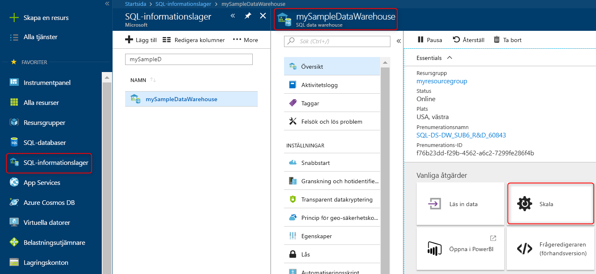

## Snabbstart: Skala beräkning i Azure SQL Data Warehouse i Azure-portalen

Skala beräkning i Azure SQL Data Warehouse i Azure Portal. [Skala ut beräkning](sql-data-warehouse-manage-compute-overview.md) för att få bättre prestanda eller skala ned beräkning om du vill sänka kostnaderna. 

Om du inte har en Azure-prenumeration kan du skapa ett [kostnadsfritt](https://azure.microsoft.com/free/) konto innan du börjar.

## Logga in på Azure Portal

Logga in på [Azure Portal](https://portal.azure.com/).

## Innan du börjar

Du kan skala ett informationslager som du redan har, eller använda [Snabbstart: Skapa och ansluta – portal](create-data-warehouse-portal.md) för att skapa ett informationslager med namnet **mySampleDataWarehouse**.  I den här snabbstarten skalas **mySampleDataWarehouse**.

>[!Note]
>Ditt informationslager måste vara online för att kunna skalas. 

## Skala beräkning

SQL Data Warehouses beräkningsresurser kan skalas genom att öka eller minska informationslagerenheterna. I snabbstarten [Skapa och ansluta – portal] (create-data-warehouse-portal.md) skapade du **mySampleDataWarehouse** och initierade det med 400 DWU:er. Följande steg justerar DWU för **mySampleDataWarehouse**.

Så här ändrar du informationslagerenheter:

1. Klicka på **SQL-informationslager** till vänster på Azure Portal.
2. Välj **mySampleDataWarehouse** på sidan **SQL-databaser**. Informationslagret öppnas.
3. Klicka på **Skala**.

    

2. På panelen Skala ändrar du DWU-inställningen genom att dra skjutreglaget åt vänster eller höger.

    

3. Klicka på **Spara**. Ett bekräftelsemeddelande visas. Klicka på **Ja** för att bekräfta eller **Nej** för att avbryta.

    

## Nästa steg
Nu har du lärt dig att skala databearbetningen för informationslagret. Om du vill veta mer om Azure SQL Data Warehouse kan fortsätta med självstudiekursen om att läsa in data.

> [!div class="nextstepaction"]
>[Läsa in data i ett SQL Data Warehouse](load-data-from-azure-blob-storage-using-polybase.md)
