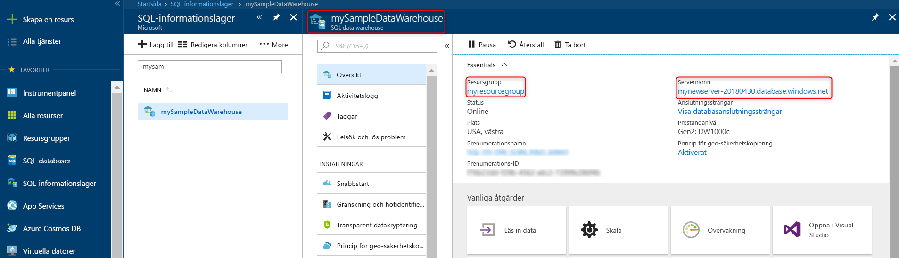

# <a name="quickstart-scale-compute-in-azure-sql-data-warehouse-in-powershell"></a>Snabbstart: Skala beräkning i Azure SQL Data Warehouse i PowerShell

Skala beräkning i Azure SQL Data Warehouse i PowerShell. [Skala ut beräkning](sql-data-warehouse-manage-compute-overview.md) för att få bättre prestanda eller skala ned beräkning om du vill sänka kostnaderna.

Om du inte har en Azure-prenumeration kan du skapa ett [kostnadsfritt](https://azure.microsoft.com/free/) konto innan du börjar.

För den här självstudien krävs Azure PowerShell-modul version 5.1.1 eller senare. Kör `Get-Module -ListAvailable AzureRM` för att se vilken version du har. Om du behöver installera eller uppgradera kan du läsa [Install Azure PowerShell module](/powershell/azure/install-azurerm-ps.md) (Installera Azure PowerShell-modul).

## <a name="before-you-begin"></a>Innan du börjar

I denna Snabbstart förutsätts att du redan har ett SQL-informationslager som du kan skala. Om du behöver skapa ett använder du [Skapa och ansluta – portal](create-data-warehouse-portal.md) för att skapa ett informationslager med namnet **mySampleDataWarehouse**.

## <a name="log-in-to-azure"></a>Logga in på Azure

Logga in på Azure-prenumerationen med kommandot [Connect-AzureRmAccount](/powershell/module/azurerm.profile/connect-azurermaccount) och följ anvisningarna på skärmen.

```powershell
Connect-AzureRmAccount
```

Om du vill se vilken prenumeration du använder kör du [Get-AzureRmSubscription](/powershell/module/azurerm.profile/get-azurermsubscription).

```powershell
Get-AzureRmSubscription
```

Om du behöver använda en annan prenumeration än standardprenumerationen kör du [Select-AzureRmSubscription](/powershell/module/azurerm.profile/select-azurermsubscription).

```powershell
Select-AzureRmSubscription -SubscriptionName "MySubscription"
```

## <a name="look-up-data-warehouse-information"></a>Leta upp information om informationslager

Leta upp databasens namn, servernamnet och resursgruppen för det informationslager som du tänker pausa och återuppta.

Följ de här anvisningarna för att hitta platsen för ditt informationslager.

1. Logga in på [Azure-portalen](https://portal.azure.com/).
2. Klicka på **SQL-databaser** på den vänstra sidan i Azure-portalen.
3. Välj **mySampleDataWarehouse** på sidan **SQL-databaser**. Informationslagret öppnas.

    

4. Anteckna namnet på informationslagret. Detta ska användas som databasnamn. Kom ihåg att ett informationslager är en typ av databas. Anteckna även servernamnet och resursgruppen. Du ska använda dem i kommandona för att pausa och återuppta.
5. Om din server är foo.database.windows.net använder du bara den första delen som servernamn i dina PowerShell-cmdlets. I den föregående bilden är det fullständiga servernamnet newserver-20171113.database.windows.net. Vi använder **newserver-20171113** som servernamn i PowerShell-cmdleten.

## <a name="scale-compute"></a>Skala beräkning

I SQL Data Warehouse kan du öka eller minska beräkningsresurser genom att justera informationslagerenheter. I [Skapa och ansluta – portal](create-data-warehouse-portal.md) skapades **mySampleDataWarehouse** och initierades med 400 DWU. Följande steg justerar DWU för **mySampleDataWarehouse**.

Du kan ändra informationslagerenheter med PowerShell-cmdleten [Set-AzureRmSqlDatabase](/powershell/module/azurerm.sql/set-azurermsqldatabase). I följande exempel anges informationslagerenheterna till DW300 för databasen **mySampleDataWarehouse** som finns i resursgruppen **myResourceGroup** på servern **mynewserver-20171113**.

```Powershell
Set-AzureRmSqlDatabase -ResourceGroupName "myResourceGroup" -DatabaseName "mySampleDataWarehouse" -ServerName "mynewserver-20171113" -RequestedServiceObjectiveName "DW300"
```

## <a name="check-data-warehouse-state"></a>Kontrollera tillstånd för informationslager

Om du vill se det aktuella tillståndet för informationslagret kan du använda PowerShell-cmdleten [Get-AzureRmSqlDatabase](/powershell/module/azurerm.sql/get-azurermsqldatabase). Då hämtas tillståndet för databasen **mySampleDataWarehouse** i resursgruppen **myResourceGroup** och servern **mynewserver-20171113.database.windows.net**.

```powershell
$database = Get-AzureRmSqlDatabase -ResourceGroupName myResourceGroup -ServerName mynewserver-20171113 -DatabaseName mySampleDataWarehouse
$database
```

Resultatet liknar detta:

```powershell
ResourceGroupName             : myResourceGroup
ServerName                    : mynewserver-20171113
DatabaseName                  : mySampleDataWarehouse
Location                      : North Europe
DatabaseId                    : 34d2ffb8-b70a-40b2-b4f9-b0a39833c974
Edition                       : DataWarehouse
CollationName                 : SQL_Latin1_General_CP1_CI_AS
CatalogCollation              :
MaxSizeBytes                  : 263882790666240
Status                        : Online
CreationDate                  : 11/20/2017 9:18:12 PM
CurrentServiceObjectiveId     : 284f1aff-fee7-4d3b-a211-5b8ebdd28fea
CurrentServiceObjectiveName   : DW300
RequestedServiceObjectiveId   : 284f1aff-fee7-4d3b-a211-5b8ebdd28fea
RequestedServiceObjectiveName :
ElasticPoolName               :
EarliestRestoreDate           :
Tags                          :
ResourceId                    : /subscriptions/xxxxxxxx-xxxx-xxxx-xxxx-xxxxxxxxxxxx/
                                resourceGroups/myResourceGroup/providers/Microsoft.Sql/servers/mynewserver-20171113/databases/mySampleDataWarehouse
CreateMode                    :
ReadScale                     : Disabled
ZoneRedundant                 : False
```

Du kan se **Status** för databasen i dina utdata. I det här fallet kan du se att den här databasen är online.  När du kör kommandot bör du få statusvärdet Online, Pausad, Återupptar, Skalning eller Pausad.

Kör följande kommando om du bara vill se status:

```powershell
$database | Select-Object DatabaseName,Status
```

## <a name="next-steps"></a>Nästa steg
Nu har du lärt dig hur du skalar beräkning för informationslagret. Om du vill veta mer om Azure SQL Data Warehouse kan fortsätta med självstudiekursen om att läsa in data.

> [!div class="nextstepaction"]
>[Läsa in data i ett SQL Data Warehouse](load-data-from-azure-blob-storage-using-polybase.md)
