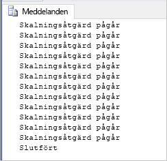

# <a name="quickstart-scale-compute-in-azure-sql-data-warehouse-using-t-sql"></a>Snabbstart: Skala beräkning i Azure SQL Data Warehouse med hjälp av T-SQL

Skala beräkning i Azure SQL Data Warehouse med hjälp av T-SQL och SQL Server Management Studio (SSMS). [Skala ut beräkning](sql-data-warehouse-manage-compute-overview.md) för att få bättre prestanda eller skala ned beräkning om du vill sänka kostnaderna. 

Om du inte har en Azure-prenumeration kan du skapa ett [kostnadsfritt](https://azure.microsoft.com/free/) konto innan du börjar.

## <a name="before-you-begin"></a>Innan du börjar

Ladda ned och installera den senaste versionen av [SQL Server Management Studio](/sql/ssms/download-sql-server-management-studio-ssms) (SSMS).
 
## <a name="create-a-data-warehouse"></a>Skapa ett datalager

Använd [Snabbstart: Skapa och ansluta – portal](create-data-warehouse-portal.md) för att skapa ett informationslager med namnet **mySampleDataWarehouse**. Slutför snabbstarten så att du har en brandväggsregel och kan ansluta till informationslagret från SQL Server Management Studio.

## <a name="connect-to-the-server-as-server-admin"></a>Ansluta till servern som serveradministratör

I det här avsnittet används [SQL Server Management Studio](/sql/ssms/download-sql-server-management-studio-ssms) (SSMS) för att upprätta en anslutning till Azure SQL-servern.

1. Öppna SQL Server Management Studio.

2. I dialogrutan **Anslut till server** anger du följande information:

   | Inställning       | Föreslaget värde | Beskrivning | 
   | ------------ | ------------------ | ------------------------------------------------- | 
   | Servertyp | Databasmotor | Det här värdet är obligatoriskt |
   | servernamn | Fullständigt kvalificerat servernamn | Här är ett exempel: **mynewserver 20171113.database.windows.net**. |
   | Autentisering | SQL Server-autentisering | SQL-autentisering är den enda autentiseringstypen som vi konfigurerar i den här självstudiekursen. |
   | Inloggning | Serveradministratörskontot | Kontot som du angav när du skapade servern. |
   | Lösenord | Lösenordet för serveradministratörskontot | Detta är det lösenord som du angav när du skapade servern. |

    

4. Klicka på **Anslut**. Fönstret Object Explorer öppnas i SSMS. 

5. Expandera **Databaser** i Object Explorer. Expandera **mySampleDatabase** så visas objekten i den nya databasen.

     

## <a name="view-service-objective"></a>Visa tjänstmål
Inställningen för tjänstmål innehåller antalet informationslagerenheter för informationslagret. 

Så här visar du aktuella informationslagerenheter för informationslagret:

1. Under anslutningen till **mynewserver-20171113.database.windows.net** expanderar du **Systemdatabaser**.
2. Högerklicka på **Huvud** och välj **Ny fråga**. Ett nytt frågefönster öppnas.
3. Kör följande fråga för att välja från den dynamiska hanteringsvyn sys.database_service_objectives. 

    ```sql
    SELECT
        db.name [Database]
    ,   ds.edition [Edition]
    ,   ds.service_objective [Service Objective]
    FROM
        sys.database_service_objectives ds
    JOIN
        sys.databases db ON ds.database_id = db.database_id
    WHERE 
        db.name = 'mySampleDataWarehouse'
    ```

4. Följande resultat visar att **mySampleDataWarehouse** har tjänstmålet DW400. 

    


## <a name="scale-compute"></a>Skala beräkning
I SQL Data Warehouse kan du öka eller minska beräkningsresurser genom att justera informationslagerenheter. I [Skapa och ansluta – portal](create-data-warehouse-portal.md) skapades **mySampleDataWarehouse** och initierades med 400 DWU. Följande steg justerar DWU för **mySampleDataWarehouse**.

Så här ändrar du informationslagerenheter:

1. Högerklicka på **Huvud** och välj **Ny fråga**.
2. Använd T-SQL-instruktionen [ALTER DATABASE](/sql/t-sql/statements/alter-database-azure-sql-database) för att ändra tjänstmålet. Kör följande fråga för att ändra tjänstmålet till DW300. 

    ```Sql
    ALTER DATABASE mySampleDataWarehouse
    MODIFY (SERVICE_OBJECTIVE = 'DW300')
    ;
    ```

## <a name="monitor-scale-change-request"></a>Övervaka ändringsbegäran för skalning
Om du vill visa förloppet för den tidigare ändringsbegäran kan du använda T-SQL-syntaxen `WAITFORDELAY` för att göra en avsökning av den dynamiska hanteringsvyn (DMV) sys.dm_operation_status.

Så här avsöker du serviceobjektets ändringsstatus:

1. Högerklicka på **Huvud** och välj **Ny fråga**.
2. Gör en avsökning av den dynamiska hanteringsvyn sys.dm_operation_status genom att köra följande fråga.

    ```sql
    WHILE 
    (
        SELECT TOP 1 state_desc
        FROM sys.dm_operation_status
        WHERE 
            1=1
            AND resource_type_desc = 'Database'
            AND major_resource_id = 'MySampleDataWarehouse'
            AND operation = 'ALTER DATABASE'
        ORDER BY
            start_time DESC
    ) = 'IN_PROGRESS'
    BEGIN
        RAISERROR('Scale operation in progress',0,0) WITH NOWAIT;
        WAITFOR DELAY '00:00:05';
    END
    PRINT 'Complete';
    ```
3. Resultatet innehåller en logg över statusavsökningen.

    

## <a name="check-data-warehouse-state"></a>Kontrollera tillstånd för informationslager

När ett informationslager har pausats går det inte att ansluta till det med T-SQL. Om du vill se det aktuella tillståndet för informationslagret kan du använda en PowerShell-cmdlet. Ett exempel finns i [Kontrollera tillstånd för informationslager – Powershell](quickstart-scale-compute-powershell.md#check-data-warehouse-state). 

## <a name="check-operation-status"></a>Kontrollera åtgärdsstatus

Kör följande fråga i den dynamiska hanteringsvyn [sys.dm_operation_status](/sql/relational-databases/system-dynamic-management-views/sys-dm-operation-status-azure-sql-database) för att returnera information om olika hanteringsåtgärder i SQL Data Warehouse. Den returnerar exempelvis åtgärden och åtgärdens tillstånd, som är IN_PROGRESS eller COMPLETED.

```sql
SELECT *
FROM
    sys.dm_operation_status
WHERE
    resource_type_desc = 'Database'
AND 
    major_resource_id = 'MySampleDataWarehouse'
```


## <a name="next-steps"></a>Nästa steg
Nu har du lärt dig hur du skalar databearbetningen för informationslagret. Om du vill veta mer om Azure SQL Data Warehouse kan fortsätta med självstudiekursen om att läsa in data.

> [!div class="nextstepaction"]
>[Läsa in data i ett SQL Data Warehouse](load-data-from-azure-blob-storage-using-polybase.md)
