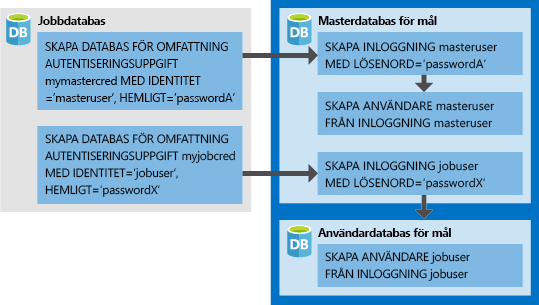

# <a name="create-an-elastic-job-agent-using-powershell"></a>Skapa en elastisk jobbagent med PowerShell

[Elastiska jobb](sql-database-job-automation-overview.md#elastic-database-jobs) aktiverar körning av ett eller flera Transact-SQL-skript (T-SQL) parallellt över flera databaser.

I den här självstudien lär du dig de steg som krävs för att köra en fråga över flera databaser:

> [!div class="checklist"]
> * Skapa en elastiskt jobbagent
> * Skapa autentiseringsuppgifter för jobbet så att det kan köra skript på sina mål
> * Definiera mål (servrar, elastiska pooler, databaser, shard-kartor) som du vill köra jobbet mot
> * Skapa autentiseringsuppgifter för databasen i måldatabaserna så att agenten kan ansluta och köra jobb
> * Skapa ett jobb
> * Lägg till jobbsteg i ett jobb
> * Starta körningen av ett jobb
> * Övervaka ett jobb

## <a name="prerequisites"></a>Nödvändiga komponenter

Om du inte redan har en Azure-prenumeration kan du skapa ett [kostnadsfritt](https://azure.microsoft.com/free/) konto innan du börjar.

- Installera **AzureRM.Sql** 4.8.1-förhandsmodulen för att få de senaste elastiska jobb-cmdletarna. Kör följande kommandon i PowerShell med administratörsbehörighet.

  ```powershell
  # Installs the latest PackageManagement powershell package which PowershellGet v1.6.5 is dependent on
  Find-Package PackageManagement -RequiredVersion 1.1.7.2 | Install-Package -Force
  
  # Installs the latest PowershellGet module which adds the -AllowPrerelease flag to Install-Module
  Find-Package PowerShellGet -RequiredVersion 1.6.5 | Install-Package -Force
  
  # Restart your powershell session with administrative access
  
  # Places AzureRM.Sql preview cmdlets side by side with existing AzureRM.Sql version
  Install-Module -Name AzureRM.Sql -AllowPrerelease -RequiredVersion 4.8.1-preview -Force
  
  # Import the AzureRM.Sql 4.8.1 module
  Import-Module AzureRM.Sql -RequiredVersion 4.8.1
  
  # Confirm if module successfully imported - if the imported version is 4.8.1, then continue
  Get-Module AzureRM.Sql
  ```

- Utöver **AzureRM.Sql** 4.8.1-förhandsgranskningsmodulen kräver den här självstudien även PowerShell-modulen *sqlserver*. Mer information finns i avsnittet om att [installera SQL Server PowerShell-modulen](https://docs.microsoft.com/sql/powershell/download-sql-server-ps-module).


## <a name="create-required-resources"></a>Skapa nödvändiga resurser

För att skapa elastiska jobbagenter krävs en databas (S0 eller högre) som kan användas som [jobbdatabas](sql-database-job-automation-overview.md#job-database). 

*Skriptet nedan skapar en ny resursgrupp, server och databas som ska användas som jobbdatabas. Skriptet nedan skapar även en andra server med 2 tomma databaser att köra jobb mot.*

Elastiska jobb har inga särskilda krav för namngivningskonventioner, så du kan använda vilken namnkonvention du vill, förutsatt att de uppfyller något av [kraven för Azure](https://docs.microsoft.com/azure/architecture/best-practices/naming-conventions).

```powershell
# Sign in to your Azure account
Connect-AzureRmAccount

# Create a resource group
Write-Output "Creating a resource group..."
$ResourceGroupName = Read-Host "Please enter a resource group name"
$Location = Read-Host "Please enter an Azure Region"
$Rg = New-AzureRmResourceGroup -Name $ResourceGroupName -Location $Location
$Rg

# Create a server
Write-Output "Creating a server..."
$AgentServerName = Read-Host "Please enter an agent server name"
$AgentServerName = $AgentServerName + "-" + [guid]::NewGuid()
$AdminLogin = Read-Host "Please enter the server admin name"
$AdminPassword = Read-Host "Please enter the server admin password"
$AdminPasswordSecure = ConvertTo-SecureString -String $AdminPassword -AsPlainText -Force
$AdminCred = New-Object -TypeName "System.Management.Automation.PSCredential" -ArgumentList $AdminLogin, $AdminPasswordSecure
$AgentServer = New-AzureRmSqlServer -ResourceGroupName $ResourceGroupName -Location $Location -ServerName $AgentServerName -ServerVersion "12.0" -SqlAdministratorCredentials ($AdminCred)

# Set server firewall rules to allow all Azure IPs
Write-Output "Creating a server firewall rule..."
$AgentServer | New-AzureRmSqlServerFirewallRule -AllowAllAzureIPs
$AgentServer

# Create the job database
Write-Output "Creating a blank SQL database to be used as the Job Database..."
$JobDatabaseName = "JobDatabase"
$JobDatabase = New-AzureRmSqlDatabase -ResourceGroupName $ResourceGroupName -ServerName $AgentServerName -DatabaseName $JobDatabaseName -RequestedServiceObjectiveName "S0"
$JobDatabase
```

```powershell
# Create a target server and some sample databases - uses the same admin credential as the agent server just for simplicity
Write-Output "Creating target server..."
$TargetServerName = Read-Host "Please enter a target server name"
$TargetServerName = $TargetServerName + "-" + [guid]::NewGuid()
$TargetServer = New-AzureRmSqlServer -ResourceGroupName $ResourceGroupName -Location $Location -ServerName $TargetServerName -ServerVersion "12.0" -SqlAdministratorCredentials ($AdminCred)

# Set target server firewall rules to allow all Azure IPs
$TargetServer | New-AzureRmSqlServerFirewallRule -AllowAllAzureIPs
$TargetServer | New-AzureRmSqlServerFirewallRule -StartIpAddress 0.0.0.0 -EndIpAddress 255.255.255.255 -FirewallRuleName AllowAll
$TargetServer

# Create some sample databases to execute jobs against...
$Db1 = New-AzureRmSqlDatabase -ResourceGroupName $ResourceGroupName -ServerName $TargetServerName -DatabaseName "TargetDb1"
$Db1
$Db2 = New-AzureRmSqlDatabase -ResourceGroupName $ResourceGroupName -ServerName $TargetServerName -DatabaseName "TargetDb2"
$Db2
```

## <a name="enable-the-elastic-jobs-preview-for-your-subscription"></a>Aktivera förhandsversionen för elastiska jobb för din prenumeration

Om du vill använda elastiska jobb registrerar du funktionen i din Azure-prenumeration genom att köra följande kommando (detta behöver bara köras en gång för varje prenumeration du vill använda elastiska jobb i):

```powershell
Register-AzureRmProviderFeature -FeatureName sqldb-JobAccounts -ProviderNamespace Microsoft.Sql
```

## <a name="create-the-elastic-job-agent"></a>Skapa en elastiskt jobbagent

En agent för elastiska jobb är en Azure-resurs för att skapa, köra och hantera jobb. Agenten kör jobb baserat på ett schema eller som ett engångsjobb.

Cmedleten **New-AzureRmSqlElasticJobAgent** kräver att det redan finns en Azure SQL-databas. Därför måste parametrarna *ResourceGroupName*, *ServerName* och  *DatabaseName* peka på befintliga resurser.

```powershell
Write-Output "Creating job agent..."
$AgentName = Read-Host "Please enter a name for your new Elastic Job agent"
$JobAgent = $JobDatabase | New-AzureRmSqlElasticJobAgent -Name $AgentName
$JobAgent
```

## <a name="create-job-credentials-so-that-jobs-can-execute-scripts-on-its-targets"></a>Skapa autentiseringsuppgifter för jobbet så att det kan köra skript på sina mål

Jobbet använder databasbegränsade autentiseringsuppgifter för att ansluta till måldatabaserna som anges av målgruppen vid körning. Dessa databasbegränsade autentiseringsuppgifter används också för att ansluta till huvuddatabasen för att räkna upp alla databaser i en server eller en elastisk pool när någon av dessa används som medlemstyp för målgruppen.

Databasbegränsade autentiseringsuppgifter måste skapas i databasen för jobbet.  
Alla måldatabaser måste ha en inloggning med tillräcklig behörighet för att slutföra jobbet.



Förutom autentiseringsuppgifterna i avbildningen, observera även tillägget av *beviljandekommando* i följande skript. Dessa behörigheter krävs för skriptet vi valde för det här exempeljobbet. Eftersom exemplet skapar en ny tabell i måldatabaserna, måste varje måldatabas ha rätt behörighet för att köras.

Kör följande skript för att skapa autentiseringsuppgifter för det nödvändiga jobbet (i jobbdatabasen):

```powershell
# In the master database (target server)
# - Create the master user login
# - Create the master user from master user login
# - Create the job user login
$Params = @{
  'Database' = 'master'
  'ServerInstance' =  $TargetServer.ServerName + '.database.windows.net'
  'Username' = $AdminLogin
  'Password' = $AdminPassword
  'OutputSqlErrors' = $true
  'Query' = "CREATE LOGIN masteruser WITH PASSWORD='password!123'"
}
Invoke-SqlCmd @Params
$Params.Query = "CREATE USER masteruser FROM LOGIN masteruser"
Invoke-SqlCmd @Params
$Params.Query = "CREATE LOGIN jobuser WITH PASSWORD='password!123'"
Invoke-SqlCmd @Params

# For each of the target databases
# - Create the jobuser from jobuser login
# - Make sure they have the right permissions for successful script execution
$TargetDatabases = @( $Db1.DatabaseName, $Db2.DatabaseName )
$CreateJobUserScript =  "CREATE USER jobuser FROM LOGIN jobuser"
$GrantAlterSchemaScript = "GRANT ALTER ON SCHEMA::dbo TO jobuser"
$GrantCreateScript = "GRANT CREATE TABLE TO jobuser"

$TargetDatabases | % {
  $Params.Database = $_

  $Params.Query = $CreateJobUserScript
  Invoke-SqlCmd @Params

  $Params.Query = $GrantAlterSchemaScript
  Invoke-SqlCmd @Params

  $Params.Query = $GrantCreateScript
  Invoke-SqlCmd @Params
}

# Create job credential in Job database for master user
Write-Output "Creating job credentials..."
$LoginPasswordSecure = (ConvertTo-SecureString -String "password!123" -AsPlainText -Force)

$MasterCred = New-Object -TypeName "System.Management.Automation.PSCredential" -ArgumentList "masteruser", $LoginPasswordSecure
$MasterCred = $JobAgent | New-AzureRmSqlElasticJobCredential -Name "masteruser" -Credential $MasterCred

$JobCred = New-Object -TypeName "System.Management.Automation.PSCredential" -ArgumentList "jobuser", $LoginPasswordSecure
$JobCred = $JobAgent | New-AzureRmSqlElasticJobCredential -Name "jobuser" -Credential $JobCred
```

## <a name="define-the-target-databases-you-want-to-run-the-job-against"></a>Definiera måldatabaserna som du vill köra jobbet mot

En [målgrupp](sql-database-job-automation-overview.md#target-group) utgörs av en eller flera databaser som ett jobbsteg ska köras mot. 

Följande kodavsnitt skapar två målgrupper: *ServerGroup* och *ServerGroupExcludingDb2*. *ServerGroup* har alla databaser som finns på servern vid körningen som mål, och *ServerGroupExcludingDb2* har alla databaser på servern, utom *TargetDb2* som mål:

```powershell
Write-Output "Creating test target groups..."
# Create ServerGroup target group
$ServerGroup = $JobAgent | New-AzureRmSqlElasticJobTargetGroup -Name 'ServerGroup'
$ServerGroup | Add-AzureRmSqlElasticJobTarget -ServerName $TargetServerName -RefreshCredentialName $MasterCred.CredentialName

# Create ServerGroup with an exclusion of Db2
$ServerGroupExcludingDb2 = $JobAgent | New-AzureRmSqlElasticJobTargetGroup -Name 'ServerGroupExcludingDb2'
$ServerGroupExcludingDb2 | Add-AzureRmSqlElasticJobTarget -ServerName $TargetServerName -RefreshCredentialName $MasterCred.CredentialName
$ServerGroupExcludingDb2 | Add-AzureRmSqlElasticJobTarget -ServerName $TargetServerName -Database $Db2.DatabaseName -Exclude
```

## <a name="create-a-job"></a>Skapa ett jobb

```powershell
Write-Output "Creating a new job"
$JobName = "Job1"
$Job = $JobAgent | New-AzureRmSqlElasticJob -Name $JobName -RunOnce
$Job
```

## <a name="create-a-job-step"></a>Steg för att skapa ett jobb

Det här exemplet definierar två jobbsteg som jobbet ska köra. Det första steget i jobbet (*step1*) skapar en ny tabell (*Step1Table*) i varje databas i målgruppen *ServerGroup*. Det andra steget i jobbet (*step2*) skapar en ny tabell (*Step2Table*) i varje databas utom för *TargetDb2*, eftersom målgruppen [som definierades tidigare](#define-the-target-databases-you-want-to-run-the-job-against) har angett att den ska undantas.

```powershell
Write-Output "Creating job steps"
$SqlText1 = "IF NOT EXISTS (SELECT * FROM sys.tables WHERE object_id = object_id('Step1Table')) CREATE TABLE [dbo].[Step1Table]([TestId] [int] NOT NULL);"
$SqlText2 = "IF NOT EXISTS (SELECT * FROM sys.tables WHERE object_id = object_id('Step2Table')) CREATE TABLE [dbo].[Step2Table]([TestId] [int] NOT NULL);"

$Job | Add-AzureRmSqlElasticJobStep -Name "step1" -TargetGroupName $ServerGroup.TargetGroupName -CredentialName $JobCred.CredentialName -CommandText $SqlText1
$Job | Add-AzureRmSqlElasticJobStep -Name "step2" -TargetGroupName $ServerGroupExcludingDb2.TargetGroupName -CredentialName $JobCred.CredentialName -CommandText $SqlText2
```


## <a name="run-the-job"></a>Kör jobbet

Kör följande kommando direkt för att starta jobbet:

```powershell
Write-Output "Start a new execution of the job..."
$JobExecution = $Job | Start-AzureRmSqlElasticJob
$JobExecution
```

Efter varje steg som avslutats korrekt bör du se två nya tabeller i TargetDb1 och bara en ny tabell i TargetDb2:


   


## <a name="monitor-status-of-job-executions"></a>Övervaka status för jobbkörningar

Följande kodavsnitt hämtar information om jobbkörning:

```powershell
# Get the latest 10 executions run
$JobAgent | Get-AzureRmSqlElasticJobExecution -Count 10

# Get the job step execution details
$JobExecution | Get-AzureRmSqlElasticJobStepExecution

# Get the job target execution details
$JobExecution | Get-AzureRmSqlElasticJobTargetExecution -Count 2
```

## <a name="schedule-the-job-to-run-later"></a>Schemalägga jobb som ska köras senare

Kör följande kommando för att schemalägga ett jobb så att det körs vid en viss tid:

```powershell
# Run every hour starting from now
$Job | Set-AzureRmSqlElasticJob -IntervalType Hour -IntervalCount 1 -StartTime (Get-Date) -Enable
```

## <a name="clean-up-resources"></a>Rensa resurser

Ta bort alla resurser som du har skapat i den här självstudien genom att ta bort resursgruppen.

> [!TIP]
> Om du planerar att fortsätta arbeta med de här jobben ska du inte rensa upp bland de resurser som skapades i den här artikeln. Om du inte planerar att fortsätta kan du följa stegen nedan för att ta bort alla resurser som har skapats i den här artikeln.
>

```powershell
Remove-AzureRmResourceGroup -ResourceGroupName $ResourceGroupName
```


## <a name="next-steps"></a>Nästa steg

I den här självstudien körde du ett Transact-SQL-skript mot en uppsättning databaser.  Du har lärt dig att göra följande:

> [!div class="checklist"]
> * Skapa en elastiskt jobbagent
> * Skapa autentiseringsuppgifter för jobbet så att det kan köra skript på sina mål
> * Definiera mål (servrar, elastiska pooler, databaser, shard-kartor) som du vill köra jobbet mot
> * Skapa autentiseringsuppgifter för databasen i måldatabaserna så att agenten kan ansluta och köra jobb
> * Skapa ett jobb
> * Lägga till ett steg i jobbet
> * Starta en körning av jobbet
> * Övervaka jobbet

> [!div class="nextstepaction"]
>[Hantera elastiska jobb med Transact-SQL](elastic-jobs-tsql.md)