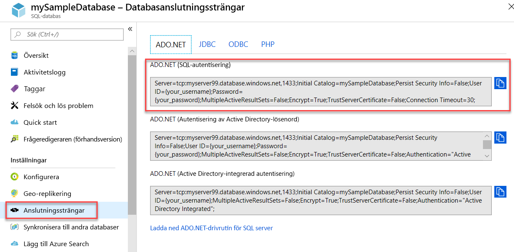

# <a name="quickstart-use-net-core-c-to-query-an-azure-sql-database"></a>Snabbstart: Köra frågor mot Azure SQL Database med hjälp av .NET Core (C#)

I den här snabbstarten använder du [.NET Core](https://www.microsoft.com/net/) och C#-kod för att ansluta till en Azure SQL-databas. Sedan kör du en Transact-SQL-instruktion för att fråga efter data.

## <a name="prerequisites"></a>Nödvändiga komponenter

Du behöver följande för den här självstudien:

[!INCLUDE [prerequisites-create-db](../../includes/sql-database-connect-query-prerequisites-create-db-includes.md)]

- [.NET Core för ditt operativsystem](https://www.microsoft.com/net/core). 

> [!NOTE]
> Den här snabbstarten använder databasen *mySampleDatabase*. Om du vill använda en annan databas måste du ändra databasreferenserna och `SELECT`-frågan i C#-koden.


## <a name="get-sql-server-connection-information"></a>Hämta anslutningsinformation för en SQL-server

[!INCLUDE [prerequisites-server-connection-info](../../includes/sql-database-connect-query-prerequisites-server-connection-info-includes.md)]

#### <a name="get-adonet-connection-information-optional"></a>Hämta information om en ADO.NET-anslutning (valfritt)

1. Gå till sidan **mySampleDatabase** och under **Inställningar** väljer du **Anslutningssträngar**.

2. Granska den fullständiga **ADO.NET**-anslutningssträngen.

    

3. Kopiera anslutningssträngen **ADO.NET** om du planerar att använda den.
  
## <a name="create-a-new-net-core-project"></a>Skapa ett nytt .NET Core-projekt

1. Öppna en kommandotolk och skapa en mapp med namnet **sqltest**. Gå till mappen och kör detta kommando.

    ```cmd
    dotnet new console
    ```
    Detta kommando skapar nya app-projektfiler, inklusive en inledande C#-kodfil (**Program.cs**), en XML-konfigurationsfil (**sqltest.csproj**) och de binärfiler som behövs.

2. Öppna **sqltest.csproj** i ett redigeringsprogram och klistra in följande XML mellan `<Project>`-taggarna. Detta XML lägger till `System.Data.SqlClient` som ett beroende.

    ```xml
    <ItemGroup>
        <PackageReference Include="System.Data.SqlClient" Version="4.6.0" />
    </ItemGroup>
    ```

## <a name="insert-code-to-query-sql-database"></a>Infoga kod för att fråga SQL-databas

1. Öppna **Program.cs** i ett redigeringsprogram.

2. Ersätt innehållet med nedanstående kod och lägg till lämpliga värden för server, databas, användarnamn och lösenord.

> [!NOTE]
> Om du vill använda en ADO.NET-anslutningssträng ersätter du de 4 raderna i kodinställningen för server, databas, användarnamn och lösenord med raden nedan. Ange ditt användarnamn och lösenord i strängen.
>
>    `builder.ConnectionString="<your_ado_net_connection_string>";`

```csharp
using System;
using System.Data.SqlClient;
using System.Text;

namespace sqltest
{
    class Program
    {
        static void Main(string[] args)
        {
            try 
            { 
                SqlConnectionStringBuilder builder = new SqlConnectionStringBuilder();

                builder.DataSource = "<your_server.database.windows.net>"; 
                builder.UserID = "<your_username>";            
                builder.Password = "<your_password>";     
                builder.InitialCatalog = "<your_database>";
         
                using (SqlConnection connection = new SqlConnection(builder.ConnectionString))
                {
                    Console.WriteLine("\nQuery data example:");
                    Console.WriteLine("=========================================\n");
                    
                    connection.Open();       
                    StringBuilder sb = new StringBuilder();
                    sb.Append("SELECT TOP 20 pc.Name as CategoryName, p.name as ProductName ");
                    sb.Append("FROM [SalesLT].[ProductCategory] pc ");
                    sb.Append("JOIN [SalesLT].[Product] p ");
                    sb.Append("ON pc.productcategoryid = p.productcategoryid;");
                    String sql = sb.ToString();

                    using (SqlCommand command = new SqlCommand(sql, connection))
                    {
                        using (SqlDataReader reader = command.ExecuteReader())
                        {
                            while (reader.Read())
                            {
                                Console.WriteLine("{0} {1}", reader.GetString(0), reader.GetString(1));
                            }
                        }
                    }                    
                }
            }
            catch (SqlException e)
            {
                Console.WriteLine(e.ToString());
            }
            Console.WriteLine("\nDone. Press enter.");
            Console.ReadLine(); 
        }
    }
}
```

## <a name="run-the-code"></a>Kör koden

1. Kör följande kommandon när du uppmanas till det.

   ```cmd
   dotnet restore
   dotnet run
   ```

2. Kontrollera att de 20 översta raderna returneras.

   ```text
   Query data example:
   =========================================

   Road Frames HL Road Frame - Black, 58
   Road Frames HL Road Frame - Red, 58
   Helmets Sport-100 Helmet, Red
   Helmets Sport-100 Helmet, Black
   Socks Mountain Bike Socks, M
   Socks Mountain Bike Socks, L
   Helmets Sport-100 Helmet, Blue
   Caps AWC Logo Cap
   Jerseys Long-Sleeve Logo Jersey, S
   Jerseys Long-Sleeve Logo Jersey, M
   Jerseys Long-Sleeve Logo Jersey, L
   Jerseys Long-Sleeve Logo Jersey, XL
   Road Frames HL Road Frame - Red, 62
   Road Frames HL Road Frame - Red, 44
   Road Frames HL Road Frame - Red, 48
   Road Frames HL Road Frame - Red, 52
   Road Frames HL Road Frame - Red, 56
   Road Frames LL Road Frame - Black, 58
   Road Frames LL Road Frame - Black, 60
   Road Frames LL Road Frame - Black, 62

   Done. Press enter.
   ```
3. Välj **Retur** för att stänga programfönstret.

## <a name="next-steps"></a>Nästa steg

- [Komma igång med .NET Core för Windows/Linux/macOS med hjälp av kommandoraden](/dotnet/core/tutorials/using-with-xplat-cli).
- Lär dig att [ansluta till och fråga i en Azure SQL-databas med .NET Framework och Visual Studio](sql-database-connect-query-dotnet-visual-studio.md).  
- Lär dig att [Utforma din första Azure SQL-databas med hjälp av SSMS](sql-database-design-first-database.md) eller [Utforma din första Azure SQL-databas och anslut med C# och ADO.NET](sql-database-design-first-database-csharp.md).
- Mer information om .NET finns i [.NET-dokumentationen](https://docs.microsoft.com/dotnet/).
