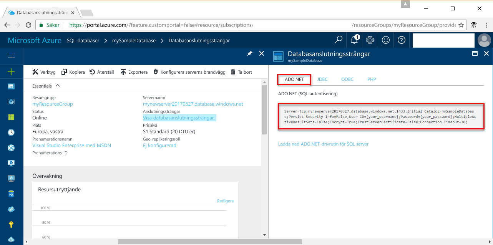

# <a name="azure-sql-database-use-net-c-to-connect-and-query-data"></a>Azure SQL Database: Använd .NET (C#) för att ansluta och skicka frågor till data

Använd [C# och ADO.NET](https://msdn.microsoft.com/library/kb9s9ks0.aspx) för att ansluta och skicka frågor till en Azure SQL Database. Den här guiden beskriver hur man använder C# för att ansluta till en Azure SQL Database och sedan köra uttryck för fråga, infoga, uppdatera och ta bort.

Den här snabbstarten använder resurser som har skapats i någon av dessa snabbstarter som utgångspunkt:

- [Skapa DB – Portal](sql-database-get-started-portal.md)
- [Skapa DB – CLI](sql-database-get-started-cli.md)

Innan du börjar bör du kontrollera att du har konfigurerat utvecklingsmiljön för C#. Se [Installera Visual Studio Community kostnadsfritt](https://www.visualstudio.com/) eller installera [ADO.NET-drivrutinen för SQL Server](https://www.microsoft.com/net/download).

## <a name="get-connection-information"></a>Hämta anslutningsinformation

Hämta anslutningssträngen i Azure Portal. Du kan använda anslutningssträngen för att ansluta till Azure SQL Database.

1. Logga in på [Azure-portalen](https://portal.azure.com/).
2. Välj **SQL-databaser** på den vänstra menyn och klicka på databasen på sidan **SQL-databaser**. 
3. Kontrollera det fullständigt kvalificerade servernamnet i fönstret **Grundläggande** för databasen. 

    

4. Klicka på **Visa databasanslutningssträngar**.

5. Kontrollera den fullständiga **ADO.NET**-anslutningssträngen.

    

## <a name="select-data"></a>Välj data

1. Öppna en tom kodfil i din utvecklingsmiljö.
2. Lägg till ```using System.Data.SqlClient``` i kodfilen ([System.Data.SqlClient namespace](https://msdn.microsoft.com/library/system.data.sqlclient.aspx)). 

3. Använd [SqlCommand.ExecuteReader](https://msdn.microsoft.com/library/system.data.sqlclient.sqlcommand.executereader.aspx) med ett [SELECT](https://msdn.microsoft.com/library/ms189499.aspx) Transact-SQL-uttryck för att skicka frågor till data i Azure SQL Database. Lägg till lämpliga värden för din server

    ```csharp
    string hostName = 'yourserver.database.windows.net';
    string dbName = 'yourdatabase';
    string user = 'yourusername';
    string password = 'yourpassword';

    string strConn = $"server=tcp:+hostName+,1433;Initial Catalog=+dbName+;Persist Security Info=False;User ID=+user+;Password=+password+;MultipleActiveResultSets=False;Encrypt=True;TrustServerCertificate=False;Connection Timeout=30;";
    
    using (var connection = new SqlConnection(strConn))
    {
       connection.Open();

       SqlCommand selectCommand = new SqlCommand("", connection);
       selectCommand.CommandType = CommandType.Text;

       selectCommand.CommandText = @"SELECT TOP 20 pc.Name as CategoryName, p.name as ProductName
        FROM [SalesLT].[ProductCategory] pc
        JOIN [SalesLT].[Product] p
        ON pc.productcategoryid = p.productcategoryid";

       SqlDataReader reader = selectCommand.ExecuteReader();

       while (reader.Read())
       {
          // show data
          Console.WriteLine($"{reader.GetString(0)}\t{reader.GetString(1)}");
       }
       reader.Close();
    }
    ```

## <a name="insert-data"></a>Infoga data

Använd [SqlCommand.ExecuteNonQuery](https://msdn.microsoft.com/library/system.data.sqlclient.sqlcommand.executenonquery.aspx) med ett [INSERT](https://msdn.microsoft.com/library/ms174335.aspx) Transact-SQL-uttryck för att infoga data i Azure SQL Database.

```csharp
    string hostName = 'yourserver.database.windows.net';
    string dbName = 'yourdatabase';
    string user = 'yourusername';
    string password = 'yourpassword';

    string strConn = $"server=tcp:+hostName+,1433;Initial Catalog=+dbName+;Persist Security Info=False;User ID=+user+;Password=+password+;MultipleActiveResultSets=False;Encrypt=True;TrustServerCertificate=False;Connection Timeout=30;";

    using (var connection = new SqlConnection(strConn))

    SqlCommand insertCommand = new SqlCommand("", connection);
    insertCommand.CommandType = CommandType.Text;
    insertCommand.CommandText = @"INSERT INTO[SalesLT].[Product]
            ( [Name]
            , [ProductNumber]
            , [Color]
            , [StandardCost]
            , [ListPrice]
            , [SellStartDate]
            )
VALUES
(
            @Name,
            @ProductNumber,
            @Color,
            @StandardCost,
            @ListPrice,
            @SellStartDate)";

            insertCommand.Parameters.AddWithValue("@Name", "BrandNewProduct");
            insertCommand.Parameters.AddWithValue("@ProductNumber", "200989");
            insertCommand.Parameters.AddWithValue("@Color", "Blue");
            insertCommand.Parameters.AddWithValue("@StandardCost", 75);
            insertCommand.Parameters.AddWithValue("@ListPrice", 80);
            insertCommand.Parameters.AddWithValue("@SellStartDate", "7/1/2016");

int newrows = insertCommand.ExecuteNonQuery();
Console.WriteLine($"Inserted {newrows.ToString()} row(s).");
```

## <a name="update-data"></a>Uppdatera data

Använd [SqlCommand.ExecuteNonQuery](https://msdn.microsoft.com/library/system.data.sqlclient.sqlcommand.executenonquery.aspx) med ett [UPDATE](https://msdn.microsoft.com/library/ms177523.aspx) Transact-SQL-uttryck för att uppdatera data i Azure SQL Database.

```csharp
    string hostName = 'yourserver.database.windows.net';
    string dbName = 'yourdatabase';
    string user = 'yourusername';
    string password = 'yourpassword';

    string strConn = $"server=tcp:+hostName+,1433;Initial Catalog=+dbName+;Persist Security Info=False;User ID=+user+;Password=+password+;MultipleActiveResultSets=False;Encrypt=True;TrustServerCertificate=False;Connection Timeout=30;";

    using (var connection = new SqlConnection(strConn))

    SqlCommand updateCommand = new SqlCommand("", connection);
    updateCommand.CommandType = CommandType.Text;
    updateCommand.CommandText = @"UPDATE SalesLT.Product SET ListPrice = @ListPrice WHERE Name = @Name";
    updateCommand.Parameters.AddWithValue("@Name", "BrandNewProduct");
    updateCommand.Parameters.AddWithValue("@ListPrice", 500);

    int updatedrows = updateCommand.ExecuteNonQuery();
    Console.WriteLine($"Updated {updatedrows.ToString()} row(s).");
```

## <a name="delete-data"></a>Ta bort data

Använd [SqlCommand.ExecuteNonQuery](https://msdn.microsoft.com/library/system.data.sqlclient.sqlcommand.executenonquery.aspx) med ett [DELETE](https://msdn.microsoft.com/library/ms189835.aspx) Transact-SQL-uttryck för att ta bort data i Azure SQL Database.

```csharp
    string hostName = 'yourserver.database.windows.net';
    string dbName = 'yourdatabase';
    string user = 'yourusername';
    string password = 'yourpassword';

    string strConn = $"server=tcp:+hostName+,1433;Initial Catalog=+dbName+;Persist Security Info=False;User ID=+user+;Password=+password+;MultipleActiveResultSets=False;Encrypt=True;TrustServerCertificate=False;Connection Timeout=30;";

    using (var connection = new SqlConnection(strConn))

SqlCommand deleteCommand = new SqlCommand("", connection);
deleteCommand.CommandType = CommandType.Text;
deleteCommand.CommandText = @"DELETE FROM SalesLT.Product WHERE Name = @Name";
deleteCommand.Parameters.AddWithValue("@Name", "BrandNewProduct");

int deletedrows = deleteCommand.ExecuteNonQuery();
Console.WriteLine($"Deleted {deletedrows.ToString()} row(s).");
```

## <a name="complete-script"></a>Fullständigt skript

Följande skript innehåller alla föregående steg i ett enda kodblock.

```csharp
using System;
using System.Data;
using System.Data.SqlClient;

namespace ConsoleApplication1
{
    class Program
    {
        static void Main(string[] args)
        {
             string hostName = 'yourserver.database.windows.net';
             string dbName = 'yourdatabase';
             string user = 'yourusername';
             string password = 'yourpassword';

             string strConn = $"server=tcp:+hostName+,1433;Initial Catalog=+dbName+;Persist Security Info=False;User ID=+user+;Password=+password+;MultipleActiveResultSets=False;Encrypt=True;TrustServerCertificate=False;Connection Timeout=30;";

             using (var connection = new SqlConnection(strConn))

            {
                connection.Open();

                Console.WriteLine("Query data example:");
                Console.WriteLine("\n=========================================\n");

                SqlCommand selectCommand = new SqlCommand("", connection);
                selectCommand.CommandType = CommandType.Text;

                selectCommand.CommandText = @"SELECT TOP 20 pc.Name as CategoryName, p.name as ProductName
                   FROM [SalesLT].[ProductCategory] pc
                   JOIN [SalesLT].[Product] p
                   ON pc.productcategoryid = p.productcategoryid";

                SqlDataReader reader = selectCommand.ExecuteReader();

                while (reader.Read())
                {
                    // show data columns
                    Console.WriteLine($"{reader.GetString(0)}\t{reader.GetString(1)}");
                }
                reader.Close();
                Console.WriteLine("\nPress any key to continue ...");
                Console.ReadLine();

                Console.WriteLine("\nInsert data example:");
                Console.WriteLine("=========================================\n");
                SqlCommand insertCommand = new SqlCommand("", connection);
                insertCommand.CommandType = CommandType.Text;
                insertCommand.CommandText = @"INSERT INTO[SalesLT].[Product]
                          ( [Name]
                          , [ProductNumber]
                          , [Color]
                          , [StandardCost]
                          , [ListPrice]
                          , [SellStartDate]
                          )
                VALUES
                (
                            @Name,
                            @ProductNumber,
                            @Color,
                            @StandardCost,
                            @ListPrice,
                            @SellStartDate)";

                insertCommand.Parameters.AddWithValue("@Name", "BrandNewProduct");
                insertCommand.Parameters.AddWithValue("@ProductNumber", "200989");
                insertCommand.Parameters.AddWithValue("@Color", "Blue");
                insertCommand.Parameters.AddWithValue("@StandardCost", 75);
                insertCommand.Parameters.AddWithValue("@ListPrice", 80);
                insertCommand.Parameters.AddWithValue("@SellStartDate", "7/1/2016");

                int newrows = insertCommand.ExecuteNonQuery();
                Console.WriteLine($"Inserted {newrows.ToString()} row(s).");
                Console.WriteLine("\nPress any key to continue ...");
                Console.ReadLine();

                Console.WriteLine("\nUpdate data example:");
                Console.WriteLine("======================\n");
                SqlCommand updateCommand = new SqlCommand("", connection);
                updateCommand.CommandType = CommandType.Text;
                updateCommand.CommandText = @"UPDATE SalesLT.Product SET ListPrice = @ListPrice WHERE Name = @Name";
                updateCommand.Parameters.AddWithValue("@Name", "BrandNewProduct");
                updateCommand.Parameters.AddWithValue("@ListPrice", 500);

                int updatedrows = updateCommand.ExecuteNonQuery();
                Console.WriteLine($"Updated {updatedrows.ToString()} row(s).");
                Console.WriteLine("\nPress any key to continue ...");
                Console.ReadLine();

                Console.WriteLine("\nDelete data example:");
                Console.WriteLine("======================\n");
                SqlCommand deleteCommand = new SqlCommand("", connection);
                deleteCommand.CommandType = CommandType.Text;
                deleteCommand.CommandText = @"DELETE FROM SalesLT.Product WHERE Name = @Name";
                deleteCommand.Parameters.AddWithValue("@Name", "BrandNewProduct");

                int deletedrows = deleteCommand.ExecuteNonQuery();
                Console.WriteLine($"Deleted {deletedrows.ToString()} row(s).");
                Console.WriteLine("\nPress any key to continue ...");
                Console.ReadLine();
            }
        }
    }
}
```

## <a name="next-steps"></a>Nästa steg

- .NET-dokumentation finns [.NET-dokumentation](https://docs.microsoft.com/dotnet/).
- Information om att skicka frågor till och redigera data med hjälp av Visual Studio Code finns [Visual Studio Code](https://code.visualstudio.com/docs).

