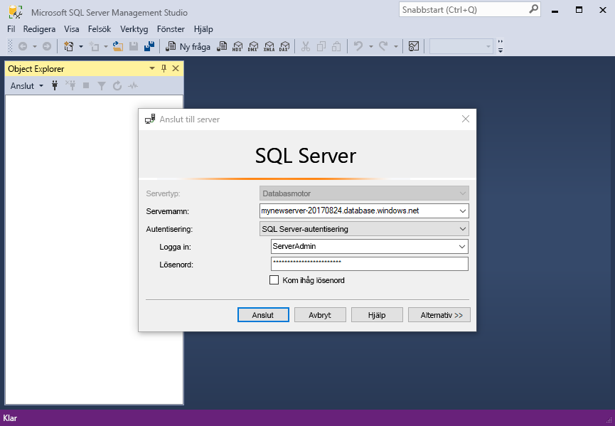
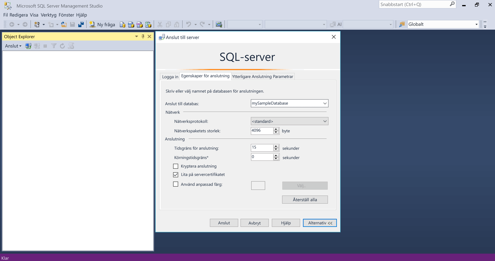
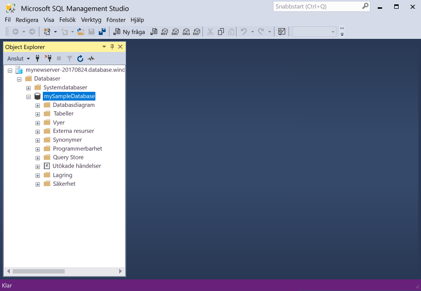
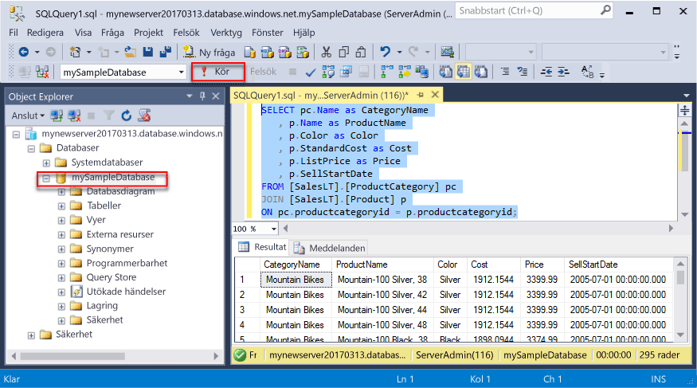
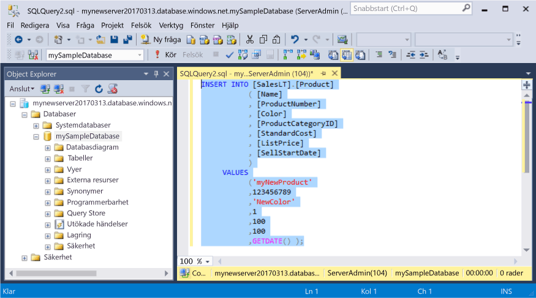
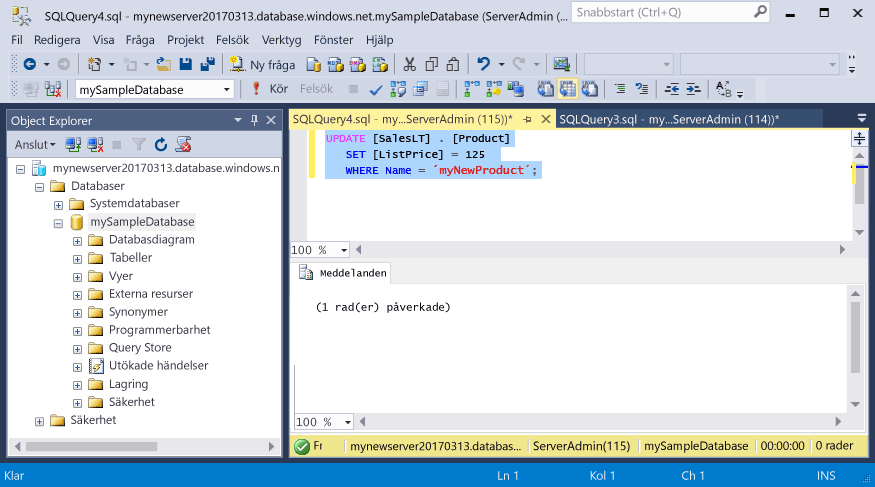
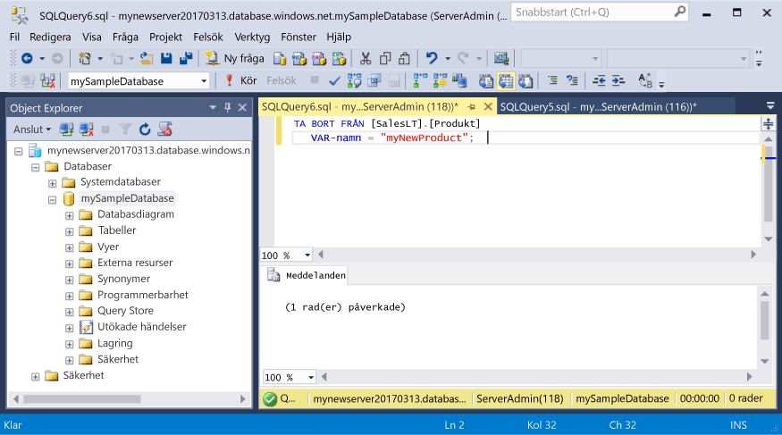

# <a name="azure-sql-database-use-sql-server-management-studio-to-connect-and-query-data"></a>Azure SQL Database: Använd SQL Server Management Studio för att ansluta och skicka frågor till data

[SQL Server Management Studio][ssms-install-latest-84g] (SSMS) är en integrerad miljö för att hantera all SQL-infrastruktur från SQL Server till SQL Database för Microsoft Windows. Den här snabbstarten visar hur du använder SSMS för att ansluta till en Azure SQL-databas och sedan använder Transact-SQL-uttryck för att skicka frågor mot, infoga, uppdatera och ta bort data i databasen. 

## <a name="prerequisites"></a>Krav

Den här snabbstarten använder resurser som har skapats i någon av dessa snabbstarter:

[!INCLUDE [prerequisites-create-db](../../includes/sql-database-connect-query-prerequisites-create-db-includes.md)]

#### <a name="install-the-latest-ssms"></a>Installera den senaste SSMS

Innan du börjar bör du kontrollera att du har installerat den senaste versionen av [SSMS][ssms-install-latest-84g]. 

## <a name="sql-server-connection-information"></a>Anslutningsinformation för en SQL-server

[!INCLUDE [prerequisites-server-connection-info](../../includes/sql-database-connect-query-prerequisites-server-connection-info-includes.md)]

## <a name="connect-to-your-database"></a>Ansluta till databasen

Använd SQL Server Management Studio för att upprätta en anslutning till Azure SQL Database-servern. 

> [!IMPORTANT]
> En logisk Azure SQL Database-server avlyssnar port 1433. Om du försöker ansluta till en logisk Azure SQL Database-server inifrån en företagsbrandvägg, måste den porten vara öppen i företagsbrandväggen för att du ska kunna ansluta.
>

1. Öppna SQL Server Management Studio.

2. I dialogrutan **Anslut till server** anger du följande information:

   | Inställning      | Föreslaget värde    | Beskrivning | 
   | ------------ | ------------------ | ----------- | 
   | **Servertyp** | Databasmotor | Det här värdet är obligatoriskt. |
   | **Servernamn** | Fullständigt kvalificerat servernamn | Namnet ska vara ungefär så här: **mynewserver20170313.database.windows.net**. |
   | **Autentisering** | SQL Server-autentisering | SQL-autentisering är den enda autentiseringstypen som vi har konfigurerat i den här kursen. |
   | **Inloggning** | Serveradministratörskontot | Detta är det konto som du angav när du skapade servern. |
   | **Lösenord** | Lösenordet för serveradministratörskontot | Detta är det lösenord som du angav när du skapade servern. |
   ||||

     

3. Klicka på **Alternativ** i dialogrutan **Anslut till server**. I avsnittet **Anslut till databas** anger du **mySampleDatabase** så att du ansluter till den här databasen.

     

4. Klicka på **Anslut**. Fönstret Object Explorer öppnas i SSMS. 

     

5. I Object Explorer expanderar du **Databaser** och sedan **mySampleDatabase** för att visa objekten i exempeldatabasen.

## <a name="query-data"></a>Frågedata

Använd följande kod för att söka efter de 20 främsta produkterna med Transact-SQL-instruktionen [SELECT](https://msdn.microsoft.com/library/ms189499.aspx).

1. I Object Explorer högerklickar du på **mySampleDatabase** och klickar sedan på **Ny fråga**. Ett tomt frågefönster öppnas som är anslutet till databasen.
2. Skriv följande fråga i frågefönstret:

   ```sql
   SELECT pc.Name as CategoryName, p.name as ProductName
   FROM [SalesLT].[ProductCategory] pc
   JOIN [SalesLT].[Product] p
   ON pc.productcategoryid = p.productcategoryid;
   ```

3. Klicka på **Execute** (Kör) för att hämta data från Product- och ProductCategory-tabeller.

    

## <a name="insert-data"></a>Infoga data

Använd följande kod för att infoga en ny produkt i tabellen SalesLT.Product med Transact-SQL-instruktionen [INSERT](https://msdn.microsoft.com/library/ms174335.aspx).

1. I frågefönstret ersätter du den föregående frågan med följande fråga:

   ```sql
   INSERT INTO [SalesLT].[Product]
           ( [Name]
           , [ProductNumber]
           , [Color]
           , [ProductCategoryID]
           , [StandardCost]
           , [ListPrice]
           , [SellStartDate]
           )
     VALUES
           ('myNewProduct'
           ,123456789
           ,'NewColor'
           ,1
           ,100
           ,100
           ,GETDATE() );
   ```

2. I verktygsfältet klickar du på **Execute** (Kör) för att infoga en ny rad i Product-tabellen.

    

## <a name="update-data"></a>Uppdatera data

Med följande kod uppdaterar du den nya produkt du tidigare lade till med Transact-SQL-instruktionen [UPDATE](https://msdn.microsoft.com/library/ms177523.aspx).

1. I frågefönstret ersätter du den föregående frågan med följande fråga:

   ```sql
   UPDATE [SalesLT].[Product]
   SET [ListPrice] = 125
   WHERE Name = 'myNewProduct';
   ```

2. I verktygsfältet trycker du på **Execute** (Kör) för att uppdatera angiven rad i Product-tabellen.

    

## <a name="delete-data"></a>Ta bort data

Med följande kod tar du bort den nya produkt du tidigare lade till med Transact-SQL-instruktionen [DELETE](https://msdn.microsoft.com/library/ms189835.aspx).

1. I frågefönstret ersätter du den föregående frågan med följande fråga:

   ```sql
   DELETE FROM [SalesLT].[Product]
   WHERE Name = 'myNewProduct';
   ```

2. I verktygsfältet trycker du på **Kör** för att ta bort angiven rad i Product-tabellen.

    

## <a name="next-steps"></a>Nästa steg

- För mer information om att skapa och hantera servrar och databaser med Transact-SQL, se [Lär dig mer om Azure SQL Database-servrar och -databaser](sql-database-servers-databases.md).
- Mer information om SSMS finns i [Använda SQL Server Management Studio](https://msdn.microsoft.com/library/ms174173.aspx).
- Information om hur du ansluter och frågar med hjälp av Azure Portal finns i [Ansluta och fråga med Azure Portal SQL-frågeredigeraren](sql-database-connect-query-portal.md).
- Mer information om att ansluta och ställa frågor med Visual Studio Code finns i [Ansluta och fråga med Visual Studio Code](sql-database-connect-query-vscode.md).
- Mer information om att ansluta och ställa frågor med .NET finns i [Ansluta och fråga med .NET](sql-database-connect-query-dotnet.md).
- Mer information om att ansluta och ställa frågor med PHP finns i [Ansluta och fråga med PHP](sql-database-connect-query-php.md).
- Mer information om att ansluta och ställa frågor med Node.js finns i [Ansluta och fråga med Node.js](sql-database-connect-query-nodejs.md).
- Mer information om att ansluta och ställa frågor med Java finns i [Ansluta och fråga med Java](sql-database-connect-query-java.md).
- Mer information om att ansluta och ställa frågor med Python finns i [Ansluta och fråga med Python](sql-database-connect-query-python.md).
- Mer information om att ansluta och ställa frågor med Ruby finns i [Ansluta och fråga med Ruby](sql-database-connect-query-ruby.md).


<!-- Article link references. -->

[ssms-install-latest-84g]: https://docs.microsoft.com/sql/ssms/sql-server-management-studio-ssms

