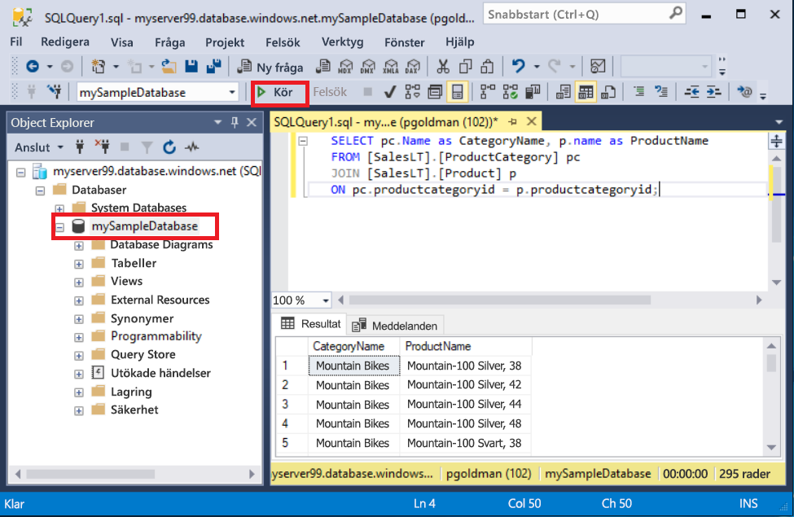
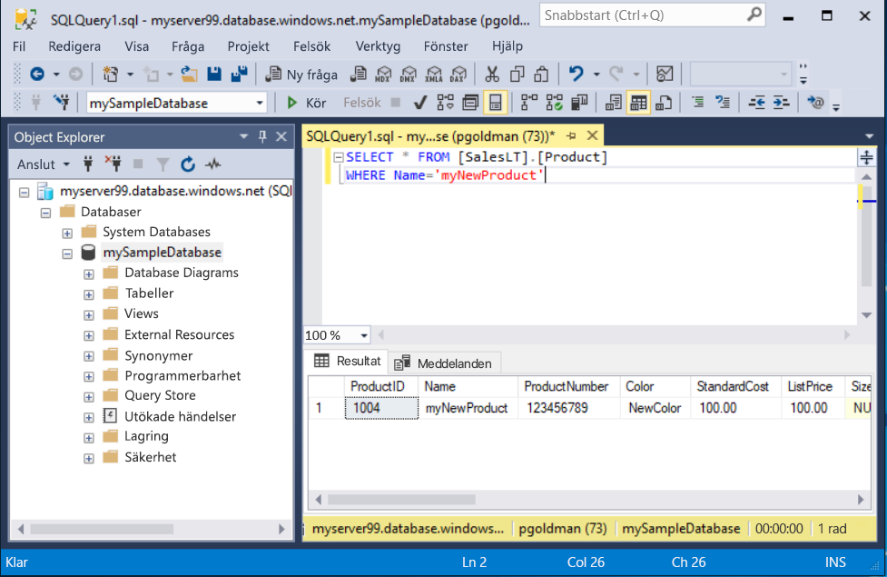

# <a name="quickstart-use-sql-server-management-studio-to-connect-and-query-an-azure-sql-database"></a>Snabbstart: Använda SQL Server Management Studio för att ansluta till och fråga i en Azure SQL-databas

I den här snabbstarten får du använda [SQL Server Management Studio][ssms-install-latest-84g] (SSMS) för att ansluta till en Azure SQL-databas. Därefter kör du Transact-SQL-uttryck för att fråga, infoga, uppdatera och ta bort data. Du kan använda SSMS för att hantera all SQL-infrastruktur, från SQL Server till SQL Database för Microsoft Windows.  

## <a name="prerequisites"></a>Förutsättningar

- En Azure SQL-databas. Du kan använda någon av dessa snabbstarter för att skapa och därefter konfigurera en databas i Azure SQL Database:

  || Enskild databas | Hanterad instans |
  |:--- |:--- |:---|
  | Skapa| [Portalen](sql-database-single-database-get-started.md) | [Portalen](sql-database-managed-instance-get-started.md) |
  || [CLI](scripts/sql-database-create-and-configure-database-cli.md) | [CLI](https://medium.com/azure-sqldb-managed-instance/working-with-sql-managed-instance-using-azure-cli-611795fe0b44) |
  || [PowerShell](scripts/sql-database-create-and-configure-database-powershell.md) | [PowerShell](scripts/sql-database-create-configure-managed-instance-powershell.md) |
  | Konfigurera | [IP-brandväggsregel på servernivå](sql-database-server-level-firewall-rule.md)| [Anslutning från en virtuell dator](sql-database-managed-instance-configure-vm.md)|
  |||[Anslutningen från på plats](sql-database-managed-instance-configure-p2s.md)
  |Läsa in data|AdventureWorks som lästs in per snabbstart|[Återställa Wide World Importers](sql-database-managed-instance-get-started-restore.md)
  |||Återställa eller importera Adventure Works från [BACPAC](sql-database-import.md) fil från [GitHub](https://github.com/Microsoft/sql-server-samples/tree/master/samples/databases/adventure-works)|
  |||

  > [!IMPORTANT]
  > Skripten i den här artikeln skrivs för att använda Adventure Works-databasen. Med en hanterad instans måste du antingen importera Adventure Works-databasen till en instansdatabas eller ändra skripten i den här artikeln om du vill använda Wide World Importers-databasen.

## <a name="install-the-latest-ssms"></a>Installera den senaste SSMS

Innan du börjar bör du kontrollera att du har installerat senaste [SSMS][ssms-install-latest-84g].

## <a name="get-sql-server-connection-information"></a>Hämta anslutningsinformation för en SQL-server

Skaffa den anslutningsinformation du behöver för att ansluta till Azure SQL Database. Du behöver det fullständiga servernamnet eller värdnamnet, databasnamnet och inloggningsinformationen för de kommande procedurerna.

1. Logga in på [Azure Portal](https://portal.azure.com/).

2. Navigera till sidan **SQL-databaser** eller **SQL-hanterade instanser**.

3. På **översiktssidan** granskar du det fullständigt kvalificerade servernamnet bredvid **Servernamn** för en enkel databas eller det fullständigt kvalificerade servernamnet bredvid **Värd** för en hanterad instans. Om du vill kopiera servernamnet eller värdnamnet hovrar du över det och markerar ikonen **Kopiera**.

## <a name="connect-to-your-database"></a>Ansluta till databasen

Anslut till din Azure SQL Database-server i SMSS.

> [!IMPORTANT]
> En Azure SQL Database-server avlyssnar port 1433. För att anslutning ska kunna ske till en SQL Database-server inifrån en företagsbrandvägg måste brandväggen ha den här porten öppen.
>

1. Öppna SSMS. Dialogrutan **Anslut till server** visas.

2. Ange följande information:

   | Inställning      | Föreslaget värde    | Beskrivning |
   | ------------ | ------------------ | ----------- |
   | **Servertyp** | Databasmotor | Obligatoriskt värde. |
   | **servernamn** | Fullständigt kvalificerat servernamn | Ungefär så här: **mynewserver20170313.database.windows.net**. |
   | **Authentication** | SQL Server-autentisering | Den här självstudien använder SQL-autentisering. |
   | **Inloggning** | Serveradministratörskontots användar-ID | Användar-ID från det serveradministratörskonto som användes när servern skapades. |
   | **Lösenord** | Serveradministratörskontots lösenord | Lösenord från det serveradministratörskonto som användes när servern skapades. |
   ||||

     

3. Välj **Alternativ** i dialogrutan **Anslut till server**. I den nedrullningsbara menyn **Anslut till databas** väljer du **mySampleDatabase**.

     

4. Välj **Anslut**. Fönstret Object Explorer öppnas.

5. Om du vill se databasens objekt expanderar du **Databaser** och **mySampleDatabase**.

     

## <a name="query-data"></a>Söka i data

Kör den här [SELECT](https://msdn.microsoft.com/library/ms189499.aspx) Transact-SQL-koden för att fråga efter de 20 viktigaste produkterna efter kategori.

1. I Object Explorer högerklickar du på **mySampleDatabase**. Välj sedan **Ny fråga**. Ett nytt frågefönster öppnas som är anslutet till din databas.

2. Klistra in den här SQL-frågan i frågefönstret.

   ```sql
   SELECT pc.Name as CategoryName, p.name as ProductName
   FROM [SalesLT].[ProductCategory] pc
   JOIN [SalesLT].[Product] p
   ON pc.productcategoryid = p.productcategoryid;
   ```

3. I verktygsfältet väljer du **Kör** för att hämta data från tabellerna `Product` och `ProductCategory`.

    

## <a name="insert-data"></a>Infoga data

Kör den här [INSERT](https://msdn.microsoft.com/library/ms174335.aspx) Transact-SQL-koden för att skapa en ny produkt i tabellen `SalesLT.Product`.

1. Ersätt den tidigare frågan med denna.

   ```sql
   INSERT INTO [SalesLT].[Product]
           ( [Name]
           , [ProductNumber]
           , [Color]
           , [ProductCategoryID]
           , [StandardCost]
           , [ListPrice]
           , [SellStartDate] )
     VALUES
           ('myNewProduct'
           ,123456789
           ,'NewColor'
           ,1
           ,100
           ,100
           ,GETDATE() );
   ```

2. Välj **Kör** för att infoga en ny rad i `Product`-tabellen. Fönstret **Meddelanden** visas **(1 rad påverkas)**.

## <a name="view-the-result"></a>Visa resultatet

1. Ersätt den tidigare frågan med denna.

   ```sql
   SELECT * FROM [SalesLT].[Product]
   WHERE Name='myNewProduct'
   ```

2. Välj **Kör**. Följande resultat visas.

   

## <a name="update-data"></a>Uppdatera data

Kör det här [uppdatering](https://msdn.microsoft.com/library/ms177523.aspx) Transact-SQL-kod för att ändra din nya produkt.

1. Ersätt den tidigare frågan med denna.

   ```sql
   UPDATE [SalesLT].[Product]
   SET [ListPrice] = 125
   WHERE Name = 'myNewProduct';
   ```

2. Välj **Kör** för att uppdatera den angivna raden i `Product`-tabellen. Fönstret **Meddelanden** visas **(1 rad påverkas)**.

## <a name="delete-data"></a>Ta bort data

Kör den här [DELETE](https://msdn.microsoft.com/library/ms189835.aspx) Transact-SQL-koden för att ta bort din nya produkt.

1. Ersätt den tidigare frågan med denna.

   ```sql
   DELETE FROM [SalesLT].[Product]
   WHERE Name = 'myNewProduct';
   ```

2. Välj **Kör** för att uppdatera den angivna raden i `Product`-tabellen. Fönstret **Meddelanden** visas **(1 rad påverkas)**.

## <a name="next-steps"></a>Nästa steg

- Mer information om SSMS finns i [SQL Server Management Studio](https://msdn.microsoft.com/library/ms174173.aspx).
- Information om hur du ansluter och frågar med hjälp av Azure Portal finns i [Ansluta och fråga med Azure Portal SQL-frågeredigeraren](sql-database-connect-query-portal.md).
- Mer information om att ansluta och ställa frågor med Visual Studio Code finns i [Ansluta och fråga med Visual Studio Code](sql-database-connect-query-vscode.md).
- Mer information om att ansluta och ställa frågor med .NET finns i [Ansluta och fråga med .NET](sql-database-connect-query-dotnet.md).
- Mer information om att ansluta och ställa frågor med PHP finns i [Ansluta och fråga med PHP](sql-database-connect-query-php.md).
- Mer information om att ansluta och ställa frågor med Node.js finns i [Ansluta och fråga med Node.js](sql-database-connect-query-nodejs.md).
- Mer information om att ansluta och ställa frågor med Java finns i [Ansluta och fråga med Java](sql-database-connect-query-java.md).
- Mer information om att ansluta och ställa frågor med Python finns i [Ansluta och fråga med Python](sql-database-connect-query-python.md).
- Mer information om att ansluta och ställa frågor med Ruby finns i [Ansluta och fråga med Ruby](sql-database-connect-query-ruby.md).

<!-- Article link references. -->

[ssms-install-latest-84g]: https://docs.microsoft.com/sql/ssms/sql-server-management-studio-ssms