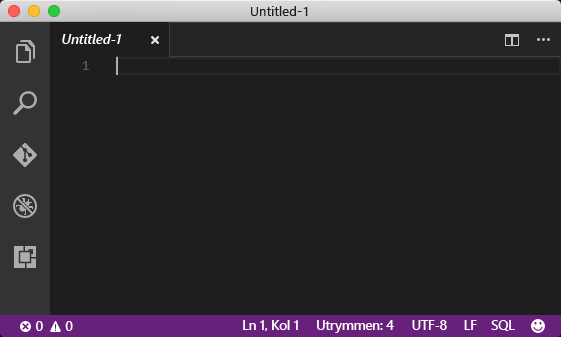
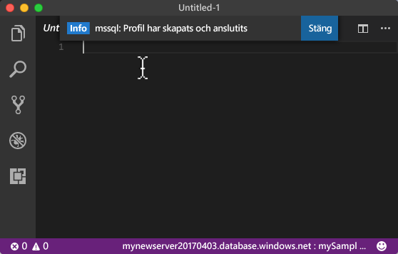
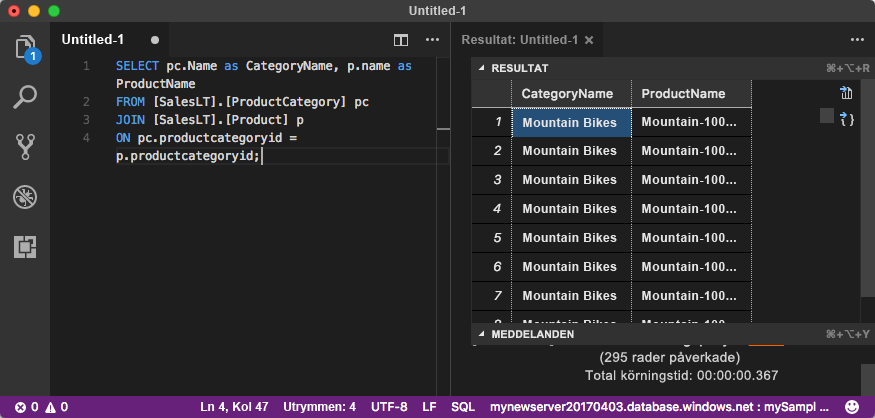

# <a name="azure-sql-database-use-visual-studio-code-to-connect-and-query-data"></a>Azure SQL Database: Använd Visual Studio Code för att ansluta och skicka frågor till data

[Visual Studio Code](https://code.visualstudio.com/docs) är en grafisk kodredigerare för Linux, macOS och Windows som stöder tillägg, inklusive [mssql tillägget](https://aka.ms/mssql-marketplace) för frågor till Microsoft SQL Server, Azure SQL Database och SQL Data Warehouse. Den här snabbstarten visar hur du använder Visual Studio Code för att ansluta till en Azure SQL-databas och sedan använda Transact-SQL-uttryck för att fråga, infoga, uppdatera och ta bort data i databasen.

Den här snabbstarten använder resurser som har skapats i någon av dessa snabbstarter som utgångspunkt:

- [Skapa DB – Portal](sql-database-get-started-portal.md)
- [Skapa DB – CLI](sql-database-get-started-cli.md)

Innan du börjar bör du kontrollera att du har installerat den senaste versionen av [Visual Studio Code](https://code.visualstudio.com/Download) och har läst in [mssql-tillägget](https://aka.ms/mssql-marketplace). Installationsanvisningar finns i [Installera VS Code](https://docs.microsoft.com/sql/linux/sql-server-linux-develop-use-vscode#install-vs-code) för mssql-tillägget och [mssql för Visual Studio Code](https://marketplace.visualstudio.com/items?itemName=ms-mssql.mssql). 

## <a name="configure-vs-code-mac-os-only"></a>Konfigurera VS Code (endast Mac OS)

### <a name="mac-os"></a>**Mac OS**
För macOS måste du installera OpenSSL, vilket är ett förhandskrav för det DotNet Core som används av mssql-tillägget. Ange följande kommandon för att installera **brew** och **OpenSSL**. 

```bash
ruby -e "$(curl -fsSL https://raw.githubusercontent.com/Homebrew/install/master/install)"
brew update
brew install openssl
mkdir -p /usr/local/lib
ln -s /usr/local/opt/openssl/lib/libcrypto.1.0.0.dylib /usr/local/lib/
ln -s /usr/local/opt/openssl/lib/libssl.1.0.0.dylib /usr/local/lib/
```

## <a name="get-connection-information"></a>Hämta anslutningsinformation

Hämta det fullständigt kvalificerade servernamnet för Azure SQL Database-servern i Azure Portal. Du kan använda det fullständigt kvalificerade servernamnet för att ansluta till servern med hjälp av Visual Studio Code.

1. Logga in på [Azure-portalen](https://portal.azure.com/).
2. Välj **SQL-databaser** på den vänstra menyn och klicka på databasen på sidan **SQL-databaser**. 
3. I rutan **Essentials** på sidan för Azure Portal för databasen letar du reda på och kopierar **servernamnet** som ska användas längre fram i denna snabbstart.

    

## <a name="set-language-mode-to-sql"></a>Ange språkläge till SQL

Ställ in språkläget på **SQL** i Visual Studio Code för att aktivera mssql-kommandon och T-SQL IntelliSense.

1. Öppna ett Visual Studio Code-fönster. 

2. Tryck på **⌘ + K, M** eller **CTRL + K, M** (Mac respektive Windows), skriv in **SQL** och tryck på **RETUR** för att ange språkläge som SQL. 



## <a name="connect-to-the-server"></a>Ansluta till servern

Använd Visual Studio Code för att upprätta en anslutning till Azure SQL Database-servern.

1. I VS Code trycker du på **CTRL+SHIFT+P** (eller **F1**) för att öppna kommandopaletten.

2. Typ av **sqlcon** och tryck på **RETUR** och ange ditt språk som **SQL**.

3. Tryck på **RETUR** för att välja **Create Connection Profile** (Skapa anslutningsprofil). Detta skapar en anslutningsprofil för SQL Server-instansen.

4. Följ anvisningarna för att ange anslutningsegenskaper för den nya anslutningsprofilen. När du har angett ett värde trycker du på **RETUR** för att fortsätta. 

   I följande tabell beskrivs egenskaperna för anslutningsprofilen.

   | Inställning | Beskrivning |
   |-----|-----|
   | **Servernamn** | Ange det fullständigt kvalificerade servernamnet som **mynewserver20170313.database.windows.net** |
   | **Databasnamn** | Ange databasnamnet, t.ex. **mySampleDatabase** |
   | **Autentisering** | Välj SQL-inloggning |
   | **Användarnamn** | Ange serveradministratörskontot |
   | **Lösenord (SQL-inloggning)** | Ange lösenordet för serveradministratörskontot | 
   | **Spara lösenordet?** | Välj **Ja** eller **Nej** |
   | **[Valfritt] Ange ett namn för den här profilen** | Ange ett anslutningsprofilnamn, t.ex. **mySampleDatabase**. 

5. Tryck på tangenten **ESC** för att stänga meddelandet som informerar om att profilen har skapats och anslutits.

6. Kontrollera anslutningen i statusfältet.

   

## <a name="query-data"></a>Frågedata

Använd [SELECT](https://msdn.microsoft.com/library/ms189499.aspx) Transact-SQL-uttrycket för att skicka frågor till data i Azure SQL Database.

1. I fönstret **Editor** anger du följande fråga i frågefönstret:

   ```sql
   SELECT pc.Name as CategoryName, p.name as ProductName
   FROM [SalesLT].[ProductCategory] pc
   JOIN [SalesLT].[Product] p
   ON pc.productcategoryid = p.productcategoryid;
   ```

2. Tryck på **CTRL+SKIFT+E** att hämta data från Product- och ProductCategory-tabeller.

    

## <a name="insert-data"></a>Infoga data

Använd [INSERT](https://msdn.microsoft.com/library/ms174335.aspx) Transact-SQL-uttrycket för att infoga data i Azure SQL Database.

1. I fönstret **Editor** tar du bort föregående fråga och skriver in följande fråga:

   ```sql
   INSERT INTO [SalesLT].[Product]
           ( [Name]
           , [ProductNumber]
           , [Color]
           , [ProductCategoryID]
           , [StandardCost]
           , [ListPrice]
           , [SellStartDate]
           )
     VALUES
           ('myNewProduct'
           ,123456789
           ,'NewColor'
           ,1
           ,100
           ,100
           ,GETDATE() );
   ```

2. Tryck på **CTRL+SKIFT+E** för att infoga en ny rad i Product-tabellen.

## <a name="update-data"></a>Uppdatera data

Använd [UPDATE](https://msdn.microsoft.com/library/ms177523.aspx) Transact-SQL-uttrycket för att uppdatera data i Azure SQL Database.

1.  I fönstret **Editor** tar du bort föregående fråga och skriver in följande fråga:

   ```sql
   UPDATE [SalesLT].[Product]
   SET [ListPrice] = 125
   WHERE Name = 'myNewProduct';
   ```

2. Tryck på **CTRL+SKIFT+E** för att uppdatera angiven rad i Product-tabellen.

## <a name="delete-data"></a>Ta bort data

Använd [DELETE](https://msdn.microsoft.com/library/ms189835.aspx) Transact-SQL-uttrycket för att ta bort data i Azure SQL Database.

1. I fönstret **Editor** tar du bort föregående fråga och skriver in följande fråga:

   ```sql
   DELETE FROM [SalesLT].[Product]
   WHERE Name = 'myNewProduct';
   ```

2. Tryck på **CTRL+SHIFT+E** för att ta bort angiven rad i Product-tabellen.

## <a name="next-steps"></a>Nästa steg

- Om du vill ansluta och fråga med SQL Server Management Studio kan du läsa [Anslut och fråga med SSMS](sql-database-connect-query-ssms.md)
- Mer information om att ansluta och ställa frågor med .NET finns i [Ansluta och fråga med .NET](sql-database-connect-query-dotnet.md).
- Mer information om att ansluta och ställa frågor med PHP finns i [Ansluta och fråga med PHP](sql-database-connect-query-php.md).
- Mer information om att ansluta och ställa frågor med Node.js finns i [Ansluta och fråga med Node.js](sql-database-connect-query-nodejs.md).
- Mer information om att ansluta och ställa frågor med Java finns i [Ansluta och fråga med Java](sql-database-connect-query-java.md).
- Mer information om att ansluta och ställa frågor med Python finns i [Ansluta och fråga med Python](sql-database-connect-query-python.md).
- Mer information om att ansluta och ställa frågor med Ruby finns i [Ansluta och fråga med Ruby](sql-database-connect-query-ruby.md).

