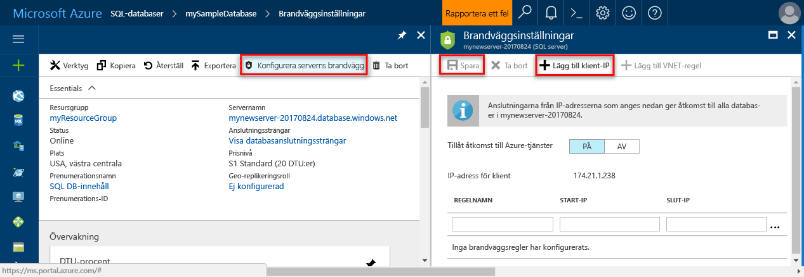

# <a name="azure-sql-database-and-sql-data-warehouse-ip-firewall-rules"></a>Azure SQL Database och SQL Data Warehouse IP-brandväggsregler

Microsoft Azure [SQL Database](sql-database-technical-overview.md) och [SQL Data Warehouse](../sql-data-warehouse/sql-data-warehouse-overview-what-is.md) tillhandahåller en relationsdatabastjänst för Azure och andra Internetbaserade program. För att skydda dina data förhindrar brandväggar all åtkomst till din databasserver tills du anger vilka datorer som har behörighet. Brandväggen ger åtkomst till databaser baserat på vilken IP-adress som varje begäran kommer från.

> [!NOTE]
> Den här artikeln gäller för Azure SQL-server och att både SQL Database och SQL Data Warehouse-databaser som skapas på Azure SQL-servern. För enkelhetens skull används SQL Database när det gäller både SQL Database och SQL Data Warehouse.
> [!IMPORTANT]
> Den här artikeln har *inte* avser **Azure SQL Database Managed Instance**. Finns i följande artikel om [ansluter till en hanterad instans](sql-database-managed-instance-connect-app.md) för mer information om nätverkskonfiguration som krävs.

## <a name="virtual-network-rules-as-alternatives-to-ip-rules"></a>Virtual network-regler som alternativ till IP-regler

Förutom IP-regler i brandväggen hanterar också *virtuella Nätverksregler*. Virtuella Nätverksregler baseras på Vnet-tjänstslutpunkter. Regler för virtuellt nätverk kan vara bättre att IP-regler i vissa fall. Mer information finns i [tjänstslutpunkter i virtuella nätverk och regler för Azure SQL Database](sql-database-vnet-service-endpoint-rule-overview.md).

## <a name="overview"></a>Översikt

Till en början blockeras all åtkomst till Azure SQL-servern av SQL Database-brandväggen. För att komma åt en databasserver, måste du ange en eller flera på servernivå IP-brandväggsregler som ger åtkomst till Azure SQL-servern. Använd IP-brandväggsregler för att ange vilka IP-adressintervall från Internet tillåts och om Azure-program kan försöka att ansluta till Azure SQL-servern.

Om du bara vill bevilja åtkomst till en av databaserna på din Azure SQL-server måste du skapa en regel på databasnivå för databasen. Ange ett IP-adressintervall för brandväggsregeln för databasen IP ligger utanför det IP-adressintervall som angetts i brandväggsregeln på servernivå IP och se till att IP-adressen för klienten ligger inom intervallet som angetts i regeln på databasnivå.

> [!IMPORTANT]
> SQL Data Warehouse kan du endast har stöd för IP-brandväggsregler på servernivå och stöder inte IP-brandväggsregler på databasnivå.

Anslutningsförsök från Internet och Azure måste först passera brandväggen innan de kan nå din Azure SQL-server eller SQL Database, som du ser i följande diagram:

   ![Diagram över brandväggskonfigurationen.][1]

- **På servernivå IP-brandväggsregler:**

  Dessa regler gör att klienterna kan komma åt hela Azure SQL-servern, det vill säga alla databaser i samma SQL-databasserver. Dessa regler lagras i **huvuddatabasen**. IP-brandväggsregler på servernivå kan konfigureras med hjälp av portalen eller med hjälp av Transact-SQL-uttryck. Du måste vara prenumerationsägare eller prenumerationsdeltagare för att skapa brandväggsregler på servernivå IP med hjälp av Azure portal eller PowerShell. Om du vill skapa en på servernivå IP-brandväggsregel med hjälp av Transact-SQL, måste du ansluta till SQL Database-instans som den primära inloggningen på servernivå eller Azure Active Directory-administratör (vilket innebär att en IP-brandväggsregel på servernivå först måste ha skapats av en användare med Azure-behörighet).

- **Databasnivå IP-brandväggsregler:**

  Dessa regler gör att klienterna kan komma åt vissa (säkra) databaser på samma SQL-databasserver. Du kan skapa dessa regler för varje databas (inklusive den **master** databas) och de lagras i de enskilda databaserna. IP-brandväggsregler för på databasnivå för huvud- och användardatabaser kan bara skapas och hanteras med hjälp av Transact-SQL-instruktioner och bara när du har konfigurerat den första brandväggen på servernivå. Om du anger ett IP-adressintervall i brandväggsregeln för på databasnivå IP ligger utanför det intervall som anges i brandväggsregeln på servernivå IP endast klienter som har IP-adresser i intervallet på databasnivå kan komma åt databasen. Du kan ha högst 128 på databasnivå IP-brandväggsregler för en databas. Mer information om hur du konfigurerar IP-brandväggsregler på databasnivå finns i exemplet senare i den här artikeln och se [sp_set_database_firewall_rule (Azure SQL Database)](https://msdn.microsoft.com/library/dn270010.aspx).

### <a name="recommendation"></a>Rekommendation

Microsoft rekommenderar att du använder på databasnivå IP-brandväggsregler när det är möjligt att förbättra säkerheten och göra databasen mer portabel. Använd IP-brandväggsregler på servernivå för administratörer och när du har många databaser med samma åtkomstkrav och du inte vill lägga tid på att konfigurera varje databas individuellt.

> [!IMPORTANT]
> Windows Azure SQL Database stöder maximalt 128 IP-brandväggsregler.
> [!NOTE]
> Information om portabla databaser i kontexten för företagskontinuitet finns i [Autentiseringskrav för haveriberedskap](sql-database-geo-replication-security-config.md).

### <a name="connecting-from-the-internet"></a>Ansluta från Internet

När en dator försöker ansluta till databasservern från Internet kontrollerar brandväggen först vilken IP-adress för begäran mot för den databas anslutningen begär brandväggsregler på databasnivå IP:

- Om IP-adressen för begäran är inom ett intervall som anges i brandväggsreglerna på databasnivå IP, godkänns anslutningen till SQL-databasen som innehåller regeln.
- Om IP-adressen för begäran inte ligger inom något av intervallen som anges i brandväggsregeln på databasnivå IP kontrolleras IP-brandväggsregler på servernivå. Om IP-adressen för begäran är inom ett intervall som anges i IP-brandväggsregler på servernivå, godkänns anslutningen. IP-brandväggsregler på servernivå gäller för alla SQL-databaser på Azure SQL-servern.  
- Om IP-adressen för begäran inte ligger inom intervallen som angetts i databasnivå- eller servernivå IP-brandväggsregler, anslutningsbegäran misslyckas.

> [!NOTE]
> För att kunna komma åt Azure SQL Database från din lokala dator måste du kontrollera att brandväggen i nätverket och på den lokala datorn tillåter utgående kommunikation på TCP-port 1433.

### <a name="connecting-from-azure"></a>Ansluta från Azure

Om du vill tillåta att program från Azure ansluter till din Azure SQL-server måste Azure-anslutningar vara aktiverade. När ett program från Azure försöker ansluta till databasservern kontrollerar brandväggen att Azure-anslutningar tillåts. En brandväggsinställning med start- och slutadresser som är 0.0.0.0 anger Azure-anslutningar tillåts. Om anslutningsförsöket inte tillåts kommer begäran inte att nå Azure SQL Database-servern.

> [!IMPORTANT]
> Det här alternativet konfigurerar brandväggen så att alla anslutningar från Azure tillåts, inklusive anslutningar från prenumerationer för andra kunder. Om du väljer det här alternativet kontrollerar du att dina inloggnings- och användarbehörigheter begränsar åtkomsten till endast auktoriserade användare.

## <a name="creating-and-managing-ip-firewall-rules"></a>Skapa och hantera IP-brandväggsregler

Första brandväggsinställningen på servernivå kan skapas med den [Azure-portalen](https://portal.azure.com/) eller programmässigt med [Azure PowerShell](https://docs.microsoft.com/powershell/module/az.sql), [Azure CLI](/cli/azure/sql/server/firewall-rule#az-sql-server-firewall-rule-create), eller [ REST-API](https://docs.microsoft.com/rest/api/sql/firewallrules/createorupdate). Efterföljande IP-brandväggsregler för på servernivå kan skapas och hanteras med hjälp av dessa metoder samt via Transact-SQL.

> [!IMPORTANT]
> IP-brandväggsregler på databasnivå kan bara skapas och hanteras med hjälp av Transact-SQL.

För att förbättra prestanda cachelagras IP-brandväggsregler på servernivå tillfälligt på databasnivå. Information om hur du uppdaterar cacheminnet finns i [DBCC FLUSHAUTHCACHE](https://msdn.microsoft.com/library/mt627793.aspx).

> [!TIP]
> Du kan använda [SQL Database Auditing](sql-database-auditing.md) att granska ändringar av brandvägg på servernivå och databasnivå.

## <a name="manage-server-level-ip-firewall-rules-using-the-azure-portal"></a>Hantera brandväggsregler på servernivå IP med Azure portal

Om du vill ange en IP-brandväggsregel på servernivå på Azure-portalen, går antingen du till sidan Översikt för Azure SQL database eller översiktssidan för din SQL Database-server.

> [!TIP]
> En självstudiekurs finns i [skapa en databas med Azure portal](sql-database-single-database-get-started.md).

### <a name="from-database-overview-page"></a>Från översiktssidan för databasen

1. Om du vill ange en IP-brandväggsregel på servernivå från översiktssidan för databasen, klickar du på **konfigurera serverbrandvägg** i verktygsfältet, som visas i följande bild: Sidan **Brandväggsinställningar** för SQL Database-servern öppnas.

      

2. Klicka på **klientens IP-adress** i verktygsfältet för att lägga till IP-adressen för datorn du använder för närvarande och klicka sedan på **spara**. En IP-brandväggsregel på servernivå skapas för din aktuella IP-adress.

      

### <a name="from-server-overview-page"></a>Från server-översiktssidan

Översiktssidan för servern öppnas, där du kan se det fullständigt kvalificerade servernamnet (till exempel **mynewserver20170403.database.windows.net**) och alternativ för ytterligare konfiguration.

1. Om du vill ange en regel för på servernivå från server översiktssidan, klickar du på **brandväggen** på den vänstra menyn under inställningar:

2. Klicka på **klientens IP-adress** i verktygsfältet för att lägga till IP-adressen för datorn du använder för närvarande och klicka sedan på **spara**. En IP-brandväggsregel på servernivå skapas för din aktuella IP-adress.

## <a name="manage-ip-firewall-rules-using-transact-sql"></a>Hantera IP-brandväggsregler med hjälp av Transact-SQL

| Katalogvy eller lagrad procedur | Nivå | Beskrivning |
| --- | --- | --- |
| [sys.firewall_rules](https://msdn.microsoft.com/library/dn269980.aspx) |Server |Visar de aktuella brandväggsreglerna för servernivå IP |
| [sp_set_firewall_rule](https://msdn.microsoft.com/library/dn270017.aspx) |Server |Skapar eller uppdaterar IP-brandväggsregler på servernivå |
| [sp_delete_firewall_rule](https://msdn.microsoft.com/library/dn270024.aspx) |Server |Tar bort IP-brandväggsregler på servernivå |
| [sys.database_firewall_rules](https://msdn.microsoft.com/library/dn269982.aspx) |Databas |Visar de aktuella brandväggsreglerna för på databasnivå IP |
| [sp_set_database_firewall_rule](https://msdn.microsoft.com/library/dn270010.aspx) |Databas |Skapar eller uppdaterar IP-brandväggsregler på databasnivå |
| [sp_delete_database_firewall_rule](https://msdn.microsoft.com/library/dn270030.aspx) |Databaser |Tar bort på databasnivå IP-brandväggsregler |

Granska befintliga regler i följande exempel, aktivera ett intervall med IP-adresser på Contoso-servern och tar bort en brandväggsregel för IP:

```sql
SELECT * FROM sys.firewall_rules ORDER BY name;
```

Lägg sedan till en IP-brandväggsregel på servernivå.

```sql
EXECUTE sp_set_firewall_rule @name = N'ContosoFirewallRule',
   @start_ip_address = '192.168.1.1', @end_ip_address = '192.168.1.10'
```

Om du vill ta bort en IP-brandväggsregel på servernivå, kör du proceduren sp_delete_firewall_rule lagras. I följande exempel tas regeln med namnet ContosoFirewallRule:

```sql
EXECUTE sp_delete_firewall_rule @name = N'ContosoFirewallRule'
```

## <a name="manage-server-level-ip-firewall-rules-using-azure-powershell"></a>Hantera brandväggsregler på servernivå IP med Azure PowerShell

[!INCLUDE [updated-for-az](../../includes/updated-for-az.md)]
> [!IMPORTANT]
> Modulen PowerShell Azure Resource Manager är fortfarande stöds av Azure SQL Database, men alla framtida utveckling är för modulen Az.Sql. Dessa cmdlets finns i [i AzureRM.Sql](https://docs.microsoft.com/powershell/module/AzureRM.Sql/). Argumenten för kommandon i modulen Az och AzureRm-moduler är avsevärt identiska.

| Cmdlet | Nivå | Beskrivning |
| --- | --- | --- |
| [Get-AzSqlServerFirewallRule](/powershell/module/az.sql/get-azsqlserverfirewallrule) |Server |Returnerar de aktuella brandväggsreglerna på servernivå |
| [New-AzSqlServerFirewallRule](/powershell/module/az.sql/new-azsqlserverfirewallrule) |Server |Skapar en ny brandväggsregel på servernivå |
| [Set-AzSqlServerFirewallRule](/powershell/module/az.sql/set-azsqlserverfirewallrule) |Server |Uppdaterar egenskaperna för en befintlig brandväggsregel på servernivå |
| [Remove-AzSqlServerFirewallRule](/powershell/module/az.sql/remove-azsqlserverfirewallrule) |Server |Tar bort brandväggsregler på servernivå |

I följande exempel anger en servernivå IP-brandväggsregel med hjälp av PowerShell:

```powershell
New-AzSqlServerFirewallRule -ResourceGroupName "myResourceGroup" `
    -ServerName $servername `
    -FirewallRuleName "AllowSome" -StartIpAddress "0.0.0.0" -EndIpAddress "0.0.0.0"
```

> [!TIP]
> PowerShell-exempel i kontexten för en Snabbstart finns [skapa DB – PowerShell](sql-database-powershell-samples.md) och [skapar en enkel databas och konfigurerar en SQL Database-servernivå IP-brandväggsregel med hjälp av PowerShell](scripts/sql-database-create-and-configure-database-powershell.md)

## <a name="manage-server-level-ip-firewall-rules-using-azure-cli"></a>Hantera brandväggsregler på servernivå IP med Azure CLI

| Cmdlet | Nivå | Beskrivning |
| --- | --- | --- |
|[Skapa AZ sql server firewall-rule](/cli/azure/sql/server/firewall-rule#az-sql-server-firewall-rule-create)|Server|Skapar en brandväggsregel för IP|
|[AZ sql server firewall-rule list](/cli/azure/sql/server/firewall-rule#az-sql-server-firewall-rule-list)|Server|Visar en lista över IP-brandväggsregler på en server|
|[AZ sql server firewall-rule show](/cli/azure/sql/server/firewall-rule#az-sql-server-firewall-rule-show)|Server|Visar information om en IP-brandväggsregel|
|[AZ sql server firewall-rule update](/cli/azure/sql/server/firewall-rule##az-sql-server-firewall-rule-update)|Server|Uppdaterar en IP-brandväggsregel|
|[AZ sql server firewall-rule delete](/cli/azure/sql/server/firewall-rule#az-sql-server-firewall-rule-delete)|Server|Tar bort en IP-brandväggsregel|

I följande exempel anger en servernivå IP-brandväggsregel med hjälp av Azure-CLI:

```azurecli-interactive
az sql server firewall-rule create --resource-group myResourceGroup --server $servername \
-n AllowYourIp --start-ip-address 0.0.0.0 --end-ip-address 0.0.0.0
```

> [!TIP]
> Azure CLI exempelvis i kontexten för en Snabbstart Se [skapa DB – Azure CLI](sql-database-cli-samples.md) och [skapar en enkel databas och konfigurerar en brandväggsregel för IP-SQL-databas med hjälp av Azure CLI](scripts/sql-database-create-and-configure-database-cli.md)

## <a name="manage-server-level-ip-firewall-rules-using-rest-api"></a>Hantera brandväggsregler på servernivå IP med REST API

| API | Nivå | Beskrivning |
| --- | --- | --- |
| [Visa en lista med brandväggsregler](https://docs.microsoft.com/rest/api/sql/firewallrules/listbyserver) |Server |Visar de aktuella brandväggsreglerna för servernivå IP |
| [Skapa eller uppdatera en brandväggsregel](https://docs.microsoft.com/rest/api/sql/firewallrules/createorupdate) |Server |Skapar eller uppdaterar IP-brandväggsregler på servernivå |
| [Ta bort brandväggsregel](https://docs.microsoft.com/rest/api/sql/firewallrules/delete) |Server |Tar bort IP-brandväggsregler på servernivå |
| [Hämta brandväggsregler](https://docs.microsoft.com/rest/api/sql/firewallrules/get) | Server | Hämtar IP-brandväggsregler på servernivå |

## <a name="server-level-versus-database-level-ip-firewall-rules"></a>På servernivå och databasnivå IP-brandväggsregler

F. Bör användare av en databas är helt isolerade från en annan databas?
Om Ja, kan du bevilja åtkomst med hjälp av IP-brandväggsregler på databasnivå. Detta förhindrar med servernivå IP-brandväggsregler, som tillåter åtkomst genom brandväggen till alla databaser, dina försvar djup.

F. Användare på IP-adressen måste ha åtkomst till alla databaser?
Använd IP-brandväggsregler på servernivå för att minska antalet gånger som du måste konfigurera IP-brandväggsregler.

F. Har du åtkomst via Azure portal, PowerShell eller REST-API genom att den person eller grupp att konfigurera de IP-brandväggsreglerna?
Du måste använda IP-brandväggsregler på servernivå. IP-brandväggsregler på databasnivå kan bara konfigureras med hjälp av Transact-SQL.  

F. Den person eller grupp konfigurerar IP-brandväggsregler som är förbjudna att ha på hög nivå behörighet på databasnivå?
Använd IP-brandväggsregler på servernivå. Konfigurera på databasnivå med IP-brandväggsregler med hjälp av Transact-SQL, måste minst `CONTROL DATABASE` behörighet på databasnivå.  

F. Är den person eller grupp konfigurering eller granskning IP-brandväggsregler centralt hantera IP-brandväggsregler för många (kanske 100-tal) databaser?
Det här valet beror på dina behov och miljö. IP-brandväggsregler på servernivå kan vara enklare att konfigurera, men skript kan konfigurera regler på databasnivå. Och även om du använder IP-brandväggsregler på servernivå kan du behöva granska om brandväggsregler på databasnivå IP-användare med `CONTROL` -behörighet på databasen har skapat IP-brandväggsregler på databasnivå.

F. Kan jag använda en blandning av både på servernivå och databasnivå IP-brandväggsregler?
Ja. Vissa användare, till exempel Administratörer behöva IP-brandväggsregler på servernivå. Andra användare, t.ex användare av ett databasprogram, kanske behöver på databasnivå IP-brandväggsregler.

## <a name="troubleshooting-the-database-firewall"></a>Felsöka databasbrandväggen

Tänk på följande om åtkomsten till Microsoft Azure SQL Database-tjänsten inte fungerar som förväntat:

- **Lokal brandväggskonfiguration:**

  Innan datorn kan komma åt Azure SQL Database, kan du behöva skapa ett brandväggsundantag på din dator för TCP-port 1433. Om du skapar anslutningar inom gränsen för Azure-molnet kan du behöva öppna ytterligare portar. Mer information finns i den **SQL-databas: Utanför eller inuti** delen av [portar utöver 1433 för ADO.NET 4.5 och SQL Database](sql-database-develop-direct-route-ports-adonet-v12.md).

- **Network adress translation (NAT):**

  På grund av NAT, kan IP-adress som används av datorn för att ansluta till Azure SQL Database skilja sig från IP-adressen som visas på din dator IP-konfigurationsinställningar. Du kan visa IP-adressen som din dator använder genom att ansluta till Azure, logga in på portalen och gå till fliken **Konfigurera** på servern som är värd för databasen. **Aktuell klient-IP-adress** visas under avsnittet **Tillåtna IP-adresser**. Klicka på **Lägg till** i **Tillåtna IP-adresser** så att den här datorn kan ansluta till servern.

- **Ändringar i listan över tillåtna har inte börjat gälla ännu:**

  Det kan finnas så mycket som fem minuter innan ändringarna brandväggskonfiguration för Azure SQL Database ska börja gälla.

- **Inloggningen har inte behörighet eller ett felaktigt lösenord använts:**

  Om en inloggning inte har behörighet på Azure SQL Database-server eller det lösenord som används är felaktig, nekas anslutningen till Azure SQL Database-servern. En brandväggsinställning ger endast klienter möjlighet att försöka ansluta till din server. Varje klient måste fortfarande ange nödvändiga säkerhetsreferenser. Mer information om hur du förbereder inloggningar finns i [hantera databaser, inloggningar och användare i Azure SQL Database](sql-database-manage-logins.md).

- **Dynamisk IP-adress:**

  Om du har en Internetanslutning med dynamisk IP-adressering och du har problem med att passera brandväggen kan prova du någon av följande lösningar:
  
  - Be din Internet Service Provider (ISP) för IP-adressintervall som tilldelats klientdatorer som har åtkomst till Azure SQL Database-servern och lägger sedan till IP-adressintervallet som en IP-brandväggsregel.
  - Få statisk IP-adressering i stället för dina klientdatorer och Lägg sedan till IP-adresser som IP-brandväggsregler.

## <a name="next-steps"></a>Nästa steg

- Bekräfta nätverksmiljön företagets tillåter inkommande kommunikation från Compute IP-adressintervall (inklusive SQL-intervall) som används av Microsoft Azure-datacenter. Det kan vara nödvändigt att listan över godkända IP-adresserna finns i [Microsoft Azure Datacenter IP-intervall](https://www.microsoft.com/download/details.aspx?id=41653)  
- En Snabbstart om hur du skapar en IP-brandväggsregel på servernivå finns [skapa en Azure SQL database](sql-database-single-database-get-started.md).
- Hjälp med att ansluta till en Azure SQL-databas från öppen källkod eller program från tredje part finns i [Client quick-start code samples to SQL Database](https://msdn.microsoft.com/library/azure/ee336282.aspx) (Snabbstart med kodexempel för att ansluta klienter till SQL Database).
- Information om ytterligare portar som du kan behöva öppna finns i den **SQL-databas: Utanför eller inuti** delen av [portar utöver 1433 för ADO.NET 4.5 och SQL-databas](sql-database-develop-direct-route-ports-adonet-v12.md)
- En översikt över Azure SQL Database-säkerhet finns i [skydda databasen](sql-database-security-overview.md)

<!--Image references-->
[1]: ./media/sql-database-firewall-configure/sqldb-firewall-1.png
