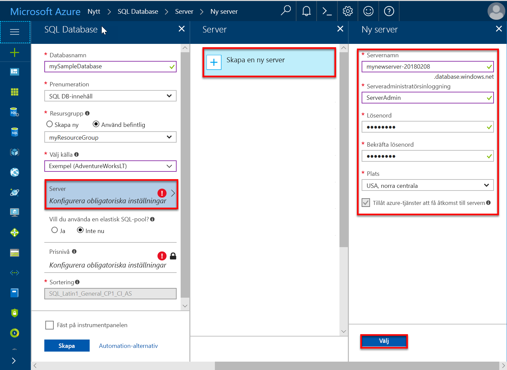
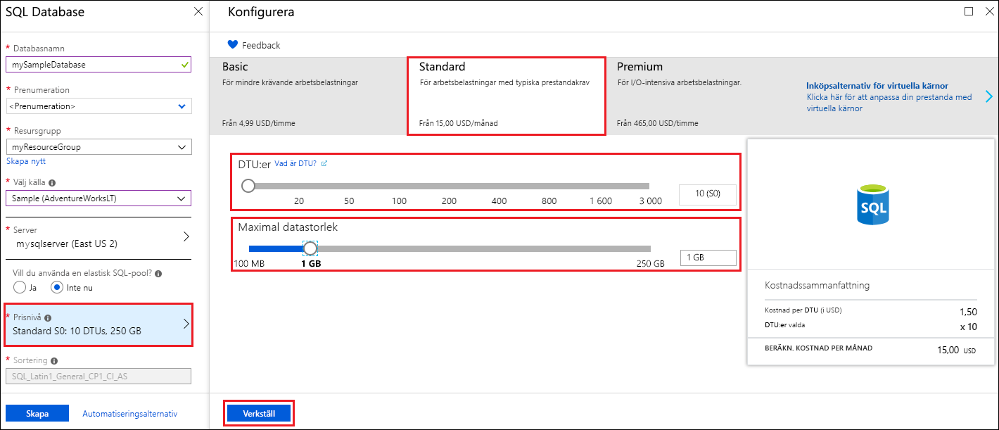
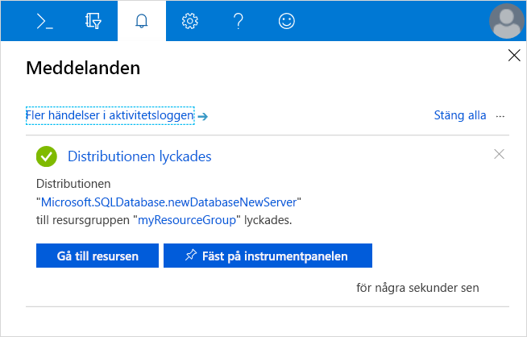
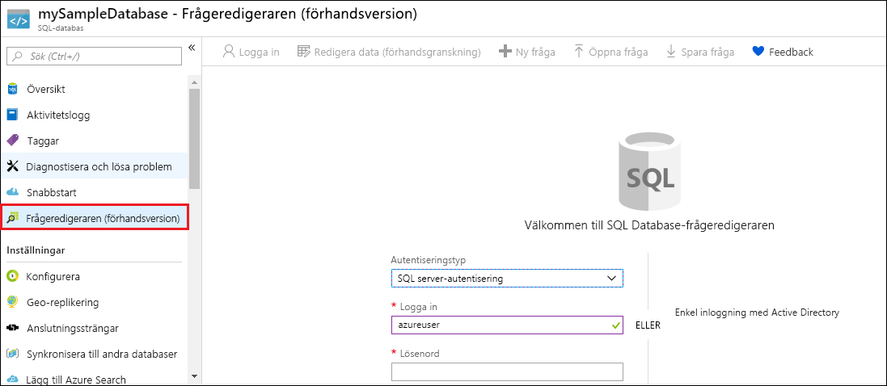
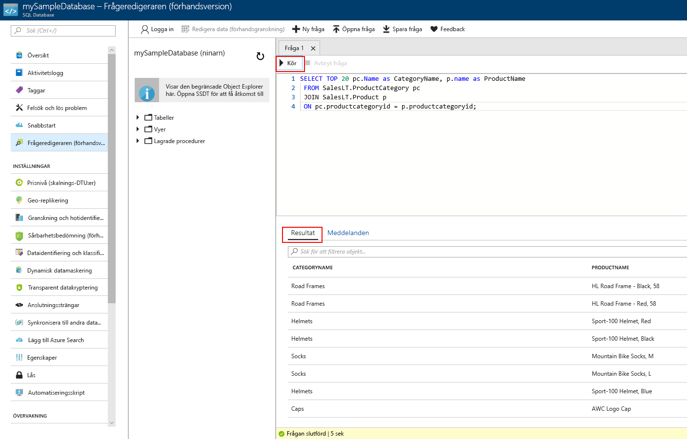

# <a name="quickstart-create-an-azure-sql-database-in-the-azure-portal"></a>Snabbstart: Skapa en Azure SQL-databas på Azure-portalen

Den här snabbstarten visar hur du skapar en SQL-databas i Azure med den [DTU-baserade inköpsmodellen](sql-database-service-tiers-dtu.md). Azure SQL Database är en ”databas som erbjuds som en tjänst”. Tjänsten innebär att du kan köra och skala SQL Server-databaser med hög tillgänglighet i molnet. Snabbstarten visar hur du kommer igång genom att skapa och sedan köra frågor mot en SQL-databas med Azure-portalen.

Om du inte har en Azure-prenumeration kan du skapa ett [kostnadsfritt](https://azure.microsoft.com/free/) konto innan du börjar.

  >[!NOTE]
  >I den här självstudiekursen används den DTU-baserade inköpsmodellen, men [den vCore-baserade inköpsmodellen](sql-database-service-tiers-vcore.md) är också tillgänglig.

## <a name="log-in-to-the-azure-portal"></a>Logga in på Azure-portalen

Logga in på [Azure-portalen](https://portal.azure.com/).

## <a name="create-a-sql-database"></a>Skapa en SQL-databas

Azure SQL-databasen skapas med en definierad uppsättning [beräknings-och lagringsresurser](sql-database-service-tiers-dtu.md). Databasen skapas i en [Azure-resursgrupp](../azure-resource-manager/resource-group-overview.md) och i en [logisk Azure SQL Database-server](sql-database-features.md).

Följ de här stegen om du vill skapa en SQL-databas som innehåller Adventure Works LT-exempeldata.

1. Klicka på **Skapa en resurs** längst upp till vänster i Azure Portal.

2. Välj **Databaser** på sidan **Nytt** och välj **Skapa** under **SQL Database** på sidan **Nytt**.

   

3. Fyll i följande information i SQL Database-formuläret (se föregående bild):   

   | Inställning       | Föreslaget värde | Beskrivning |
   | ------------ | ------------------ | ------------------------------------------------- |
   | **Databasnamn** | mySampleDatabase | För giltiga databasnamn, se [databasidentifierare](https://docs.microsoft.com/sql/relational-databases/databases/database-identifiers). |
   | **Prenumeration** | Din prenumeration  | Mer information om dina prenumerationer finns i [Prenumerationer](https://account.windowsazure.com/Subscriptions). |
   | **Resursgrupp**  | myResourceGroup | Giltiga resursgruppnamn finns i [Namngivningsregler och begränsningar](https://docs.microsoft.com/azure/architecture/best-practices/naming-conventions). |
   | **Välj källa** | Exempel: (AdventureWorksLT) | Läser in AdventureWorksLT-schemat och data i den nya databasen |

   > [!IMPORTANT]
   > Du måste välja exempeldatabasen i det här formuläret eftersom den används i resten av snabbstarten.
   >

4. Under **Server** klickar du på **Konfigurera nödvändiga inställningar** och fyller i formuläret SQL Server (logisk server) med följande information, som du ser i följande bild:   

   | Inställning       | Föreslaget värde | Beskrivning |
   | ------------ | ------------------ | ------------------------------------------------- |
   | **Servernamn** | Valfritt globalt unikt namn | Giltiga servernamn finns i [Namngivningsregler och begränsningar](https://docs.microsoft.com/azure/architecture/best-practices/naming-conventions). |
   | **Inloggning för serveradministratör** | Valfritt giltigt namn | För giltiga inloggningsnamn, se [Databasidentifierare](https://docs.microsoft.com/sql/relational-databases/databases/database-identifiers). |
   | **Lösenord** | Valfritt giltigt lösenord | Lösenordet måste innehålla minst 8 tecken och måste innehålla tecken från tre av följande kategorier: versaler, gemener, siffror och icke-alfanumeriska tecken. |
   | **Prenumeration** | Din prenumeration | Mer information om dina prenumerationer finns i [Prenumerationer](https://account.windowsazure.com/Subscriptions). |
   | **Resursgrupp** | myResourceGroup | Giltiga resursgruppnamn finns i [Namngivningsregler och begränsningar](https://docs.microsoft.com/azure/architecture/best-practices/naming-conventions). |
   | **Plats** | Valfri giltig plats | För information om regioner, se [Azure-regioner](https://azure.microsoft.com/regions/). |

   > [!IMPORTANT]
   > Det användarnamn och lösenord för serveradministration du anger här krävs för inloggning på servern och databaserna senare i den här snabbstarten. Kom ihåg eller skriv ned den här informationen så att du kan använda den senare.
   >  

   

5. När du har fyllt i formuläret klickar du på **Välj**.

6. Klicka på **Prisnivå** för att ange tjänstnivå, antalet DTU:er och mängden lagring. Undersök alternativen för mängden DTU:er och lagring som är tillgänglig på varje tjänstnivå.

   > [!IMPORTANT]
   > Mer än 1 TB lagringsutrymme på premiumnivån är för närvarande tillgängligt i alla regioner förutom följande: Storbritannien, norra, västra centrala USA, södra Storbritannien 2, Kina, östra, USDoDCentral, Tyskland, centrala, USDoDEast, sydvästra USA Gov, södra centrala USA Gov, Tyskland, nordöstra, Kina, norra, östra USA Gov. Det maximala lagringsutrymmet på Premium-nivån i andra regioner är begränsat till 1 TB. Se [sidan 11-15 i Aktuella begränsningar]( sql-database-dtu-resource-limits-single-databases.md#single-database-limitations-of-p11-and-p15-when-the-maximum-size-greater-than-1-tb).  

7. För den här snabbstarten väljer du tjänstnivån **Standard** och använder sedan skjutreglaget för att välja **10 DTU:er (S0)** och **1** GB lagring.

   

8. Godkänn förhandsgranskningsvillkoren för att använda alternativet **Lägg till mer lagringsutrymme**.

   > [!IMPORTANT]
   > Mer än 1 TB lagringsutrymme på premiumnivån är för närvarande tillgängligt i alla regioner förutom följande: USA, västra centrala; Kina, östra; USDoDCentral; USGov Iowa; Tyskland, centrala; USDoDEast; US Gov, sydvästra; Tyskland, nordöstra; Kina, norra. Det maximala lagringsutrymmet på Premium-nivån i andra regioner är begränsat till 1 TB. Se [sidan 11-15 i Aktuella begränsningar]( sql-database-dtu-resource-limits-single-databases.md#single-database-limitations-of-p11-and-p15-when-the-maximum-size-greater-than-1-tb).  

9. När du har valt tjänstenivå, antalet DTU:er och mängden lagring klickar du på **Apply** (Använd).  

10. Nu när du har fyllt i SQL Database-formuläret klickar du på **Skapa** så att databasen etableras. Etableringen tar några minuter.

11. Klicka på **Aviseringar** i verktygsfältet för att övervaka distributionsprocessen.

     

## <a name="query-the-sql-database"></a>Söka i SQL-databasen

Nu när du har skapat en exempeldatabas i Azure kan vi använda det inbyggda frågeverktyget på Azure Portal till att bekräfta att du kan ansluta till databasen och fråga efter data.

1. På SQL Database-sidan för din databas klickar du på **Frågeredigerare (förhandsversion)** i den vänstra menyn och sedan på **Logga in**.

   

2. Välj SQL Server-autentisering, ange den nödvändiga inloggningsinformationen och klicka sedan på **OK** för att logga in.

3. När du är autentiserad som **ServerAdmin** skriver du följande fråga i fönstret för frågeredigeraren.

   ```sql
   SELECT TOP 20 pc.Name as CategoryName, p.name as ProductName
   FROM SalesLT.ProductCategory pc
   JOIN SalesLT.Product p
   ON pc.productcategoryid = p.productcategoryid;
   ```

4. Klicka på **Kör** och granska frågeresultaten i fönstret **Resultat**.

   

5. Stäng sidan med **frågeredigeraren** och klicka på **OK** för att ta bort de ändringar som inte har sparats.

## <a name="clean-up-resources"></a>Rensa resurser

Spara de här resurserna om du vill gå till [nästa steg](#next-steps) och lära dig hur du ansluter och skickar frågor till din databas med ett antal olika metoder. Men om du vill ta bort resurserna du skapade i den här snabbstarten utför du följande steg.


1. På menyn till vänster i Azure Portal klickar du på **Resursgrupper** och sedan på **myResourceGroup**.
2. På sidan med resursgrupper klickar du på **Ta bort**, skriver **myResourceGroup** i textrutan och klickar sedan på **Ta bort**.

## <a name="next-steps"></a>Nästa steg

- Nu när du har en databas behöver du skapa en brandväggsregel på servernivå för att ansluta till den från dina lokala verktyg. Se [Skapa brandväggsregel på servernivå](sql-database-get-started-portal-firewall.md)
- Om du skapar en brandväggsregel på servernivå kan du [ansluta och köra frågor](sql-database-connect-query.md) med önskat verktyg och språk, inklusive
  - [Ansluta och köra frågor med hjälp av SQL Server Management Studio](sql-database-connect-query-ssms.md)
  - [Ansluta och köra frågor med hjälp av Azure Data Studio](https://docs.microsoft.com/sql/azure-data-studio/quickstart-sql-database?toc=/azure/sql-database/toc.json)
- Information om hur du skapar databaser med hjälp av Azure CLI finns i [Azure CLI-exempel](sql-database-cli-samples.md)
- Information om hur du skapar databaser med hjälp av Azure PowerShell finns i [Azure PowerShell-exempel](sql-database-powershell-samples.md)