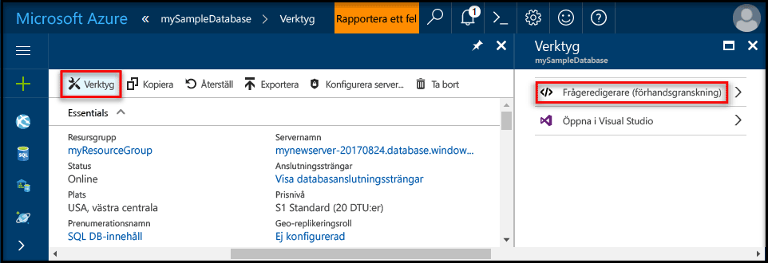
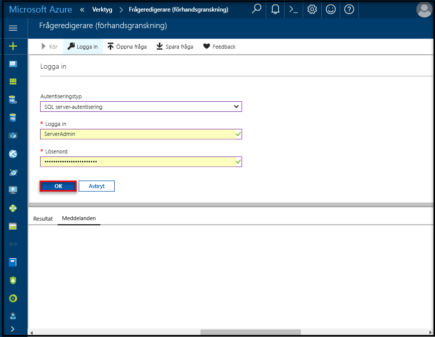

# <a name="create-an-azure-sql-database-in-the-azure-portal"></a>Skapa en Azure SQL-databas på Azure Portal

Den här snabbstarten visar hur du skapar en SQL-databas i Azure. Azure SQL Database är en ”databas som erbjuds som en tjänst”. Tjänsten innebär att du kan köra och skala SQL Server-databaser med hög tillgänglighet i molnet. Snabbstarten visar hur du kommer igång genom att skapa en SQL-databas med Azure Portal.

Om du inte har en Azure-prenumeration kan du skapa ett [kostnadsfritt](https://azure.microsoft.com/free/) konto innan du börjar.

## <a name="log-in-to-the-azure-portal"></a>Logga in på Azure Portal

Logga in på [Azure-portalen](https://portal.azure.com/).

## <a name="create-a-sql-database"></a>Skapa en SQL-databas

Azure SQL-databasen skapas med en definierad uppsättning [beräknings-och lagringsresurser](sql-database-service-tiers.md). Databasen skapas i en [Azure-resursgrupp](../azure-resource-manager/resource-group-overview.md) och i en [logisk Azure SQL Database-server](sql-database-features.md). 

Följ de här stegen om du vill skapa en SQL-databas som innehåller Adventure Works LT-exempeldata. 

1. Klicka på knappen **New** (Nytt) i det övre vänstra hörnet i Azure Portal.

2. Välj **Databaser** på sidan **Nytt** och välj **Skapa** under **SQL Database** på sidan **Nytt**.

   

3. Fyll i följande information i SQL Database-formuläret (se föregående bild):   

   | Inställning       | Föreslaget värde | Beskrivning | 
   | ------------ | ------------------ | ------------------------------------------------- | 
   | **Databasnamn** | mySampleDatabase | För giltiga databasnamn, se [databasidentifierare](https://docs.microsoft.com/sql/relational-databases/databases/database-identifiers). | 
   | **Prenumeration** | Din prenumeration  | Mer information om dina prenumerationer finns i [Prenumerationer](https://account.windowsazure.com/Subscriptions). |
   | **Resursgrupp**  | myResourceGroup | Giltiga resursgruppnamn finns i [Namngivningsregler och begränsningar](https://docs.microsoft.com/azure/architecture/best-practices/naming-conventions). |
   | **Källa källa** | Exempel: (AdventureWorksLT) | Läser in AdventureWorksLT-schemat och data i den nya databasen |

   > [!IMPORTANT]
   > Du måste välja exempeldatabasen i det här formuläret eftersom den används i resten av snabbstarten.
   > 

4. Under **Server** klickar du på **Konfigurera nödvändiga inställningar** och fyller i formuläret SQL Server (logisk server) med följande information, som du ser i följande bild:   

   | Inställning       | Föreslaget värde | Beskrivning | 
   | ------------ | ------------------ | ------------------------------------------------- | 
   | **Servernamn** | Valfritt globalt unikt namn | Giltiga servernamn finns i [Namngivningsregler och begränsningar](https://docs.microsoft.com/azure/architecture/best-practices/naming-conventions). | 
   | **Inloggning för serveradministratör** | Valfritt giltigt namn | För giltiga inloggningsnamn, se [Databasidentifierare](https://docs.microsoft.com/sql/relational-databases/databases/database-identifiers). |
   | **Lösenord** | Valfritt giltigt lösenord | Lösenordet måste innehålla minst 8 tecken och måste innehålla tecken från tre av följande kategorier: versaler, gemener, siffror och icke-alfanumeriska tecken. |
   | **Prenumeration** | Din prenumeration | Mer information om dina prenumerationer finns i [Prenumerationer](https://account.windowsazure.com/Subscriptions). |
   | **Resursgrupp** | myResourceGroup | Giltiga resursgruppnamn finns i [Namngivningsregler och begränsningar](https://docs.microsoft.com/azure/architecture/best-practices/naming-conventions). |
   | **Plats** | Valfri giltig plats | För information om regioner, se [Azure-regioner](https://azure.microsoft.com/regions/). |

   > [!IMPORTANT]
   > Det användarnamn och lösenord för serveradministration du anger här krävs för inloggning på servern och databaserna senare i den här snabbstarten. Kom ihåg eller skriv ned den här informationen så att du kan använda den senare. 
   >  

   

5. När du har fyllt i formuläret klickar du på **Välj**.

6. Klicka på **Prisnivå** för att ange tjänstnivå, antalet DTU:er och mängden lagring. Undersök alternativen för mängden DTU:er och lagring som är tillgänglig på varje tjänstnivå. 

   > [!IMPORTANT]
   > \*Lagringsstorlekar som är större än mängden lagringsutrymme som ingår finns i förhandsversionen, och extra kostnader tillkommer. Mer information finns i [Priser för SQL Database](https://azure.microsoft.com/pricing/details/sql-database/). 
   >
   >\*I Premium-nivån finns för närvarande mer än 1 TB lagringsutrymme i följande regioner: Östra USA 2, USA, västra, Virginia (USA-förvaltad region), Europa, västra, Centrala Tyskland, Sydostasien, Östra Japan, Australien, östra, Centrala Kanada och Östra Kanada. Se [sidan 11-15 i Aktuella begränsningar](sql-database-resource-limits.md#single-database-limitations-of-p11-and-p15-when-the-maximum-size-greater-than-1-tb).  
   > 

7. För den här snabbstartsguiden väljer du tjänstenivån **Standard** och använder sedan skjutreglaget för att välja **100 DTU:er (S3)** och **400** GB lagring.

   

8. Godkänn förhandsgranskningsvillkoren för att använda alternativet **Lägg till mer lagringsutrymme**. 

   > [!IMPORTANT]
   > \*Lagringsstorlekar som är större än mängden lagringsutrymme som ingår finns i förhandsversionen, och extra kostnader tillkommer. Mer information finns i [Priser för SQL Database](https://azure.microsoft.com/pricing/details/sql-database/). 
   >
   >\*I Premium-nivån finns för närvarande mer än 1 TB lagringsutrymme i följande regioner: Östra USA 2, USA, västra, Virginia (USA-förvaltad region), Europa, västra, Centrala Tyskland, Sydostasien, Östra Japan, Australien, östra, Centrala Kanada och Östra Kanada. Se [sidan 11-15 i Aktuella begränsningar](sql-database-resource-limits.md#single-database-limitations-of-p11-and-p15-when-the-maximum-size-greater-than-1-tb).  
   > 

9. När du har valt tjänstenivå, antalet DTU:er och mängden lagring klickar du på **Apply** (Använd).  

10. Nu när du har fyllt i SQL Database-formuläret klickar du på **Skapa** så att databasen etableras. Etableringen tar några minuter. 

11. Klicka på **Aviseringar** i verktygsfältet för att övervaka distributionsprocessen.
    
     

## <a name="create-a-server-level-firewall-rule"></a>Skapa en brandväggsregel på servernivå

SQL Database-tjänsten skapar en brandvägg på servernivå som hindrar externa program och verktyg från att ansluta till servern eller databaser på servern, såvida inte en brandväggsregel konfigureras som öppnar brandväggen för specifika IP-adresser. Följ de här stegen om du vill skapa en [brandväggsregel på SQL Database-servernivå](sql-database-firewall-configure.md) för din klients IP-adress och aktivera extern anslutning genom SQL Database-brandväggen endast för din IP-adress. 

> [!NOTE]
> SQL Database kommunicerar via port 1433. Om du försöker ansluta inifrån ett företagsnätverk, kan utgående trafik via port 1433 nekas av nätverkets brandvägg. I så fall kommer du inte att kunna ansluta till din Azure SQL Database-server om inte din IT-avdelning öppnar port 1433.
>

1. När distributionen är klar klickar du på **SQL-databaser** på menyn till vänster och klickar sedan på **mySampleDatabase** på sidan **SQL-databaser**. Översiktssidan för databasen öppnas, där du kan se det fullständigt kvalificerade servernamnet (som **mynewserver-20170824.database.windows.net**) och alternativ för ytterligare konfiguration. 

2. Kopiera det här fullständiga servernamnet för anslutning till servern och databaserna i efterföljande snabbstarter. 

    

3. Klicka på **Konfigurera serverns brandvägg** i verktygsfältet (se föregående bild). Sidan **Brandväggsinställningar** för SQL Database-servern öppnas. 

    

4. Klicka på **Lägg till klient-IP** i verktygsfältet och lägg till din aktuella IP-adress i en ny brandväggsregel. Med en brandväggsregel kan du öppna port 1433 för en enskild IP-adress eller för IP-adressintervall.

5. Klicka på **Spara**. En brandväggsregel på servernivå för att öppna port 1433 på den logiska servern skapas för din aktuella IP-adress.

6. Klicka på **OK** och stäng sedan sidan **Brandväggsinställningar**.

Nu kan du ansluta till SQL Server Database-servern och dess databaser med SQL Server Management Studio eller något annat verktyg från den här IP-adressen med det Server-administratörskonto som skapades tidigare.

> [!IMPORTANT]
> Som standard är åtkomst genom SQL Database-brandväggen aktiverad för alla Azure-tjänster. Klicka på **AV** på den här sidan om du vill inaktivera åtkomsten för alla Azure-tjänster.
>

## <a name="query-the-sql-database"></a>Söka i SQL-databasen

Nu när du har skapat en exempeldatabas i Azure kan vi använda det inbyggda frågeverktyget på Azure Portal till att bekräfta att du kan ansluta till databasen och fråga efter data. 

1. På SQL Database-sidan för din databas klickar du på **Verktyg** i verktygsfältet och sedan på **Frågeredigerare (förhandsgranskning)**.

    

2. Klicka i kryssrutan **Villkor för förhandsgranskning** och sedan på **OK**. Sidan Frågeredigerare öppnas.

3. Klicka på **Logga in**, läs inloggningsinformationen och klicka sedan på **OK** för att logga in med SQL Server-autentisering med inloggningen för serveradministratör och lösenordet du skapade tidigare.

    

4. Logga in genom att klicka på **OK**.

5. När du är autentiserad som **ServerAdmin** skriver du följande fråga i fönstret för frågeredigeraren.

   ```sql
   SELECT TOP 20 pc.Name as CategoryName, p.name as ProductName
   FROM SalesLT.ProductCategory pc
   JOIN SalesLT.Product p
   ON pc.productcategoryid = p.productcategoryid;
   ```

6. Klicka på **Kör** och granska frågeresultaten i fönstret **Resultat**.

   

7. Stäng **frågeredigerarsidan**, klicka på **OK** för att ta bort osparade redigeringar och stäng sedan sidan **Verktyg**.

## <a name="clean-up-resources"></a>Rensa resurser

Spara de här resurserna om du vill gå till [nästa steg](#next-steps) och lära dig hur du ansluter och skickar frågor till din databas med ett antal olika metoder. Men om du vill ta bort resurserna du skapade i den här snabbstarten utför du följande steg. 


1. På menyn till vänster i Azure Portal klickar du på **Resursgrupper** och sedan på **myResourceGroup**. 
2. På sidan med resursgrupper klickar du på **Ta bort**, skriver **myResourceGroup** i textrutan och klickar sedan på **Ta bort**.

## <a name="next-steps"></a>Nästa steg

Nu när du har en databas kan du ansluta och söka med dina favoritverktyg. Lär dig mer genom att välja verktyg nedan:

- [SQL Server Management Studio](sql-database-connect-query-ssms.md)
- [Visual Studio Code](sql-database-connect-query-vscode.md)
- [NET](sql-database-connect-query-dotnet.md)
- [PHP](sql-database-connect-query-php.md)
- [Node.js](sql-database-connect-query-nodejs.md)
- [Java](sql-database-connect-query-java.md)
- [Python](sql-database-connect-query-python.md)
- [Ruby](sql-database-connect-query-ruby.md)
