# SQL Database-självstudier: Skapa en SQL-databas på bara några minuter med hjälp av Azure Portal
> [!div class="op_single_selector"]
> * [Azure-portalen](sql-database-get-started.md)
> * [C#](sql-database-get-started-csharp.md)
> * [PowerShell](sql-database-get-started-powershell.md)
> 
> 

I de här självstudierna kommer du att lära dig hur man använder Azure-portalen för att:

* Skapa en Azure SQL Database med exempeldata.
* Skapa en brandväggsregel på servernivå för en enskild IP-adress eller för IP-adressintervall.

Du kan utföra samma åtgärder, antingen med [C#](sql-database-get-started-csharp.md) eller [PowerShell](sql-database-get-started-powershell.md).

[!INCLUDE [Login](../../includes/azure-getting-started-portal-login.md)]

## Skapa din första Azure SQL Database
1. Om du inte är ansluten ansluter du till [Azure Portal](http://portal.azure.com).
2. Klicka på **Ny**, klicka på **Data + lagring**, och leta sedan upp **SQL Database**.
   
    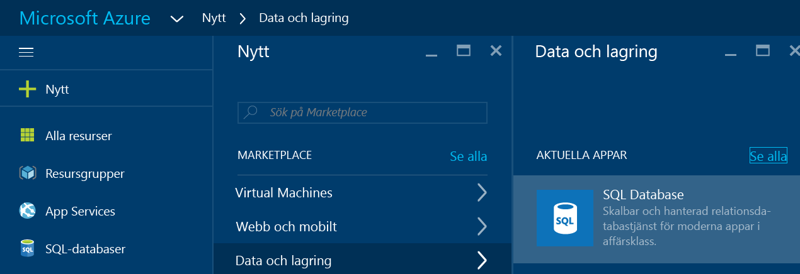
3. Klicka på **SQL Database** för att öppna bladet SQL Database. Innehållet på det här bladet varierar beroende på antalet prenumerationer och befintliga objekt (till exempel befintliga servrar).
   
    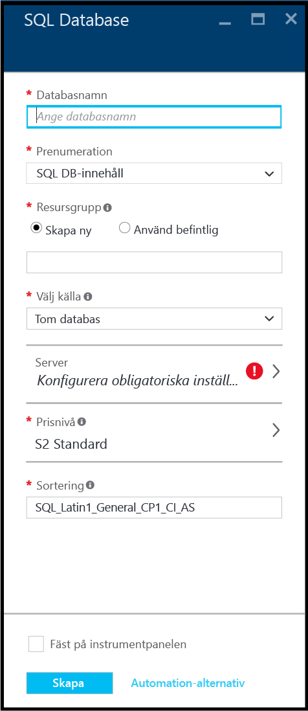
4. Ange ett namn för din första databas, till exempel "min databas", i textrutan **Databasnamn**. En grön kryssmarkering visar att du har angett ett giltigt namn.
   
    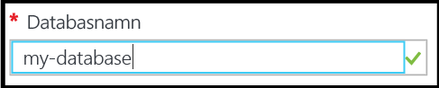
5. Välj en prenumeration om du har flera.
6. Klicka på **Skapa nytt** under **Resursgrupp** och ange ett namn för din första resursgrupp – till exempel "min-resurs-grupp". En grön kryssmarkering visar att du har angett ett giltigt namn.
   
    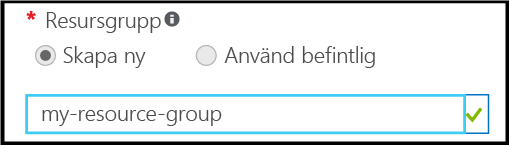
7. Klicka på **Exempel** under **Välj källa**, och sedan på **AdventureWorksLT [V12]** under **Välj exempel**.
   
    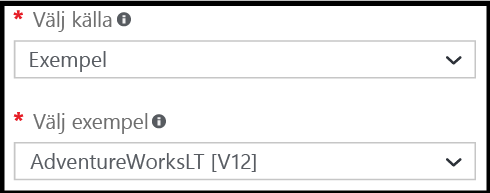
8. Klicka på **Konfigurera nödvändiga inställningar** under **Server**.
   
    
9. Klicka **Skapa en ny server** på bladet Server. En Azure SQL Database skapas inom ett serverobjekt som kan vara antingen en ny eller en befintlig server.
   
    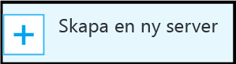
10. Granska bladet **Ny server** för att förstå informationen du behöver ange för den nya servern.
    
    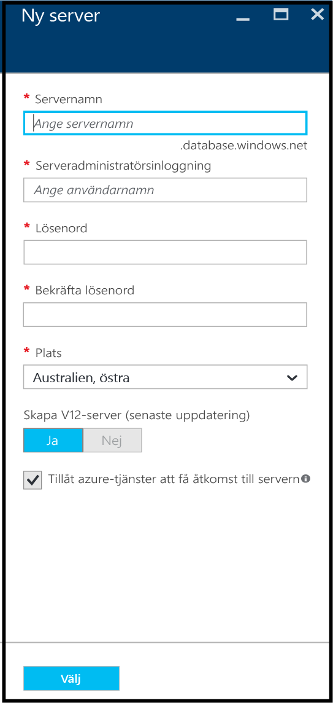
11. Ange ett namn för din första server – till exempel "mitt- nya-serverobjekt".i textrutan **Servernamn**. En grön kryssmarkering visar att du har angett ett giltigt namn.
    
    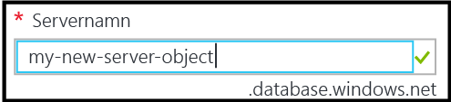
12. Ange ett användarnamn för administratörinloggning för denna server – till exempel "mitt-adminkonto" under **Inloggning för serveradministratör**. Den här inloggningen kallas den primära server-inloggningen. En grön kryssmarkering visar att du har angett ett giltigt namn.
    
    
13. Ange ett lösenord för serverns huvudsakliga inloggningskonto, till exempel "p@ssw0rd1" under **Lösenord** och **Bekräfta lösenord**. En grön kryssmarkering visar att du har angett ett giltigt lösenord.
    
    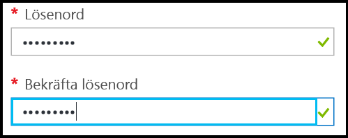
14. Välj ett datacenter som är lämpligt för din plats – till exempel "Australien, östra" under **Plats**.
    
    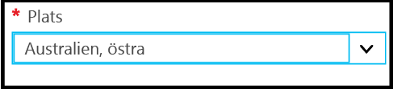
15. Observera att du bara har möjlighet att skapa en aktuell version av Azure SQL server under ** Skapa V12-server (Senaste uppdatering).
    
    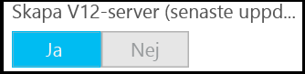
16. Observera att som standard är kryssrutan för **Ge Azure-tjänster åtkomst till server** vald och kan inte ändras här. Det här är ett avancerat alternativ. Du kan ändra inställningen i inställningarna för serverbrandväggen för det här serverobjektet, även om det i de flesta fall inte behövs.
    
    
17. Gå igenom dina val på bladet för den nya servern och klicka sedan på **Välj** för att välja den här nya servern för den nya databasen.
    
    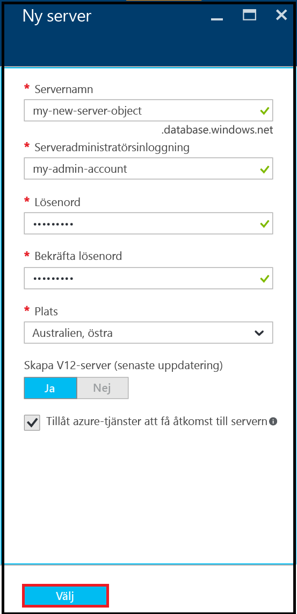
18. Klicka på **S2 Standard** under **Prisnivå** på bladet SQL Database och klicka sedan på **Basic** för att välja den billigaste prisnivån för din första databas. Du kan alltid ändra prisnivån senare.
    
    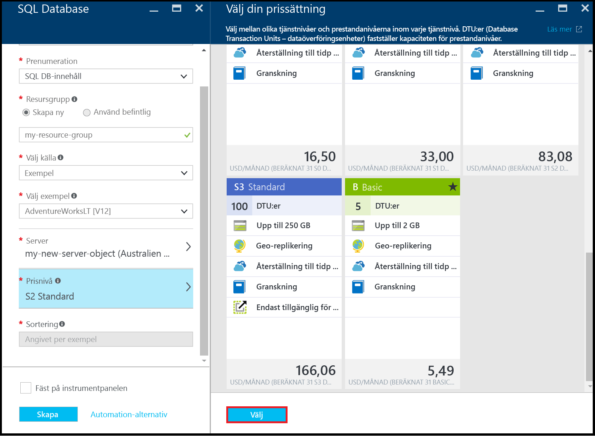
19. Granska dina val på bladet SQL Database och klicka sedan **Skapa** för att skapa din första server och databas. De värden som du har angett verifieras och distributionen startar.
    
    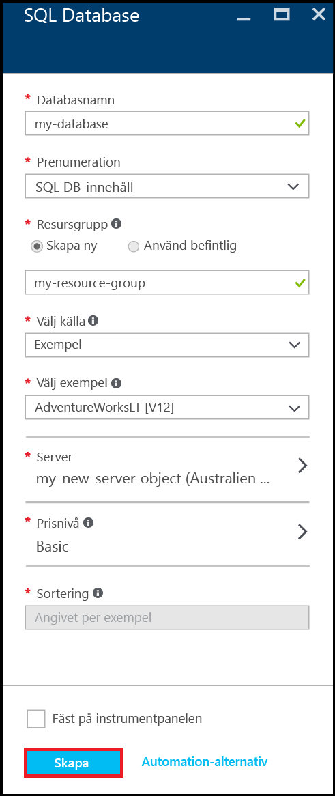
20. Klicka på objekten **Meddelanden** i portalens verktygsfält för att kontrollera distributionens status.
    
    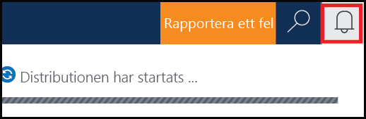

> [!IMPORTANT]
> När distributionen har slutförts skapas din nya Azure SQL-server och databas i Azure. Du kommer inte att kunna ansluta till den nya servern eller databasen med hjälp av SQL Server-verktyg förrän du skapar en serverbrandväggsregel för att öppna SQL Database-brandväggen för anslutningar utanför Azure.
> 
> 

[!INCLUDE [Create server firewall rule](../../includes/sql-database-create-new-server-firewall-portal.md)]

## Nästa steg
Nu när du har slutfört de här SQL Database-självstudierna och skapat en databas med lite exempeldata, är du redo att börja använda dina favoritverktyg.

* Om du är bekant med Transact-SQL och SQL Server Management Studio (SSMS), lär du dig hur man [Ansluter och frågar en SQL-databas med SSMS](sql-database-connect-query-ssms.md).
* Om du kan Excel, lär du dig hur man [Ansluter till en SQL Database i Azure med Excel](sql-database-connect-excel.md).
* Om du är redo att börja koda, väljer du programmeringsspråk på [Anslutningsbibliotek för SQL Database och SQL Server](sql-database-libraries.md).
* Om du vill flytta dina lokala SQL Server-databaser till Azure, se [Migrera en databas till SQL Database](sql-database-cloud-migrate.md) för mer information.
* Om du vill läsa in data i en ny tabell från en CSV-fil med kommandoradsverktyget BCP, se [Läs in data i SQL Database från en CSV-fil med BCP](sql-database-load-from-csv-with-bcp.md).
* Om du vill börja utforska Azure SQL Database-säkerhet se [Komma igång med säkerhet](sql-database-get-started-security.md)

## Ytterligare resurser
[Vad är SQL Database?](sql-database-technical-overview.md)

<!---HONumber=sep12_HO2-->

