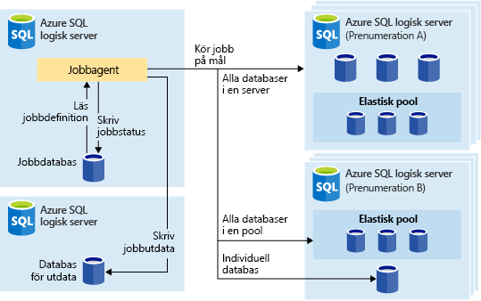
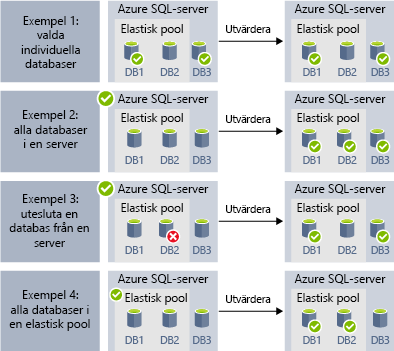
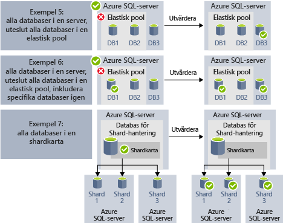

# <a name="automate-management-tasks-using-database-jobs"></a>Automatisera hanteringsuppgifter med hjälp av databasjobb

Med Azure SQL Database kan du skapa och schemalägga jobb som kan köras periodiskt mot en eller flera databaser för att köra T-SQL-frågor och utföra underhållsuppgifter. Alla jobb loggar status för körning och försöker automatiskt utföra åtgärderna på nytt om det uppstår fel.
Du kan definiera måldatabas eller grupper med Azure SQL-databaser där jobbet ska köras och även definiera scheman för att köra ett jobb.
Ett jobb hanterar uppgiften att logga in på måldatabasen. Du definierar, underhåller och bevarar även Transact-SQL-skript som ska köras över en grupp Azure SQL-databaser.

## <a name="when-to-use-automated-jobs"></a>När du ska använda automatiska jobb

Det finns flera scenarier när du kan använda jobbautomatisering:

- Automatisera hanteringsuppgifter och schemalägga dem sedan att köras varje veckodag, efter kontorstid osv.
  - Distribuera schemaändringar, hantering av autentiseringsuppgifter, insamling av prestandadata eller insamling av telemetri för klientorganisation (kund).
  - Uppdatera referensdata (information som är gemensam över alla databaser), läsa in data från Azure Blob-lagring.
  - Bygg om index för att förbättra frågeprestandan. Konfigurera jobb att köras över en samling databaser regelbundet, till exempel vid tidpunkter för låg belastning.
  - Samla in frågeresultat från en uppsättning databaser till en central tabell regelbundet. Prestandafrågor kan kontinuerligt köras och konfigureras för att utlösa ytterligare åtgärder som ska utföras.
- Samla in data för rapportering
  - Sammanställ data från en samling Azure SQL-databaser till en enkel måltabell.
  - Kör databearbetningsfrågor med längre körningstid över en stor uppsättning databaser, till exempel insamling av kundtelemetri. Resultaten samlas till en enskild måltabell för ytterligare analys.
- Dataflyttar
  - Skapa jobb som replikerar ändringar som görs i dina databaser till andra databaser eller samla in uppdateringar som görs i fjärrdatabaser och tillämpa ändringar i databasen.
  - Skapa jobb som läser in data från eller till databaser med hjälp av SQL Server Integration Services (SSIS).

## <a name="overview"></a>Översikt

Följande tekniker för jobbschemaläggning är tillgängliga i Azure SQL Database:

- **SQL Agent-jobb** är en klassisk och beprövad komponent för SQL Server-jobbschemaläggning som är tillgänglig i hanterad instans. SQL Agent-jobb är inte tillgängliga i enkla databaser.
- **Elastic Database-jobb** är en tjänst för jobbschemaläggning som kör anpassade jobb på en eller flera Azure SQL-databaser.

Det finns vissa skillnader mellan SQL Agent (tillgängligt lokalt och som en del av SQL Database Managed Instance) och Database Elastic-jobbagenten (tillgänglig för enkla databaser i Azure SQL-databaser och databaser i SQL Data Warehouse).

|  |Elastiska jobb  |SQL Agent |
|---------|---------|---------|
|Scope     |  Vilket antal som helst av Azure SQL-databaser och/eller informationslagerdatabaser i samma Azure-moln som jobbagenten. Målen kan finnas på olika SQL Database-servrar, prenumerationer och/eller regioner. <br><br>Målgrupper kan bestå av enskilda databaser eller informationslagerdatabaser, eller alla databaser i en server, pool eller shardkarta (dynamiskt uppräknade vid jobbkörningen). | Valfri enskild databas i samma SQL Server-instans som SQL-agenten. |
|API:er och verktyg som stöds     |  Portal, PowerShell, T-SQL, Azure Resource Manager      |   T-SQL, SQL Server Management Studio (SSMS)     |

## <a name="sql-agent-jobs"></a>SQL Agent-jobb

SQL Agent-jobb är angivna serier med T-SQL-skript mot din databas. Använd jobb för att definiera en administrativ uppgift som kan köras en eller flera gånger och övervakas lyckad eller misslyckad status.
Ett jobb kan köras på en lokal server eller på flera fjärrservrar. SQL Agent-jobb är en intern databasmotorkomponent som körs i tjänsten för hanterad instans.
Det finns flera viktiga begrepp vad gäller SQL Agent-jobb:

- **Jobbsteg** är en uppsättning med ett eller flera steg som ska köras i jobbet. För varje jobbsteg kan du definiera strategi för återförsök och vilken åtgärd som ska vidtas om jobbsteget lyckas eller misslyckas.
- **Scheman** definierar när jobbet ska köras.
- **Meddelanden** gör att du kan definiera regler som används för att meddela operatörer via e-post när jobbet är klart.

### <a name="job-steps"></a>Jobbsteg

SQL Agent-jobbsteg är sekvenser med åtgärder som SQL Agent ska köra. Varje steg har följande steg som ska köras om steget lyckas eller misslyckas, antalet återförsök i fall av fel.
Med SQL Agent kan du skapa olika typer av jobbsteg, till exempel Transact-SQL-jobbsteg som kör en enda Transact-SQL-batch mot databasen, eller OS-kommando-/PowerShell-steg som kan köra anpassade OS-skript, SSIS-jobbsteg som du kan använda till att läsas in data med hjälp av SSIS-körningen eller [replikeringssteg](sql-database-managed-instance-transactional-replication.md) som kan publicera ändringar från din databas till andra databaser.

[Transaktionsreplikering](sql-database-managed-instance-transactional-replication.md) är en databasmotorfunktion som gör att du kan publicera ändringar som görs i en eller flera tabeller i en databas och publicera/distribuera dem till en uppsättning prenumerantdatabaser. Publicering av ändringarna implementeras med hjälp av följande typer av SQL Agent-jobbsteg:

- Transaktionsloggläsare.
- Ögonblicksbild.
- Distributör.

Andra typer av jobbsteg stöds för närvarande inte, däribland:

- Jobbsteg för sammanslagen replikering stöds inte.
- Köläsare stöds inte.
- Analysis Services stöds inte

### <a name="job-schedules"></a>Jobbscheman

Ett schema anger när ett jobb körs. Fler än ett jobb kan köras på samma schema, och fler än ett schema kan tillämpas på samma jobb.
Ett schema kan definiera följande villkor för den tid då ett jobb körs:

- När instansen startas om (eller när SQL Server Agent startas). Jobbet aktiveras efter varje redundans.
- En gång vid ett specifikt datum och en specifik tid, vilket är användbart för fördröjd körning av ett jobb.
- Enligt ett återkommande schema.

> [!Note]
> Hanterad instans kan för närvarande inte användas till att starta ett jobb när instansen är ”inaktiv”.

### <a name="job-notifications"></a>Jobbmeddelanden

Med SQL Agent-jobb kan du få meddelanden när jobbet är klart eller misslyckas. Du kan få meddelanden via e-post.

Först behöver du konfigurera det e-postkonto som ska användas för att skicka e-postmeddelanden och tilldela kontot till den e-postprofil som kallas `AzureManagedInstance_dbmail_profile`, enligt följande exempel:

```sql
-- Create a Database Mail account
EXECUTE msdb.dbo.sysmail_add_account_sp
    @account_name = 'SQL Agent Account',
    @description = 'Mail account for Azure SQL Managed Instance SQL Agent system.',
    @email_address = '$(loginEmail)',
    @display_name = 'SQL Agent Account',
    @mailserver_name = '$(mailserver)' ,
    @username = '$(loginEmail)' ,  
    @password = '$(password)' 

-- Create a Database Mail profile
EXECUTE msdb.dbo.sysmail_add_profile_sp
    @profile_name = 'AzureManagedInstance_dbmail_profile',
    @description = 'E-mail profile used for messages sent by Managed Instance SQL Agent.' ;

-- Add the account to the profile
EXECUTE msdb.dbo.sysmail_add_profileaccount_sp
    @profile_name = 'AzureManagedInstance_dbmail_profile',
    @account_name = 'SQL Agent Account',
    @sequence_number = 1;
```

Du kan även behöva aktivera Database Mail i hanterad instans:

```sql
GO
EXEC sp_configure 'show advanced options', 1;  
GO  
RECONFIGURE;  
GO  
EXEC sp_configure 'Database Mail XPs', 1;  
GO  
RECONFIGURE 
```

Du kan meddela operatören att något har hänt med dina SQL Agent-jobb. En operatör definierar kontaktinformation för en enskild ansvarig för underhåll av en eller flera hanterade instanser. Ibland tilldelas en enskild person operatörsansvar.
I system med flera hanterade instanser eller SQL-servrar kan många personer dela operatörsansvar. En operatör innehåller ingen säkerhetsinformation och definierar inte ett säkerhetsobjekt.

Du kan skapa operatörer med hjälp av SSMS eller Transact-SQL-skript såsom det visas i följande exempel:

```sql
EXEC msdb.dbo.sp_add_operator 
    @name=N'Mihajlo Pupun', 
        @enabled=1, 
        @email_address=N'mihajlo.pupin@contoso.com'
```

Du kan ändra jobb och tilldela en operatör som meddelas via e-post om jobbet är klart, misslyckas eller lyckas med hjälp av SSMS eller följande Transact-SQL-skript:

```sql
EXEC msdb.dbo.sp_update_job @job_name=N'Load data using SSIS', 
        @notify_level_email=3,                        -- Options are: 1 on succeed, 2 on failure, 3 on complete
        @notify_email_operator_name=N'Mihajlo Pupun'
```

### <a name="sql-agent-job-limitations"></a>Begränsningar för SQL Agent-jobb

Vissa av de SQL Agent-funktioner som är tillgängliga i SQL Server stöds inte i hanterad instans:
- Inställningar för SQL Agent är skrivskyddade. Proceduren `sp_set_agent_properties` stöds inte i hanterad instans.
- Aktivering/inaktivering av Agent stöds för närvarande inte i hanterad instans. SQL Agent körs alltid.
- Meddelanden stöds delvis
  - Personsökare stöds inte.
  - NetSend stöds inte.
  - Aviseringar stöds ännu inte.
- Proxyservrar stöds inte.
- EventLog stöds inte.

Information om SQL Server Agent finns i [SQL Server Agent](https://docs.microsoft.com/sql/ssms/agent/sql-server-agent).

## <a name="elastic-database-jobs"></a>Elastic Database-jobb

**Elastic Database-jobb** ger möjligheten att köra ett eller flera T-SQL-skript parallellt, över ett stort antal databaser enligt ett schema eller på begäran.

**Köra jobb mot en valfri kombination av databaser**: en eller flera enskilda databaser, alla databaser på en server, alla databaser i en elastisk pool eller en shardkarta med den ytterligare flexibiliteten att inkludera eller exkludera en viss databas. **Jobb kan köras över flera servrar och flera pooler och kan även köras mot databaser i olika prenumerationer.** Servrar och pooler räknas upp dynamiskt vid körning. Därför körs jobben mot alla databaser som finns i målgruppen vid tidpunkten för körningen.

Följande bild visar en jobbagent som kör flera jobb över olika typer av målgrupper:



### <a name="elastic-job-components"></a>Elastiska jobbkomponenter

|Komponent  | Beskrivning (mer information finns nedanför tabellen) |
|---------|---------|
|[**Elastisk jobbagent**](#elastic-job-agent) |  Den Azure-resurs som du skapar för att köra och hantera jobb.   |
|[**Jobbdatabas**](#job-database)    |    En Azure SQL-databas som jobbagenten använder för att lagra jobbrelaterade data, jobbdefinitioner osv.      |
|[**Målgrupp**](#target-group)      |  Den uppsättning servrar, pooler, databaser och shardkartor som ett jobb ska köras mot.       |
|[**Jobb**](#job)  |  Ett jobb är en arbetsprocess som består av ett eller flera [jobbsteg](#job-step). Jobbsteg anger vilket T-SQL-skript som ska köras samt annan information som krävs för att köra skriptet.  |


#### <a name="elastic-job-agent"></a>Elastisk jobbagent

En agent för elastiska jobb är Azure-resursen för att skapa, köra och hantera jobb. Den elastiska jobbagenten är en Azure-resurs som du skapar i portalen ([PowerShell](elastic-jobs-powershell.md) och REST stöds också). 

För att skapa en **elastisk jobbagent** krävs en befintlig SQL-databas. Agenten konfigurerar den här befintliga databasen som [*jobbdatabasen*](#job-database).

Det är kostnadsfritt att skapa en elastisk jobbagent. Jobbdatabasen debiteras samma kostnad som övriga SQL-databaser.

#### <a name="job-database"></a>Jobbdatabas

*Jobbdatabasen* används för att definiera jobb och spåra status och historik för jobbkörningar. *Jobbdatabasen* används också för att lagra agentmetadata, loggar, resultat och jobbdefinitioner och innehåller även många användbara lagrade procedurer och andra databasobjekt för att skapa, köra och hantera jobb med hjälp av T-SQL.

För den aktuella förhandsversionen krävs en befintlig Azure SQL-databas (S0 eller senare) för att skapa en elastisk jobbagent.

*Jobbdatabasen* behöver inte bokstavligt talat vara ny, men den ska vara ren och tom och på S0 eller en högre tjänstnivå. Den rekommenderade tjänstnivån för *jobbdatabasen* är S1 eller högre, men i praktiken beror det på prestandabehoven för dina jobb: antal jobbsteg samt hur många gånger och hur ofta jobb körs. Till exempel kan en S0-databas vara tillräcklig för en jobbagent som kör några jobb per timme, men om det körs ett jobb varje minut kan prestandan bli för låg. I det fallet vore det förmodligen bättre att ha en högre tjänstnivå.


##### <a name="job-database-permissions"></a>Behörigheter för jobbdatabas

När en jobbagent skapas så skapas ett schema, tabeller och en roll som heter *jobs_reader* i *jobbdatabasen*. Rollen skapas med följande behörigheter och är utformad för att ge administratörer mer detaljerad åtkomstkontroll för jobbövervakning:


|Rollnamn  |'jobs'-schemabehörigheter  |'jobs_internal'-schemabehörigheter  |
|---------|---------|---------|
|**jobs_reader**     |    VÄLJ     |    Inget     |

> [!IMPORTANT]
> Tänk på säkerhetsaspekterna innan du beviljar åtkomst till *jobbdatabasen* som en databasadministratör. En användare som vill vålla skada och får behörigheter att skapa eller redigera jobb skulle kunna skapa eller redigera ett jobb som använder lagrade autentiseringsuppgifter för att ansluta till en databas som står under en sådan användares kontroll. Användaren skulle då kunna ta reda på lösenordet i autentiseringsuppgifterna.


#### <a name="target-group"></a>Målgrupp

En *målgrupp* definierar den uppsättning databaser som ett jobbsteg ska köras mot. En målgrupp kan innehålla vilket antal och vilken kombination som helst av följande:

- **SQL Database-server** – om en server anges utgör alla databaser som finns i servern vid tidpunkten för jobbkörningen en del av gruppen. Huvuddatabasens autentiseringsuppgifter måste anges så att gruppen kan räknas upp och uppdateras före jobbkörning.
- **Elastisk pool** – om en elastisk pool anges utgör alla databaser som finns i den elastiska poolen vid tidpunkten för jobbkörningen en del av gruppen. Vad gäller en server måste huvuddatabasens autentiseringsuppgifter anges så att gruppen kan uppdateras före jobbkörningen.
- **Enskild databas** – ange en eller flera enskilda databaser som ska utgöra en del av gruppen.
- **Shardkarta** – databaser för en shardkarta.

> [!TIP]
> Vid tidpunkten för jobbkörning omvärderar *dynamisk uppräkning* uppsättningen databaser i de målgrupper som inkluderar servrar eller pooler. Dynamisk uppräkning ser till att **jobb körs över alla databaser som finns i servern eller poolen vid tidpunkten för jobbkörningen**. Omvärdering av lista över databaser vid körning är särskilt användbart för scenarier där pool- eller servermedlemskap ändras ofta.

Pooler och enskilda databaser kan anges som inkluderade eller exkluderade från gruppen. På så sätt går det att skapa en målgrupp med valfri kombination av databaser. Till exempel kan du lägga till en server till en målgrupp men exkludera specifika databaser i den elastiska poolen (eller exkludera en hel elastisk pool).

En målgrupp kan inkludera databaser i flera prenumerationer och över flera regioner. Observera att körningar mellan regioner har en högre fördröjning än körningar inom samma region.

Följande exempel visar hur olika målgruppsdefinitioner räknas upp dynamiskt när ett jobb körs för att fastställa vilka databaser jobbet ska köra:



**Exempel 1** illustrerar en målgrupp som består av en lista med enskilda databaser. När ett jobbsteg körs med den här målgruppen körs åtgärden i jobbsteget i var och en av dessa databaser.<br>
**Exempel 2** illustrerar en målgrupp som innehåller en Azure SQL-server som mål. När ett jobbsteg körs med den här målgruppen räknas servern upp dynamiskt för att fastställa vilken listan med databaser som för närvarande finns på servern. Åtgärden i jobbsteget körs i var och en av dessa databaser.<br>
**Exempel 3** illustrerar en målgrupp liknande den i *exempel 2*, men en databas undantas uttryckligen. Åtgärden i jobbsteget körs *inte* i den undantagna databasen.<br>
**Exempel 4** illustrerar en målgrupp som innehåller en elastisk pool som mål. Precis som i *exempel 2* räknas poolen upp dynamiskt när jobbet körs för att fastställa listan med databaser i poolen.
<br><br>




**Exempel 5** och **exempel 6** illustrerar avancerade scenarier där Azure SQL-servrar, elastiska pooler och databaser kan kombineras med hjälp av inkluderings- och exkluderingsregler.<br>
**Exempel 7** illustrerar hur shards (fragment) i en shard-karta även kan utvärderas när ett jobb körs.

#### <a name="job"></a>Jobb

Ett *jobb* är en arbetsprocess som körs enligt ett schema eller som ett engångsjobb. Jobb består att ett eller flera *jobbsteg*.

##### <a name="job-step"></a>Jobbsteg

Varje jobbsteg anger ett T-QSL-skript som ska köras, en eller flera målgrupper som T-SQL-skriptet ska köras mot samt de autentiseringsuppgifter som jobbagenten behöver för att ansluta till måldatabasen. Varje jobbsteg har anpassade principer för tidsgränser och försök på nytt, och kan valfritt ange utdataparametrar.

#### <a name="job-output"></a>Jobbutdata

Resultatet av stegen i ett jobb på varje måldatabas registreras i detalj, och skriptutdata kan samlas in i en specifik tabell. Du kan ange en databas för att spara alla data som returneras från ett jobb.

#### <a name="job-history"></a>Jobbhistorik

Jobbkörningshistorik sparas i *jobbdatabasen*. Ett systemrensningsjobb rensar körningshistorik som är äldre än 45 dagar. Om du vill ta bort historik som är äldre än 45 dagar anropar du den lagrade proceduren **sp_purge_history** i *jobbdatabasen*.

### <a name="agent-performance-capacity-and-limitations"></a>Agentprestanda, kapacitet och begränsningar

Elastiska jobb använder minimalt med beräkningsresurser medan de väntar på att jobb med lång körningstid blir klara.

Beroende på storleken på målgruppen med databaser och önskad körningstid för ett jobb (antalet samtidiga arbetare) kräver agenten olika mängder beräkningsresurser och prestanda från *jobbdatabasen* (ju fler mål och ju högre antal jobb, desto större beräkningsresurser krävs det).

För tillfället är förhandsgranskningen begränsad till 100 samtidiga jobb.

#### <a name="prevent-jobs-from-reducing-target-database-performance"></a>Förhindra jobb från att minska måldatabasens prestanda

För att resurser inte ska överbelastas vid körning av jobb mot databaser i en elastisk SQL-pool kan jobb konfigureras för att begränsa antalet databaser som ett jobb kan köras mot samtidigt.

## <a name="next-steps"></a>Nästa steg

- [Vad är SQL Server Agent](https://docs.microsoft.com/sql/ssms/agent/sql-server-agent) 
- [Så skapar du och hanterar elastiska jobb](elastic-jobs-overview.md) 
- [Skapa och hantera elastiska jobb med PowerShell](elastic-jobs-powershell.md) 
- [Skapa och hantera elastiska jobb med Transact-SQL (T-SQL)](elastic-jobs-tsql.md) 
