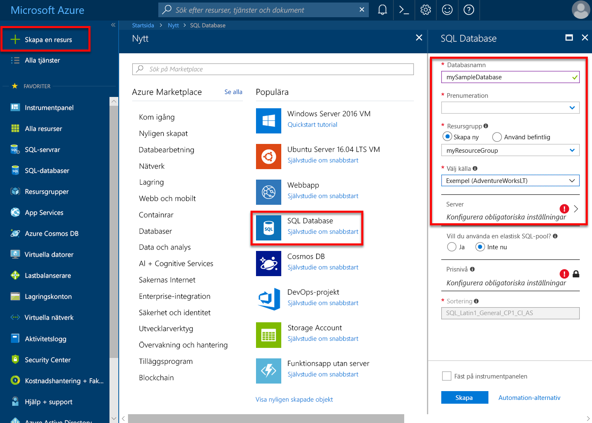

# Azure SQL Database logiska servrar och deras hantering

## Vad är en logisk Azure SQL-server

En logisk server som fungerar som en central administrativ plats för flera enskilt eller [med](sql-database-elastic-pool.md) databaser, [inloggningar](sql-database-manage-logins.md), [brandväggsregler](sql-database-firewall-configure.md), [granskning regler](sql-database-auditing.md), [hot principer](sql-database-threat-detection.md), och [redundansgrupper](sql-database-auto-failover-group.md) en logisk server kan finnas i en annan region än dess resursgrupp. Den logiska servern måste finnas innan du kan skapa Azure SQL-databasen. Alla databaser på en server skapas inom samma region som den logiska servern.

En logisk server är en logisk konstruktion som skiljer sig från en SQL Server-instans som du kanske är bekant med lokala över hela världen. Mer specifikt ger SQL Database-tjänsten inga garantier avseende platsen för databaserna i förhållande till deras logiska servrar och exponerar inga funktioner eller åtkomst på instansnivå. En server i en SQL Database Managed Instance är däremot liknar en SQL Server-instans som du kanske är bekant med lokala över hela världen.

När du skapar en logisk server kan ange du en server-konto för inloggning och lösenord som har administratörsbehörighet till master-databasen på den servern och alla databaser som har skapats på den servern. Det här första kontot är ett konto för SQL-inloggning. Azure SQL Database stöder SQL-autentisering och Azure Active Directory-autentisering för autentisering. Information om inloggningar och autentisering finns i [hantera databaser och inloggningar i Azure SQL Database](sql-database-manage-logins.md). Windows-autentisering stöds inte.

En logisk Azure Database-server:

- Skapas i en Azure-prenumeration, men kan flyttas till en annan prenumeration tillsammans med de resurser som den innehåller.
- Är den överordnade resursen för databaser, elastiska pooler och informationslager.
- Tillhandahåller ett namnområde för databaser, elastiska pooler och informationslager
- Är en logisk behållare med stark livslängdssemantik – ta bort en server och tar bort den inneslutna databaser, elastiska pooler och informationslager.
- Deltar i [Azure rollbaserad åtkomstkontroll (RBAC)](/azure/role-based-access-control/overview) -databaser, elastiska pooler och informationslager på en server ärver åtkomsträttigheter från servern
- Är en hög-elementet för identiteten för databaser, elastiska pooler och informationslager för Azure-resurser (se URL-schemat för databaser och pooler)
- Samlar resurser i en region.
- Tillhandahåller en anslutningsslutpunkt för databasåtkomst (`<serverName>`.database.windows.net)
- Ger åtkomst till metadata för inneslutna resurser via DMV:er genom att ansluta till en huvuddatabas.
- Tillhandahåller definitionsområdet för hanteringsprinciper som tillämpas på dess databaser - inloggningar, brandvägg, granskning, hotidentifiering och, till exempel
- Begränsas av en kvot i den överordnade prenumerationen (sex servrar per prenumeration som standard - [Se prenumerationsbegränsningar här](../azure-subscription-service-limits.md))
- Tillhandahåller definitionsområdet för databaskvoten och DTU eller vCore kvoten för de resurser som den innehåller (till exempel 45 000 DTU)
- Är versionshanteringsomfånget för funktioner som är aktiverade för resurserna
- Huvudkontoinloggningar på servernivå kan hantera alla databaser på en server.
- Kan innehålla inloggningar som liknar de i instanser av SQL Server i din lokala miljö som har åtkomst till en eller flera databaser på servern, samt kan beviljas begränsade administrativa rättigheter. Mer information finns i avsnittet om [inloggningar](sql-database-manage-logins.md).
- Standardsortering för alla användardatabaser som har skapats på en logisk server är `SQL_LATIN1_GENERAL_CP1_CI_AS`, där `LATIN1_GENERAL` är engelska (USA), `CP1` är teckentabell 1252, `CI` är skiftlägeskänslig och `AS` är accentkänslig.

## Hantera Azure SQL-servrar, databaser och brandväggar med Azure portal

Du kan skapa resursgrupp för Azure SQL-databas förbereds i förväg eller när du skapar själva servern. Det finns flera metoder för att komma till ett nytt SQL server-format, antingen genom att skapa en ny SQLServer eller som del av att skapa en ny databas.

### Skapa en tom SQLServer (logisk server)

Skapa en Azure SQL Database-server (utan en databas) med hjälp av den [Azure-portalen](https://portal.azure.com), navigera till ett tomt formulär för SQL server (logisk server).  

### Skapa en tom eller exemplet SQL-databas

Att skapa en Azure SQL-databas med den [Azure-portalen](https://portal.azure.com)går du till en tom SQL Database-formuläret och anger önskad information. Du kan skapa Azure SQL-databasen resursgrupp och logiska server förbereds i förväg eller när du skapade själva databasen. Du kan skapa en tom databas eller skapa en exempeldatabas baserad på Adventure Works med

  

> [!IMPORTANT]
> Information om hur du väljer prisnivå för din databas finns i [DTU-baserade inköpsmodellen](sql-database-service-tiers-dtu.md) och [vCore-baserade inköpsmodellen](sql-database-service-tiers-vcore.md).

Om du vill skapa en hanterad instans [skapar en hanterad instans](sql-database-managed-instance-get-started.md)

### Hantera en befintlig SQLServer

Navigera till servern med ett antal metoder – till exempel från specifika SQL database-sidan, om du vill hantera en befintlig server i **SQL-servrar** sidan eller **alla resurser** sidan.

För att hantera en befintlig databas, gå till den **SQL-databaser** och klicka på den databas du vill hantera. Skärmbilden nedan visar hur du börjar ställa in en brandväggsregel på servernivå för en databas från den **översikt** för en databas.

   

> [!IMPORTANT]
> För att konfigurera egenskaper för prestanda för en databas, se [DTU-baserade inköpsmodellen](sql-database-service-tiers-dtu.md) och [vCore-baserade inköpsmodellen](sql-database-service-tiers-vcore.md).
> [!TIP]
> Läs en Azure-portalen Snabbstart, [skapa en Azure SQL database i Azure-portalen](sql-database-get-started-portal.md).

## Hantera Azure SQL-servrar, databaser och brandväggar med hjälp av PowerShell

Använd följande PowerShell-cmdletar för att skapa och hantera Azure SQL server, databaser och brandväggar med Azure PowerShell. Om du behöver installera eller uppgradera PowerShell kan du läsa [installera Azure PowerShell-modulen](/powershell/azure/install-az-ps). Skapa och hantera elastiska pooler finns i [elastiska pooler](sql-database-elastic-pool.md).

| Cmdlet | Beskrivning |
| --- | --- |
|[New-AzureRmSqlDatabase](/powershell/module/azurerm.sql/new-azurermsqldatabase)|Skapar en databas |
|[Get-AzureRmSqlDatabase](/powershell/module/azurerm.sql/get-azurermsqldatabase)|Hämtar en eller flera databaser|
|[Set-AzureRmSqlDatabase](/powershell/module/azurerm.sql/set-azurermsqldatabase)|Anger egenskaperna för en databas eller flyttar en befintlig databas till en elastisk pool|
|[Remove-AzureRmSqlDatabase](/powershell/module/azurerm.sql/remove-azurermsqldatabase)|Tar bort en databas|
|[New-AzureRmResourceGroup](/powershell/module/azurerm.resources/new-azurermresourcegroup)|Skapar en resursgrupp|
|[New-AzureRmSqlServer](/powershell/module/azurerm.sql/new-azurermsqlserver)|Skapar en server|
|[Get-AzureRmSqlServer](/powershell/module/azurerm.sql/get-azurermsqlserver)|Returnerar information om servrar|
|[Set-AzureRmSqlServer](https://docs.microsoft.com/powershell/module/azurerm.sql/set-azurermsqlserver)|Ändrar egenskaperna för en server|
|[Remove-AzureRmSqlServer](/powershell/module/azurerm.sql/remove-azurermsqlserver)|Tar bort en server|
|[New-AzureRmSqlServerFirewallRule](/powershell/module/azurerm.sql/new-azurermsqlserverfirewallrule)|Skapar en brandväggsregel på servernivå |
|[Get-AzureRmSqlServerFirewallRule](/powershell/module/azurerm.sql/get-azurermsqlserverfirewallrule)|Hämtar brandväggsregler för en server|
|[Set-AzureRmSqlServerFirewallRule](/powershell/module/azurerm.sql/set-azurermsqlserverfirewallrule)|Ändrar en brandväggsregel på en server|
|[Remove-AzureRmSqlServerFirewallRule](/powershell/module/azurerm.sql/remove-azurermsqlserverfirewallrule)|Tar bort en brandväggsregel från en server.|
| New-AzureRmSqlServerVirtualNetworkRule | Skapar en [ *virtuell nätverksregel*](sql-database-vnet-service-endpoint-rule-overview.md), baserat på ett undernät som är en tjänstslutpunkt för virtuellt nätverk. |

> [!TIP]
> En PowerShell-Snabbstart Se [skapa en enskild Azure SQL-databas med hjälp av PowerShell](sql-database-get-started-portal.md). Exempelskript för PowerShell, se [Använd PowerShell för att skapa en Azure SQL-databas och konfigurera en brandväggsregel](scripts/sql-database-create-and-configure-database-powershell.md) och [övervaka och skala en enskild SQL-databas med hjälp av PowerShell](scripts/sql-database-monitor-and-scale-database-powershell.md).
>

## Hantera Azure SQL-servrar, databaser och brandväggar med Azure CLI

Skapa och hantera Azure SQL server, databaser och brandväggar med den [Azure CLI](/cli/azure), Använd följande [Azure CLI SQL Database](/cli/azure/sql/db) kommandon. Använd [Cloud Shell](/azure/cloud-shell/overview) för att köra CLI i webbläsaren eller [installera](/cli/azure/install-azure-cli) det på macOS, Linux eller Windows. Skapa och hantera elastiska pooler finns i [elastiska pooler](sql-database-elastic-pool.md).

| Cmdlet | Beskrivning |
| --- | --- |
|[az sql db create](/cli/azure/sql/db#az-sql-db-create) |Skapar en databas|
|[AZ sql db list](/cli/azure/sql/db#az-sql-db-list)|Visar en lista över alla databaser och datalager i en server eller alla databaser i en elastisk pool|
|[AZ sql db list-editions](/cli/azure/sql/db#az-sql-db-list-editions)|Visar tillgängliga mål och gränser|
|[AZ sql db list-usages](/cli/azure/sql/db#az-sql-db-list-usages)|Returnerar databasen användningar|
|[AZ sql db show](/cli/azure/sql/db#az-sql-db-show)|Hämtar en databasen eller datalagret|
|[az sql db update](/cli/azure/sql/db#az-sql-db-update)|Uppdaterar en-databas|
|[AZ sql db delete](/cli/azure/sql/db#az-sql-db-delete)|Tar bort en databas|
|[az group create](/cli/azure/group#az-group-create)|Skapar en resursgrupp|
|[az sql server create](/cli/azure/sql/server#az-sql-server-create)|Skapar en server|
|[AZ sql server list](/cli/azure/sql/server#az-sql-server-list)|Visar servrar|
|[AZ sql server list-usages](/cli/azure/sql/server#az-sql-server-list-usages)|Returnerar servern användningar|
|[AZ sql server show](/cli/azure/sql/server#az-sql-server-show)|Hämtar en server|
|[uppdatering av AZ sql server](/cli/azure/sql/server#az-sql-server-update)|Uppdaterar en server|
|[AZ sql server delete](/cli/azure/sql/server#az-sql-server-delete)|Tar bort en server|
|[Skapa AZ sql server firewall-rule](/cli/azure/sql/server/firewall-rule#az-sql-server-firewall-rule-create)|Skapar en brandväggsregel|
|[AZ sql server firewall-rule list](/cli/azure/sql/server/firewall-rule#az-sql-server-firewall-rule-list)|Visar en lista över brandväggsreglerna på en server|
|[AZ sql server firewall-rule show](/cli/azure/sql/server/firewall-rule#az-sql-server-firewall-rule-show)|Visar information om en brandväggsregel|
|[AZ sql server firewall-rule update](/cli/azure/sql/server/firewall-rule##az-sql-server-firewall-rule-update)|Uppdaterar en brandväggsregel|
|[AZ sql server firewall-rule delete](/cli/azure/sql/server/firewall-rule#az-sql-server-firewall-rule-delete)|Tar bort en brandväggsregel|

> [!TIP]
> En Snabbstart för Azure CLI, se [skapa en enskild Azure SQL-databas med hjälp av Azure CLI](sql-database-cli-samples.md). Exempelskript för Azure CLI, se [Använd CLI för att skapa en Azure SQL-databas och konfigurera en brandväggsregel](scripts/sql-database-create-and-configure-database-cli.md) och [Använd CLI för att övervaka och skala en enskild SQL-databas](scripts/sql-database-monitor-and-scale-database-cli.md).
>

## Hantera Azure SQL-servrar, databaser och brandväggar med Transact-SQL

Använd följande T-SQL-kommandon för att skapa och hantera Azure SQL server, databaser och brandväggar med Transact-SQL. Du kan skicka dessa kommandon med hjälp av Azure-portalen [SQL Server Management Studio](/sql/ssms/use-sql-server-management-studio), [Visual Studio Code](https://code.visualstudio.com/docs), eller andra program som kan ansluta till en Azure SQL Database-server och skicka Transact-SQL -kommandon. Hantera elastiska pooler finns i [elastiska pooler](sql-database-elastic-pool.md).

> [!IMPORTANT]
> Du kan inte skapa eller ta bort en server med hjälp av Transact-SQL.
>

| Kommando | Beskrivning |
| --- | --- |
|[Skapa databas (Azure SQL Database)](/sql/t-sql/statements/create-database-azure-sql-database)|Skapar en ny databas. Du måste vara ansluten till huvuddatabasen för att skapa en ny databas.|
| [ALTER DATABASE (Azure SQL-databas)](/sql/t-sql/statements/alter-database-azure-sql-database) |Ändrar en Azure SQL database. |
|[ALTER DATABASE (Azure SQL Data Warehouse)](/sql/t-sql/statements/alter-database-azure-sql-data-warehouse)|Ändrar en Azure SQL Data Warehouse.|
|[Ta bort databasen (Transact-SQL)](/sql/t-sql/statements/drop-database-transact-sql)|Tar bort en databas.|
|[sys.database_service_objectives (Azure SQL Database)](/sql/relational-databases/system-catalog-views/sys-database-service-objectives-azure-sql-database)|Returnerar edition (tjänstnivå), tjänstmålet (prisnivå) och namn på elastisk pool, om sådant finns, för en Azure SQL database eller en Azure SQL Data Warehouse. Returnerar information om alla databaser om inloggad på master-databasen i en Azure SQL Database-server. Du måste vara ansluten till huvuddatabasen för för Azure SQL Data Warehouse.|
|[sys.dm_db_resource_stats (Azure SQL Database)](/sql/relational-databases/system-dynamic-management-views/sys-dm-db-resource-stats-azure-sql-database)| Returnerar CPU, IO och minne i samband med en Azure SQL Database-databas. Det finns en rad för var 15: e sekund, även om det finns ingen aktivitet i databasen.|
|[sys.resource_stats (Azure SQL Database)](/sql/relational-databases/system-catalog-views/sys-resource-stats-azure-sql-database)|Returnerar CPU-användning och lagring data för en Azure SQL Database. Data som samlas in och sammanställs inom fem minuter långa intervall.|
|[sys.database_connection_stats (Azure SQL Database)](/sql/relational-databases/system-catalog-views/sys-database-connection-stats-azure-sql-database)|Innehåller statistik för SQL Database connectivity databashändelser, ger en översikt av databasen anslutning lyckade och misslyckade. |
|[sys.event_log (Azure SQL Database)](/sql/relational-databases/system-catalog-views/sys-event-log-azure-sql-database)|Returnerar lyckade anslutningar i Azure SQL Database-databas, anslutningsfel och låsningar. Du kan använda den här informationen för att spåra och felsöka din Databasaktivitet med SQL Database.|
|[sp_set_firewall_rule (Azure SQL Database)](/sql/relational-databases/system-stored-procedures/sp-set-firewall-rule-azure-sql-database)|Skapar eller uppdaterar brandväggsinställningarna på servernivå för din SQL Database-server. Den här lagrade proceduren är endast tillgänglig i master-databasen till den primära inloggningen på servernivå. En brandväggsregel på servernivå kan bara skapas med hjälp av Transact-SQL efter den första brandväggsregeln på servernivå har skapats av en användare med Azure-behörighet|
|[sys.firewall_rules (Azure SQL Database)](/sql/relational-databases/system-catalog-views/sys-firewall-rules-azure-sql-database)|Returnerar information om inställningarna för brandväggen på servernivå som är associerade med Microsoft Azure SQL Database.|
|[sp_delete_firewall_rule (Azure SQL Database)](/sql/relational-databases/system-stored-procedures/sp-delete-firewall-rule-azure-sql-database)|Tar bort brandväggsinställningar på servernivå från din SQL Database-server. Den här lagrade proceduren är endast tillgänglig i master-databasen till den primära inloggningen på servernivå.|
|[sp_set_database_firewall_rule (Azure SQL Database)](/sql/relational-databases/system-stored-procedures/sp-set-database-firewall-rule-azure-sql-database)|Skapar eller uppdaterar brandväggsreglerna på databasnivå för din Azure SQL Database eller SQL Data Warehouse. Database-brandväggsregler kan konfigureras för master-databasen och för användardatabaser på SQL-databas. Database-brandväggsregler är användbara när du använder finns databasanvändare. |
|[sys.database_firewall_rules (Azure SQL Database)](/sql/relational-databases/system-catalog-views/sys-database-firewall-rules-azure-sql-database)|Returnerar information om inställningarna för brandväggen på databasnivå som är associerade med Microsoft Azure SQL Database. |
|[sp_delete_database_firewall_rule (Azure SQL Database)](/sql/relational-databases/system-stored-procedures/sp-delete-database-firewall-rule-azure-sql-database)|Tar bort brandväggsregel på databasnivå inställningen från Azure SQL Database eller SQL Data Warehouse. |

> [!TIP]
> En Snabbstart med hjälp av SQL Server Management Studio på Microsoft Windows, se [Azure SQL Database: Använda SQL Server Management Studio för att ansluta och fråga data](sql-database-connect-query-ssms.md). En Snabbstart med hjälp av Visual Studio Code på macOS, Linux eller Windows, se [Azure SQL Database: Använd Visual Studio Code för att ansluta och fråga efter data](sql-database-connect-query-vscode.md).

## Hantera Azure SQL-servrar, databaser och brandväggar med hjälp av REST-API

Om du vill skapa och hantera Azure SQL server, databaser och brandväggar, kan du använda dessa REST API-begäranden.

| Kommando | Beskrivning |
| --- | --- |
|[Servrar – skapa eller uppdatera](https://docs.microsoft.com/rest/api/sql/servers/createorupdate)|Skapar eller uppdaterar en ny server.|
|[Servrar – ta bort](https://docs.microsoft.com/rest/api/sql/servers/delete)|Tar bort en SQLServer.|
|[Servrar – Get](https://docs.microsoft.com/rest/api/sql/servers/get)|Hämtar en server.|
|[Servrar – lista](https://docs.microsoft.com/rest/api/sql/servers/list)|Returnerar en lista över servrar.|
|[Servrar – listan efter resursgrupp](https://docs.microsoft.com/rest/api/sql/servers/listbyresourcegroup)|Returnerar en lista över servrar i en resursgrupp.|
|[Servrar - uppdatering](https://docs.microsoft.com/rest/api/sql/servers/update)|Uppdaterar en befintlig server.|
|[Databaser – skapa eller uppdatera](https://docs.microsoft.com/rest/api/sql/databases/createorupdate)|Skapar en ny databas eller uppdaterar en befintlig databas.|
|[Databaser – ta bort](https://docs.microsoft.com/rest/api/sql/databases/delete)|Tar bort en databas.|
|[Databaser – Get](https://docs.microsoft.com/rest/api/sql/databases/get)|Hämtar en databas.|
|[Databaser – lista med elastisk Pool](https://docs.microsoft.com/rest/api/sql/databases/listbyelasticpool)|Returnerar en lista över databaser i en elastisk pool.|
|[Databaser – listan efter Server](https://docs.microsoft.com/rest/api/sql/databases/listbyserver)|Returnerar en lista över databaser i en server.|
|[Databaser – uppdatering](https://docs.microsoft.com/rest/api/sql/databases/update)|Uppdaterar en befintlig databas.|
|[Brandväggsregler – skapa eller uppdatera](https://docs.microsoft.com/rest/api/sql/firewallrules/createorupdate)|Skapar eller uppdaterar en brandväggsregel.|
|[Brandväggsregler – ta bort](https://docs.microsoft.com/rest/api/sql/firewallrules/delete)|Tar bort en brandväggsregel.|
|[Brandväggsregler - Get](https://docs.microsoft.com/rest/api/sql/firewallrules/get)|Hämtar en brandväggsregel.|
|[Brandväggsregler - listan efter Server](https://docs.microsoft.com/rest/api/sql/firewallrules/listbyserver)|Returnerar en lista med brandväggsregler.|

## Nästa steg

- Läs om hur du migrerar en SQL Server-databas till Azure i [migrera till Azure SQL Database](sql-database-cloud-migrate.md).
- Information om vilka funktioner som stöds finns i avsnittet [Funktioner](sql-database-features.md).
