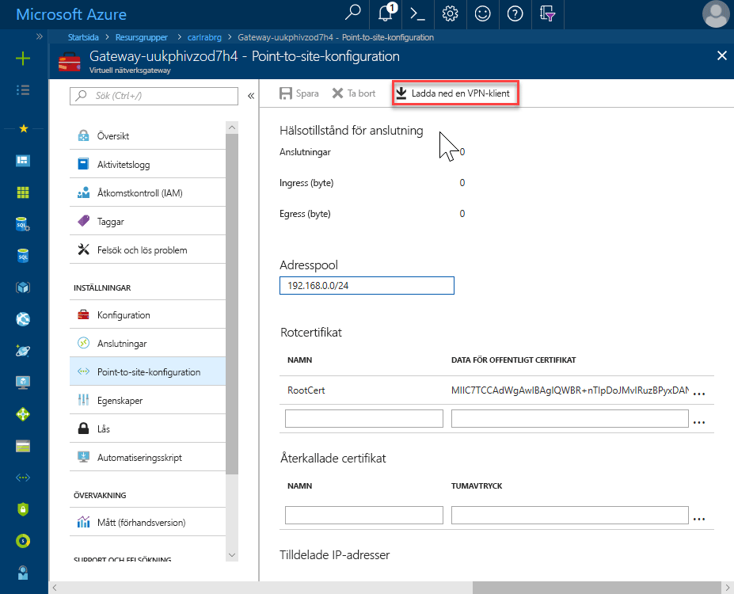
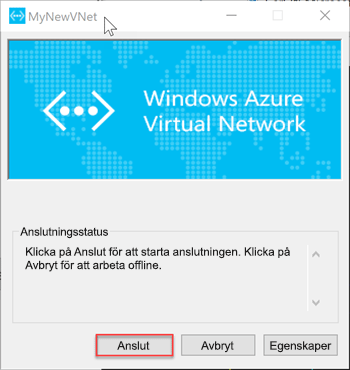

# <a name="quickstart-configure-a-point-to-site-connection-to-an-azure-sql-database-managed-instance-from-on-premises"></a>Snabbstart: Konfigurera en punkt-till-plats-anslutning till en Azure SQL Database Managed Instance från en lokal plats

Den här snabbstarten visar hur du ansluter till en Azure SQL Database Managed Instance med hjälp av [SQL Server Management Studio](https://docs.microsoft.com/sql/ssms/sql-server-management-studio-ssms) (SSMS) från en lokal klientdator över en punkt-till-plats-anslutning. Mer information om punkt-till-plats-anslutningar finns i [om punkt-till-plats-VPN](../vpn-gateway/point-to-site-about.md)

## <a name="prerequisites"></a>Nödvändiga komponenter

Den här snabbstarten:

- Använder resurserna som du skapade [skapar en hanterad instans](sql-database-managed-instance-get-started.md) som startpunkt.
- Kräver PowerShell 5.1 och AZ PowerShell 1.4.0 eller senare på den lokala klientdatorn. Om det behövs, se anvisningarna för [installerar Azure PowerShell-modulen](https://docs.microsoft.com/powershell/azure/install-az-ps#install-the-azure-powershell-module).
- Kräver den senaste versionen av [SQL Server Management Studio](https://docs.microsoft.com/sql/ssms/sql-server-management-studio-ssms) (SSMS) på den lokala klientdatorn.

## <a name="attach-a-vpn-gateway-to-your-managed-instance-virtual-network"></a>Bifoga en VPN-gateway till det virtuella nätverket för hanterad instans

1. Öppna PowerShell på den lokala klientdatorn.

2. Kopiera följande PowerShell-skript. Det här skriptet bifogar en VPN-Gateway till det virtuella nätverket för hanterad instans som du skapade i den [skapar en hanterad instans](sql-database-managed-instance-get-started.md) Snabbstart. Skriptet gör följande:

   - Skapa och installera certifikat på klientdatorn
   - Beräknar framtida VPN-Gateway undernätets IP-intervall
   - Skapar GatewaySubnet
   - Distribuerar Azure Resource Manager-mallen som kopplar VPN-gatewayen till VPN-undernät

     ```powershell
     $scriptUrlBase = 'https://raw.githubusercontent.com/Microsoft/sql-server-samples/master/samples/manage/azure-sql-db-managed-instance/attach-vpn-gateway'

     $parameters = @{
       subscriptionId = '<subscriptionId>'
       resourceGroupName = '<resourceGroupName>'
       virtualNetworkName = '<virtualNetworkName>'
       certificateNamePrefix  = '<certificateNamePrefix>'
       }

     Invoke-Command -ScriptBlock ([Scriptblock]::Create((iwr ($scriptUrlBase+'/attachVPNGatewayAz.ps1?t='+ [DateTime]::Now.Ticks)).Content)) -ArgumentList $parameters, $scriptUrlBase
     ```

     > [!IMPORTANT]
     > Om du vill använda Azure PowerShell Resource Manager-modulen i stället för Az-modulen, använder du följande cmdlet: `attachVPNGateway.ps1` snarare än `attachVPNGatewayAz.ps1` cmdlet.

3. Klistra in skriptet i PowerShell-fönster och ange de obligatoriska parametrarna. Värdena för `<subscriptionId>`, `<resourceGroup>`, och `<virtualNetworkName>` måste matcha de som du använde för den [skapa Managed Instance](sql-database-managed-instance-get-started.md) Snabbstart. Värdet för `<certificateNamePrefix>` kan vara en sträng med ditt val.

4. Kör PowerShell-skript.

> [!IMPORTANT]
> Fortsätt inte förrän PowerShell-skriptet har körts.

## <a name="create-a-vpn-connection-to-your-managed-instance"></a>Skapa en VPN-anslutning till din hanterade instans

1. Logga in på [Azure Portal](https://portal.azure.com/).
2. Öppna resursgruppen där du skapade den virtuella nätverksgatewayen och öppna sedan den virtuella nätverksresursen på en gateway.
3. Välj **punkt-till-plats-konfiguration** och välj sedan **hämta VPN-klient**.

      
4. Extrahera filerna från zip-filen och öppna sedan mappen med de extrahera filerna på din lokala dator.
5. Öppna i ”**WindowsAmd64** mappen och öppna den **VpnClientSetupAmd64.exe** fil.
6. Om du får en **Windows skyddade datorn** klickar du på **mer info** och klicka sedan på **kör ändå**.

    \
7. I dialogrutan User Account Control klickar du på **Ja** att fortsätta.
8. I dialogrutan som refererar till det virtuella nätverket väljer **Ja** installera VPN-klienten för det virtuella nätverket.

## <a name="connect-to-the-vpn-connection"></a>Ansluta till VPN-anslutningen

1. Gå till **VPN** i **nätverk och Internet** på den lokala klientdatorn och välj det virtuella nätverket för hanterad instans att upprätta en anslutning till det här virtuella nätverket. I följande bild, det virtuella nätverket namnet **MyNewVNet**.

      
2. Välj **Anslut**.
3. I dialogrutan Välj **Connect**.

      
4. När du uppmanas att Connection Manager behöver förhöjda privilegier för att uppdatera din routningstabell, Välj **Fortsätt**.
5. Välj **Ja** i dialogrutan User Account Control för att fortsätta.

   Du har skapat en VPN-anslutning till din hanterade instans i virtuellt nätverk.

      

## <a name="use-ssms-to-connect-to-the-managed-instance"></a>Använd SSMS för att ansluta till den hanterade instansen

1. Öppna SQL Server Management Studio (SSMS) på den lokala datorn.
2. I den **Anslut till Server** dialogrutan anger du det fullständiga **värdnamn** för din hanterade instans i den **servernamn** box.
3. Välj **SQL Server-autentisering**, ange ditt användarnamn och lösenord och välj sedan **Connect**.

      

När du ansluter kan kan du visa din system- och användardatabaserna i noden databaser. Du kan också visa olika objekt i noderna säkerhet, Server-objekt, replikering, hantering, SQL Server Agent och XEvent Profiler.

## <a name="next-steps"></a>Nästa steg

- En Snabbstart som visar hur du ansluter från en Azure virtuell dator, se [konfigurera en punkt-till-plats-anslutning](sql-database-managed-instance-configure-p2s.md).
- En översikt över anslutningsalternativen för olika program finns i [Ansluta dina program till Managed Instance](sql-database-managed-instance-connect-app.md).
- Om du vill återställa en befintlig SQL Server-databas från en lokal plats till en hanterad instans, kan du använda den [Azure Database Migration Service (DMS) för migrering](../dms/tutorial-sql-server-to-managed-instance.md) eller [T-SQL RESTORE-kommandot](sql-database-managed-instance-get-started-restore.md) att återställa från en säkerhetskopian av databasfilen.
