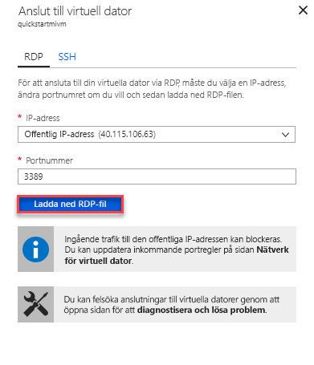

# Snabbstart: Konfigurera virtuell Azure-dator att ansluta till en Azure SQL Database Managed Instance

Den här snabbstarten visar hur du konfigurerar en Azure-dator att ansluta till en Azure SQL Database Managed Instance med SQL Server Management Studio (SSMS). En Snabbstart som visar hur du ansluter från en lokal klientdator med en punkt-till-plats-anslutning, se [konfigurera en punkt-till-plats-anslutning](sql-database-managed-instance-configure-p2s.md) 

## Förutsättningar

Den här snabbstarten används de resurser som skapades i [skapar en hanterad instans](sql-database-managed-instance-get-started.md) som startpunkt.

## Logga in på Azure Portal

Logga in på [Azure Portal](https://portal.azure.com/).

## Skapa ett nytt undernät i VNet för hanterad instans

Följande steg skapar ett nytt undernät i den hanterade instansen i virtuella nätverk så att virtuella Azure-datorer kan ansluta till den hanterade instansen. Hanterad instans-undernätet är dedikerad till hanterade instanser. Du kan inte skapa resurser, t.ex. Azure-datorer, i det undernätet. 

1. Öppna resursgruppen för den hanterade instansen som du skapade i den [skapar en hanterad instans](sql-database-managed-instance-get-started.md) Snabbstart. Välj det virtuella nätverket för din hanterade instans.

   

2. Välj **undernät** och välj sedan **+ undernät** att skapa ett nytt undernät.

   

3. Fyll i formuläret med hjälp av informationen i den här tabellen:

   | Inställning| Föreslaget värde | Beskrivning |
   | ---------------- | ----------------- | ----------- | 
   | **Namn** | Valfritt giltigt namn|Giltiga namn finns i [Namngivningsregler och begränsningar](https://docs.microsoft.com/azure/architecture/best-practices/naming-conventions).|
   | **Adressintervall (CIDR-block)** | Ett giltigt intervall | Standardvärdet är bra för den här snabbstarten.|
   | **Nätverkssäkerhetsgrupp** | Ingen | Standardvärdet är bra för den här snabbstarten.|
   | **Routningstabell** | Ingen | Standardvärdet är bra för den här snabbstarten.|
   | **Serviceslutpunkter** | 0 som valts | Standardvärdet är bra för den här snabbstarten.|
   | **Undernät delegering** | Ingen | Standardvärdet är bra för den här snabbstarten.|
 
   

4. Välj **OK** att skapa det här extra undernätet i den hanterade instansen i virtuella nätverk.

## Skapa en virtuell maskin i det nya undernätet i det virtuella nätverket

Följande steg visar hur du skapar en virtuell dator i det nya undernätet för att ansluta till den hanterade instansen. 

## Förbereda virtuella Azure-datorer

Eftersom SQL Managed Instance placeras i ditt privata virtuella nätverk, måste du skapa en Azure-dator med en installerade SQL-klientverktyg, t.ex. SQL Server Management Studio eller Azure Data Studio. Det här verktyget kan du ansluta till den hanterade instansen och köra frågor. Den här snabbstarten använder SQL Server Management Studio.

Det enklaste sättet att skapa en virtuell dator för klienten med alla nödvändiga verktyg är att använda Azure Resource Manager-mallar.

1. Kontrollera att du är inloggad på Azure-portalen i en annan flik i webbläsaren. Välj knappen följande för att skapa en virtuell dator för klienten och installera SQL Server Management Studio:

    

2. Fyll i formuläret med hjälp av informationen i följande tabell:

   | Inställning| Föreslaget värde | Beskrivning |
   | ---------------- | ----------------- | ----------- |
   | **Prenumeration** | En giltig prenumeration | Måste vara en prenumeration där du har behörighet att skapa nya resurser. |
   | **Resursgrupp** |Den resursgrupp som du angav i den [skapa Managed Instance](sql-database-managed-instance-get-started.md) Snabbstart.|Den här resursgruppen måste vara det där det virtuella nätverket finns.|
   | **Plats** | Platsen för resursgruppen. | Det här värdet har fyllts i baserat på den valda resursgruppen. | 
   | **Namn på virtuell dator**  | Valfritt giltigt namn | Giltiga namn finns i [Namngivningsregler och begränsningar](https://docs.microsoft.com/azure/architecture/best-practices/naming-conventions).|
   |**Administratörens användarnamn**|Valfritt giltigt användarnamn|Giltiga namn finns i [Namngivningsregler och begränsningar](https://docs.microsoft.com/azure/architecture/best-practices/naming-conventions). Använd inte ”serveradmin” eftersom det är en reserverad servernivåroll. Du använder den här användarnamn när du [ansluta till den virtuella datorn](#connect-to-virtual-machine).| 
   |**Lösenord**|Valfritt giltigt lösenord|Lösenordet måste vara minst 12 tecken långt och uppfylla [de definierade kraven på komplexitet](../virtual-machines/windows/faq.md#what-are-the-password-requirements-when-creating-a-vm). Du använder det här lösenordet varje gång du [ansluta till den virtuella datorn](#connect-to-virtual-machine).|
   | **Storlek på virtuell dator** | Valfri giltig storlek | Standard i den här mallen för **Standard_B2s** är tillräcklig för den här snabbstarten. |
   | **Plats**|[resourceGroup () .location].| Ändra inte det här värdet. |
   | **Namn på virtuellt nätverk**|Den virtuella nät nätverken nätverk där du skapade den hanterade instansen.|
   | **Namn på undernät**|Namnet på det undernät som du skapade i föregående procedur| Välj inte undernätet där du skapade den hanterade instansen.|
   | **artefakter plats** | [distribution ().properties.templateLink.uri] | Ändra inte det här värdet. |
   | **artefakter plats Sas-token** | Lämna tomt | Ändra inte det här värdet. |

   

   Om du använde de föreslagna namnet på virtuellt nätverk och standardundernät i [skapar din hanterade instans](sql-database-managed-instance-get-started.md), du behöver inte ändra sista två parametrar. Annars bör du ändra dessa värden till de värden som du angav när du konfigurerar nätverksmiljön.

3. Välj den **jag godkänner villkoren som anges ovan** kryssrutan.
4. Välj **köp** att distribuera virtuella Azure-datorer i nätverket.
5. Välj ikonen **Meddelanden** för att visa status för distributionen.

Fortsätt inte förrän den virtuella Azure-datorn har skapats. 

## Ansluta till den virtuella datorn

Följande steg visar hur du ansluter till den nya virtuella datorn med hjälp av en fjärrskrivbordsanslutning.

1. När distributionen är klar går du till den virtuella datorresursen.

      

2. Välj **Anslut**. 
   
   Ett formulär för Remote Desktop Protocol (RDP-fil) visas med offentliga IP-adressen och porten för den virtuella datorn. 

     

3. Välj **ladda ned RDP-filen**.
 
   > [!NOTE]
   > Du kan också använda SSH för att ansluta till den virtuella datorn.

4. Stäng den **Anslut till den virtuella datorn** formuläret.
5. Öppna den hämtade RDP-filen för att ansluta till den virtuella datorn. 
6. När du uppmanas, väljer **Connect**. På en Mac-dator behöver du en RDP-klient som denna [Fjärrskrivbordsklient](https://itunes.apple.com/us/app/microsoft-remote-desktop/id715768417?mt=12) från Mac App Store.

6. Ange användarnamnet och lösenordet du angav när du skapar den virtuella datorn och välj sedan **OK**.

7. Du kan få en certifikatvarning under inloggningen. Välj **Ja** eller **Fortsätt** att fortsätta med anslutningen.

Du är ansluten till den virtuella datorn i Serverhanterarens instrumentpanel.

## Använd SSMS för att ansluta till den hanterade instansen

1. Öppna SQL Server Management Studio (SSMS) på den virtuella datorn.
 
   Det tar en stund åt att öppna så att slutföra konfigurationen eftersom det är första gången SSMS har startats.
2. I den **Anslut till Server** dialogrutan anger du det fullständiga **värdnamn** för din hanterade instans i den **servernamn** box. Välj **SQL Server-autentisering**, ange ditt användarnamn och lösenord och välj sedan **Connect**.

      

När du ansluter kan du visa system- och användardatabaserna i noden för databaser och olika objekt i noderna för säkerhet, server-objekt, replikering, hantering, SQL Server Agent och XEvent Profiler.

## Nästa steg

- En Snabbstart som visar hur du ansluter från en lokal klientdator med en punkt-till-plats-anslutning, se [konfigurera en punkt-till-plats-anslutning](sql-database-managed-instance-configure-p2s.md).
- En översikt över anslutningsalternativen för program finns i [Ansluta dina program till hanterad instans](sql-database-managed-instance-connect-app.md).
- Om du vill återställa en befintlig SQL Server-databas från en lokal plats till en hanterad instans, kan du använda den [Azure Database Migration Service (DMS) för migrering](../dms/tutorial-sql-server-to-managed-instance.md) eller [T-SQL RESTORE-kommandot](sql-database-managed-instance-get-started-restore.md) att återställa från en säkerhetskopian av databasfilen.
