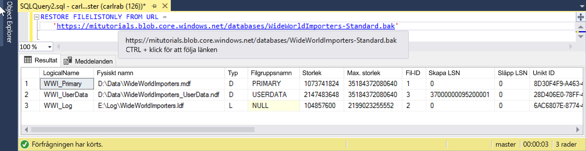

# <a name="quickstart-restore-a-database-to-a-managed-instance"></a>Snabbstart: Återställa en databas till en hanterad instans

I den här snabbstarten ska du använda SQL Server Management Studio (SSMS) för att återställa en databas (Wide World Importers – standardsäkerhetskopian) från Azure Blob Storage till en [hanterad instans](sql-database-managed-instance.md) för Azure SQL Database.

> [!VIDEO https://www.youtube.com/embed/RxWYojo_Y3Q]

> [!NOTE]
> Mer information om migrering med hjälp av Azure Database Migration Service (DMS) finns i avsnittet [Migrering av hanterade instanser med DMS](../dms/tutorial-sql-server-to-managed-instance.md).
> Mer information om de olika migreringsmetoderna finns i [SQL Server-instansmigrering till Azure SQL Database Managed Instance](sql-database-managed-instance-migrate.md).

## <a name="prerequisites"></a>Nödvändiga komponenter

Den här snabbstarten:

- Använder resurser från snabbstarten [Skapa en hanterad instans](sql-database-managed-instance-get-started.md).
- Kräver att datorn har den senaste versionen av [SQL Server Management Studio](https://docs.microsoft.com/sql/ssms/sql-server-management-studio-ssms) installerad.
- Kräver att du använder SSMS för att kunna ansluta till din hanterade instans. Läs följande snabbstarter om hur man ansluter:
  - [Connect to an Azure SQL Database Managed Instance from an Azure VM](sql-database-managed-instance-configure-vm.md) (Ansluta till en hanterad Azure SQL Database-instans från en virtuell Azure-dator)
  - [Konfigurera en punkt-till-plats-anslutning till en hanterad Azure SQL Database-instans lokalt](sql-database-managed-instance-configure-p2s.md).

> [!NOTE]
> Mer information om hur du säkerhetskopierar och återställer en SQL Server-databas med hjälp av Azure Blob Storage och en [SAS-nyckel](https://docs.microsoft.com/azure/storage/common/storage-dotnet-shared-access-signature-part-1) finns i [SQL Server-säkerhetskopiering till URL](sql-database-managed-instance-get-started-restore.md).

## <a name="restore-the-database-from-a-backup-file"></a>Återställ databasen från en säkerhetskopia

Återställ Wide World Importers-databasen till din hanterade instans i SSMS enligt dessa steg. Säkerhetskopian av databasfilen lagras i ett förkonfigurerat Azure Blob Storage-konto.

1. Öppna SMSS och anslut till din hanterade instans.
2. Högerklicka på din hanterade instans på den vänstra menyn och välj **Ny fråga** så öppnas ett nytt frågefönster.
3. Använd följande skript, som använder ett förkonfigurerat lagringskonto och SAS-nyckel, för att [skapa en autentiseringsuppgift](https://docs.microsoft.com/sql/t-sql/statements/create-credential-transact-sql) i den hanterade instansen.

   ```sql
   CREATE CREDENTIAL [https://mitutorials.blob.core.windows.net/databases]
   WITH IDENTITY = 'SHARED ACCESS SIGNATURE'
   , SECRET = 'sv=2017-11-09&ss=bfqt&srt=sco&sp=rwdlacup&se=2028-09-06T02:52:55Z&st=2018-09-04T18:52:55Z&spr=https&sig=WOTiM%2FS4GVF%2FEEs9DGQR9Im0W%2BwndxW2CQ7%2B5fHd7Is%3D'
   ```

    

4. Kontrollera dina autentiseringsuppgifter genom att köra följande skript som använder en [behållare](https://azure.microsoft.com/services/container-instances/)-URL för att hämta en lista över säkerhetskopior.

   ```sql
   RESTORE FILELISTONLY FROM URL =
      'https://mitutorials.blob.core.windows.net/databases/WideWorldImporters-Standard.bak'
   ```

    

5. Återställ Wide World Importers-databasen genom att köra följande skript.

   ```sql
   RESTORE DATABASE [Wide World Importers] FROM URL =
     'https://mitutorials.blob.core.windows.net/databases/WideWorldImporters-Standard.bak'
   ```

    

6. Spåra återställningsstatusen genom att köra följande skript.

   ```sql
   SELECT session_id as SPID, command, a.text AS Query, start_time, percent_complete
      , dateadd(second,estimated_completion_time/1000, getdate()) as estimated_completion_time
   FROM sys.dm_exec_requests r
   CROSS APPLY sys.dm_exec_sql_text(r.sql_handle) a
   WHERE r.command in ('BACKUP DATABASE','RESTORE DATABASE')
   ```

7. När återställningen är klar kan du visa den i Object Explorer.

## <a name="next-steps"></a>Nästa steg

- Information om hur du felsöker säkerhetskopiering till en URL finns i avsnittet [Metodtips och felsökning för säkerhetskopiering av SQL-server till en URL](https://docs.microsoft.com/sql/relational-databases/backup-restore/sql-server-backup-to-url-best-practices-and-troubleshooting).
- En översikt över appanslutningsalternativ finns i [Ansluta dina program till hanterad instans](sql-database-managed-instance-connect-app.md).
- Information om hur du ställer frågor med dina favoritverktyg och språk finns i [Snabbstart: Azure SQL Database-anslutning och fråga](sql-database-connect-query.md).
