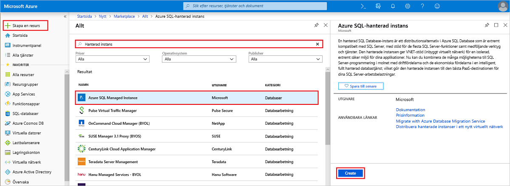
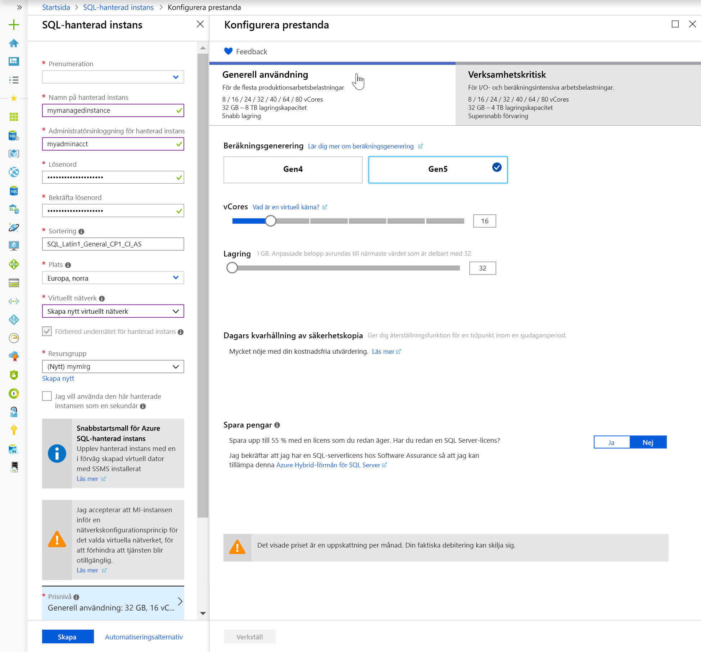
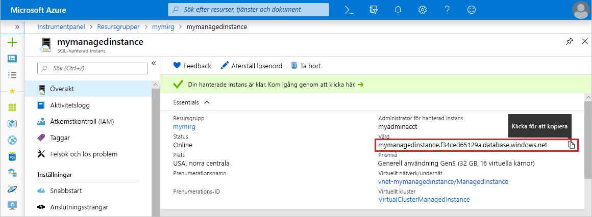

# Snabbstart: Skapa en hanterad Azure SQL Database-instans

I den här snabbstarten går vi igenom hur du skapar en [hanterad instans](sql-database-managed-instance.md) av Azure SQL Database i Azure-portalen.

Om du inte har en Azure-prenumeration kan du [skapa ett kostnadsfritt konto ](https://azure.microsoft.com/free/) innan du börjar.

## Logga in på Azure Portal

Logga in på [Azure-portalen](https://portal.azure.com/).

## Skapa en hanterad instans

I följande steg visas hur du skapar en hanterad instans.

1. Välj **Skapa en resurs** längst upp till vänster i Azure Portal.
2. Leta upp **Managed Instance** och välj sedan **Azure SQL Managed Instance**.
3. Välj **Skapa**.

   

4. Fyll i formuläret **Hanterad instans** med den begärda informationen, med hjälp av informationen i följande tabell:

   | Inställning| Föreslaget värde | Beskrivning |
   | ------ | --------------- | ----------- |
   | **Prenumeration** | Din prenumeration | En prenumeration där du har behörighet att skapa nya resurser |
   |**Namn på hanterad instans**|Valfritt giltigt namn|Giltiga namn finns i [Namngivningsregler och begränsningar](https://docs.microsoft.com/azure/architecture/best-practices/naming-conventions).|
   |**Administratörsinloggning för hanterad instans**|Giltigt användarnamn|Giltiga namn finns i [Namngivningsregler och begränsningar](https://docs.microsoft.com/azure/architecture/best-practices/naming-conventions). Använd inte ”serveradmin” eftersom det är en reserverad servernivåroll.|
   |**Lösenord**|Valfritt giltigt lösenord|Lösenordet måste vara minst 16 tecken långt och uppfylla [de definierade kraven på komplexitet](../virtual-machines/windows/faq.md#what-are-the-password-requirements-when-creating-a-vm).|
   |**Plats**|Platsen där du vill skapa den hanterade instansen|För information om regioner, se [Azure-regioner](https://azure.microsoft.com/regions/).|
   |**Virtuellt nätverk**|Välj antingen **Skapa nytt virtuellt nätverk** eller ett giltigt virtuellt nätverk och undernät.| Om en nätverk/undernät är nedtonat måste det [ändras för att uppfylla nätverkskraven](sql-database-managed-instance-configure-vnet-subnet.md) innan du väljer det som mål för den nya hanterade instansen. Information om kraven för att konfigurera nätverksmiljön för en hanterad instans finns i [Konfigurera ett virtuellt nätverk för hanterad Azure SQL Database-instans](sql-database-managed-instance-connectivity-architecture.md). |
   |**Resursgrupp**|En ny eller befintlig resursgrupp|Giltiga resursgruppnamn finns i [Namngivningsregler och begränsningar](https://docs.microsoft.com/azure/architecture/best-practices/naming-conventions).|

   

5. Om du vill använda den hanterade instansen som en sekundär redundansgrupp för instansen väljer du utcheckningen och anger den hanterade DnsAzurePartner-instansen. Den här funktionen är en förhandsversion och visas inte i den tillhörande skärmbilden.
6. Välj **Prisnivå** för att beräkna storlek på instanser och lagringsresurser samt granska alternativen för prisnivå. Standardvärdet är prisnivån Generell användning med 32 GB minne och 16 virtuella kärnor.
7. Använd skjutreglagen eller textrutorna för att ange mängden lagringsutrymme och antalet virtuella kärnor.
8. När det är klart väljer du **Verkställ** för att spara ditt val.  
9. Välj **Skapa** för att distribuera den hanterade instansen.
10. Välj ikonen **Meddelanden** för att visa status för distributionen.

    

11. Välj **Distribution pågår** för att öppna fönstret för den hanterade instansen om du vill fortsätta övervaka förloppet för distributionen.

> [!IMPORTANT]
> För den första instansen i ett undernät tar distributionen vanligtvis mycket längre tid än för efterföljande instanser. Avbryt inte distributionsåtgärden om den tar längre tid än förväntat. Det tar bara några minuter att skapa den andra hanterade instansen i undernätet.

## Granska resurser och hämta det fullständigt kvalificerade servernamnet

När distributionen är färdig kan du granska resurserna som har skapats och hämta det fullständigt kvalificerade servernamnet för användning i senare snabbstarter.

1. Öppna resursgruppen för din hanterade instans och visa resurserna som skapades åt dig i snabbstarten [Skapa en hanterad instans](#create-a-managed-instance).

2. Välj din hanterade instans.

   

3. På fliken **Översikt** letar du upp egenskapen **Värd** och kopierar den hanterade instansens fullständigt hanterade värdadress.

   

   Namnet ser ut ungefär så här: **ditt_datornamn.a1b2c3d4e5f6.database.windows.net**.

## Nästa steg

- Läs om hur du ansluter till en hanterad instans i:
  - En översikt över anslutningsalternativen för olika program finns i [Ansluta dina program till Managed Instance](sql-database-managed-instance-connect-app.md).
  - [Konfigurera en anslutning till en virtuell Azure-dator](sql-database-managed-instance-configure-vm.md) är en snabbstart där du får se hur du ansluter till en hanterad instans från en virtuell Azure-dator.
  - [Konfigurera en punkt-till-plats-anslutning](sql-database-managed-instance-configure-p2s.md) är en snabbstart där du får se hur du ansluter till en hanterad instans från en lokal klientdator via punkt-till-plats-anslutning.
- Om du vill återställa en lokal befintlig SQL Server-databas till en hanterad instans kan du använda [Azure Database Migration Service (DMS) för migrering](../dms/tutorial-sql-server-to-managed-instance.md) till att återställa från en databassäkerhetskopia eller kommandot [T-SQL RESTORE](sql-database-managed-instance-get-started-restore.md) till att återställa från en databassäkerhetskopia.
- Information om avancerad övervakning av databasprestanda för hanterad instans med inbyggd intelligens som felsökning finns i artikeln om att [övervaka Azure SQL Database med Azure SQL-analys](../azure-monitor/insights/azure-sql.md)
