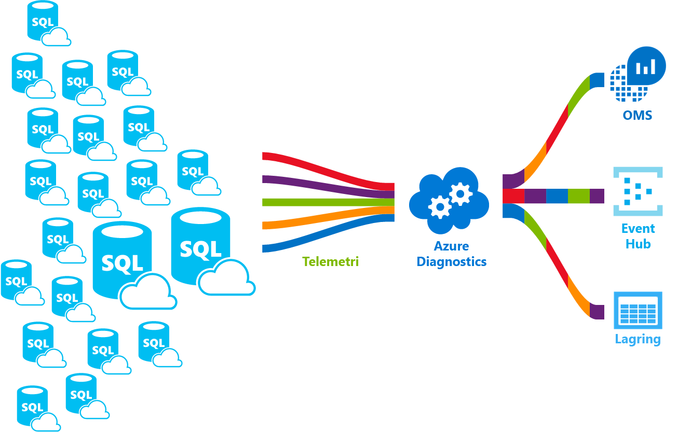

# <a name="azure-sql-database-metrics-and-diagnostics-logging"></a>Azure SQL Database-mått och diagnostikloggning

Enkla databaser och databaser i pooler i elastiska pooler instansdatabaser i en hanterad instans kan strömma loggar för mått och diagnostik för lättare prestandaövervakning. Du kan konfigurera en databas för överföring av Resursanvändning, personal och sessioner och anslutning till en av följande Azure-resurser:

- **Azure SQL-analys**: få intelligent övervakning av din Azure SQL-databaser som innehåller prestandarapporter, aviseringar och rekommendationer för problemlösning.
- **Azure Event Hubs**: integrera telemetri för SQL-databas med din anpassade övervakningslösningar eller med heta pipelines.
- **Azure Storage**: att arkivera stora mängder telemetri för en bråkdel av priset.

    

Mer information om mått och loggfiler kategorier som stöds av olika Azure-tjänster finns:

- [Översikt över mått i Microsoft Azure](../monitoring-and-diagnostics/monitoring-overview-metrics.md)
- [Översikt över Azure-diagnostikloggar](../azure-monitor/platform/diagnostic-logs-overview.md)

Den här artikeln innehåller riktlinjer som hjälper dig att aktivera diagnostiktelemetri för Azure SQL-databaser, elastiska pooler och hanterade instanser. Det också kan hjälpa dig att förstå hur du konfigurerar Azure SQL Analytics som ett övervakningsverktyg för att visa diagnostik databastelemetri.

## <a name="enable-logging-of-diagnostics-telemetry"></a>Aktivera loggning av diagnostiktelemetri

Du kan aktivera och hantera mått och diagnostik telemetri loggning genom att använda någon av följande metoder:

- Azure Portal
- PowerShell
- Azure CLI
- Azure Monitor REST-API
- Azure Resource Manager-mall

När du aktiverar mått och diagnostik loggning kan behöva du ange Azure-resurs-mål för att samla in telemetri som diagnotics. Tillgängliga alternativ inkluderar:

- Azure SQL-analys
- Azure Event Hubs
- Azure Storage

Du kan etablera en ny resurs i Azure eller välja en befintlig resurs. När du har valt en resurs med hjälp av den **diagnostikinställningar** , anger du vilka data du samlar in.

> [!NOTE]
> Om du även använder elastiska pooler eller en hanterad instans, rekommenderar vi att du aktiverar diagnostiktelemetri för dessa resurser också. Databasen behållare i elastiska pooler och en hanterad instans har sina egna separata diagnostiktelemetri.

## <a name="enable-logging-for-azure-sql-databases"></a>Aktivera loggning för Azure SQL-databaser

Aktivera för mått och diagnostik loggning på SQL-databaser – de är inte aktiverad som standard.

Du kan ställa in Azure SQL-databaser för att samla in följande diagnostiktelemetri:

| Övervakning av telemetri för databaser | Enkel databas och stöd för databas i pool | Hanterad instans-stöd |
| :------------------- | ------------------- | ------------------- |
| [Alla mått](#all-metrics): Innehåller DTU/CPU-procent, DTU/CPU-begränsning, fysiska data läses procent, skriva log procent brandväggsanslutningar, sessioner procent, arbetare procent, lagring, lagringsprocent och XTP lagringsprocent lyckades/misslyckades/blockerades. | Ja | Nej |
| [QueryStoreRuntimeStatistics](#query-store-runtime-statistics): Innehåller information om den fråga runtime statistik, till exempel CPU-användning och fråga varaktighet. | Ja | Ja |
| [QueryStoreWaitStatistics](#query-store-wait-statistics): Innehåller information om frågestatistik för vänta (vad dina frågor kan ha väntat), till exempel processor, LOG och låser. | Ja | Ja |
| [Fel](#errors-dataset): Innehåller information om SQL-fel på databasen. | Ja | Ja |
| [DatabaseWaitStatistics](#database-wait-statistics-dataset): Innehåller information om hur lång tid att databasen har använt för att vänta på olika vänta typer. | Ja | Nej |
| [Tidsgränser](#time-outs-dataset): Innehåller information om tidsgränser för databasen. | Ja | Nej |
| [Block](#blockings-dataset): Innehåller information om blockering av händelser i databasen. | Ja | Nej |
| [SQLInsights](#intelligent-insights-dataset): Innehåller intelligenta insikter om prestanda. Mer information finns i [smarta insikter](sql-database-intelligent-insights.md). | Ja | Ja |

### <a name="azure-portal"></a>Azure Portal

Du använder den **diagnostikinställningar** menyn för var och en enkel tilldelade i poler, eller instans databas i Azure portal för att konfigurera strömning av diagnostiktelemetri för Azure SQL-databaser. Du kan ange följande mål: Azure Storage, Azure Event Hubs och Azure Monitor-loggar.

### <a name="configure-streaming-of-diagnostics-telemetry-for-single-pooled-or-instance-databases"></a>Konfigurera strömning av diagnostiktelemetri för en enskild, i pooler eller instans databaser

   

Att aktivera strömning av diagnostiktelemetri för en enskild, tilldelade i poler, eller instans databaser, Följ dessa steg:

1. Gå till din Azure SQL database-resurs.
1. Välj **diagnostikinställningar**.
1. Välj **slå på diagnostik** om inga tidigare inställningar finns, eller välj **Redigera inställning** så här redigerar du en föregående inställning.
   - Du kan skapa upp till tre parallella anslutningar till stream-diagnostiktelemetri.
   - Välj **+ Lägg till diagnostikinställning** konfigurera parallella strömning av diagnostikdata till flera resurser.

   
1. Ange ett namn på inställningen för din egen referens.
1. Välj en mål-resurs för strömmande diagnostikdata: **Arkivet till lagringskontot**, **Stream till en händelsehubb**, eller **skicka till Log Analytics**.
1. Välj följande kryssrutor för databasen diagnostik loggtelemetri för övervakningen standard, baserat på händelse: **SQLInsights**, **AutomaticTuning**, **QueryStoreRuntimeStatistics**, **QueryStoreWaitStatistics**, **fel** , **DatabaseWaitStatistics**, **tidsgränser**, **block**, och **låsningar**.
1. För en avancerad, 1-minut-baserade övervakningsupplevelse, markerar du kryssrutan för **AllMetrics**.
1. Välj **Spara**.

   

> [!NOTE]
> Granskningsloggar för säkerhet kan inte aktiveras från diagnostik databasinställningarna. För att aktivera granskning av loggströmningen, se [konfigurera granskning för din databas](sql-database-auditing.md#subheading-2), och [granskningsloggar i Azure Monitor-loggar och Azure Event Hubs](https://blogs.msdn.microsoft.com/sqlsecurity/2018/09/13/sql-audit-logs-in-azure-log-analytics-and-azure-event-hubs/).
> [!TIP]
> Upprepa dessa steg för varje Azure SQL-databas som du vill övervaka.

### <a name="configure-streaming-of-diagnostics-telemetry-for-instance-databases-in-managed-instance"></a>Konfigurera strömning av diagnostiktelemetri exempelvis databaser i hanterad instans

   

Följ dessa steg om du vill aktivera strömning av diagnostiktelemetri exempelvis databaser i hanterade instansen:

1. Gå till din instans-databas i hanterad instans.
2. Välj **diagnostikinställningar**.
3. Välj **slå på diagnostik** om inga tidigare inställningar finns, eller välj **Redigera inställning** så här redigerar du en föregående inställning.
   - Du kan skapa upp till tre (3) parallella anslutningar till stream-diagnostiktelemetri.
   - Välj **+ Lägg till diagnostikinställning** konfigurera parallella strömning av diagnostikdata till flera resurser.

   

4. Ange ett namn på inställningen för din egen referens.
5. Välj en mål-resurs för strömmande diagnostikdata: **Arkivet till lagringskontot**, **Stream till en händelsehubb**, eller **skicka till Log Analytics**.
6. Markera kryssrutorna för databastelemetri för diagnostik: **SQLInsights**, **QueryStoreRuntimeStatistics**, **QueryStoreWaitStatistics** och **fel**.
7. Välj **Spara**.

   

> [!TIP]
> Upprepa dessa steg för varje instans som du vill övervaka.

## <a name="enable-logging-for-elastic-pools-or-managed-instances"></a>Aktivera loggning för elastiska pooler eller hanterade instanser

Aktivera diagnostiktelemetri för elastiska pooler och hanterade instanser som behållare för databasen. De har sina egna diagnostiktelemetri som inte är aktiverad som standard.

### <a name="configure-streaming-of-diagnostics-telemetry-for-elastic-pools"></a>Konfigurera strömning av diagnostiktelemetri för elastiska pooler

   

Du kan ställa in en elastisk pool-resurs för att samla in följande diagnostiktelemetri:

| Resurs | Övervakning av telemetri |
| :------------------- | ------------------- |
| **Elastisk pool** | [Alla mått](sql-database-metrics-diag-logging.md#all-metrics) innehåller eDTU/CPU-procent, eDTU/CPU-begränsning, fysiska data läses procent, skriva log procent, sessioner procent, arbetare procent, lagring, lagringsprocent, lagringsgräns och XTP lagringsprocent. |

Följ dessa steg om du vill aktivera strömning av diagnostiktelemetri för en elastisk pool-resurs:

1. Gå till resursen för elastisk pool i Azure-portalen.
1. Välj **diagnostikinställningar**.
1. Välj **slå på diagnostik** om inga tidigare inställningar finns, eller välj **Redigera inställning** så här redigerar du en föregående inställning.

   

1. Ange ett namn på inställningen för din egen referens.
1. Välj en mål-resurs för strömmande diagnostikdata: **Arkivet till lagringskontot**, **Stream till en händelsehubb**, eller **skicka till Log Analytics**.
1. Log analytics, Välj **konfigurera** och skapa en ny arbetsyta genom att välja **+ Skapa ny arbetsyta**, eller välj en befintlig arbetsyta.
1. Markera kryssrutan för telemetri för elastisk pool diagnostik: **AllMetrics**.
1. Välj **Spara**.

   

> [!TIP]
> Upprepa dessa steg för varje elastisk pool som du vill övervaka.

### <a name="configure-streaming-of-diagnostics-telemetry-for-managed-instances"></a>Konfigurera strömning av diagnostiktelemetri för hanterade instanser

   

Du kan ställa in en hanterad instans-resurs för att samla in följande diagnostiktelemetri:

| Resurs | Övervakning av telemetri |
| :------------------- | ------------------- |
| **Hanterad instans** | [ResourceUsageStats](#logs-for-managed-instances) innehåller antal virtuella kärnor, Genomsnittlig CPU-procent, i/o-begäranden, byte lästa/skrivna, reserverade lagringsutrymme och använt lagringsutrymme. |

Följ dessa steg om du vill aktivera strömning av diagnostiktelemetri för en hanterad instans-resurs:

1. Gå till resursen som hanterad instans i Azure-portalen.
1. Välj **diagnostikinställningar**.
1. Välj **slå på diagnostik** om inga tidigare inställningar finns, eller välj **Redigera inställning** så här redigerar du en föregående inställning.

   

1. Ange ett namn på inställningen för din egen referens.
1. Välj en mål-resurs för strömmande diagnostikdata: **Arkivet till lagringskontot**, **Stream till en händelsehubb**, eller **skicka till Log Analytics**.
1. Log analytics, Välj **konfigurera** och skapa en ny arbetsyta genom att välja **+ Skapa ny arbetsyta**, eller Använd en befintlig arbetsyta.
1. Markera kryssrutan för instans-diagnostiktelemetri: **ResourceUsageStats**.
1. Välj **Spara**.

   

> [!TIP]
> Upprepa dessa steg för varje hanterad instans som du vill övervaka.

### <a name="powershell"></a>PowerShell

Du kan aktivera mätvärden och diagnostikloggning med hjälp av PowerShell.

- Använd följande kommando om du vill aktivera lagring av diagnostikloggar i ett lagringskonto:

   ```powershell
   Set-AzureRmDiagnosticSetting -ResourceId [your resource id] -StorageAccountId [your storage account id] -Enabled $true
   ```

   Storage-konto-ID är resurs-ID för mållagringskontot.

- Om du vill aktivera strömning av diagnostikloggar till en händelsehubb, Använd följande kommando:

   ```powershell
   Set-AzureRmDiagnosticSetting -ResourceId [your resource id] -ServiceBusRuleId [your service bus rule id] -Enabled $true
   ```

   Regel-ID för Azure Service Bus är en sträng med det här formatet:

   ```powershell
   {service bus resource ID}/authorizationrules/{key name}
   ```

- Använd följande kommando om du vill aktivera skicka diagnostikloggar till en Log Analytics-arbetsyta:

   ```powershell
   Set-AzureRmDiagnosticSetting -ResourceId [your resource id] -WorkspaceId [resource id of the log analytics workspace] -Enabled $true
   ```

- Du kan hämta resurs-ID för Log Analytics-arbetsytan med hjälp av följande kommando:

   ```powershell
   (Get-AzureRmOperationalInsightsWorkspace).ResourceId
   ```

Du kan kombinera dessa parametrar om du vill aktivera flera Utdataalternativ för.

### <a name="to-configure-multiple-azure-resources"></a>Konfigurera flera Azure-resurser

För att stödja flera prenumerationer, använder du PowerShell-skriptet från [aktivera Azure resource mått loggning med hjälp av PowerShell](https://blogs.technet.microsoft.com/msoms/2017/01/17/enable-azure-resource-metrics-logging-using-powershell/).

Ange resurs-ID för arbetsyta \<$WSID\> som en parameter när du kör skriptet `Enable-AzureRMDiagnostics.ps1` skicka diagnostikdata från flera resurser till arbetsytan.

- Att hämta arbetsyte-ID \<$WSID\> målet för dina diagnostiska data, Använd följande skript:

    ```powershell
    PS C:\> $WSID = "/subscriptions/<subID>/resourcegroups/<RG_NAME>/providers/microsoft.operationalinsights/workspaces/<WS_NAME>"
    PS C:\> .\Enable-AzureRMDiagnostics.ps1 -WSID $WSID
    ```
   Ersätt \<subID\> med prenumerations-ID \<RG_NAME\> med resursgruppens namn och \<WS_NAME\> med namnet på arbetsytan.

### <a name="azure-cli"></a>Azure CLI

Du kan aktivera mätvärden och diagnostikloggning med hjälp av Azure CLI.

- Använd följande kommando om du vill aktivera lagring av diagnostikloggar i ett lagringskonto:

   ```azurecli-interactive
   azure insights diagnostic set --resourceId <resourceId> --storageId <storageAccountId> --enabled true
   ```

   Storage-konto-ID är resurs-ID för mållagringskontot.

- Om du vill aktivera strömning av diagnostikloggar till en händelsehubb, Använd följande kommando:

   ```azurecli-interactive
   azure insights diagnostic set --resourceId <resourceId> --serviceBusRuleId <serviceBusRuleId> --enabled true
   ```

   Regel-ID för Service Bus är en sträng med det här formatet:

   ```azurecli-interactive
   {service bus resource ID}/authorizationrules/{key name}
   ```

- Använd följande kommando om du vill aktivera att skicka diagnostikloggar till en Log Analytics-arbetsyta:

   ```azurecli-interactive
   azure insights diagnostic set --resourceId <resourceId> --workspaceId <resource id of the log analytics workspace> --enabled true
   ```

Du kan kombinera dessa parametrar om du vill aktivera flera Utdataalternativ för.

### <a name="rest-api"></a>REST-API

Läs om hur du [ändra inställningarna för startdiagnostik med hjälp av REST-API i Azure Monitor](https://docs.microsoft.com/rest/api/monitor/diagnosticsettings).

### <a name="resource-manager-template"></a>Resource Manager-mall

Läs om hur du [aktivera diagnostikinställningar när resursen skapas med hjälp av Resource Manager-mall](../azure-monitor/platform/diagnostic-logs-stream-template.md).

## <a name="stream-into-azure-sql-analytics"></a>Stream till Azure SQL-analys

Azure SQL Analytics är en molnlösning som övervakar prestandan för Azure SQL-databaser, elastiska pooler och hanterade instanser och över flera prenumerationer. Det kan du samla in och visualisera prestandamått för Azure SQL Database och har inbyggd intelligens för prestandafelsökning av.


SQL Database mått och diagnostik för loggar kan strömmas till Azure SQL Analytics med hjälp av inbyggt **skicka till Log Analytics** alternativet diagnostik på fliken Inställningar i portalen. Du kan också aktivera log analytics med hjälp av en diagnostikinställning via PowerShell-cmdletar, Azure CLI eller REST-API i Azure Monitor.

### <a name="installation-overview"></a>Installationsöversikt

Du kan övervaka en SQL-databas flotta med Azure SQL Analytics. Utför följande steg:

1. Skapa en Azure SQL Analytics-lösningen från Azure Marketplace.
2. Skapa en övervakningsarbetsytan i lösningen.
3. Konfigurera databaserna så att stream-diagnostiktelemetri till arbetsytan.

Om du använder elastiska pooler eller hanterade instanser kan behöva du också konfigurera diagnostiktelemetri direktuppspelning från dessa resurser.

### <a name="create-azure-sql-analytics-resource"></a>Skapa Azure SQL Analytics-resurs

1. Sök efter Azure SQL Analytics i Azure Marketplace och välja den.

   

2. Välj **skapa** på lösningens översiktsskärmen.

3. Fyll i formuläret Azure SQL Analytics med ytterligare information som krävs: namn på arbetsyta, prenumeration, resursgrupp, plats och prisnivå.

   

4. Välj **OK** att bekräfta och välj sedan **skapa**.

### <a name="configure-databases-to-record-metrics-and-diagnostics-logs"></a>Konfigurera databaser för att registrera mått och diagnostik för loggar

Det enklaste sättet att konfigurera där databaser registrera mått är med hjälp av Azure portal. Som tidigare beskrivits kan du gå till din SQL Database-resurs i Azure-portalen och välj **diagnostikinställningar**.

Om du använder elastiska pooler eller hanterade instanser, måste du också konfigurera inställningarna för startdiagnostik i dessa resurser för att aktivera diagnostiktelemetri att strömma till arbetsytan.

### <a name="use-the-sql-analytics-solution"></a>Använd SQL Analytics-lösningen

Du kan använda SQL Analytics som en hierarkisk instrumentpanel för att visa dina SQL Database-resurser. Läs hur du använder SQL Analytics-lösningen i [övervaka SQL-databasen med hjälp av SQL Analytics-lösningen](../log-analytics/log-analytics-azure-sql.md).

## <a name="stream-into-event-hubs"></a>Strömma till Event Hubs

Du kan strömma SQL Database mått och diagnostik för loggar till Event Hubs med hjälp av inbyggt **Stream till en händelsehubb** alternativ i Azure-portalen. Du kan också aktivera regel-ID för Service Bus med hjälp av en diagnostikinställning via PowerShell-cmdletar, Azure CLI eller REST-API i Azure Monitor.

### <a name="what-to-do-with-metrics-and-diagnostics-logs-in-event-hubs"></a>Vad du gör med mått och diagnostik för loggar i Event Hubs

När valda data strömmas i Event Hubs, är ett steg närmare att aktivera avancerade scenarier för övervakning. Händelsehubbar fungerar som åtkomsten för en händelsepipeline. När data har samlats in i en händelsehubb, kan de omvandlas och lagras med hjälp av en leverantör av realtidsanalys eller en lagringsadapter. Händelsehubbar frikopplar produktionen av en händelseström från användningen av dessa händelser. På så sätt kan händelsekonsumenterna kan komma åt händelser på sitt eget schema. Mer information om Händelsehubbar finns:

- [Vad är Azure Event Hubs?](../event-hubs/event-hubs-what-is-event-hubs.md)
- [Kom igång med Event Hubs](../event-hubs/event-hubs-csharp-ephcs-getstarted.md)

Du kan använda strömmas mått i Event Hubs till:

- **Visa tjänstehälsa med strömmande data i frekvent sökväg till Power BI**. Med hjälp av Event Hubs, Stream Analytics och Power BI, kan du enkelt omvandla dina data för mått och diagnostik i nära realtid på dina Azure-tjänster. En översikt över hur du ställer in en event hub, bearbeta data med Stream Analytics och utnyttja Power BI som utdata, finns i [Stream Analytics och Power BI](../stream-analytics/stream-analytics-power-bi-dashboard.md).

- **Stream loggar till tredje parts loggning och telemetri dataströmmar**. Genom att använda Event Hubs strömning kan få du mått och diagnostik för loggarna i olika lösningar från tredje part övervaknings- och log analytics.

- **Skapa en anpassad telemetri och loggning**. Har du redan har en specialbyggda telemetri plattform eller funderar på att bygga en? Mycket skalbar publicerings-/ natur Händelsehubbar kan du flexibelt kan mata in diagnostikloggar. Se [Dan Rosanova för att använda Event Hubs i en global skala telemetri platform](https://azure.microsoft.com/documentation/videos/build-2015-designing-and-sizing-a-global-scale-telemetry-platform-on-azure-event-Hubs/).

## <a name="stream-into-storage"></a>Stream till Storage

Du kan lagra SQL-databas mått och diagnostik loggar i Azure Storage med hjälp av inbyggt **arkivet till ett lagringskonto** alternativ i Azure-portalen. Du kan också aktivera lagring med hjälp av en diagnostikinställning via PowerShell-cmdletar, Azure CLI eller REST-API i Azure Monitor.

### <a name="schema-of-metrics-and-diagnostics-logs-in-the-storage-account"></a>Schemat för mått och diagnostik för loggar i storage-konto

När du har konfigurerat mått och diagnostik för insamling av loggar, skapas en lagringsbehållare i lagringskontot som du har valt när de första raderna i data är tillgängliga. Strukturen för blobar är:

```powershell
insights-{metrics|logs}-{category name}/resourceId=/SUBSCRIPTIONS/{subscription ID}/ RESOURCEGROUPS/{resource group name}/PROVIDERS/Microsoft.SQL/servers/{resource_server}/ databases/{database_name}/y={four-digit numeric year}/m={two-digit numeric month}/d={two-digit numeric day}/h={two-digit 24-hour clock hour}/m=00/PT1H.json
```

Eller rättare:

```powershell
insights-{metrics|logs}-{category name}/resourceId=/{resource Id}/y={four-digit numeric year}/m={two-digit numeric month}/d={two-digit numeric day}/h={two-digit 24-hour clock hour}/m=00/PT1H.json
```

Exempelvis kanske en blob-namnet för alla mått:

```powershell
insights-metrics-minute/resourceId=/SUBSCRIPTIONS/s1id1234-5679-0123-4567-890123456789/RESOURCEGROUPS/TESTRESOURCEGROUP/PROVIDERS/MICROSOFT.SQL/ servers/Server1/databases/database1/y=2016/m=08/d=22/h=18/m=00/PT1H.json
```

Det ser ut som ett blobbnamn för lagring av data från en elastisk pool:

```powershell
insights-{metrics|logs}-{category name}/resourceId=/SUBSCRIPTIONS/{subscription ID}/ RESOURCEGROUPS/{resource group name}/PROVIDERS/Microsoft.SQL/servers/{resource_server}/ elasticPools/{elastic_pool_name}/y={four-digit numeric year}/m={two-digit numeric month}/d={two-digit numeric day}/h={two-digit 24-hour clock hour}/m=00/PT1H.json
```

### <a name="download-metrics-and-logs-from-storage"></a>Hämta mått och loggar från Storage

Lär dig hur du [hämta mått och diagnostik för loggar från Storage](../storage/blobs/storage-quickstart-blobs-dotnet.md#download-the-sample-application).

## <a name="data-retention-policy-and-pricing"></a>Policy för datalagring och prissättning

Om du väljer Event Hubs eller ett lagringskonto kan ange du en bevarandeprincip. Den här principen tar bort data som är äldre än en vald tidsperiod. Om du anger Log Analytics beror bevarandeprincipen på den valda prisnivån. I det här fallet kan de tillhandahållna kostnadsfria enheterna för datainmatning kostnadsfria övervakning av flera databaser varje månad. Alla användning av diagnostiktelemetri som överstiger de kostnadsfria enheterna kan medföra kostnader. Tänk på att aktiva databaser med större arbetsbelastningar mata in mer data än inaktiva databaser. Mer information finns i [priser för Log analytics](https://azure.microsoft.com/pricing/details/monitor/).

Om du använder Azure SQL Analytics kan du övervaka din förbrukning för inmatning av data i lösningen genom att välja **OMS-arbetsyta** på navigeringsmenyn i Azure SQL Analytics och sedan välja **användning** och **beräknade kostnader**.

## <a name="metrics-and-logs-available"></a>Mått och loggar som är tillgängliga

Insamlade övervakning telemetri som kan användas för dina egna _anpassade analysis_ och _programutveckling_ med [SQL Analytics-språket](https://docs.microsoft.com/azure/log-analytics/query-language/get-started-queries).

## <a name="all-metrics"></a>Alla mått

Avse följande tabell innehåller information om alla mått per resurs.

### <a name="all-metrics-for-elastic-pools"></a>Alla mått för elastiska pooler

|**Resurs**|**Mått**|
|---|---|
|Elastisk pool|eDTU procent eDTU används, eDTU-gränsen, CPU-procent, fysiska data Läs procent, skriva log procent, sessioner procent, arbetare procent, lagring, lagringsprocent, gränsen för lagring, XTP-lagringsprocent |

### <a name="all-metrics-for-azure-sql-databases"></a>Alla mått för Azure SQL-databaser

|**Resurs**|**Mått**|
|---|---|
|Azure SQL-databas|DTU-procent DTU används, DTU-gränsen, CPU-procent, fysiska data Läs procent, skriva log procent, brandväggsanslutningar, sessioner procent, arbetare procent, lagring, lagringsprocent, XTP lagringsprocent, lyckades/misslyckades/blockerades och låsningar |

## <a name="logs-for-managed-instances"></a>Loggar för hanterade instanser

Se tabellen nedan för mer information om loggar för hanterade instanser.

### <a name="resource-usage-statistics"></a>Användningsstatistik för resursen

|Egenskap |Beskrivning|
|---|---|
|TenantId|Ditt klient-ID |
|SourceSystem|Alltid: Azure|
|TimeGenerated [UTC]|Tidsstämpel när loggen registrerades |
|Type|Alltid: AzureDiagnostics |
|ResourceProvider|Namnet på resursprovidern. Alltid: MICROSOFT.SQL |
|Kategori|Namnet på kategorin. Alltid: ResourceUsageStats |
|Resurs|Namn på resursen |
|ResourceType|Namnet på resurstypen. Alltid: MANAGEDINSTANCES |
|SubscriptionId|Prenumerations-GUID för databasen |
|ResourceGroup|Namnet på resursgruppen för databasen |
|LogicalServerName_s|Namnet på den hanterade instansen |
|ResourceId|Resurs-URI |
|SKU_s|Hanterad instans produkt-SKU |
|virtual_core_count_s|Antal virtuella kärnor tillgängliga |
|avg_cpu_percent_s|Genomsnittlig CPU-procent |
|reserved_storage_mb_s|Reserverad kapacitet på den hanterade instansen |
|storage_space_used_mb_s|Använd lagring på den hanterade instansen |
|io_requests_s|Antal IOPS |
|io_bytes_read_s|Lästa IOPS-byte |
|io_bytes_written_s|Skrivna IOPS-byte |

## <a name="logs-for-single-pooled-and-instance-databases"></a>Loggar för en enskild, pooler och instansen databaser

Se följande tabeller för information om loggfiler för Azure SQL enkel, pooler och instansen databaser.

### <a name="query-store-runtime-statistics"></a>Query Store-körningsstatistik

|Egenskap |Beskrivning|
|---|---|
|TenantId|Ditt klient-ID |
|SourceSystem|Alltid: Azure |
|TimeGenerated [UTC]|Tidsstämpel när loggen registrerades |
|Type|Alltid: AzureDiagnostics |
|ResourceProvider|Namnet på resursprovidern. Alltid: MICROSOFT.SQL |
|Kategori|Namnet på kategorin. Alltid: QueryStoreRuntimeStatistics |
|OperationName|Åtgärdens namn. Alltid: QueryStoreRuntimeStatisticsEvent |
|Resurs|Namn på resursen |
|ResourceType|Namnet på resurstypen. Alltid: SERVERS/DATABASES |
|SubscriptionId|Prenumerations-GUID för databasen |
|ResourceGroup|Namnet på resursgruppen för databasen |
|LogicalServerName_s|Namnet på servern för databasen |
|ElasticPoolName_s|Namnet på den elastiska poolen för databasen, om sådana |
|DatabaseName_s|Namnet på databasen |
|ResourceId|Resurs-URI |
|query_hash_s|Fråge-hash |
|query_plan_hash_s|Fråge-hash för plan |
|statement_sql_handle_s|Sql instruktionsreferensen |
|interval_start_time_d|Starta datetimeoffset för intervallet i antalet tick från 1900-1-1 |
|interval_end_time_d|Datetimeoffset i slutet av intervallet i antalet tick från 1900-1-1 |
|logical_io_writes_d|Totalt antal logiska i/o-skrivåtgärder |
|max_logical_io_writes_d|Maxantal logiska IO skriver per körning |
|physical_io_reads_d|Totalt antal fysiska i/o-läsåtgärder |
|max_physical_io_reads_d|Maxantal logiska IO läser per körning |
|logical_io_reads_d|Totalt antal logiska i/o-läsåtgärder |
|max_logical_io_reads_d|Maxantal logiska IO läser per körning |
|execution_type_d|Körningstyp |
|count_executions_d|Antal körningar av frågan |
|cpu_time_d|Total CPU-tid som används av frågan i mikrosekunder |
|max_cpu_time_d|Max CPU-tid konsument genom en enda körning i mikrosekunder |
|dop_d|Summan av grad av parallellitet |
|max_dop_d|Maxgrad av parallellitet som används för utförande |
|rowcount_d|Totala antalet rader som returneras |
|max_rowcount_d|Maxantal rader som returneras i utförande |
|query_max_used_memory_d|Totala mängden minne som används i KB |
|max_query_max_used_memory_d|Högsta mängd minne som används av en enda körning i KB |
|duration_d|Total körningstid i mikrosekunder |
|max_duration_d|Maximal körningstid för en enda körning |
|num_physical_io_reads_d|Totalt antal fysiska läsningar |
|max_num_physical_io_reads_d|Maxantal fysiska läsningar per körning |
|log_bytes_used_d|Logg-byte som används |
|max_log_bytes_used_d|Maximal mängd logg-byte som används per körning |
|query_id_d|ID för frågan i Query Store |
|plan_id_d|ID för planen i Query Store |

Läs mer om [Query Store runtime statistikdata](https://docs.microsoft.com/sql/relational-databases/system-catalog-views/sys-query-store-runtime-stats-transact-sql).

### <a name="query-store-wait-statistics"></a>Query Store vänta statistik

|Egenskap |Beskrivning|
|---|---|
|TenantId|Ditt klient-ID |
|SourceSystem|Alltid: Azure |
|TimeGenerated [UTC]|Tidsstämpel när loggen registrerades |
|Type|Alltid: AzureDiagnostics |
|ResourceProvider|Namnet på resursprovidern. Alltid: MICROSOFT.SQL |
|Kategori|Namnet på kategorin. Alltid: QueryStoreWaitStatistics |
|OperationName|Åtgärdens namn. Alltid: QueryStoreWaitStatisticsEvent |
|Resurs|Namn på resursen |
|ResourceType|Namnet på resurstypen. Alltid: SERVERS/DATABASES |
|SubscriptionId|Prenumerations-GUID för databasen |
|ResourceGroup|Namnet på resursgruppen för databasen |
|LogicalServerName_s|Namnet på servern för databasen |
|ElasticPoolName_s|Namnet på den elastiska poolen för databasen, om sådana |
|DatabaseName_s|Namnet på databasen |
|ResourceId|Resurs-URI |
|wait_category_s|Kategori för väntan |
|is_parameterizable_s|Är frågan parameteriseringsbar |
|statement_type_s|Typ av instruktionen |
|statement_key_hash_s|Hash för instruktionen-nyckel |
|exec_type_d|Typ av körning |
|total_query_wait_time_ms_d|Total väntetid för frågan på kategorin specifika vänta |
|max_query_wait_time_ms_d|Maximal väntetid av frågan i enskilda körningen på kategorin specifika vänta |
|query_param_type_d|0 |
|query_hash_s|Fråge-hash i Query Store |
|query_plan_hash_s|Fråge-hash-plan i Query Store |
|statement_sql_handle_s|Instruktionsreferensen i Query Store |
|interval_start_time_d|Starta datetimeoffset för intervallet i antalet tick från 1900-1-1 |
|interval_end_time_d|Datetimeoffset i slutet av intervallet i antalet tick från 1900-1-1 |
|count_executions_d|Antal körningar av frågan |
|query_id_d|ID för frågan i Query Store |
|plan_id_d|ID för planen i Query Store |

Läs mer om [Query Store vänta statistikdata](https://docs.microsoft.com/sql/relational-databases/system-catalog-views/sys-query-store-wait-stats-transact-sql).

### <a name="errors-dataset"></a>Fel-datauppsättning

|Egenskap |Beskrivning|
|---|---|
|TenantId|Ditt klient-ID |
|SourceSystem|Alltid: Azure |
|TimeGenerated [UTC]|Tidsstämpel när loggen registrerades |
|Type|Alltid: AzureDiagnostics |
|ResourceProvider|Namnet på resursprovidern. Alltid: MICROSOFT.SQ |
|Kategori|Namnet på kategorin. Alltid: Fel |
|OperationName|Åtgärdens namn. Alltid: ErrorEvent |
|Resurs|Namn på resursen |
|ResourceType|Namnet på resurstypen. Alltid: SERVERS/DATABASES |
|SubscriptionId|Prenumerations-GUID för databasen |
|ResourceGroup|Namnet på resursgruppen för databasen |
|LogicalServerName_s|Namnet på servern för databasen |
|ElasticPoolName_s|Namnet på den elastiska poolen för databasen, om sådana |
|DatabaseName_s|Namnet på databasen |
|ResourceId|Resurs-URI |
|Meddelande|Felmeddelande i oformaterad text |
|user_defined_b|Är fel användardefinierade-bitars |
|error_number_d|Felkod |
|Severity|Allvarlighetsgraden för felet |
|state_d|Tillståndet för felet |
|query_hash_s|Fråge-hash för misslyckade frågan, om det är tillgängligt |
|query_plan_hash_s|Fråga plan hash för misslyckade frågan, om det är tillgängligt |

Läs mer om [felmeddelanden för SQL Server](https://msdn.microsoft.com/library/cc645603.aspx).

### <a name="database-wait-statistics-dataset"></a>Databasen vänta statistik datauppsättning

|Egenskap |Beskrivning|
|---|---|
|TenantId|Ditt klient-ID |
|SourceSystem|Alltid: Azure |
|TimeGenerated [UTC]|Tidsstämpel när loggen registrerades |
|Type|Alltid: AzureDiagnostics |
|ResourceProvider|Namnet på resursprovidern. Alltid: MICROSOFT.SQL |
|Kategori|Namnet på kategorin. Alltid: DatabaseWaitStatistics |
|OperationName|Åtgärdens namn. Alltid: DatabaseWaitStatisticsEvent |
|Resurs|Namn på resursen |
|ResourceType|Namnet på resurstypen. Alltid: SERVERS/DATABASES |
|SubscriptionId|Prenumerations-GUID för databasen |
|ResourceGroup|Namnet på resursgruppen för databasen |
|LogicalServerName_s|Namnet på servern för databasen |
|ElasticPoolName_s|Namnet på den elastiska poolen för databasen, om sådana |
|DatabaseName_s|Namnet på databasen |
|ResourceId|Resurs-URI |
|wait_type_s|Vänta typens namn |
|start_utc_date_t [UTC]|Mätt periodens starttid |
|end_utc_date_t [UTC]|Uppmätt period sluttid |
|delta_max_wait_time_ms_d|Max väntade tid per körning |
|delta_signal_wait_time_ms_d|Totalt antal signaler väntetid |
|delta_wait_time_ms_d|Total Väntetid i perioden |
|delta_waiting_tasks_count_d|Antalet väntande aktiviteter |

Läs mer om [databasen vänta statistik](https://docs.microsoft.com/sql/relational-databases/system-dynamic-management-views/sys-dm-os-wait-stats-transact-sql).

### <a name="time-outs-dataset"></a>Timeout-datauppsättning

|Egenskap |Beskrivning|
|---|---|
|TenantId|Ditt klient-ID |
|SourceSystem|Alltid: Azure |
|TimeGenerated [UTC]|Tidsstämpel när loggen registrerades |
|Type|Alltid: AzureDiagnostics |
|ResourceProvider|Namnet på resursprovidern. Alltid: MICROSOFT.SQL |
|Kategori|Namnet på kategorin. Alltid: Timeouter |
|OperationName|Åtgärdens namn. Alltid: TimeoutEvent |
|Resurs|Namn på resursen |
|ResourceType|Namnet på resurstypen. Alltid: SERVERS/DATABASES |
|SubscriptionId|Prenumerations-GUID för databasen |
|ResourceGroup|Namnet på resursgruppen för databasen |
|LogicalServerName_s|Namnet på servern för databasen |
|ElasticPoolName_s|Namnet på den elastiska poolen för databasen, om sådana |
|DatabaseName_s|Namnet på databasen |
|ResourceId|Resurs-URI |
|error_state_d|Felkod för tillstånd |
|query_hash_s|Fråga hash, om det är tillgängligt |
|query_plan_hash_s|Fråga plan hash, om det är tillgängligt |

### <a name="blockings-dataset"></a>Blockings datauppsättning

|Egenskap |Beskrivning|
|---|---|
|TenantId|Ditt klient-ID |
|SourceSystem|Alltid: Azure |
|TimeGenerated [UTC]|Tidsstämpel när loggen registrerades |
|Type|Alltid: AzureDiagnostics |
|ResourceProvider|Namnet på resursprovidern. Alltid: MICROSOFT.SQL |
|Kategori|Namnet på kategorin. Alltid: block |
|OperationName|Åtgärdens namn. Alltid: BlockEvent |
|Resurs|Namn på resursen |
|ResourceType|Namnet på resurstypen. Alltid: SERVERS/DATABASES |
|SubscriptionId|Prenumerations-GUID för databasen |
|ResourceGroup|Namnet på resursgruppen för databasen |
|LogicalServerName_s|Namnet på servern för databasen |
|ElasticPoolName_s|Namnet på den elastiska poolen för databasen, om sådana |
|DatabaseName_s|Namnet på databasen |
|ResourceId|Resurs-URI |
|lock_mode_s|LOCK-läge som används av frågan |
|resource_owner_type_s|Den låsägare |
|blocked_process_filtered_s|Blockerad processen rapporten XML |
|duration_d|Varaktigheten för låset i mikrosekunder |

### <a name="deadlocks-dataset"></a>Låsningar datauppsättning

|Egenskap |Beskrivning|
|---|---|
|TenantId|Ditt klient-ID |
|SourceSystem|Alltid: Azure |
|TimeGenerated [UTC] |Tidsstämpel när loggen registrerades |
|Type|Alltid: AzureDiagnostics |
|ResourceProvider|Namnet på resursprovidern. Alltid: MICROSOFT.SQL |
|Kategori|Namnet på kategorin. Alltid: Dödlägen |
|OperationName|Åtgärdens namn. Alltid: DeadlockEvent |
|Resurs|Namn på resursen |
|ResourceType|Namnet på resurstypen. Alltid: SERVERS/DATABASES |
|SubscriptionId|Prenumerations-GUID för databasen |
|ResourceGroup|Namnet på resursgruppen för databasen |
|LogicalServerName_s|Namnet på servern för databasen |
|ElasticPoolName_s|Namnet på den elastiska poolen för databasen, om sådana |
|DatabaseName_s|Namnet på databasen |
|ResourceId|Resurs-URI |
|deadlock_xml_s|Deadlock rapporten XML |

### <a name="automatic-tuning-dataset"></a>Automatisk justering datauppsättning

|Egenskap |Beskrivning|
|---|---|
|TenantId|Ditt klient-ID |
|SourceSystem|Alltid: Azure |
|TimeGenerated [UTC]|Tidsstämpel när loggen registrerades |
|Type|Alltid: AzureDiagnostics |
|ResourceProvider|Namnet på resursprovidern. Alltid: MICROSOFT.SQL |
|Kategori|Namnet på kategorin. Alltid: AutomaticTuning |
|Resurs|Namn på resursen |
|ResourceType|Namnet på resurstypen. Alltid: SERVERS/DATABASES |
|SubscriptionId|Prenumerations-GUID för databasen |
|ResourceGroup|Namnet på resursgruppen för databasen |
|LogicalServerName_s|Namnet på servern för databasen |
|LogicalDatabaseName_s|Namnet på databasen |
|ElasticPoolName_s|Namnet på den elastiska poolen för databasen, om sådana |
|DatabaseName_s|Namnet på databasen |
|ResourceId|Resurs-URI |
|RecommendationHash_s|Unikt hash för automatisk justering rekommendation |
|OptionName_s|Åtgärden för automatisk justering |
|Schema_s|Databasschemat |
|Table_s|Tabell som påverkas |
|IndexName_s|Indexnamn |
|IndexColumns_s|Kolumnnamn |
|IncludedColumns_s|Kolumner som ingår |
|EstimatedImpact_s|Uppskattad påverkan av automatisk justering rekommendation JSON |
|Event_s|Typ av händelse med automatisk justering |
|Timestamp_t|Senast uppdaterade tidsstämpeln |

### <a name="intelligent-insights-dataset"></a>Intelligent Insights datauppsättning

Läs mer om den [smarta insikter loggformat](sql-database-intelligent-insights-use-diagnostics-log.md).

## <a name="next-steps"></a>Nästa steg

Lär dig hur du aktiverar loggning och för att förstå mått och loggar kategorier som stöds av olika Azure-tjänsterna, se:

- [Översikt över mått i Microsoft Azure](../monitoring-and-diagnostics/monitoring-overview-metrics.md)
- [Översikt över Azure-diagnostikloggar](../azure-monitor/platform/diagnostic-logs-overview.md)

Läs mer om Event Hubs finns:

- [Vad är Azure Event Hubs?](../event-hubs/event-hubs-what-is-event-hubs.md)
- [Kom igång med Event Hubs](../event-hubs/event-hubs-csharp-ephcs-getstarted.md)

Läs mer om Azure Storage i [hur du laddar ned mått och diagnostik för loggar från Storage](../storage/blobs/storage-quickstart-blobs-dotnet.md#download-the-sample-application).
