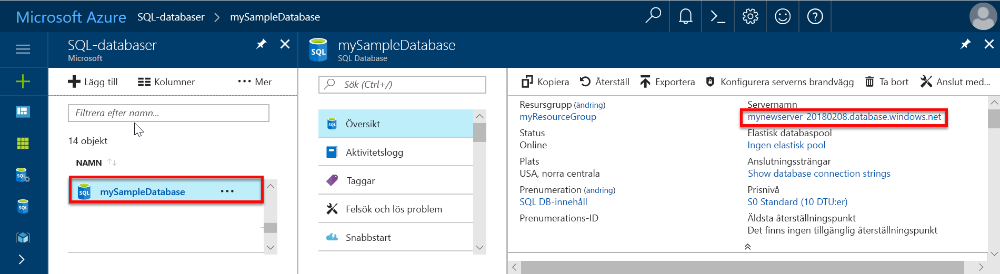

# <a name="migrate-your-sql-server-database-to-azure-sql-database-using-dma"></a>Migrera din SQL Server-databas till Azure SQL Database med DMA

Det är lika enkelt att flytta din SQL Server-databas till en enkel databas i Azure SQL Database som att skapa en tom SQL-databas i Azure och sedan använda [Data Migration Assistant](https://www.microsoft.com/download/details.aspx?id=53595) (DMA) för att importera databasen till Azure. Fler migreringsalternativ finns i [Migrera din databas till Azure SQL Database](sql-database-cloud-migrate.md).

> [!IMPORTANT]
> Om du vill migrera till Azure SQL Database Managed Instance kan du läsa [Migrera från SQL Server till en hanterad instans](sql-database-managed-instance-migrate.md)

I de här självstudierna får du lära dig att:

> [!div class="checklist"]
> * Skapa en tom Azure SQL-databas på Azure-portalen (med en ny eller befintlig Azure SQL Database-server)
> * Skapa en brandvägg på servernivå på Azure-portalen (om ingen har skapats tidigare)
> * Använda [Data Migration Assistant](https://www.microsoft.com/download/details.aspx?id=53595) (DMA) för att importera din SQL Server-databas till den tomma Azure SQL-databasen 
> * Använda [SQL Server Management Studio](https://docs.microsoft.com/sql/ssms/download-sql-server-management-studio-ssms) (SSMS) för att ändra egenskaperna för databasen.

Om du inte har en Azure-prenumeration kan du [skapa ett kostnadsfritt konto ](https://azure.microsoft.com/free/) innan du börjar.

## <a name="prerequisites"></a>Förutsättningar

Följande krav måste uppfyllas för att kunna köra den här självstudiekursen:

- Installerat den senaste versionen av [SQL Server Management Studio](https://docs.microsoft.com/sql/ssms/download-sql-server-management-studio-ssms) (SSMS).  
- Installerat den senaste versionen av [Data Migration Assistant](https://www.microsoft.com/download/details.aspx?id=53595) (DMA).
- Du har identifierat och har åtkomst till en databas att migrera. De här självstudierna använder [SQL Server 2008R2 AdventureWorks OLTP-databasen](https://msftdbprodsamples.codeplex.com/releases/view/59211) på en instans av SQL Server 2008R2 eller senare, men du kan använda valfri databas. Åtgärda kompatibilitetsproblem genom att använda [SQL Server Data Tools](https://docs.microsoft.com/sql/ssdt/download-sql-server-data-tools-ssdt)

## <a name="log-in-to-the-azure-portal"></a>Logga in på Azure-portalen

Logga in på [Azure-portalen](https://portal.azure.com/).

## <a name="create-a-blank-sql-database"></a>Skapa en tom SQL-databas

Azure SQL-databasen skapas med en definierad uppsättning [beräknings-och lagringsresurser](sql-database-service-tiers-dtu.md). Databasen skapas i en [Azure-resursgrupp](../azure-resource-manager/resource-group-overview.md) och i en [logisk Azure SQL Database-server](sql-database-features.md). 

Följ de här stegen om du vill skapa en tom SQL-databas. 

1. Klicka på **Skapa en resurs** längst upp till vänster i Azure Portal.

2. Välj **Databaser** på sidan **Nytt** och välj **Skapa** under **SQL Database** på sidan **Nytt**.

   

3. Fyll i följande information i SQL Database-formuläret (se föregående bild):   

   | Inställning       | Föreslaget värde | Beskrivning | 
   | ------------ | ------------------ | ------------------------------------------------- | 
   | **Databasnamn** | mySampleDatabase | För giltiga databasnamn, se [databasidentifierare](https://docs.microsoft.com/sql/relational-databases/databases/database-identifiers). | 
   | **Prenumeration** | Din prenumeration  | Mer information om dina prenumerationer finns i [Prenumerationer](https://account.windowsazure.com/Subscriptions). |
   | **Resursgrupp** | myResourceGroup | Giltiga resursgruppnamn finns i [Namngivningsregler och begränsningar](https://docs.microsoft.com/azure/architecture/best-practices/naming-conventions). |
   | **Välj källa** | Tom databas | Anger att en tom databas ska skapas. |

4. Klicka på **Server** för att skapa och konfigurera en ny server för den nya databasen. Fyll i formuläret **Ny server** med följande information: 

   | Inställning       | Föreslaget värde | Beskrivning | 
   | ------------ | ------------------ | ------------------------------------------------- | 
   | **Servernamn** | Valfritt globalt unikt namn | Giltiga servernamn finns i [Namngivningsregler och begränsningar](https://docs.microsoft.com/azure/architecture/best-practices/naming-conventions). | 
   | **Inloggning för serveradministratör** | Valfritt giltigt namn | För giltiga inloggningsnamn, se [Databasidentifierare](https://docs.microsoft.com/sql/relational-databases/databases/database-identifiers).|
   | **Lösenord** | Valfritt giltigt lösenord | Lösenordet måste innehålla minst åtta tecken och måste innehålla tecken från tre av följande kategorier: versaler, gemener, siffror och icke-alfanumeriska tecken. |
   | **Plats** | Valfri giltig plats | För information om regioner, se [Azure-regioner](https://azure.microsoft.com/regions/). |

   

5. Klicka på **Välj**.

6. Klicka på **Prisnivå** för att ange tjänstnivå, antalet DTU:er och mängden lagring. Undersök alternativen för mängden DTU:er och lagringsutrymme som du har tillgång till på varje tjänstnivå. 

7. I de här självstudierna väljer du tjänstnivån **Standard** och använder sedan skjutreglaget för att välja **100 DTU:er (S3)** och **400** GB lagring.

   

8. Godkänn förhandsgranskningsvillkoren för att använda alternativet **Lägg till mer lagringsutrymme**. 

   > [!IMPORTANT]
   > Mer än 1 TB lagringsutrymme på premiumnivån är för närvarande tillgängligt i alla regioner förutom följande: USA, västra centrala; Kina, östra; USDoDCentral; USGov Iowa; Tyskland, centrala; USDoDEast; US Gov, sydvästra; Tyskland, nordöstra; Kina, norra. Det maximala lagringsutrymmet på Premium-nivån i andra regioner är begränsat till 1 TB. Se [sidan 11-15 i Aktuella begränsningar]( sql-database-dtu-resource-limits-single-databases.md#single-database-limitations-of-p11-and-p15-when-the-maximum-size-greater-than-1-tb).  

9. När du har valt tjänstenivå, antalet DTU:er och mängden lagring klickar du på **Apply** (Använd).  

10. Välj en **sortering** för den tomma databasen (använd standardvärdet för de här självstudierna). Mer information om sorteringar finns i [Sorteringar](https://docs.microsoft.com/sql/t-sql/statements/collations).

11. Nu när du har fyllt i SQL Database-formuläret klickar du på **Skapa** så att databasen etableras. Etableringen tar några minuter. 

12. Klicka på **Aviseringar** i verktygsfältet för att övervaka distributionsprocessen.
    
     

## <a name="create-a-server-level-firewall-rule"></a>Skapa en brandväggsregel på servernivå

SQL Database-tjänsten skapar en brandvägg på servernivå som hindrar externa program och verktyg från att ansluta till servern eller databaser på servern, såvida inte en brandväggsregel konfigureras som öppnar brandväggen för specifika IP-adresser. Följ de här stegen om du vill skapa en [brandväggsregel på SQL Database-servernivå](sql-database-firewall-configure.md) för din klients IP-adress och aktivera extern anslutning genom SQL Database-brandväggen endast för din IP-adress. 

> [!NOTE]
> SQL Database kommunicerar via port 1433. Om du försöker ansluta inifrån ett företagsnätverk, kan utgående trafik via port 1433 nekas av nätverkets brandvägg. I så fall kommer du inte att kunna ansluta till din Azure SQL Database-server om inte din IT-avdelning öppnar port 1433.
>

1. När distributionen är klar klickar du på **SQL-databaser** på menyn till vänster och klickar sedan på **mySampleDatabase** på sidan **SQL-databaser**. Översiktssidan för databasen öppnas, där du kan se det fullständigt kvalificerade servernamnet (som **mynewserver-20170824.database.windows.net**) och alternativ för ytterligare konfiguration. 

2. Kopiera det här fullständigt kvalificerade servernamnet. Du behöver det när du ansluter till servern och dess databaser i efterföljande snabbstarter. 

    

3. Klicka på **Konfigurera serverns brandvägg** i verktygsfältet. Sidan **Brandväggsinställningar** för SQL Database-servern öppnas. 

    

4. Klicka på **Lägg till klient-IP** i verktygsfältet och lägg till din aktuella IP-adress i en ny brandväggsregel. Med en brandväggsregel kan du öppna port 1433 för en enskild IP-adress eller för IP-adressintervall.

5. Klicka på **Spara**. En brandväggsregel på servernivå för att öppna port 1433 på den logiska servern skapas för din aktuella IP-adress.

6. Klicka på **OK** och stäng sedan sidan **Brandväggsinställningar**.

Nu kan du ansluta till SQL Server Database-servern och dess databaser med SQL Server Management Studio, Data Migration Assistant eller något annat verktyg från den här IP-adressen med det serveradministratörskonto som skapades i föregående procedur.

> [!IMPORTANT]
> Som standard är åtkomst genom SQL Database-brandväggen aktiverad för alla Azure-tjänster. Klicka på **AV** på den här sidan om du vill inaktivera åtkomsten för alla Azure-tjänster.

## <a name="sql-server-connection-information"></a>Anslutningsinformation för en SQL-server

Hämta det fullständigt kvalificerade servernamnet för Azure SQL Database-servern i Azure Portal. Du kan använda det fullständiga servernamnet för att ansluta till din Azure SQL-server med klientverktyg, inklusive Data Migration Assistant och SQL Server Management Studio.

1. Logga in på [Azure-portalen](https://portal.azure.com/).
2. Välj **SQL-databaser** på den vänstra menyn och klicka på databasen på sidan **SQL-databaser**. 
3. I rutan **Essentials** på sidan för Azure Portal för databasen letar du reda på och kopierar **servernamnet**.

   

## <a name="migrate-your-database"></a>Migrera databasen

Följ de här stegen för att använda **[Data Migration Assistant](https://www.microsoft.com/download/details.aspx?id=53595)** för att kontrollera om databasen är klar för migrering till Azure SQL Database och slutföra migreringen.

1. Öppna **Data Migration Assistant**. Du kan köra DMA på alla datorer som är anslutna till den SQL Server-instans som innehåller den databas som du planerar att migrera och som är anslutna till internet. Du behöver inte installera DMS på värddatorn för den SQL Server-instans som du migrerar. Brandväggsregeln som du skapade i föregående procedur måste gälla för den dator som du kör Data Migration Assistant på.

     

2. I den vänstra menyn klickar du på **+ Ny** för att skapa ett **Utvärderingsprojekt**. Fyll i de begärda värdena och klicka sedan på **Skapa**:

   | Inställning      | Föreslaget värde | Beskrivning | 
   | ------------ | ------------------ | ------------------------------------------------- | 
   | Projekttyp | Migrering | Välj att antingen utvärdera din databas för migrering eller välja att utvärdera och migrera som en del av samma arbetsflöde |
   |Projektnamn|Självstudier för migrering| Ett beskrivande namn |
   |Typ av källserver| SQL Server | Detta är den enda källan som stöds för närvarande |
   |Typ av målserver| Azure SQL Database| Alternativen är: Azure SQL Database, SQL Server, SQL Server på virtuella Azure-datorer |
   |Migreringsomfång| Schema och data| Alternativen är: Schema och data, endast schema, endast data |
   
   

3.  På sidan **Välj källa** fyller du i de begärda värdena och klickar sedan på **Anslut**:

    | Inställning      | Föreslaget värde | Beskrivning | 
    | ------------ | ------------------ | ------------------------------------------------- | 
    | servernamn | Ditt servernamn eller din IP-adress | Ditt servernamn eller din IP-adress |
    | Autentiseringstyp | Önskad autentiseringstyp| Alternativ: Windows-autentisering, SQL Server-autentisering, Active Directory-integrerad autentisering, Active Directory-lösenordsautentisering |
    | Användarnamn | Ditt inloggningsnamn | Din inloggning måste ha **CONTROL SERVER**-behörighet |
    | Lösenord| Ditt lösenord | Ditt lösenord |
    | Anslutningsegenskaper| Välj det som passar din miljö av **Kryptera anslutning** eller **Lita på servercertifikatet**. | Välj de egenskaper som är lämpliga för att ansluta till din server |

    

5. Välj en enskild databas från en källserver att migrera till Azure SQL Database och klicka sedan på **Nästa**. För de här självstudierna finns bara en enskild databas.

6. På sidan **Välj mål** fyller du i de begärda värdena och klickar sedan på **Anslut**:

    | Inställning      | Föreslaget värde | Beskrivning | 
    | ------------ | ------------------ | ------------------------------------------------- | 
    | servernamn | Ditt fullständigt kvalificerade Azure Database-servernamn | Ditt fullständigt kvalificerade Azure Database-servernamn från föregående procedur |
    | Autentiseringstyp | SQL Server-autentisering | SQL Server-autentisering är det enda alternativet i de här självstudierna, men Active Directory-integrerad autentisering och Active Directory-lösenordsautentisering stöds också av Azure SQL Database |
    | Användarnamn | Ditt inloggningsnamn | Din inloggning måste ha behörigheten **CONTROL DATABASE** till källdatabasen |
    | Lösenord| Ditt lösenord | Ditt lösenord |
    | Anslutningsegenskaper| Välj det som passar din miljö av **Kryptera anslutning** eller **Lita på servercertifikatet**. | Välj de egenskaper som är lämpliga för att ansluta till din server |

    

7. Markera databasen från målservern som du skapade i föregående procedur och klicka sedan på **Nästa** för att starta utvärderingsprocessen för databasschemat. För de här självstudierna finns bara en enskild databas. Observera att kompatibilitetsnivån för den här databasen är inställd på 140, vilket är standardkompatibilitetsnivån för alla nya databaser i Azure SQL Database.

   > [!IMPORTANT] 
   > När du migrerar din databas till Azure SQL Database kan du välja att köra databasen på en angiven kompatibilitetsnivå för bakåtkompatibilitet. Mer information om effekterna av och alternativ för att köra en databas på en specifik kompatibilitetsnivå finns i [Ändra databasens kompatibilitetsnivå](https://docs.microsoft.com/sql/t-sql/statements/alter-database-transact-sql-compatibility-level). I [Ändra konfiguration av databasomfång](https://docs.microsoft.com/sql/t-sql/statements/alter-database-scoped-configuration-transact-sql) finns även information om ytterligare databasnivåinställningar som rör kompatibilitetsnivåer.
   >

8. På sidan **Välj objekt** ska du, när utvärderingen av källdatabasschemat har slutförts, granska de objekt som har valts för migrering och de objekt som innehåller problem. Kontrollera till exempel om objektet **dbo.uspSearchCandidateResumes** har några funktionsändringar för **SERVERPROPERTY('LCID')** och om objektet **HumanResourcesJobCandidate** har några fulltextsökningsändringar. 

   > [!IMPORTANT] 
   > Beroende på databasens och programmets design kan du, när du migrerar källdatabasen, behöva ändra någon av eller både databasen och ditt program efter migreringen (och i vissa fall före migreringen). Mer information om skillnader jämfört med Transact-SQL som kan påverka migreringen finns i [Azure SQL Database Transact-SQL skillnader](sql-database-transact-sql-information.md).

     

9. Klicka på **Generera SQL-skript** för att skriva schemaobjekten i källdatabasen. 
10. Granska det genererade skriptet och klicka sedan på **Nästa problem** vid behov för att granska de identifierade utvärderingsproblemen och rekommendationer. Rekommendationen för fulltextsökning är exempelvis att du, när du uppdaterar, testar dina program som utnyttjar fulltextfunktionerna. Du kan spara eller kopiera skriptet om du vill.

     

11. Klicka på **Distribuera schemat** och titta på schemamigreringsprocessen.

     

12. När schemamigreringen är klar granskar du resultaten. Om det inte finns några fel klickar du på **Migrera data**.
13. På sidan **Välj tabeller** granskar du de tabeller som valts för migrering och klickar sedan på **Starta datamigrering**.

     

14. Titta på migreringsprocessen.

     

## <a name="connect-to-the-database-with-ssms"></a>Ansluta till databasen med SSMS

Använd [SQL Server Management Studio](https://docs.microsoft.com/sql/ssms/sql-server-management-studio-ssms) för att upprätta en anslutning till Azure SQL Database-servern.

1. Öppna SQL Server Management Studio.

2. I dialogrutan **Anslut till server** anger du följande information:

   | Inställning       | Föreslaget värde | Beskrivning | 
   | ------------ | ------------------ | ------------------------------------------------- | 
   | Servertyp | Databasmotor | Det här värdet är obligatoriskt |
   | servernamn | Fullständigt kvalificerat servernamn | Namnet bör se ut ungefär så här: **mynewserver20170824.database.windows.net**. |
   | Autentisering | SQL Server-autentisering | SQL-autentisering är den enda autentiseringstypen som vi har konfigurerat i den här kursen. |
   | Inloggning | Serveradministratörskontot | Detta är det konto som du angav när du skapade servern. |
   | Lösenord | Lösenordet för serveradministratörskontot | Detta är det lösenord som du angav när du skapade servern. |

   

3. Klicka på **Alternativ** i dialogrutan **Anslut till server**. I avsnittet **Anslut till databas** anger du **mySampleDatabase** så att du ansluter till den här databasen.

     

4. Klicka på **Anslut**. Fönstret Object Explorer öppnas i SSMS. 

5. I Object Explorer expanderar du **Databaser** och sedan **mySampleDatabase** för att visa objekten i exempeldatabasen.

     

## <a name="change-database-properties"></a>Ändra egenskaperna för databasen

Du kan ändra tjänstnivån, prestandanivån och kompatibilitetsnivån med hjälp av SQL Server Management Studio. Under importen rekommenderar vi att du importerar till en databas på en högre prestandanivå för bästa prestanda, men att du skalar ner när importen är klar för att spara pengar, tills du är redo att använda den importerade databasen aktivt. Att ändra kompatibilitetsnivån kan ge bättre prestanda och åtkomst till de senaste funktionerna för Azure SQL Database-tjänsten. När du migrerar en äldre databas bevaras dess databaskompatibilitetsnivå på den lägsta nivån som stöds och är kompatibel med den databas som importeras. Mer information finns i [Förbättrad frågeprestanda med kompatibilitetsnivå 130 i Azure SQL Database](sql-database-compatibility-level-query-performance-130.md).

1. I Object Explorer högerklickar du på **mySampleDatabase** och klickar sedan på **Ny fråga**. Ett frågefönster öppnas som är anslutet till databasen.

2. Kör följande kommando för att ange tjänstnivån till **Standard** och prestandanivån till **S1**.

    ```sql
    ALTER DATABASE mySampleDatabase 
    MODIFY 
        (
        EDITION = 'Standard'
        , MAXSIZE = 250 GB
        , SERVICE_OBJECTIVE = 'S1'
    );
    ```

## <a name="next-steps"></a>Nästa steg 
I de här självstudierna lärde du dig att:

> * Skapa en tom Azure SQL-databas på Azure-portalen 
> * Skapa en brandväggsregel på servernivå på Azure-portalen 
> * Använda [Data Migration Assistant](https://www.microsoft.com/download/details.aspx?id=53595) (DMA) för att importera din SQL Server-databas till den tomma Azure SQL-databasen 
> * Använda [SQL Server Management Studio](https://docs.microsoft.com/sql/ssms/download-sql-server-management-studio-ssms) (SSMS) för att ändra egenskaperna för databasen.

Gå vidare till fler självstudier för att lära dig att skydda databasen.

> [!div class="nextstepaction"]
> [Skydda din Azure SQL-databas](sql-database-security-tutorial.md).


