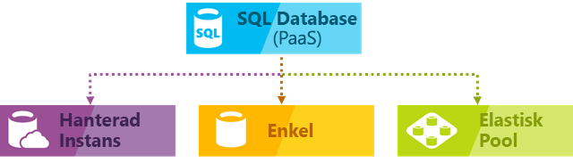
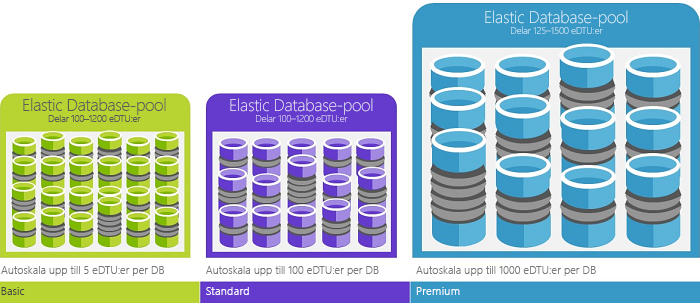

# Vad är tjänsten Azure SQL Database? 

SQL-databasen är en hanterad, allmän relationsdatabastjänst i Microsoft Azure som har stöd för strukturer som relationsdata, JSON, spatial och XML. Med SQL Database får du dynamiskt skalbara prestanda i två olika inköpsmodeller: en [vCore-baserad inköpsmodell](sql-database-service-tiers-vcore.md) och en [DTU-baserad inköpsmodell](sql-database-service-tiers-dtu.md). SQL Database tillhandahåller också alternativ som [kolumnlagringsindex](https://docs.microsoft.com/sql/relational-databases/indexes/columnstore-indexes-overview) för extrem analytisk analys och rapportering, och [minnesintern OLTP](sql-database-in-memory.md) för extrem transaktionell bearbetning. Microsoft hanterar alla korrigeringar och uppdateringar av SQL-kodbasen sömlöst och avlägsnar all hantering av underliggande den infrastrukturen. 

Azure SQL Database innehåller följande distributionsalternativ för en Azure SQL-databas:
- Som en enda databas med en egen uppsättning resurser som hanteras via en logisk server 
- Som en poolindelad databas i en [elastisk pool](sql-database-elastic-pool.md) med en delad uppsättning resurser som hanteras via en logisk server
- Som en del av en uppsättning databaser som kallas en [hanterad instans](sql-database-managed-instance.md) som innehåller system- och användardatabaser och dela en uppsättning resurser

Följande bild visar dessa distributionsalternativ:

 

SQL-databas delar sin kodbas med [Microsoft SQL Server-databasmotorn](https://docs.microsoft.com/sql/sql-server/sql-server-technical-documentation). Med Microsofts moln-först-strategi släpps de senaste funktionerna för SQL Server först till SQL-databasen och sedan till SQL-servern. Den här metoden ger de senaste funktionerna för SQL Server utan merkostnader för uppdatering eller uppgradering och med nya funktioner som testas över miljontals databaser. Mer information om nya funktioner efter hand som de tillkännages finns i:

- **[Azure-produktöversikt för SQL Database](https://azure.microsoft.com/roadmap/?category=databases)** Här reda på vad som är nytt och vad som är på gång. 
- **[Azure SQL Database-blogg](https://azure.microsoft.com/blog/topics/database)**: en plats där SQL Server-produktteamet bloggar om nyheter och funktioner om SQL Database. 

> [!IMPORTANT]
> Funktionsskillnaderna mellan SQL Database och SQL Server finns i [SQL-funktioner](sql-database-features.md). 

SQL Database levererar förutsägbar prestanda med flera resurstyper, tjänstnivåer och storlekar som ger dynamisk skalbarhet utan driftstopp, inbyggd intelligent optimering, global skalbarhet och tillgänglighet och avancerad säkerhet alternativ – allt med nästan obefintlig administration. Dessa funktioner gör att du kan fokusera på snabb apputveckling och att accelerera din tid till marknaden, istället för att ägna värdefull tid och resurser åt att hantera virtuella datorer och infrastruktur. SQL Database-tjänsten används för närvarande i 38 datacenter runtom i världen och många fler datacenter ansluter sig hela tiden, vilket innebär att du kan köra din databas från ett datacenter nära dig.

## Skalbar prestanda och pooler

Med SQL Database, alla databaser vara isolerade från varandra och portabla, var och en med sin egen tjänstnivå inom den [DTU-baserade inköpsmodellen](sql-database-service-tiers-dtu.md) eller [vCore-baserade inköpsmodellen](sql-database-service-tiers-vcore.md) och en garanterad beräkna storleken. SQL Database tillhandahåller olika instansstorlekarna för olika behov och gör att databaserna är poolade för att maximera användningen av resurser och spara pengar.

- Med [SQL Database Managed Instance](sql-database-managed-instance.md), varje instans är isolerad från andra instanser med garanterade resurser. Mer information finns i [SQL Database Managed Instance](sql-database-managed-instance.md).
- Med den [hyperskala tjänstnivå](sql-database-hyperscale.md) (förhandsversion) i vCore köpa modellen, kan du skala till 100 TB med snabb säkerhetskopiering och återställa funktioner.

### Justera prestanda och skalning utan avbrott

SQL Database har en [DTU-baserad inköpsmodell](sql-database-service-tiers-dtu.md) och en [vCore-baserad inköpsmodell](sql-database-service-tiers-vcore.md). 
- Den DTU-baserade inköpsmodellen erbjuder en blandning av beräknings-, minnes- och IO-resurser i tre tjänstnivåer (för lätta till tunga databasarbetsbelastningar): Basic, Standard och Premium. Compute-storlekar inom varje nivå med en blandning av dessa resurser, där du kan lägga till ytterligare lagringsresurser.
- Med den vCore-baserade inköpsmodellen kan du välja antal virtuella kärnor, hur mycket minne och hur mycket och snabbt lagringsutrymme du vill ha.

Du kan skapa din första app på en liten, enkel databas till en låg kostnad per månad på nivån generell användning tjänsten och sedan ändra dess tjänstnivå manuellt eller programmässigt när som helst på kritiska tjänstnivån företag att uppfylla behoven i din lösning. Du kan justera prestandan utan driftavbrott för din app eller dina kunder. Dynamisk skalbarhet gör att databasen transparent kan svara på snabbt förändrade resurskrav och gör det möjligt för dig att endast betala för de resurser som du behöver, när du behöver dem.

> [!IMPORTANT]
> Du kan skala från en tjänstnivå för generell användning och affärskritiska till en [hyperskala tjänstnivå](sql-database-hyperscale.md). Du kan dock ändra prestandanivåerna inom tjänstnivån hyperskala.

Dynamisk skalbarhet skiljer sig från autoskalning. Med Autoskala avses när en tjänst skalar automatiskt utifrån olika kriterier, medan dynamisk skalbarhet möjliggör manuell skalning utan avbrott. Enskilda Azure SQL-databaser stöder manuell dynamisk skalbarhet, men inte Autoskala. Om du vill ha en mer *automatisk* upplevelse bör du använda elastiska pooler, vilka tillåter databaser att dela resurser i en pool utifrån enskilda databasbehov. Det finns dock skript som kan hjälpa dig att automatisera skalbarhet för en enskild Azure SQL-databas. Mer information finns i [Använd PowerShell till att övervaka och skala en enskild SQL-databas](scripts/sql-database-monitor-and-scale-database-powershell.md). 

### Elastiska pooler som maximerar resursutnyttjandet

För många företag och appar räcker det att kunna skapa enkla databaser och reglera prestanda för fristående databaser upp eller ner efter behov, speciellt om användningsmönstren är relativt förutsägbara. Men om du har oförutsägbara användningsmönster, kan det vara svårt att hantera kostnader och din affärsmodell. [Elastiska pooler](sql-database-elastic-pool.md) är utformade för att lösa detta problem. Konceptet är enkelt. Du allokerar prestandaresurser till en pool snarare än till en individuell databas, och betalar för de samlade prestandaresurserna för poolen istället för en enskild databas prestanda. 

   

Med elastiska pooler behöver du inte fokusera på att reglera databasprestanda upp och ner när behovet av resurser varierar. Databaserna i poolen förbrukar den elastiska poolens prestandaresurser efter behov. Databaser i poolen förbrukar, men överskrider inte begränsningarna i poolen. Dina kostnader förblir förutsägbara även om den individuella databasanvändningen inte är det. Dessutom kan du [lägga till och ta bort databaser i poolen](sql-database-elastic-pool-manage-portal.md) och därmed skala din app från några få databaser till tusentals, inom en budget som du själv styr över. Du också styra de minimalt och maximalt tillgängliga resurser som är tillgängliga för databaser i poolen, för att säkerställa att ingen databas i poolen använder alla poolresurser och att varje databas i poolen har garanterade resurser. Läs mer om designmönster för SaaS-program med elastiska pooler i [Designmönster för SaaS-program med flera klienter med SQL Database](sql-database-design-patterns-multi-tenancy-saas-applications.md). 

Skript kan hjälpa dig med att övervaka och skala elastiska pooler. Mer information finns i [Använda PowerShell till att övervaka och skala en elastisk SQL-pool i Azure SQL Database](scripts/sql-database-monitor-and-scale-pool-powershell.md)

> [!IMPORTANT]
> SQL Database Managed Instance stöder inte elastiska pooler.

### Blanda enskilda databaser med databaser i en pool

Vilken väg du än väljer – enskilda databaser eller elastiska pooler – är du inte låst. Du kan blanda enskilda databaser med elastiska pooler och snabbt och enkelt ändra tjänstnivåerna för enskilda databaser och elastiska pooler efter behov. Med den kraft och räckvidd som Azure har, kan du dessutom blanda andra Azure-tjänster med SQL Database, allt för att möta designbehoven för just din unika app, samt styra kostnader och upptäcka nya affärsmöjligheter.

### Omfattande övervakning och aviseringsfunktioner

Men hur kan man jämföra den relativa prestandan för enskilda databaser och elastiska pooler? Hur vet man rätt värden när man reglerar upp eller ner? Du använder de inbyggda verktygen för [prestandaövervakning](sql-database-performance.md) och [avisering](sql-database-insights-alerts-portal.md) i kombination med prestandaklassificering. Med dessa verktyg kan du snabbt utvärdera effekten av att skala upp eller ner baserat på dina aktuella eller projekterade prestandakrav. Mer information finns i avsnittet om [den DTU-baserade inköpsmodellen](sql-database-service-tiers-dtu.md) och [den vCore-baserade inköpsmodellen](sql-database-service-tiers-vcore.md).

Dessutom kan SQL-databasen [skapa mått och diagnostikloggar](sql-database-metrics-diag-logging.md) för lättare övervakning. Du kan konfigurera SQL-databasen för att lagra resursanvändning, personal och sessioner och anslutning till en av dessa Azure-resurser:

- **Azure Storage**: För arkivering av stora mängder telemetri till ett lågt pris
- **Azure Event Hub**: För integrering av telemetri i SQL-databasen med anpassad övervakningslösning eller heta pipelines
- **Azure Log Analytics**: För en inbyggd övervakningslösning med rapporter, aviseringar och problemlösningsfunktioner. Azure Log Analytics är en funktion i den [Operations Management Suite (OMS)](../operations-management-suite/operations-management-suite-overview.md)

    

## Kapacitet för tillgänglighet

Azures branschledande serviceavtal [(SLA)](http://azure.microsoft.com/support/legal/sla/) med 99,99 % tillgänglighet, drivs av ett globalt nätverk med Microsoft-hanterade datacenter som gör att din app är igång 24/7. Azure-plattformen hanterar varje Azure SQL Database fullt ut och garanterar att inga data går förlorade och att datatillgängligheten är hög. Azure hanterar automatiskt uppdatering, säkerhetskopiering, replikering, felidentifiering, fel med underliggande maskinvara, programvara eller nätverk, distribuering av felkorrigeringar, redundans, databasuppgraderingar och andra underhållsåtgärder. Standardtillgänglighet uppnås genom en uppdelning av beräknings och lagringslager. Premiumtillgänglighet uppnås genom integrering av beräkning och lagring på en enda nod för prestanda och sedan implementering av AlwaysOn-tillgänglighetsgrupper på ett och samma ställe. En fullständig beskrivning av kapacitet för hög tillgänglighet i Azure SQL Database finns i [tillgänglighet för SQL Database](sql-database-high-availability.md). SQL Database tillhandahåller dessutom inbyggda funktioner för [kontinuitet för företag och global skalbarhet](sql-database-business-continuity.md), inklusive:

- **[Automatisk säkerhetskopiering](sql-database-automated-backups.md)**: SQL-databasen utför automatiskt fullständiga och differentiella säkerhetskopieringar samt säkerhetskopiering av transaktionsloggen.
- **[Återställning vid tidpunkt](sql-database-recovery-using-backups.md)**: SQL-databasen har stöd för återställning till en valfri tidpunkt inom den automatiska kvarhållningsperioden för säkerhetskopiering.
- **[Aktiv geo-replikering](sql-database-geo-replication-overview.md)**: Med SQL-databasen kan du konfigurera upp till fyra läsbara sekundära databaser i antingen samma eller globalt distribuerade Azure-datacenter.  Till exempel om du har ett SaaS-program med en katalog-databas som har ett stort antal samtidiga skrivskyddade transaktioner, använder aktiv geo-replikering för att aktivera global skrivskyddsskala och tar bort flaskhalsar på primärorsaken som beror på skrivskyddade arbetsbelastningar. 
- **[Redundansgrupper](sql-database-geo-replication-overview.md)**: SQL-databasen kan du aktivera hög tillgänglighet och belastningsutjämning på global nivå, inklusive transparent geo-replikering och redundans för stora mängder databaser och elastiska pooler. Redundansgrupper och aktiv geo-replikering kan du skapa globalt distribuerade SaaS-program med minimala administrationsomkostnader, vilket lämnar all komplex övervakning, rutt, och felstyrning till SQL-databasen.
- **[Zonredundanta databaser](sql-database-high-availability.md)**: Med SQL Database kan du etablera Premium-databaser eller affärskritiska databaser samt elastiska pooler i flera tillgänglighetszoner. Eftersom dessa databaser och elastiska pooler har flera redundanta repliker för hög tillgänglighet får du mer elasticitet om du placerar replikerna i flera tillgänglighetszoner. Du kan även återställa automatiskt från datacenters skalningsfel utan dataförlust.  

## Inbyggd intelligens

Med SQL-databas får du inbyggd intelligens som hjälper dig att avsevärt minska kostnaderna för att köra och hantera databaser och maximera både prestanda och säkerhet för programmet. Miljontals kundarbetsflöden körs dygnet runt, SQL Database samlar in och bearbetar en omfattande mängd telemetridata, samtidigt som den helt respekterar kundens integritet i bakgrunden. Olika algoritmer utvärderar kontinuerligt telemetridata så att tjänsten kan lära sig och anpassa dem med ditt program. Baserat på den här analysen skapar tjänsten rekommendationer som ökar prestandan på ett sätt som är skräddarsytt för din arbetsbelastning. 

### Automatisk prestandaövervakning och justering

SQL Database ger detaljerad inblick i frågor som du behöver övervaka. SQL-databas lär sig om din databas och du kan anpassa ditt databasschema för din arbetsbelastning. SQL-databasen innehåller [rekommendationer för prestandajustering](sql-database-advisor.md) där du kan granska justeringsåtgärder och använda dem. 

Det kan vara svårt att konstant övervaka databasen, särskilt när vi hanterar flera databaser. [Intelligent Insights](sql-database-intelligent-insights.md) gör det här åt dig genom att automatiskt övervaka prestandan för SQL Database med skalning och informerar dig vid problem med prestandaförsämring. Det identifierar rotorsaken till problemet och ger rekommendationer om prestandaförbättring när så är möjligt.

Det kan vara svårt att hantera ett stort antal databaser effektivt, även om du har alla verktyg och rapporter i SQL Database och Azure-portalen. I stället för att övervaka och justera databasen manuellt, kan du delegera vissa åtgärder som övervakar och justerar till SQL Database med hjälp av [automatisk justering](sql-database-automatic-tuning.md). SQL Database tillämpar automatiskt rekommendationer, tester och verifierar var och en av prestandajusteringsåtgärderna för att kontrollera att prestandan ständigt förbättras. På så sätt kan SQL-databasen automatiskt anpassas efter din arbetsbelastning på ett kontrollerat och säkert sätt. Automatisk justering innebär att databasens prestanda övervakas och jämförs noggrant före och efter varje prestandajusteringsåtgärd. Om detta inte förbättrar prestandan återställs justeringsåtgärden.

Idag förlitar sig många av våra samarbetspartners som använder [SaaS appar för flera appar](sql-database-design-patterns-multi-tenancy-saas-applications.md) utöver SQL-databasen på automatisk prestandajustering för att säkerställa att deras program alltid hade stabil och pålitlig prestanda. För dessa minskar funktionen risken för en prestandaincident mitt i natten. Eftersom en del av deras kundbas också använder SQL Server, använder de dessutom samma indexeringsrekommendationer som tillhandahålls av SQL Database för sina SQL Server-kunder.

Det finns två automatiska justeringsaspekter som är [tillgängliga i SQL Database](sql-database-automatic-tuning.md):

- **Automatisk indexhantering**: Identifierar index som bör läggas till i din databas och index som ska tas bort.
- **Plan för automatisk korrigering**: Identifierar problematiska planer och åtgärdar prestandaproblem i SQL-planen (kommer snart, finns redan i SQL Server 2017).

### Anpassningsbar frågebearbetning

Vi lägger också till funktionen för [anpassningsbar frågebearbetning](/sql/relational-databases/performance/adaptive-query-processing) i SQL Database-familjen, inklusive överlagrad körning för tabellvärdesfunktioner med flera instruktioner, minnesfeedback i batchläge och anpassningsbara kopplingar i batchläge. De olika funktionerna med anpassningsbar frågebearbetning tillämpar liknande ”Läs och anpassa”-teknik, vilket bidrar till förmågan att hantera prestandaproblem som berör historiskt olösbara optimeringsproblem.

## Avancerad säkerhet och efterlevnad

SQL-databasen innehåller en uppsättning [inbyggda funktioner för säkerhet och efterlevnad](sql-database-security-overview.md) för att uppfylla olika krav för säkerhet och regelefterlevnad i programmet. 

### Advanced Threat Protection

SQL Advanced Threat Protection är ett enhetligt paket för avancerade SQL-säkerhetsfunktioner. Det innefattar funktioner för att identifiera och klassificera känsliga data, hantera säkerhetsrisker i databasen och identifiera avvikande aktiviteter som kan indikera ett hot mot databasen. Det ger en samlad plats för aktivering och hantering av dessa funktioner.

- [Data Discovery & Classification](sql-database-data-discovery-and-classification.md) (för närvarande i förhandsversion) ger funktioner som är inbyggda i Azure SQL Database för identifiering, klassificering, etikettering och skydd av känsliga data i databasen. Det kan användas för att ge insyn i tillståndet på din databasklassificering och för att spåra åtkomst till känsliga data i och utanför databasen.
- [Vulnerability Assessment](sql-vulnerability-assessment.md) är en tjänst som är enkel att konfigurera och som kan identifiera, spåra och hjälpa dig att åtgärda eventuella säkerhetsrisker i databasen. Den ger inblick i dina säkerhetstillstånd och inkluderar lämpliga åtgärder för att lösa säkerhetsproblem och förbättra databasens skydd.
- [Threat Detection](sql-database-threat-detection.md) identifierar avvikande aktiviteter som visar onormala och potentiellt skadliga försök att komma åt eller utnyttja databasen. Den övervakar kontinuerligt databasen för misstänkta aktiviteter och ger omedelbara säkerhetsaviseringar om potentiella säkerhetsproblem, SQL-inmatningsattacker samt avvikande åtkomstmönster i databasen. Threat Detection-aviseringar ger detaljerad information om misstänkt aktivitet och rekommenderar åtgärder för att undersöka och minska risken.

### Granskning för efterlevnad och säkerhet

[SQL-databasgranskning](sql-database-auditing.md) spårar databashändelser och skriver händelserna i en granskningslogg i ditt Azure Storage-konto. Granskning kan hjälpa dig att upprätthålla regelefterlevnad, förstå databasaktiviteter och få insyn i avvikelser och fel som kan tyda på affärsproblem eller potentiella säkerhetsöverträdelser.

### Datakryptering

SQL Database skyddar dina data genom att tillhandahålla kryptering för data i rörelse med [Transport Layer Security](https://support.microsoft.com/kb/3135244), för vilande data med [Transparent Data Encryption](https://docs.microsoft.com/sql/relational-databases/security/encryption/transparent-data-encryption-azure-sql) och för data under användning med [Always Encrypted](https://docs.microsoft.com/sql/relational-databases/security/encryption/always-encrypted-database-engine).

### Azure Active Directory-integrering och multifaktorautentisering

Med SQL Database kan du centralt hantera identiteter för databasanvändare och andra Microsoft-tjänster med [Azure Active Directory-integrering](sql-database-aad-authentication.md). Den här funktionen förenklar hanteringen av behörighet och ger ökad säkerhet. Azure Active Directory stöder [multifaktorautentisering](sql-database-ssms-mfa-authentication.md) (MFA) för att öka säkerheten för data och program med stöd för en process med enkel inloggning.

### Efterlevnadscertifiering

SQL Database granskas regelbundet och har certifierats mot flera efterlevnadsstandarder. Mer information finns i [Microsoft Azure säkerhetscenter](https://azure.microsoft.com/support/trust-center/), där du hittar den senaste listan med [SQL Database-kompatibilitetscertifieringar](https://azure.microsoft.com/support/trust-center/services/).

## Lättanvända verktyg

SQL Database gör byggandet och underhållet av appar enklare och mer produktivt. Med SQL Database kan du fokusera på det du gör väst: bygga bra appar. Du kan hantera och utveckla SQL Database med verktyg och kunskaper som du redan har.

- **[Azure-portalen](https://portal.azure.com/)**: ett webbaserat program för att hantera alla Azure-tjänster 
- **[SQL Server Management Studio](https://docs.microsoft.com/sql/ssms/download-sql-server-management-studio-ssms)**: ett kostnadsfritt, nedladdningsbart klientprogram för att hantera all SQL-infrastruktur från SQL Server till SQL Database
- **[SQL Server Data Tools i Visual Studio](https://docs.microsoft.com/sql/ssdt/download-sql-server-data-tools-ssdt)**: ett kostnadsfritt, nedladdningsbart klientprogram för att utveckla relationsdatabaser i SQL Server, Azure SQL-databaser, Integration Services-paket, datamodeller för Analysis Services och Reporting Services-rapporter.
- **[Visual Studio Code](https://code.visualstudio.com/docs)** är en kostnadsfri, nedladdningsbar kodredigerare med öppen källkod för Windows, macOS och Linux som har stöd för tillägg, inklusive [mssql-tillägget](https://aka.ms/mssql-marketplace) för frågor mot Microsoft SQL Server, Azure SQL Database och SQL Data Warehouse.

Skapa program med Python, Java, Node.js, PHP, Ruby och .NET på MacOS, Linux och Windows har stöd för SQL-databas. SQL Database stöder samma [anslutningsbibliotek](sql-database-libraries.md) som SQL Server.

## Tala med teknikteamet för SQL Server

- [DBA Stack Exchange](https://dba.stackexchange.com/questions/tagged/sql-server): Ställ frågor om databasadministration
- [Stack Overflow](http://stackoverflow.com/questions/tagged/sql-server): Ställ frågor om utveckling
- [MSDN-forum](https://social.msdn.microsoft.com/Forums/home?category=sqlserver): Ställ tekniska frågor
- [Feedback](http://aka.ms/sqlfeedback): Rapportera fel och kom med förslag
- [Reddit](https://www.reddit.com/r/SQLServer/): Diskutera SQL Server

## Nästa steg

- Se [Prissidan](https://azure.microsoft.com/pricing/details/sql-database/) för en kostnadsjämförelse och kostnadsberäknare för enskilda databaser och elastiska pooler.

- Läs följande snabbstarter innan du börjar:

  - [Skapa en SQL-databas i Azure Portal](sql-database-get-started-portal.md)  
  - [Skapa en SQL-databas med Azure CLI](sql-database-get-started-cli.md)
  - [Skapa en SQL Database med PowerShell](sql-database-get-started-powershell.md)

- En uppsättning Azure CLI- och PowerShell-exempel finns här:
  - [Azure CLI-exempel för SQL Database](sql-database-cli-samples.md)
  - [Azure PowerShell-exempel för SQL Database](sql-database-powershell-samples.md)
