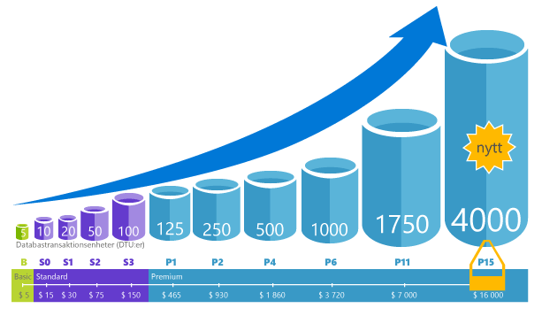

<properties
    pageTitle="SQL Database: Vad är en DTU? | Microsoft Azure"
    description="Förstå vad en Azure SQL Database-transaktionsenhet är."
    keywords="databasalternativ, databasprestanda"
    services="sql-database"
    documentationCenter=""
    authors="CarlRabeler"
    manager="jhubbard"
    editor="CarlRabeler"/>

<tags
    ms.service="sql-database"
    ms.devlang="na"
    ms.topic="get-started-article"
    ms.tgt_pltfrm="na"
    ms.workload="NA"
    ms.date="09/06/2016"
    ms.author="carlrab"/>

# Förklarar vad databastransaktionsenheter (DTU, Database Transaction Unit) och elastiska databastransaktionsenheter (eDTU) är.

Den här artikeln förklarar vad databastransaktionsenheter (DTU:er) och elastiska databastransaktionsenheter (eDTU:er) är och vad som händer när du når det högsta antalet tillåtna DTU:er eller eDTU:er.  

## Vad är databastransaktionsenheter (DTU:er)?

En DTU är en måttenhet för de resurser som garanterat är tillgängliga för en fristående Azure SQL-databas på en specifik prestandanivå på en [tjänstnivå för fristående databaser](sql-database-service-tiers.md#standalone-database-service-tiers-and-performance-levels). En DTU är ett kombinerat mått på processor, minne, data-I/O och transaktionsloggs-I/O i ett förhållande som bestäms av en benchmark-arbetsbelastning för OLTP som är utformad att representera verkliga OLTP-arbetsbelastningar. En fördubbling av DTU:erna genom en ökning av prestandanivån för en databas är likställt med en fördubbling av uppsättningen resurser som är tillgängliga för databasen. En premium P11-databas med 1 750 DTU:er erbjuder exempelvis 350 gånger mer DTU-beräkningskraft än en grundläggande databas med 5 DTU:er. Information om metodiken bakom benchmark-arbetsbelastningen för OLTP som används för att fastställa DTU-kombinationen finns i [Översikt över SQL Database-benchmark](sql-database-benchmark-overview.md).

Du kan [byta tjänstnivå](sql-database-scale-up.md) när som helst med minimalt avbrott för dina program (normalt mindre än fyra sekunder). För många företag och appar, räcker det att kunna skapa databaser och reglera prestandan för enskilda databaser upp eller ner efter behov, speciellt där användningsmönster är relativt förutsägbara. Men om du har oförutsägbara användningsmönster, kan det vara svårt att hantera kostnader och din affärsmodell. I det här scenariot använder du en elastisk pool med ett visst antal eDTU:er.

## Vad är elastiska databastransaktionsenheter (eDTU:er)

En eDTU är en måttenhet för den uppsättning resurser (DTU:er) som kan delas mellan en uppsättning databaser på en Azure SQL server – kallat en [elastisk pool](sql-database-elastic-pool.png). Elastiska pooler erbjuder en enkel kostnadseffektiv lösning för att hantera prestandamål för flera databaser med mycket varierande och oförutsägbara användningsmönster. Mer information finns i [Elastiska pooler och tjänstnivåer](sql-database-service-tiers.md#elastic-pool-service-tiers-and-performance-in-edtus).

En pool tilldelas ett bestämt antal eDTU:er till ett fast pris. I poolen kan de enskilda databaserna skalas automatiskt inom fastställda parametrar. Vid hög belastning kan en databas använda fler eDTU:er för att uppfylla efterfrågan. Databaser med lätt arbetsbelastning förbrukar mindre, och databaser utan belastning förbrukar inga eDTU:er. Genom att etablera resurser för hela poolen i stället för enskilda databaser kan du förenkla dina hanteringsuppgifter. Dessutom har du en förutsägbar budget för poolen.

Ytterligare eDTU:er kan läggas till i en befintlig pool utan driftavbrott för databasen och utan att databaserna i den elastiska poolen påverkas. På samma sätt kan eDTU:er som inte längre behövs tas bort från en befintlig pool när som helst. Du kan lägga till eller ta bort databaser i poolen. Om du vet att en databas underförbrukar resurser tar du bort den.

## Hur vet jag hur många DTU:er min arbetsbelastning behöver?

Om du vill migrera en befintlig lokal VM-arbetsbelastning eller en VM-arbetsbelastning i SQL Server till Azure SQL Database kan du använda [DTU-kalkylatorn](http://dtucalculator.azurewebsites.net/) för att göra en ungefärlig uppskattning av hur många DTU:er du behöver. För en befintlig Azure SQL Database-arbetsbelastning kan du använda [SQL Database Query Performance Insight](sql-database-query-performance.md) för att förstå databasens resursförbrukning (DTU:er) och få djupare insikt i hur du kan optimera arbetsbelastningen. Du kan också använda [sys.dm_db_ resource_stats](https://msdn.microsoft.com/library/dn800981.aspx)-DMV:n om du vill hämta information om resursförbrukningen för den senaste timmen. Du kan också fråga katalogvyn [sys.resource_stats](http://msdn.microsoft.com/library/dn269979.aspx) om du vill få samma data för de senaste 14 dagarna, dock med lägre tillförlitlighet med medelvärden på fem minuter.

## Hur vet jag om jag kan dra nytta av en elastisk pool med resurser?

Pooler lämpar sig för ett stort antal databaser med specifika användningsmönster. För en viss databas kännetecknas det här mönstret av låg genomsnittlig användning med relativt ovanliga användningstoppar. SQL Database utvärderar automatiskt den historiska resursanvändningen för databaser på en befintlig SQL Database-server och rekommenderar lämplig poolkonfiguration på Azure Portal. Mer information finns i [När ska jag använda en elastisk databaspool?](sql-database-elastic-pool-guidance.md)

## Vad händer när jag når maxgränsen för antalet DTU:er?

Prestandanivåerna kalibreras och regleras för att tillhandahålla nödvändiga resurser så att din databasarbetsbelastning kan köra upp till den högsta gränsen som tillåts för din valda tjänstnivå/prestandanivå. Om din arbetsbelastning når någon av gränserna för processor, data-IO eller logg-IO tillhandahålls fortfarande resurser på den högsta tillåtna nivån, men du kan märka att svarstiderna för dina frågor blir längre. Dessa gränser resulterar inte i fel, men i en långsammare arbetsbelastning, såvida inte fördröjningarna blir så allvarliga att tidsgränsen för frågorna överskrids. Om du når gränsen för det högsta antalet tillåtna samtidiga användarsessioner/begäranden (arbetstrådar) returneras explicita fel. Information om gränserna för andra resurser än processor, minne, data-I/O och transaktionsloggs-I/O finns i [Azure SQL Database-resursgränser](sql-database-resource-limits.md).

## Nästa steg

- Information om DTU:er och eDTU:er som är tillgängliga för fristående databaser och för elastiska pooler finns i [Tjänstnivå](sql-database-service-tiers.md).
- Information om gränserna för andra resurser än processor, minne, data-I/O och transaktionsloggs-I/O finns i [Azure SQL Database-resursgränser](sql-database-resource-limits.md).
- Information som hjälper dig att avgöra din förbrukning (DTU:er) finns i [SQL Database Query Performance Insight](sql-database-query-performance.md).
- Information om metodiken bakom benchmark-arbetsbelastningen för OLTP som används för att fastställa DTU-kombinationen finns i [Översikt över SQL Database-benchmark](sql-database-benchmark-overview.md).

<!--HONumber=Sep16_HO3-->

