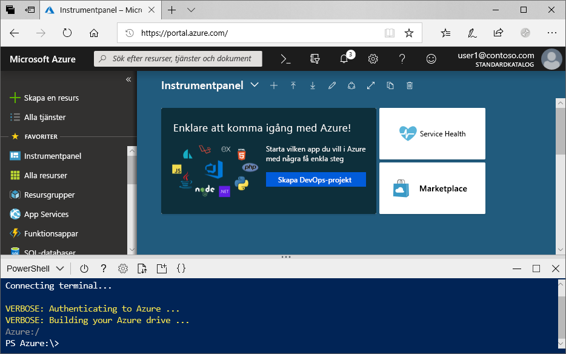
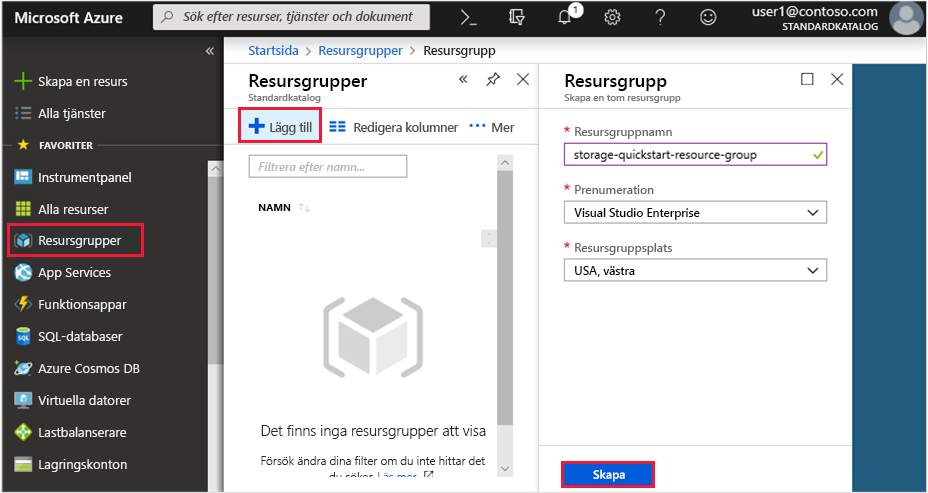
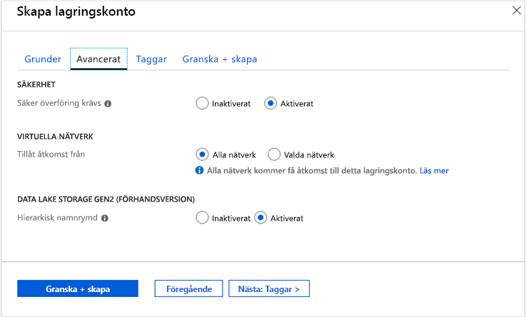

# <a name="quickstart-create-an-azure-data-lake-storage-gen2-storage-account"></a>Snabbstart: Skapa ett Azure Data Lake Storage Gen2-lagringskonto

Azure Data Lake Storage Gen2 [stöder ett hierarkiskt namnområde](data-lake-storage-introduction.md) som innehåller ett inbyggt directory-baserad filsystem som skräddarsytts för att fungera med Hadoop Distributed File System (HDFS). Du kan komma åt Data Lake Storage Gen2-data från HDFS via [ABFS-drivrutinen](data-lake-storage-abfs-driver.md).

Den här snabbstarten visar hur du skapar ett konto med [Azure-portalen](https://portal.azure.com/), [Azure PowerShell](https://docs.microsoft.com/powershell/azure/overview) eller [Azure CLI](https://docs.microsoft.com/cli/azure?view=azure-cli-latest).

## <a name="prerequisites"></a>Nödvändiga komponenter

Om du inte har en Azure-prenumeration kan du skapa ett [kostnadsfritt konto](https://azure.microsoft.com/free/) innan du börjar. 

|           | Krav |
|-----------|--------------|
|Portalen     | Inget         |
|PowerShell | Den här snabbstarten kräver PowerShell-modul Az.Storage-version **0.7** eller senare. Kör kommandot `Get-Module -ListAvailable Az.Storage` för att hitta din nuvarande version. Om inga resultat visas när du kör detta kommando eller om en annan version än **0.7** visas måste du uppgradera powershell-modulen. Se avsnittet [Uppgradera powershell-modulen](#upgrade-your-powershell-module) i den här guiden.
|CLI        | Du kan logga in på Azure och köra Azure CLI-kommandon i ett av två sätt: <ul><li>Du kan köra CLI-kommandon från Azure-portalen, i Azure Cloud Shell </li><li>Du kan installera CLI och köra CLI-kommandon lokalt</li></ul>|

När du arbetar på kommandoraden kan du välja om du vill köra Azure Cloud Shell eller installera CLI lokalt.

### <a name="use-azure-cloud-shell"></a>Använda Azure Cloud Shell

Azure Cloud Shell är ett kostnadsfritt Bash-gränssnitt som du kan köra direkt i Azure-portalen. Den har Azure CLI förinstallerat och har konfigurerats för användning med ditt konto. Klicka på knappen **Cloud Shell** på menyn längst upp till höger i Azure-portalen:

[](https://portal.azure.com)

Knappen startar ett interaktivt gränssnitt som du kan använda för att köra stegen i den här snabbstarten:

[](https://portal.azure.com)

### <a name="install-the-cli-locally"></a>Installera CLI lokalt

Du kan även installera och använda Azure CLI lokalt. För den här snabbstarten krävs att du kör Azure CLI version 2.0.38 eller senare. Kör `az --version` för att hitta versionen. Om du behöver installera eller uppgradera kan du läsa informationen i [Installera Azure CLI](/cli/azure/install-azure-cli).

## <a name="create-a-storage-account-with-azure-data-lake-storage-gen2-enabled"></a>Skapa ett lagringskonto med Azure Data Lake Storage Gen2 aktiverat

Innan du skapar ett konto ska du först skapa en resursgrupp som fungerar som en logisk container för lagringskonton eller någon annan Azure-resurs som du skapar. Om du vill rensa de resurser som har skapats med den här snabbstarten kan du helt enkelt ta bort resursgruppen. När du tar bort resursgruppen raderas även det kopplade lagringskontot och eventuella andra resurser som är kopplade till resursgruppen. Mer information om resursgrupper finns i [Översikt över Azure Resource Manager](../../azure-resource-manager/resource-group-overview.md).

> [!NOTE]
> Du måste skapa nya lagringskonton av typen **StorageV2 (generell användning V2)** för att kunna utnyttja Data Lake Storage Gen2-funktionerna.  

Mer information om lagringskonton finns i [kontoöversikten för Azure Storage](../common/storage-account-overview.md).

Tänk på dessa regler när du namnger lagringskontot:

- Namnet på ett lagringskonto måste vara mellan 3 och 24 tecken långt och får endast innehålla siffror och gemener.
- Namnet på ditt lagringskonto måste vara unikt i Azure. Det får inte finnas två lagringskonton med samma namn.

## <a name="create-an-account-using-the-azure-portal"></a>Skapa ett konto med hjälp av Azure-portalen

Logga in på [Azure Portal](https://portal.azure.com).

### <a name="create-a-resource-group"></a>Skapa en resursgrupp

Följ de här stegen för att skapa en resursgrupp i Azure-portalen:

1. I Azure-portalen expanderar du menyn på vänster sida för att öppna tjänstemenyn och väljer **Resursgrupper**.
2. Klicka på knappen **Lägg till** för att lägga till en ny resursgrupp.
3. Ange ett namn för den nya resursgruppen.
4. Välj den prenumeration där du vill skapa den nya resursgruppen.
5. Välj platsen för resursgruppen.
6. Klicka på knappen **Skapa**.  

   

### <a name="create-a-general-purpose-v2-storage-account"></a>Skapa ett v2-lagringskonto för generell användning

Följ de här stegen för att skapa ett GPv2-konto för generell användning i Azure-portalen:

> [!NOTE]
> Den hierarkiska namnrymden är för närvarande tillgänglig i alla offentliga regioner.

1. I Azure-portalen expanderar du menyn på vänster sida för att öppna tjänstemenyn och välja **Alla tjänster**. Rulla ned till **lagring** och välj **lagringskonton**. På fönstret **lagringskonton** som visas, väljer du **lägg till**.
2. Välj den **prenumeration** och **resursgrupp** som du skapade tidigare.
3. Ange ett namn för lagringskontot.
4. Ange **USA, västra 2** som **Plats**
5. Lämna dessa fält med respektive standardvärde: **Prestanda**, **kontotyp**, **replikering**, **åtkomstnivå**.
6. Välj den prenumeration där du vill skapa lagringskontot.
7. Välj **Nästa : Avancerad >**
8. Lämna standardvärdena i fälten **SECURITY** och **VIRTUELLA NÄTVERK**.
9. I avsnittet **Data Lake Storage Gen2** anger du **Hierarkisk namnrymd** till **Aktiverad**.
10. Skapa lagringskontot genom att klicka på **Granska + Skapa**.

    

Nu har ditt lagringskonto skapats via Portal.

### <a name="clean-up-resources"></a>Rensa resurser

Ta bort en resursgrupp med Azure-portalen:

1. I Azure-portalen expanderar du menyn på vänster sida för att öppna tjänstemenyn och väljer **Resursgrupper** för att visa listan över dina resursgrupper.
2. Leta reda på den resursgrupp du vill ta bort och högerklicka på knappen **Mer** (**...**) till höger om listan.
3. Välj **Ta bort resursgrupp** och bekräfta.

## <a name="create-an-account-using-powershell"></a>Skapa ett lagringskonto med PowerShell

Installera först den senaste versionen av [PowerShellGet](https://docs.microsoft.com/powershell/gallery/installing-psget)-modulen.

Sedan kan uppgradera din powershell-modulen, logga in på Azure-prenumerationen, skapa en resursgrupp och sedan skapa ett lagringskonto.

### <a name="upgrade-your-powershell-module"></a>Uppgradera din PowerShell-modul

[!INCLUDE [updated-for-az](../../../includes/updated-for-az.md)]

För att interagera med Data Lake Storage Gen2 med hjälp av PowerShell måste du installera Az.Storage Modulversion **0.7** eller senare.

Starta genom att öppna en PowerShell-session med förhöjd behörighet.

Installera modulen Az.Storage

```powershell
Install-Module Az.Storage -Repository PSGallery -AllowPrerelease -AllowClobber -Force
```

### <a name="sign-in-to-your-azure-subscription"></a>Logga in på Azure-prenumerationen

Använd kommandot `Login-AzAccount` och följ anvisningarna på skärmen för att autentisera.

```powershell
Login-AzAccount
```

### <a name="create-a-resource-group"></a>Skapa en resursgrupp

Om du vill skapa en resursgrupp med PowerShell använder du kommandot [New-AzResourceGroup](/powershell/module/az.resources/new-azresourcegroup): 

> [!NOTE]
> Den hierarkiska namnrymden är för närvarande tillgänglig i alla offentliga regioner.

```powershell
# put resource group in a variable so you can use the same group name going forward,
# without hardcoding it repeatedly
$resourceGroup = "storage-quickstart-resource-group"
$location = "westus2"
New-AzResourceGroup -Name $resourceGroup -Location $location
```

### <a name="create-a-general-purpose-v2-storage-account"></a>Skapa ett v2-lagringskonto för generell användning

Om du vill skapa ett GPv2-lagringskonto för generell användning från PowerShell med lokalt redundant lagring (LRS) använder du kommandot [New-AzStorageAccount](/powershell/module/az.storage/New-azStorageAccount):

```powershell
$location = "westus2"

New-AzStorageAccount -ResourceGroupName $resourceGroup `
  -Name "storagequickstart" `
  -Location $location `
  -SkuName Standard_LRS `
  -Kind StorageV2 `
  -EnableHierarchicalNamespace $True
```

### <a name="clean-up-resources"></a>Rensa resurser

Om du vill ta bort resursgruppen och dess kopplade resurser, inklusive det nya lagringskontot så använder du kommandot [Remove-AzResourceGroup](/powershell/module/az.resources/remove-azresourcegroup): 

```powershell
Remove-AzResourceGroup -Name $resourceGroup
```

## <a name="create-an-account-using-azure-cli"></a>Skapa ett konto med Azure CLI

Om du vill starta Azure Cloud Shell, logga in på den [Azure-portalen](https://portal.azure.com).

Om du vill logga in på den lokala installationen av CLI kör inloggningskommandot:

```cli
az login
```

### <a name="add-the-cli-extension-for-azure-data-lake-gen-2"></a>Lägg till CLI-tillägg för Azure Data Lake Gen 2

För att kunna interagera med Data Lake Storage Gen2 via CLI måste du lägga till tillägget för gränssnittet.

Det gör du genom att ange följande kommando i Cloud Shell eller ett lokalt gränssnitt: `az extension add --name storage-preview`

### <a name="create-a-resource-group"></a>Skapa en resursgrupp

Om du vill skapa en ny resursgrupp med Azure CLI använder du kommandot [az group create](/cli/azure/group).

```azurecli-interactive
az group create `
    --name storage-quickstart-resource-group `
    --location westus2
```

> [!NOTE]
> > Den hierarkiska namnrymden är för närvarande tillgänglig i alla offentliga regioner.

### <a name="create-a-general-purpose-v2-storage-account"></a>Skapa ett v2-lagringskonto för generell användning

Om du vill skapa ett allmänt GPv2-lagringskonto för generell användning från Azure CLI med lokalt redundant lagring använder du kommandot [az storage account create](/cli/azure/storage/account).

```azurecli-interactive
az storage account create `
    --name storagequickstart `
    --resource-group storage-quickstart-resource-group `
    --location westus2 `
    --sku Standard_LRS `
    --kind StorageV2 `
    --hierarchical-namespace true
```

### <a name="clean-up-resources"></a>Rensa resurser

Om du vill ta bort resursgruppen och dess kopplade resurser, inklusive det nya lagringskontot, använder du kommandot [az group delete](/cli/azure/group).

```azurecli-interactive
az group delete --name myResourceGroup
```

## <a name="next-steps"></a>Nästa steg

I den här snabbstarten har du skapat ett lagringskonto med Data Lake Storage Gen2-funktioner. Om du vill lära dig hur du laddar upp och ned blobar till och från lagringskontot kan du läsa följande avsnitt.

* [AzCopy v10](https://docs.microsoft.com/azure/storage/common/storage-use-azcopy-v10?toc=%2fazure%2fstorage%2fblobs%2ftoc.json)
