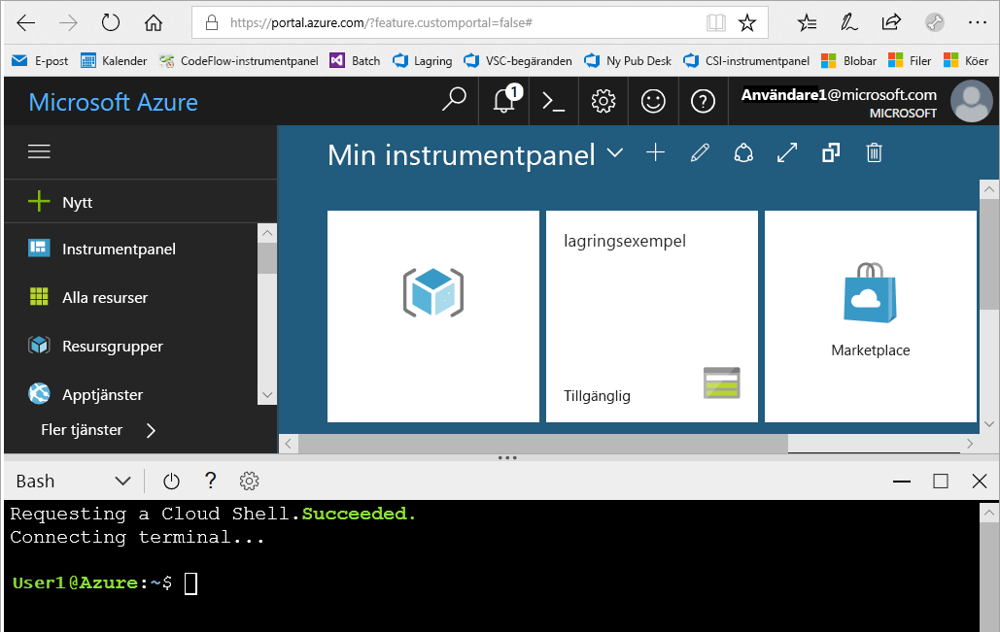

# <a name="create-a-blockblobstorage-account"></a>Skapa ett BlockBlobStorage-konto

Med BlockBlobStorage-kontots typ kan du skapa block-blobbar med förstklassiga prestanda egenskaper. Den här typen av lagrings konto är optimerad för arbets belastningar med höga transaktions priser eller som kräver mycket snabba åtkomst tider. Den här artikeln visar hur du skapar ett BlockBlobStorage-konto med hjälp av Azure Portal, Azure CLI eller Azure PowerShell.

Mer information om BlockBlobStorage-konton finns i [Översikt över Azure Storage-konto](https://docs.microsoft.com/azure/storage/common/storage-account-overview).

## <a name="prerequisites"></a>Krav

Om du inte har en Azure-prenumeration kan du skapa ett [kostnadsfritt konto](https://azure.microsoft.com/free/) innan du börjar.

# <a name="portal"></a>[Portal](#tab/azure-portal)

Inga.

# <a name="powershell"></a>[PowerShell](#tab/azure-powershell)

Den här instruktions artikeln kräver Azure PowerShell module AZ version 1.2.0 eller senare. Kör `Get-Module -ListAvailable Az` för att hitta din nuvarande version. Om du behöver installera eller uppgradera kan du läsa [Install Azure PowerShell module](/powershell/azure/install-Az-ps) (Installera Azure PowerShell-modul).

# <a name="azure-cli"></a>[Azure CLI](#tab/azure-cli)

Du kan logga in på Azure och köra Azure CLI-kommandon på ett av två sätt:

- Du kan köra CLI-kommandon inifrån Azure Portal i Azure Cloud Shell.
- Du kan installera CLI-och kör CLI-kommandona lokalt.

### <a name="use-azure-cloud-shell"></a>Använda Azure Cloud Shell

Azure Cloud Shell är ett kostnadsfritt Bash-gränssnitt som du kan köra direkt i Azure Portal. Azure CLI är förinstallerat och konfigurerat för användning med ditt konto. Klicka på knappen **Cloud Shell** på menyn i det övre högra avsnittet av Azure Portal:

[](https://portal.azure.com)

Knappen startar ett interaktivt gränssnitt som du kan använda för att köra stegen som beskrivs i den här instruktions artikeln:

[](https://portal.azure.com)

### <a name="install-the-cli-locally"></a>Installera CLI lokalt

Du kan även installera och använda Azure CLI lokalt. Den här instruktions artikeln kräver att du kör Azure CLI-version 2.0.46 eller senare. Kör `az --version` för att hitta versionen. Om du behöver installera eller uppgradera kan du läsa informationen i [Installera Azure CLI](/cli/azure/install-azure-cli). 

---

## <a name="sign-in-to-azure"></a>Logga in på Azure

# <a name="portal"></a>[Portal](#tab/azure-portal)

Logga in på [Azure-portalen](https://portal.azure.com).

# <a name="powershell"></a>[PowerShell](#tab/azure-powershell)

Logga in på din Azure-prenumeration med `Connect-AzAccount` kommandot och följ anvisningarna på skärmen för att autentisera.

```powershell
Connect-AzAccount
```

# <a name="azure-cli"></a>[Azure CLI](#tab/azure-cli)

Logga in på [Azure Portal](https://portal.azure.com)för att starta Azure Cloud Shell.

Logga in på den lokala installationen av CLI genom att köra kommandot [AZ login](/cli/azure/reference-index#az-login) :

```azurecli
az login
```

---

## <a name="create-a-blockblobstorage-account"></a>Skapa ett BlockBlobStorage-konto

## <a name="portal"></a>[Portal](#tab/azure-portal)
Följ dessa steg om du vill skapa ett BlockBlobStorage-konto i Azure Portal:

1. I Azure Portal väljer du **alla tjänster** > **lagrings** kategorin > **lagrings konton**.

2. Under **lagrings konton** väljer du **Lägg till**.

3. I fältet **prenumeration** väljer du den prenumeration där du vill skapa lagrings kontot.

4. I fältet **resurs grupp** väljer du en befintlig resurs grupp eller väljer **Skapa ny**, och anger ett namn för den nya resurs gruppen.

5. I fältet **namn på lagrings konto** anger du ett namn för kontot. Observera följande rikt linjer:

   - Namnet måste vara unikt i Azure.
   - Namnet måste innehålla mellan tre och 24 tecken.
   - Namnet får bara innehålla siffror och gemena bokstäver.

6. I fältet **plats** väljer du en plats för lagrings kontot eller använder standard platsen.

7. Konfigurera följande för resten av inställningarna:

   |Fält     |Värde  |
   |---------|---------|
   |**Prestanda**    |  Välj **Premium**.   |
   |**Typ av konto**    | Välj **BlockBlobStorage**.      |
   |**Replikering**    |  Lämna standardinställningen för **Lokalt Redundant lagring (LRS)**.      |

   

8. Välj fliken **Avancerat** .

9. Om du vill optimera ditt lagrings konto för data analys ska du ange **hierarkiskt namn område** till **aktiverat**. Annars lämnar du det här alternativet inställt på standardvärdet. Om du aktiverar den här inställningen med ditt BlockBlobStorage-konto får du [Premium-nivån för data Lake Storage](premium-tier-for-data-lake-storage.md).  Mer information om Data Lake Storage finns i [Introduktion till Azure Data Lake Storage Gen2](data-lake-storage-introduction.md).

8. Välj **Granska + skapa** för att granska inställningarna för lagrings kontot.

9. Välj **Skapa**.

## <a name="azure-powershell"></a>[Azure PowerShell](#tab/azure-powershell)

[!INCLUDE [updated-for-az](../../../includes/updated-for-az.md)]

1. Öppna en upphöjd Windows PowerShell-session (kör som administratör).

2. Kör följande kommando för att kontrol lera att den senaste versionen av `Az` PowerShell-modulen är installerad.

   ```powershell
   Install-Module -Name Az -AllowClobber
   ```

3. Öppna en ny PowerShell-konsol och logga in med ditt Azure-konto.

   ```powershell
   Connect-AzAccount -SubscriptionId <SubscriptionID>
   ```

4. Om det behövs skapar du en ny resurs grupp. Ersätt värdena i citat tecken och kör följande kommando.

   ```powershell
   $resourcegroup = "new_resource_group_name"
   $location = "region_name"
   New-AzResourceGroup -Name $resourceGroup -Location $location
   ```

5. Skapa BlockBlobStorage-kontot. Ersätt värdena i citat tecken och kör följande kommando.

   ```powershell
   $resourcegroup = "resource_group_name"
   $storageaccount = "new_storage_account_name"
   $location = "region_name"

   New-AzStorageAccount -ResourceGroupName $resourcegroup -Name $storageaccount -Location $location -Kind "BlockBlobStorage" -SkuName "Premium_LRS"
   ```
   Om du vill optimera ditt lagrings konto för data analys kan du lägga till `-EnableHierarchicalNamespace $True` i kommandot. Om du aktiverar den här inställningen med ditt BlockBlobStorage-konto får du [Premium-nivån för data Lake Storage](premium-tier-for-data-lake-storage.md).  Mer information om Data Lake Storage finns i [Introduktion till Azure Data Lake Storage Gen2](data-lake-storage-introduction.md).

## <a name="azure-cli"></a>[Azure CLI](#tab/azure-cli)

Om du vill skapa ett block-BLOB-konto med hjälp av Azure CLI måste du först installera Azure CLI v. 2.0.46 eller en senare version. Kör `az --version` för att hitta versionen. Om du behöver installera eller uppgradera kan du läsa informationen i [Installera Azure CLI](/cli/azure/install-azure-cli).

1. Logga in på din Azure-prenumeration.

   ```azurecli
   az login
   ```

2. Om det behövs skapar du en ny resurs grupp. Ersätt värdena inom hakparenteser (inklusive hakparenteser) och kör följande kommando.

   ```azurecli
   az group create \
    --name "<new_resource_group_name>" \
    --location "<location>"
   ```

3. Skapa BlockBlobStorage-kontot. Ersätt värdena inom hakparenteser (inklusive hakparenteser) och kör följande kommando.

   ```azurecli
   az storage account create \
    --location "<location>" \
    --name "<new_storage_account_name>" \
    --resource-group "<resource_group_name>" \
    --kind "BlockBlobStorage" \
    --sku "Premium_LRS"
   ```

   Om du vill optimera ditt lagrings konto för data analys kan du lägga till `--hierarchical-namespace true` i kommandot. Om du aktiverar den här inställningen med ditt BlockBlobStorage-konto får du [Premium-nivån för data Lake Storage](premium-tier-for-data-lake-storage.md).  Mer information om Data Lake Storage finns i [Introduktion till Azure Data Lake Storage Gen2](data-lake-storage-introduction.md).

---

## <a name="next-steps"></a>Nästa steg

- Mer information om lagrings konton finns i [Översikt över Azure Storage-konto](https://docs.microsoft.com/azure/storage/common/storage-account-overview).

- Mer information om resursgrupper finns i [Översikt över Azure Resource Manager](https://docs.microsoft.com/azure/azure-resource-manager/resource-group-overview).
