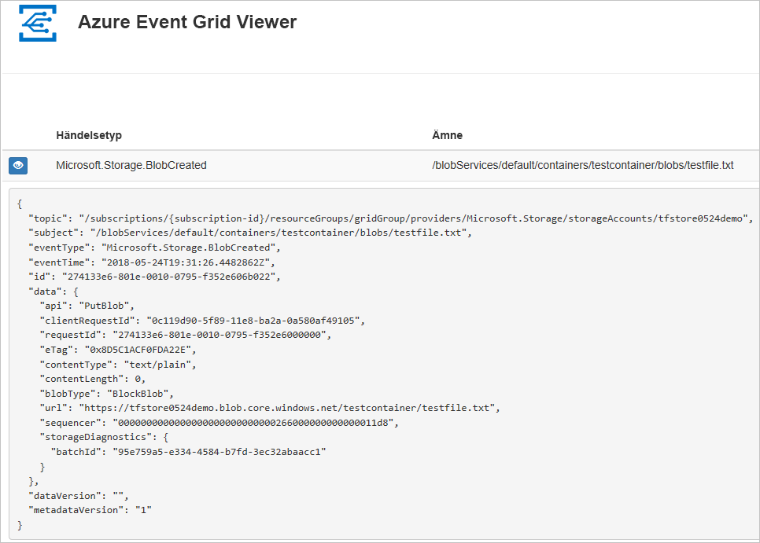
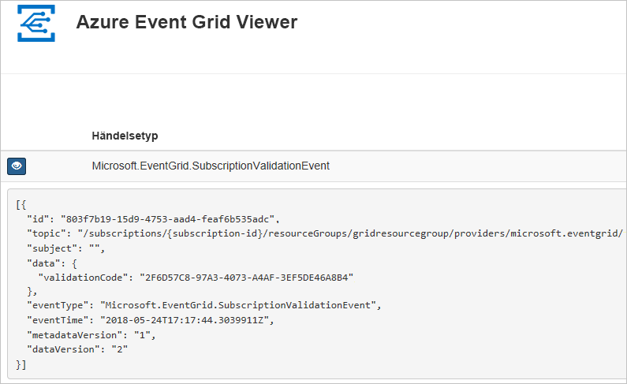

# <a name="quickstart-route-storage-events-to-web-endpoint-with-azure-cli"></a>Snabb start: dirigera lagrings händelser till webb slut punkt med Azure CLI

Azure Event Grid är en händelsetjänst för molnet. I den här artikeln använder du Azure CLI för att prenumerera på Blob Storage-händelser och utlösa händelsen för att visa resultatet.

Normalt kan du skicka händelser till en slutpunkt som bearbetar informationen om händelsen och utför åtgärder. Men för att enkelt beskriva den här artikeln kan skicka du händelser till en webbapp som samlar in och visar meddelanden.

När du slutför stegen som beskrivs i den här artikeln ser du att händelsedata har skickats till webbappen.



[!INCLUDE [quickstarts-free-trial-note.md](../../../includes/quickstarts-free-trial-note.md)]

[!INCLUDE [azure-cli-prepare-your-environment.md](../../../includes/azure-cli-prepare-your-environment.md)]

- Den här artikeln kräver version 2.0.70 eller senare av Azure CLI. Om du använder Azure Cloud Shell är den senaste versionen redan installerad.

## <a name="create-a-resource-group"></a>Skapa en resursgrupp

Event Grid-ämnen är Azure-resurser och måste placeras i en Azure-resursgrupp. Resursgruppen är en logisk samling där Azure-resurser distribueras och hanteras.

Skapa en resursgrupp med kommandot [az group create](/cli/azure/group). 

I följande exempel skapas en resursgrupp med namnet `<resource_group_name>` på platsen *westcentralus*.  Ersätt `<resource_group_name>` med ett unikt namn för din resursgrupp.

```azurecli-interactive
az group create --name <resource_group_name> --location westcentralus
```

## <a name="create-a-storage-account"></a>skapar ett lagringskonto

Blob storage-händelser är tillgängliga i storage-konton för generell användning v2 och Blob storage-konton. **General Purpose v2**-lagringskonton stöder alla funktionerna för alla lagringstjänster, som blobbar, filer, köer och tabeller. Ett **Blob Storage-konto** är ett specialiserat lagrings konto för lagring av ostrukturerade data som blobbar (objekt) i Azure Storage. Blob Storage-konton liknar allmänna lagringskonton och har samma höga hållbarhet, tillgänglighet, skalbarhet och prestanda som du använder idag, inklusive 100 % API-konsekvens för blockblobbar och tilläggsblobbar. Mer information finns i [kontoöversikten för Azure Storage](../common/storage-account-overview.md).

Ersätt `<storage_account_name>` med ett unikt namn på ditt lagringskonto och `<resource_group_name>` med resursgruppen du skapade tidigare.

```azurecli-interactive
az storage account create \
  --name <storage_account_name> \
  --location westcentralus \
  --resource-group <resource_group_name> \
  --sku Standard_LRS \
  --kind BlobStorage \
  --access-tier Hot
```

## <a name="create-a-message-endpoint"></a>Skapa en slutpunkt för meddelanden

Innan du prenumererar på ämnet ska vi ska slutpunkten för händelsemeddelandet. Slutpunkten utför vanligtvis åtgärder baserat på informationen om händelsen. För att förenkla den här snabbstarten kan du distribuera en [förskapad webbapp](https://github.com/Azure-Samples/azure-event-grid-viewer) som visar meddelanden om händelser. Den distribuerade lösningen innehåller en App Service-plan,en webbapp för App Service och källkod från GitHub.

Ersätt `<your-site-name>` med ett unikt namn för din webbapp. Webbappnamnet måste vara unikt eftersom det är en del av DNS-posten.

```azurecli-interactive
sitename=<your-site-name>

az group deployment create \
  --resource-group <resource_group_name> \
  --template-uri "https://raw.githubusercontent.com/Azure-Samples/azure-event-grid-viewer/master/azuredeploy.json" \
  --parameters siteName=$sitename hostingPlanName=viewerhost
```

Det kan ta några minuter att slutföra distributionen. Efter distributionen har slutförts kan du visa webbappen för att kontrollera att den körs. I en webbläsare navigerar du till: `https://<your-site-name>.azurewebsites.net`

Webbplatsen bör visas utan några meddelanden.

[!INCLUDE [event-grid-register-provider-cli.md](../../../includes/event-grid-register-provider-cli.md)]

## <a name="subscribe-to-your-storage-account"></a>Prenumerera på ditt lagringskonto

Du prenumererar på ett ämne därför att du vill ange för Event Grid vilka händelser du vill följa och vart du vill skicka händelserna. I följande exempel ska vi prenumerera på det lagringskonto du nyss skapat och skicka URL:en från din webbapp som slutpunkten för händelseavisering. Ersätt `<event_subscription_name>` med ett namn för din händelseprenumeration. För `<resource_group_name>` och `<storage_account_name>` använder du det värde du skapade tidigare.

Slutpunkten för ditt webbprogram måste innehålla suffixet `/api/updates/`.

```azurecli-interactive
storageid=$(az storage account show --name <storage_account_name> --resource-group <resource_group_name> --query id --output tsv)
endpoint=https://$sitename.azurewebsites.net/api/updates

az eventgrid event-subscription create \
  --source-resource-id $storageid \
  --name <event_subscription_name> \
  --endpoint $endpoint
```

Visa ditt webbprogram igen och observera att en händelse för verifieringen av prenumerationen har skickats till den. Välj ögonikonen för att utöka informationen om händelsen. Händelserutnätet skickar valideringshändelsen så att slutpunkten kan bekräfta att den vill ta emot händelsedata. Webbappen inkluderar kod för att verifiera prenumerationen.



## <a name="trigger-an-event-from-blob-storage"></a>Utlösa en händelse från Blob Storage

Nu ska vi utlösa en händelse och se hur Event Grid distribuerar meddelandet till slutpunkten. Först ska vi konfigurera namnet och nyckeln för lagringskontot. Därefter ska vi skapa en container, och slutligen ska vi skapa och ladda upp en fil. För `<storage_account_name>` och `<resource_group_name>` använder du de värden du skapade tidigare.

```azurecli-interactive
export AZURE_STORAGE_ACCOUNT=<storage_account_name>
export AZURE_STORAGE_ACCESS_KEY="$(az storage account keys list --account-name <storage_account_name> --resource-group <resource_group_name> --query "[0].value" --output tsv)"

az storage container create --name testcontainer

touch testfile.txt
az storage blob upload --file testfile.txt --container-name testcontainer --name testfile.txt
```

Du har utlöst händelsen och Event Grid skickade meddelandet till den slutpunkt som du konfigurerade när du prenumererade. Visa din webbapp om du vill se händelsen som du har skickat.


```json
[{
  "topic": "/subscriptions/xxxxxxxx-xxxx-xxxx-xxxx-xxxxxxxxxxxx/resourceGroups/myrg/providers/Microsoft.Storage/storageAccounts/myblobstorageaccount",
  "subject": "/blobServices/default/containers/testcontainer/blobs/testfile.txt",
  "eventType": "Microsoft.Storage.BlobCreated",
  "eventTime": "2017-08-16T20:33:51.0595757Z",
  "id": "4d96b1d4-0001-00b3-58ce-16568c064fab",
  "data": {
    "api": "PutBlockList",
    "clientRequestId": "d65ca2e2-a168-4155-b7a4-2c925c18902f",
    "requestId": "4d96b1d4-0001-00b3-58ce-16568c000000",
    "eTag": "0x8D4E4E61AE038AD",
    "contentType": "text/plain",
    "contentLength": 0,
    "blobType": "BlockBlob",
    "url": "https://myblobstorageaccount.blob.core.windows.net/testcontainer/testblob1.txt",
    "sequencer": "00000000000000EB0000000000046199",
    "storageDiagnostics": {
      "batchId": "dffea416-b46e-4613-ac19-0371c0c5e352"
    }
  },
  "dataVersion": "",
  "metadataVersion": "1"
}]

```

## <a name="clean-up-resources"></a>Rensa resurser
Om du planerar att fortsätta arbeta med det här lagringskontot och händelseprenumerationen ska du inte rensa upp bland de resurser som skapades i den här artikeln. Om du inte planerar att fortsätta kan du använda kommandona nedan för att ta bort alla resurser som har skapats i den här artikeln.

Ersätt `<resource_group_name>` med resursgruppen du skapade ovan.

```azurecli-interactive
az group delete --name <resource_group_name>
```

## <a name="next-steps"></a>Nästa steg

Nu när du vet hur du skapar ämnen och prenumerationer på händelser kan du läsa mer om Blob Storage-händelser och vad Event Grid kan hjälpa dig med:

- [Reagera på Blob Storage-händelser](storage-blob-event-overview.md)
- [Om Event Grid](../../event-grid/overview.md)
