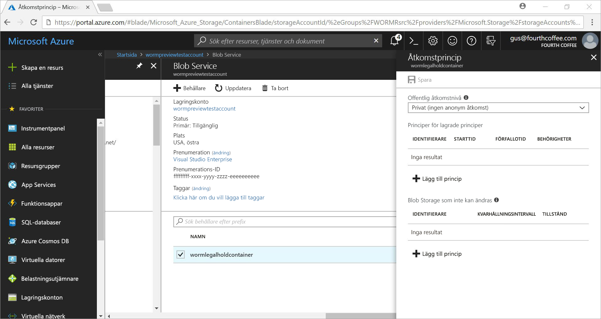
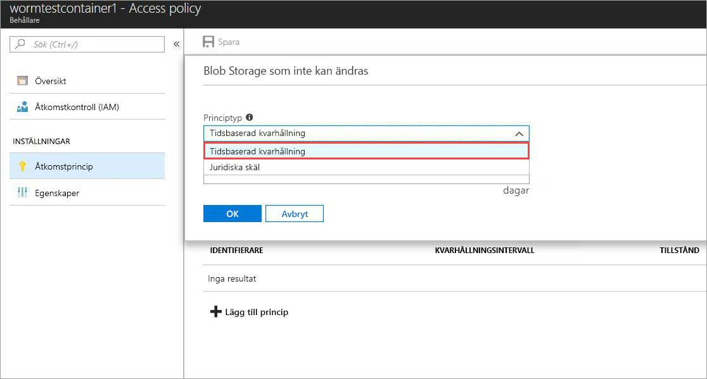
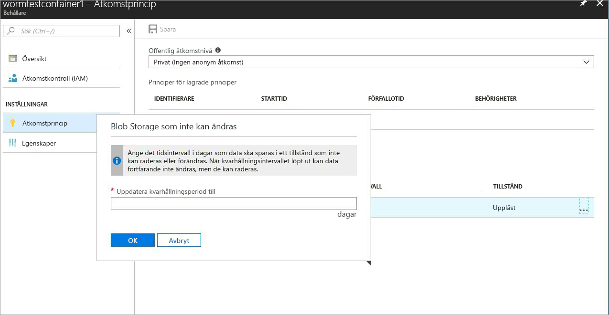
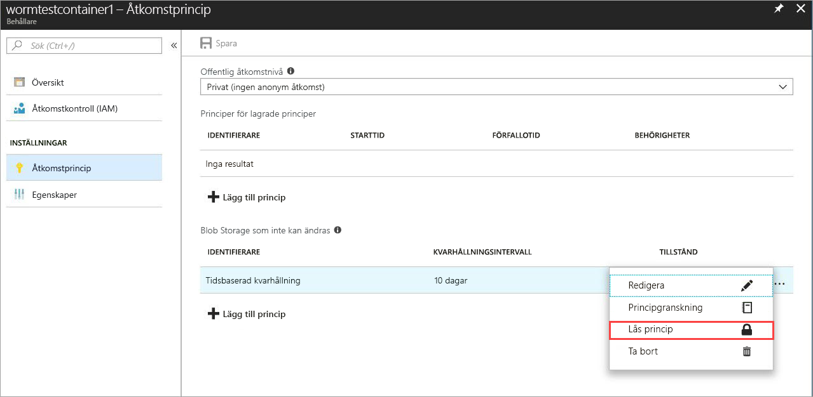
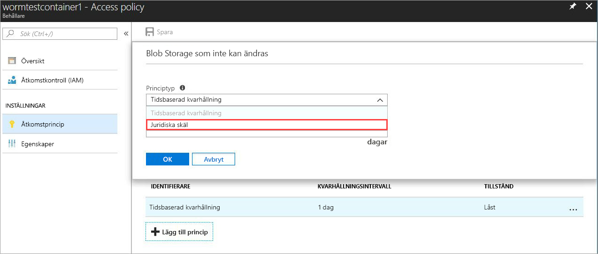
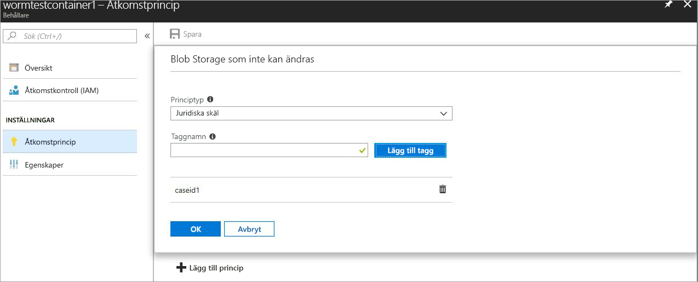

# <a name="store-business-critical-data-in-azure-blob-storage"></a>Store verksamhetskritiska data i Azure Blob storage

Oföränderlig lagring för Azure-blobblagringen (objekt) gör det möjligt för användare att lagra sina verksamhetskritiska data i tillståndet mask (Skriv en gång, Läs många). Det här tillståndet tillhandahåller data bevarandeintervallet och icke-ändringsbart för ett intervall som angetts av användaren. Blobar kan skapas och läsa, men inte ändras eller tas bort under Kvarhållningsintervall.

## <a name="overview"></a>Översikt

Oföränderlig storage hjälper finansiella institutioner och relaterade branscher – särskilt broker-återförsäljare organisationer – att lagra data på ett säkert sätt. Det kan också utnyttjas i alla scenarier för att skydda viktiga data mot borttagning.  

Vanliga program innehåller:

- **Regelefterlevnad**: Oföränderlig lagring för Azure Blob storage hjälper organisationer adress sek 17a-4(f), CFTC 1.31(d), FINRA och andra bestämmelser.

- **Skydda dokumentet kvarhållning**: BLOB-lagring garanterar att data inte ändras eller tas bort av någon användare, inklusive användare med administrativ behörighet.

- **Bevarande av juridiska skäl**: Oföränderlig lagring för Azure Blob storage kan du lagra känslig information som är kritiska för tvister eller brottsutredning manipuleringssäker statusen för den önskade varaktigheten.

Oföränderlig storage möjliggör:

- **Stöd för tidsbaserat bevarande Grupprincip**: Användare ange principer för att lagra data för ett visst intervall.

- **Bevarande av juridiska skäl stöd för Grupprincip**: När Kvarhållningsintervall som inte är känt, kan användarna ange bevarande av juridiska skäl att lagra data immutably tills bevarande av juridiska skäl är avmarkerad.  När ett bevarande av juridiska skäl anges kan blobbar skapas och läsas, men inte ändras eller tas bort. Varje bevarande av juridiska skäl är associerat med en användardefinierad alfanumerisk tagg som används som en ID-sträng (till exempel en case-ID).

- **Stöd för alla blob-nivåerna**: MASK principer är oberoende av Azure Blob storage-nivå och gäller för alla nivåer: frekvent, lågfrekvent och Arkiv. Användarna kan överföra data till den mest kostnaden-optimerade nivån för sina arbetsbelastningar samtidigt som data oföränderlighetsprincip.

- **Behållare på servernivå configuration**: Användare kan konfigurera tidsbaserad bevarandeprinciper och bevarande av juridiska skäl taggar på behållarenivån. Med hjälp av enkla behållarenivån inställningar, kan användare skapa och låsa tidsbaserade bevarandeprinciper, utöka kvarhållningsintervaller, ange och ta bort bevarande av juridiska skäl och mycket mer. Dessa principer gäller för alla blobar i behållaren, både befintliga och nya.

- **Granska loggningsstöd**: Varje behållare innehåller en granskningslogg. Den visar upp till fem tidsbaserat bevarande kommandon för låst tidsbaserade bevarandeprinciper, med högst tre loggar för kvarhållning intervall tillägg. Loggen innehåller användar-ID, kommandotypen, tidsstämplar och Kvarhållningsintervall för tidsbaserat bevarande. Loggen innehåller användar-ID, kommandotypen, tidsstämplar för bevarande av juridiska skäl och bevarande av juridiska skäl taggar. Den här loggfilen sparas i livslängden för behållare, i enlighet med sek 17a-4(f) föreskrifter. Den [Azure-aktivitetsloggen](https://docs.microsoft.com/azure/monitoring-and-diagnostics/monitoring-overview-activity-logs) och visar en mer omfattande logg över alla kontrollen plan aktiviteter. Det är användarens ansvar att lagra dessa loggar beständigt som kan krävas för regler eller andra ändamål.

Oföränderlig lagring är aktiverat i alla offentliga Azure-regioner.

## <a name="how-it-works"></a>Hur det fungerar

Oföränderlig lagring för Azure Blob storage stöder två typer av mask eller inte kan ändras principer: tidsbaserat bevarande och bevarande av juridiska skäl. Mer information om hur du skapar dessa kan ändras principer finns i den [komma igång](#getting-started) avsnittet.

När en tidsbaserad bevarandeprincip eller bevarande av juridiska skäl har tillämpats på en behållare, alla befintliga blobar flytta till den inte kan ändras (skriva och ta bort skyddade) tillstånd. Alla nya blobar som har laddats upp till behållaren kommer också flytta till tillståndet inte kan ändras.

> [!IMPORTANT]
> En tidsbaserad bevarandeprincip måste vara *låst* för blobben som ska finnas i en oföränderlig (skriva och ta bort skyddade) tillstånd för sek 17a-4(f) och andra föreskrifter. Vi rekommenderar att du låser principen inom en rimlig tid, vanligtvis inom 24 timmar. Vi rekommenderar inte den *upplåst* tillstånd för något annat syfte än kortsiktig funktionen utvärderingsversioner.

När en tidsbaserad bevarandeprincip används på en behållare, alla blobar i behållaren ska vara kvar i tillståndet inte kan ändras under hela den *effektiva* kvarhållningsperiod. Den effektiva kvarhållningsperioden för befintliga blobbar är lika med skillnaden mellan tiden för skapandet av bloben och det användardefinierade kvarhållningsintervallet.

För nya blobbar är den effektiva kvarhållningsperioden lika med det kvarhållningsintervall som angetts av användaren. Eftersom användare kan utöka Kvarhållningsintervall, använder kan ändras storage de senaste värdet för Kvarhållningsintervall som angetts av användaren för att beräkna effektiv kvarhållningsperioden.

> [!TIP]
> Exempel:
>
> En användare skapar en tidsbaserad bevarandeprincip med ett Kvarhållningsintervall på fem år.
>
> Befintlig blob i behållaren testblob1, skapades för ett år sedan. Effektiva kvarhållningsperioden för testblob1 är fyra år.
>
> En ny blob, testblob2, överförs nu till containern. Effektiva kvarhållningsperioden för den här nya bloben är fem år.

### <a name="legal-holds"></a>Bevarande av juridiska skäl

När du ställer in ett bevarande av juridiska skäl Behåll alla befintliga och nya BLOB kan ändras tillståndet tills bevarande av juridiska skäl är avmarkerad. Mer information om hur du definierar och rensa bevarande av juridiska skäl finns i den [komma igång](#getting-started) avsnittet.

En behållare kan ha både ett bevarande av juridiska skäl och en tidsbaserad bevarandeprincip på samma gång. Alla blobar i behållaren förblir kan ändras statusen tills alla bevarande av juridiska skäl rensas, även om deras effektiva kvarhållningsperiod har upphört att gälla. Omvänt kan är en blob i ett tillstånd som inte kan ändras tills effektiva kvarhållningsperioden upphör att gälla, även om alla bevarande av juridiska skäl har rensats.

I följande tabell visas typerna av blobåtgärder som är inaktiverade i olika scenarier som inte kan ändras. Mer information finns i den [Azure Blob Service-API](https://docs.microsoft.com/rest/api/storageservices/blob-service-rest-api) dokumentation.

|Scenario  |BLOB-tillstånd  |Blobåtgärder inte tillåtet  |
|---------|---------|---------|
|Effektivt kvarhållningsintervall för blobben har ännu inte gått ut och/eller bevarande av juridiska skäl har angetts     |Oåterkallelig: både ta bort- och skrivskyddad         |Ta bort behållare, ta bort Blob, placera Blob<sup>1</sup>, placera Block<sup>1</sup>, placera Blockeringslista<sup>1</sup>, ange Blob-Metadata, placera sidan, ange egenskaper för Blob, ta ögonblicksbild av Blob, inkrementell kopiering av Blob, Lägga till Block         |
|Effektivt kvarhållningsintervall på blobben har upphört att gälla     |Skrivskyddad endast (ta bort tillåts)         |Placera Blob<sup>1</sup>, placera Block<sup>1</sup>, placera Blockeringslista<sup>1</sup>, ange Blob-Metadata, placera sidan, ange Blob egenskaper, ta ögonblicksbild av Blob, inkrementell kopiering av Blob, lägga till Block         |
|Alla juridiska innehåller avmarkerad och ingen tidsbaserad bevarandeprincip anges för behållaren     |Föränderlig         |Ingen         |
|Ingen mask princip har skapats (tidsbaserat bevarande eller bevarande av juridiska skäl)     |Föränderlig         |Ingen         |

<sup>1</sup> programmet kan anropa den här åtgärden för att skapa en blob en gång. Alla efterföljande åtgärder på blobben är inte tillåtna.

> [!NOTE]
>
> Oföränderlig storage är endast tillgängliga i General Purpose V2 och Blob Storage-konton. Kontot måste skapas via [Azure Resource Manager](https://docs.microsoft.com/azure/azure-resource-manager/resource-group-overview).

## <a name="pricing"></a>Prissättning

Det finns ingen extra kostnad för att använda den här funktionen. Oföränderlig data debiteras på samma sätt som vanliga, föränderliga data. Information om priser på Azure Blob Storage finns i den [Azure Storage-prissidan](https://azure.microsoft.com/pricing/details/storage/blobs/).


## <a name="getting-started"></a>Komma igång

De senaste versionerna av den [Azure-portalen](http://portal.azure.com) och [Azure CLI](https://docs.microsoft.com/cli/azure/install-azure-cli?view=azure-cli-latest) samt förhandsversionen av [Azure PowerShell](https://github.com/Azure/azure-powershell/releases) stöder inte kan ändras lagring för Azure Blob storage.

### <a name="azure-portal"></a>Azure Portal

1. Skapa en ny container eller välj en befintlig container för lagring av de blobbar som ska behållas i det oföränderliga tillståndet.
 Behållaren måste vara i ett GPv2- eller blob storage-konto.
2. Välj **princip** i inställningarna för behållaren. Välj sedan **+ Lägg till** under **oföränderlig bloblagring**.

    

3. Välj för att aktivera tidsbaserat bevarande **tidsbaserat bevarande** från den nedrullningsbara menyn.

    

4. Ange Kvarhållningsintervall i dagar (minst är en dag).

    

    Som du ser i skärmbilden, är det ursprungliga tillståndet för principen upplåst. Du kan testa funktionen med en mindre Kvarhållningsintervall och gör ändringar i principen innan du låser den. Låsning är nödvändigt för regler som sek 17a – 4 efterlevs.

5. Låsa principen. Högerklicka på de tre punkterna (**...** ), och följande visas:

    

    Välj **Låsprincip**, och principtillståndet visas nu som låst. När principen är låst kan inte tas bort och endast tillägg av Kvarhållningsintervall som ska tillåtas.

6. Välj för att aktivera bevarande av juridiska skäl **+ Lägg till**. Välj **bevarande av juridiska skäl** från den nedrullningsbara menyn.

    

7. Skapa ett bevarande av juridiska skäl med en eller flera taggar.

    

8. Om du vill ta bort ett bevarande av juridiska skäl, helt enkelt ta bort taggen.

### <a name="azure-cli"></a>Azure CLI

Funktionen ingår i följande kommando grupper: `az storage container immutability-policy` och `az storage container legal-hold`. Kör `-h` på dem för att se kommandona.

### <a name="powershell"></a>PowerShell

Modulen Az.Storage förhandsversionen stöder inte kan ändras lagring.  Följ dessa steg om du vill aktivera funktionen:

1. Kontrollera att du har den senaste versionen av installerat PowerShellGet: `Install-Module PowerShellGet –Repository PSGallery –Force`.
2. Ta bort alla tidigare installation av Azure PowerShell.
3. Installera Azure PowerShell: `Install-Module Az –Repository PSGallery –AllowClobber`.
4. Installera förhandsversionen av Azure PowerShell Storage-modulen: `Install-Module Az.Storage -AllowPrerelease -Repository PSGallery -AllowClobber`

Den [exempel på PowerShell-kod](#sample-powershell-code) senare i den här artikeln visar användning av funktioner.

## <a name="client-libraries"></a>Klientbibliotek

Följande klientbibliotek oföränderligt storage har stöd för Azure Blob storage:

- [Klientbiblioteket för .NET version 7.2.0-preview och senare](https://www.nuget.org/packages/Microsoft.Azure.Management.Storage/7.2.0-preview)
- [Klientbiblioteket för node.js version 4.0.0 och senare](https://www.npmjs.com/package/azure-arm-storage)
- [Python-klientbiblioteket version 2.0.0 Release Candidate 2 och senare](https://pypi.org/project/azure-mgmt-storage/2.0.0rc2/)
- [Java-klientbiblioteket](https://github.com/Azure/azure-rest-api-specs/tree/master/specification/storage/resource-manager/Microsoft.Storage/preview/2018-03-01-preview)

## <a name="supported-values"></a>Värden som stöds

- Det minsta Kvarhållningsintervall är en dag. Det maximala antalet är 400 år.
- För ett lagringskonto är det maximala antalet behållare med låsta oföränderligt principer 1 000.
- För ett lagringskonto är det maximala antalet behållare med en inställning för bevarande av juridiska skäl 1 000.
- För en behållare är det maximala antalet taggar för bevarande av juridiska skäl 10.
- Den maximala längden på en tagg för bevarande av juridiska skäl är 23 alfanumeriska tecken. Den minsta längden är tre tecken.
- För en behållare är det maximala antalet tillåtna kvarhållning intervall tillägg för låst oföränderligt principer tre.
- För en behållare med en låst oföränderligt princip håller högst fem tidsbaserat bevarande loggar och högst 10 juridiska du principen loggar bevaras under behållaren.

## <a name="faq"></a>VANLIGA FRÅGOR OCH SVAR

**Gäller funktionen om du vill endast blockblobar, eller sidan och tilläggsblobbar samt?**

Oföränderlig storage kan användas med en blobtyp, men vi rekommenderar att du använder den huvudsakligen för blockblob-objekt. Till skillnad från blockblob-objekt, sidan BLOB-objekt och lägga till BLOB-objekt måste skapa utanför en mask behållare och kopieras sedan i. När du har inte kopierat dessa blobar till en mask behållare och ytterligare *lägger till* till en tilläggs blob eller ändringar av en sidblobb tillåts.

**Behöver jag alltid skapa ett nytt lagringskonto för att använda den här funktionen?**

Du kan använda lagring som inte kan ändras med befintliga eller nya General Purpose V2 eller Blob Storage-konton. Den här funktionen är endast tillgänglig för Blob storage.

**Vad händer om jag försöker ta bort en container med en *låst* tidsbaserade bevarandeprincip eller bevarande av juridiska skäl?**

Ta bort behållaråtgärden misslyckas om det finns minst en blob med en låst tidsbaserad bevarandeprincip eller ett juridiskt bevarande. Ta bort behållaren åtgärden lyckas bara om inga blob med en aktiv Kvarhållningsintervall finns och att det finns inga bevarande av juridiska skäl. Du måste ta bort blobar innan du kan ta bort behållaren.

**Vad händer om jag försöker ta bort ett lagringskonto med en WORM-container som har en *låst* tidsbaserad bevarandeprincip eller ett bevarande av juridiska skäl?**

Borttagningen av lagringskontot misslyckas om det finns minst en WORM-container med bevarande av juridiska skäl eller en blob med ett aktivt kvarhållningsintervall.  Du måste ta bort alla mask behållare innan du kan ta bort lagringskontot. Information om borttagning av behållare, finns i den föregående frågan.

**Kan jag flytta data över olika blob-nivåer (frekvent, lågfrekvent, kall) när blobben är i oförändrat tillstånd?**

Ja, du kan använda kommandot Ange Blob-nivå för att flytta data över blob-nivåer samtidigt som data bevaras i oföränderligt tillstånd. Oföränderlig lagring stöds på frekvent, lågfrekvent och arkivnivå på blob.

**Vad händer om jag inte betalat och mitt kvarhållningsintervall inte har gått ut?**

När det gäller utebliven betalning gäller normal datalagringsprinciper som anges i villkoren i ditt avtal med Microsoft.

**Finns det en utvärderingsversion eller en respitperiod för att bara testa funktionen?**

Ja. När en tidsbaserad bevarandeprincip skapas, det är ett *upplåst* tillstånd. I det här tillståndet kan du göra önskade ändringar Kvarhållningsintervall, till exempel öka eller minska och även ta bort principen. När principen är låst, förblir den låst tills Kvarhållningsintervall som upphör att gälla. Detta förhindrar borttagning och ändring av Kvarhållningsintervall. Vi rekommenderar starkt att du använder den *upplåst* endast för försöket och låsa principen inom en 24-timmarsperiod. Dessa metoder hjälper dig att uppfylla med sek 17a-4(f) och andra bestämmelser.

**Är funktionen tillgänglig i nationella och offentliga moln?**

Oföränderlig storage är tillgängligt i offentlig Azure-, Kina och Government-regioner. Om du inte kan ändras lagring inte är tillgänglig i din region, e- azurestoragefeedback@microsoft.com.

## <a name="sample-powershell-code"></a>Exempel på PowerShell-kod

[!INCLUDE [updated-for-az](../../../includes/updated-for-az.md)]

Följande PowerShell-exempelskript är referens. Det här skriptet skapar ett nytt lagringskonto och en behållare. Den sedan visar hur du kan ange och ta bort bevarande av juridiska skäl, skapa och låsa en tidsbaserad bevarandeprincip (även kallat en oföränderlighetsprincip) och utöka Kvarhållningsintervall.

Konfigurera och testa Azure Storage-konto:

```powershell
$ResourceGroup = "<Enter your resource group>”
$StorageAccount = "<Enter your storage account name>"
$container = "<Enter your container name>"
$container2 = "<Enter another container name>”
$location = "<Enter the storage account location>"

# Log in to the Azure Resource Manager account
Login-AzAccount
Register-AzResourceProvider -ProviderNamespace "Microsoft.Storage"

# Create your Azure resource group
New-AzResourceGroup -Name $ResourceGroup -Location $location

# Create your Azure storage account
New-AzStorageAccount -ResourceGroupName $ResourceGroup -StorageAccountName `
    $StorageAccount -SkuName Standard_LRS -Location $location -Kind StorageV2

# Create a new container
New-AzStorageContainer -ResourceGroupName $ResourceGroup `
    -StorageAccountName $StorageAccount -Name $container

# Create Container 2 with a storage account object
$accountObject = Get-AzStorageAccount -ResourceGroupName $ResourceGroup `
    -StorageAccountName $StorageAccount
New-AzStorageContainer -StorageAccount $accountObject -Name $container2

# Get a container
Get-AzStorageContainer -ResourceGroupName $ResourceGroup `
    -StorageAccountName $StorageAccount -Name $container

# Get a container with an account object
$containerObject = Get-AzStorageContainer -StorageAccount $accountObject -Name $container

# List containers
Get-AzStorageContainer -ResourceGroupName $ResourceGroup `
    -StorageAccountName $StorageAccount

# Remove a container (add -Force to dismiss the prompt)
Remove-AzStorageContainer -ResourceGroupName $ResourceGroup `
    -StorageAccountName $StorageAccount -Name $container2

# Remove a container with an account object
Remove-AzStorageContainer -StorageAccount $accountObject -Name $container2

# Remove a container with a container object
$containerObject2 = Get-AzStorageContainer -StorageAccount $accountObject -Name $container2
Remove-AzStorageContainer -InputObject $containerObject2
```

Ange och ta bort bevarande av juridiska skäl:

```powershell
# Set a legal hold
Add-AzStorageContainerLegalHold -ResourceGroupName $ResourceGroup `
    -StorageAccountName $StorageAccount -Name $container -Tag <tag1>,<tag2>,...

# with an account object
Add-AzStorageContainerLegalHold -StorageAccount $accountObject -Name $container -Tag <tag3>

# with a container object
Add-AzStorageContainerLegalHold -Container $containerObject -Tag <tag4>,<tag5>,...

# Clear a legal hold
Remove-AzStorageContainerLegalHold -ResourceGroupName $ResourceGroup `
    -StorageAccountName $StorageAccount -Name $container -Tag <tag2>

# with an account object
Remove-AzStorageContainerLegalHold -StorageAccount $accountObject -Name $container -Tag <tag3>,<tag5>

# with a container object
Remove-AzStorageContainerLegalHold -Container $containerObject -Tag <tag4>
```

Skapa eller uppdatera oföränderlighetsprinciper:
```powershell
# with an account name or container name
Set-AzStorageContainerImmutabilityPolicy -ResourceGroupName $ResourceGroup `
    -StorageAccountName $StorageAccount -ContainerName $container -ImmutabilityPeriod 10

# with an account object
Set-AzStorageContainerImmutabilityPolicy -StorageAccount $accountObject `
    -ContainerName $container -ImmutabilityPeriod 1 -Etag $policy.Etag

# with a container object
$policy = Set-AzStorageContainerImmutabilityPolicy -Container `
    $containerObject -ImmutabilityPeriod 7

# with an immutability policy object
Set-AzStorageContainerImmutabilityPolicy -ImmutabilityPolicy $policy -ImmutabilityPeriod 5
```

Hämta oföränderlighetsprinciper:
```powershell
# Get an immutability policy
Get-AzStorageContainerImmutabilityPolicy -ResourceGroupName $ResourceGroup `
    -StorageAccountName $StorageAccount -ContainerName $container

# with an account object
Get-AzStorageContainerImmutabilityPolicy -StorageAccount $accountObject `
    -ContainerName $container

# with a container object
Get-AzStorageContainerImmutabilityPolicy -Container $containerObject
```

Låsa oföränderlighetsprinciper (Lägg till - Force för att stänga Kommandotolken):
```powershell
# with an immutability policy object
$policy = Get-AzStorageContainerImmutabilityPolicy -ResourceGroupName `
    $ResourceGroup -StorageAccountName $StorageAccount -ContainerName $container
$policy = Lock-AzStorageContainerImmutabilityPolicy -ImmutabilityPolicy $policy -force

# with an account name or container name
$policy = Lock-AzStorageContainerImmutabilityPolicy -ResourceGroupName `
    $ResourceGroup -StorageAccountName $StorageAccount -ContainerName $container `
    -Etag $policy.Etag

# with an account object
$policy = Lock-AzStorageContainerImmutabilityPolicy -StorageAccount `
    $accountObject -ContainerName $container -Etag $policy.Etag

# with a container object
$policy = Lock-AzStorageContainerImmutabilityPolicy -Container `
    $containerObject -Etag $policy.Etag -force
```

Utöka oföränderlighetsprinciper:
```powershell

# with an immutability policy object
$policy = Get-AzStorageContainerImmutabilityPolicy -ResourceGroupName `
    $ResourceGroup -StorageAccountName $StorageAccount -ContainerName $container

$policy = Set-AzStorageContainerImmutabilityPolicy -ImmutabilityPolicy `
    $policy -ImmutabilityPeriod 11 -ExtendPolicy

# with an account name or container name
$policy = Set-AzStorageContainerImmutabilityPolicy -ResourceGroupName `
    $ResourceGroup -StorageAccountName $StorageAccount -ContainerName $container `
    -ImmutabilityPeriod 11 -Etag $policy.Etag -ExtendPolicy

# with an account object
$policy = Set-AzStorageContainerImmutabilityPolicy -StorageAccount `
    $accountObject -ContainerName $container -ImmutabilityPeriod 12 -Etag `
    $policy.Etag -ExtendPolicy

# with a container object
$policy = Set-AzStorageContainerImmutabilityPolicy -Container `
    $containerObject -ImmutabilityPeriod 13 -Etag $policy.Etag -ExtendPolicy
```

Ta bort en oföränderlighetsprincip (Lägg till - Force för att stänga Kommandotolken):
```powershell
# with an immutability policy object
$policy = Get-AzStorageContainerImmutabilityPolicy -ResourceGroupName `
    $ResourceGroup -StorageAccountName $StorageAccount -ContainerName $container
Remove-AzStorageContainerImmutabilityPolicy -ImmutabilityPolicy $policy

# with an account name or container name
Remove-AzStorageContainerImmutabilityPolicy -ResourceGroupName `
    $ResourceGroup -StorageAccountName $StorageAccount -ContainerName $container `
    -Etag $policy.Etag

# with an account object
Remove-AzStorageContainerImmutabilityPolicy -StorageAccount $accountObject `
    -ContainerName $container -Etag $policy.Etag

# with a container object
Remove-AzStorageContainerImmutabilityPolicy -Container $containerObject `
    -Etag $policy.Etag

```
