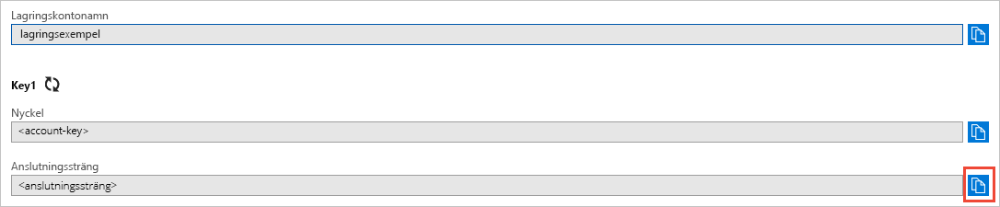

# <a name="quickstart-azure-blob-storage-client-library-v11-for-net"></a>Snabb start: klient biblioteket för Azure Blob Storage-V11 för .NET

Kom igång med Azure-Blob Storage klient bibliotek V11 för .NET. Azure Blob Storage är Microsofts objekt lagrings lösning för molnet. Följ stegen för att installera paketet och prova exempel koden för grundläggande uppgifter. Blob Storage är optimerad för lagring av enorma mängder ostrukturerade data.

> [!NOTE]
> I den här snabb starten används en äldre version av klient biblioteket för Azure Blob Storage. Information om hur du kommer igång med den senaste versionen finns i [snabb start: Azure Blob Storage klient bibliotek V12 för .net](storage-quickstart-blobs-dotnet.md).

Använd Azure Blob Storage-klient biblioteket för .NET för att:

* Skapa en container
* Ange behörigheter för en behållare
* Skapa en BLOB i Azure Storage
* Ladda ned blobben till den lokala datorn
* Lista alla blobar i en behållare
* Ta bort en container

Ytterligare resurser:

* [Referensdokumentation för API](/dotnet/api/overview/azure/storage)
* [Biblioteks käll kod](https://github.com/Azure/azure-storage-net/tree/master/Blob)
* [Paket (NuGet)](https://www.nuget.org/packages/Microsoft.Azure.Storage.Blob/)
* [Exempel](https://azure.microsoft.com/resources/samples/?sort=0&service=storage&platform=dotnet&term=blob)

[!INCLUDE [storage-multi-protocol-access-preview](../../../includes/storage-multi-protocol-access-preview.md)]

## <a name="prerequisites"></a>Förutsättningar

* Azure-prenumeration – [skapa en kostnads fritt](https://azure.microsoft.com/free/)
* Azure Storage konto – [skapa ett lagrings konto](../common/storage-account-create.md)
* Nuvarande [.net Core SDK](https://dotnet.microsoft.com/download/dotnet-core) för ditt operativ system. Se till att hämta SDK och inte körnings miljön.

## <a name="setting-up"></a>Konfigurera

Det här avsnittet beskriver hur du förbereder ett projekt för att arbeta med Azure Blob Storage-klient biblioteket för .NET.

### <a name="create-the-project"></a>Skapa projektet

Börja med att skapa ett .NET Core-program med namnet *BLOB-snabb start*.

1. I ett konsol fönster (till exempel cmd, PowerShell eller bash) använder du `dotnet new` kommandot för att skapa en ny konsol app med namnet *BLOB-snabb start*. Det här kommandot skapar ett enkelt "Hello World" C#-projekt med en enda käll fil: *program.cs*.

   ```console
   dotnet new console -n blob-quickstart
   ```

2. Växla till den nyss skapade *BLOB-snabb starts* mappen och skapa appen för att verifiera att alla är väl.

   ```console
   cd blob-quickstart
   ```

   ```console
   dotnet build
   ```

Förväntade utdata från versionen bör se ut ungefär så här:

```output
C:\QuickStarts\blob-quickstart> dotnet build
Microsoft (R) Build Engine version 16.0.450+ga8dc7f1d34 for .NET Core
Copyright (C) Microsoft Corporation. All rights reserved.

  Restore completed in 44.31 ms for C:\QuickStarts\blob-quickstart\blob-quickstart.csproj.
  blob-quickstart -> C:\QuickStarts\blob-quickstart\bin\Debug\netcoreapp2.1\blob-quickstart.dll

Build succeeded.
    0 Warning(s)
    0 Error(s)

Time Elapsed 00:00:03.08
```

### <a name="install-the-package"></a>Installera paketet

När du fortfarande är i program katalogen installerar du Azure-Blob Storage klient biblioteket för .NET-paketet med hjälp av `dotnet add package` kommandot.

```console
dotnet add package Microsoft.Azure.Storage.Blob
```

### <a name="set-up-the-app-framework"></a>Konfigurera app Framework

Från projekt katalogen:

1. Öppna filen *program.cs* i redigeraren
2. Ta bort `Console.WriteLine` instruktionen
3. Lägg till `using` direktiv
4. Skapa en `ProcessAsync` metod där huvud koden för exemplet kommer att finnas
5. Anropa metoden asynkront `ProcessAsync` från `Main`

Här är koden:

```csharp
using System;
using System.IO;
using System.Threading.Tasks;
using Microsoft.Azure.Storage;
using Microsoft.Azure.Storage.Blob;

namespace blob_quickstart
{
    class Program
    {
        public static async Task Main()
        {
            Console.WriteLine("Azure Blob Storage - .NET quickstart sample\n");

            await ProcessAsync();

            Console.WriteLine("Press any key to exit the sample application.");
            Console.ReadLine();
        }

        private static async Task ProcessAsync()
        {
        }
    }
}
```

### <a name="copy-your-credentials-from-the-azure-portal"></a>Kopiera dina autentiseringsuppgifter från Azure-portalen

När exempel programmet gör en begäran för att Azure Storage, måste det vara auktoriserat. Om du vill auktorisera en begäran lägger du till autentiseringsuppgifterna för ditt lagrings konto i programmet som en anslutnings sträng. Visa autentiseringsuppgifterna för lagringskontot genom att följa dessa steg:

1. Navigera till [Azure Portal](https://portal.azure.com).
2. Leta rätt på ditt lagringskonto.
3. Välj **Åtkomstnycklar** i avsnittet **Inställningar** i lagringskontoöversikten. Här kan du visa åtkomstnycklarna för kontot och den fullständiga anslutningssträngen för varje nyckel.
4. Sök efter värdet för **Anslutningssträng** under **key1** och kopiera anslutningssträngen genom att välja **Kopiera**. Du lägger till strängvärdet för anslutningen till en miljövariabel i nästa steg.

    

### <a name="configure-your-storage-connection-string"></a>Konfigurera anslutningssträngen för lagring

När du har kopierat anslutningssträngen ska du skriva den till en ny miljövariabel på den lokala dator där programmet körs. Konfigurera miljövariabeln genom att öppna ett konsolfönster och följa anvisningarna för ditt operativsystem. Ersätt `<yourconnectionstring>` med den faktiska anslutnings strängen.

#### <a name="windows"></a>Windows

```cmd
setx AZURE_STORAGE_CONNECTION_STRING "<yourconnectionstring>"
```

När du har lagt till miljövariabeln i Windows måste du starta en ny instans av kommando fönstret.

#### <a name="linux"></a>Linux

```bash
export AZURE_STORAGE_CONNECTION_STRING="<yourconnectionstring>"
```

#### <a name="macos"></a>MacOS

```bash
export AZURE_STORAGE_CONNECTION_STRING="<yourconnectionstring>"
```

När du har lagt till miljövariabeln startar du om alla program som körs som behöver läsa miljövariabeln. Starta till exempel utvecklings miljön eller redigeraren innan du fortsätter.

## <a name="object-model"></a>Objekt modell

Azure Blob Storage är optimerat för att lagra enorma mängder ostrukturerade data. Ostrukturerade data är data som inte följer en viss datamodell eller definition, till exempel text eller binära data. I blobblagringen finns tre typer av resurser:

* Lagringskontot.
* En container på lagringskontot
* En blobb i en container

Följande diagram visar relationen mellan de här resurserna.


Använd följande .NET-klasser för att interagera med dessa resurser:

* [CloudStorageAccount](/dotnet/api/microsoft.azure.storage.cloudstorageaccount): `CloudStorageAccount` klassen representerar ditt Azure Storage-konto. Använd den här klassen för att ge åtkomst till Blob Storage med hjälp av konto åtkomst nycklar.
* [CloudBlobClient](/dotnet/api/microsoft.azure.storage.blob.cloudblobclient): `CloudBlobClient` klassen ger en åtkomst punkt till BLOB service i din kod.
* [CloudBlobContainer](/dotnet/api/microsoft.azure.storage.blob.cloudblobcontainer): `CloudBlobContainer` klassen representerar en BLOB-behållare i din kod.
* [CloudBlockBlob](/dotnet/api/microsoft.azure.storage.blob.cloudblockblob): `CloudBlockBlob` objektet representerar en block-BLOB i koden. Blockblobbar består av datablock som kan hanteras individuellt.

## <a name="code-examples"></a>Kodexempel

I de här exempel kods tycken visas hur du gör följande med klient biblioteket för Azure Blob Storage för .NET:

   * [Autentisera klienten](#authenticate-the-client)
   * [Skapa en container](#create-a-container)
   * [Ange behörigheter för en behållare](#set-permissions-on-a-container)
   * [Ladda upp blobbar till en behållare](#upload-blobs-to-a-container)
   * [Visa blobar i en container](#list-the-blobs-in-a-container)
   * [Ladda ned blobbar](#download-blobs)
   * [Ta bort en container](#delete-a-container)

### <a name="authenticate-the-client"></a>Autentisera klienten

Koden nedan kontrollerar att miljövariabeln innehåller en anslutnings sträng som kan parsas för att skapa ett [CloudStorageAccount](/dotnet/api/microsoft.azure.storage.cloudstorageaccount) -objekt som pekar på lagrings kontot. Kontrollera att anslutningssträngen är giltig med hjälp av [TryParse](/dotnet/api/microsoft.azure.storage.cloudstorageaccount.tryparse)-metoden. Om `TryParse` är lyckad initierar den `storageAccount` variabeln och returnerar `true` .

Lägg till den här koden i- `ProcessAsync` metoden:

```csharp
// Retrieve the connection string for use with the application. The storage 
// connection string is stored in an environment variable on the machine 
// running the application called AZURE_STORAGE_CONNECTION_STRING. If the 
// environment variable is created after the application is launched in a 
// console or with Visual Studio, the shell or application needs to be closed
// and reloaded to take the environment variable into account.
string storageConnectionString = Environment.GetEnvironmentVariable("AZURE_STORAGE_CONNECTION_STRING");

// Check whether the connection string can be parsed.
CloudStorageAccount storageAccount;
if (CloudStorageAccount.TryParse(storageConnectionString, out storageAccount))
{
    // If the connection string is valid, proceed with operations against Blob
    // storage here.
    // ADD OTHER OPERATIONS HERE
}
else
{
    // Otherwise, let the user know that they need to define the environment variable.
    Console.WriteLine(
        "A connection string has not been defined in the system environment variables. " +
        "Add an environment variable named 'AZURE_STORAGE_CONNECTION_STRING' with your storage " +
        "connection string as a value.");
    Console.WriteLine("Press any key to exit the application.");
    Console.ReadLine();
}
```

> [!NOTE]
> Om du vill utföra resten av åtgärderna i den här artikeln ersätter du koden `// ADD OTHER OPERATIONS HERE` ovan med kodfragmenten i följande avsnitt.

### <a name="create-a-container"></a>Skapa en container

För att kunna skapa containern måste du först skapa en instans av objektet [CloudBlobClient](/dotnet/api/microsoft.azure.storage.blob.cloudblobclient) som pekar på bloblagringen i lagringskontot. Skapa en instans av objektet [CloudBlobContainer](/dotnet/api/microsoft.azure.storage.blob.cloudblobcontainer) och skapa sedan behållaren.

I det här fallet anropar koden [CreateAsync](/dotnet/api/microsoft.azure.storage.blob.cloudblobcontainer.createasync) -metoden för att skapa behållaren. Ett GUID-värde läggs till containerns namn så att det blir unikt. I en produktions miljö är det ofta bättre att använda metoden [CreateIfNotExistsAsync](/dotnet/api/microsoft.azure.storage.blob.cloudblobcontainer.createifnotexistsasync) för att skapa en behållare endast om den inte redan finns.

> [!IMPORTANT]
> Containernamn måste använda gemener. Mer information om namngivning av containrar och blobar finns i [Namngivning och referens av containrar, blobar och metadata](/rest/api/storageservices/naming-and-referencing-containers--blobs--and-metadata).

```csharp
// Create the CloudBlobClient that represents the 
// Blob storage endpoint for the storage account.
CloudBlobClient cloudBlobClient = storageAccount.CreateCloudBlobClient();

// Create a container called 'quickstartblobs' and 
// append a GUID value to it to make the name unique.
CloudBlobContainer cloudBlobContainer = 
    cloudBlobClient.GetContainerReference("quickstartblobs" + 
        Guid.NewGuid().ToString());
await cloudBlobContainer.CreateAsync();
```

### <a name="set-permissions-on-a-container"></a>Ange behörigheter för en behållare

Ange behörigheter för behållaren så att alla blobar i behållaren är offentliga. Om en blob är offentlig kan den användas anonymt av alla klienter.

```csharp
// Set the permissions so the blobs are public.
BlobContainerPermissions permissions = new BlobContainerPermissions
{
    PublicAccess = BlobContainerPublicAccessType.Blob
};
await cloudBlobContainer.SetPermissionsAsync(permissions);
```

### <a name="upload-blobs-to-a-container"></a>Ladda upp blobbar till en behållare

Följande kodfragment hämtar en referens till ett `CloudBlockBlob` objekt genom att anropa metoden [GetBlockBlobReference](/dotnet/api/microsoft.azure.storage.blob.cloudblobcontainer.getblockblobreference) i den behållare som skapades i föregående avsnitt. Sedan överförs den valda lokala filen till blobben genom att [UploadFromFileAsync](/dotnet/api/microsoft.azure.storage.blob.cloudblockblob.uploadfromfileasync) -metoden anropas. Den här metoden skapar bloben om den inte redan finns, och skriver över den om den finns.

```csharp
// Create a file in your local MyDocuments folder to upload to a blob.
string localPath = Environment.GetFolderPath(Environment.SpecialFolder.MyDocuments);
string localFileName = "QuickStart_" + Guid.NewGuid().ToString() + ".txt";
string sourceFile = Path.Combine(localPath, localFileName);
// Write text to the file.
File.WriteAllText(sourceFile, "Hello, World!");

Console.WriteLine("Temp file = {0}", sourceFile);
Console.WriteLine("Uploading to Blob storage as blob '{0}'", localFileName);

// Get a reference to the blob address, then upload the file to the blob.
// Use the value of localFileName for the blob name.
CloudBlockBlob cloudBlockBlob = cloudBlobContainer.GetBlockBlobReference(localFileName);
await cloudBlockBlob.UploadFromFileAsync(sourceFile);
```

### <a name="list-the-blobs-in-a-container"></a>Visa blobar i en container

Visa en lista över blobarna i behållaren med hjälp av metoden [ListBlobsSegmentedAsync](/dotnet/api/microsoft.azure.storage.blob.cloudblobcontainer.listblobssegmentedasync) . I det här fallet har endast en BLOB lagts till i behållaren, så List åtgärden returnerar bara den en blob.

Om det finns för många blobbar att returnera i ett anrop (som standard är mer än 5000) `ListBlobsSegmentedAsync` returnerar metoden ett segment av den totala resultat uppsättningen och en fortsättnings-token. Om du vill hämta nästa segment blobar anger du det fortsättningstoken som returnerades av tidigare anrop, och så vidare tills fortsättningstokenet är null. Ett fortsättningstoken med nullvärde anger att alla blobar har hämtats. Koden visar hur du använder tilläggs-token för bästa praxis.

```csharp
// List the blobs in the container.
Console.WriteLine("List blobs in container.");
BlobContinuationToken blobContinuationToken = null;
do
{
    var results = await cloudBlobContainer.ListBlobsSegmentedAsync(null, blobContinuationToken);
    // Get the value of the continuation token returned by the listing call.
    blobContinuationToken = results.ContinuationToken;
    foreach (IListBlobItem item in results.Results)
    {
        Console.WriteLine(item.Uri);
    }
} while (blobContinuationToken != null); // Loop while the continuation token is not null.

```

### <a name="download-blobs"></a>Ladda ned blobbar

Ladda ned bloben som skapades tidigare till ditt lokala fil system med hjälp av metoden [DownloadToFileAsync](/dotnet/api/microsoft.azure.storage.blob.cloudblob.downloadtofileasync) . Exempel koden lägger till suffixet "_DOWNLOADED" till BLOB-namnet så att du kan se båda filerna i det lokala fil systemet.

```csharp
// Download the blob to a local file, using the reference created earlier.
// Append the string "_DOWNLOADED" before the .txt extension so that you 
// can see both files in MyDocuments.
string destinationFile = sourceFile.Replace(".txt", "_DOWNLOADED.txt");
Console.WriteLine("Downloading blob to {0}", destinationFile);
await cloudBlockBlob.DownloadToFileAsync(destinationFile, FileMode.Create);
```

### <a name="delete-a-container"></a>Ta bort en container

Följande kod rensar resurserna som skapats av appen genom att ta bort hela behållaren med hjälp av [CloudBlobContainer. DeleteAsync](/dotnet/api/microsoft.azure.storage.blob.cloudblobcontainer.deleteasync). Du kan även ta bort de lokala filerna om du vill.

```csharp
Console.WriteLine("Press the 'Enter' key to delete the example files, " +
    "example container, and exit the application.");
Console.ReadLine();
// Clean up resources. This includes the container and the two temp files.
Console.WriteLine("Deleting the container");
if (cloudBlobContainer != null)
{
    await cloudBlobContainer.DeleteIfExistsAsync();
}
Console.WriteLine("Deleting the source, and downloaded files");
File.Delete(sourceFile);
File.Delete(destinationFile);
```

## <a name="run-the-code"></a>Kör koden

Den här appen skapar en test fil i din lokala mina *dokument* -mapp och laddar upp den till Blob Storage. Exemplet visar sedan blobarna i behållaren och laddar ned filen med ett nytt namn så att du kan jämföra de gamla och nya filerna.

Gå till program katalogen och skapa och kör sedan programmet.

```console
dotnet build
```

```console
dotnet run
```

Utdata från appen liknar följande exempel:

```output
Azure Blob storage - .NET Quickstart example

Created container 'quickstartblobs33c90d2a-eabd-4236-958b-5cc5949e731f'

Temp file = C:\Users\myusername\Documents\QuickStart_c5e7f24f-a7f8-4926-a9da-96
97c748f4db.txt
Uploading to Blob storage as blob 'QuickStart_c5e7f24f-a7f8-4926-a9da-9697c748f
4db.txt'

Listing blobs in container.
https://storagesamples.blob.core.windows.net/quickstartblobs33c90d2a-eabd-4236-
958b-5cc5949e731f/QuickStart_c5e7f24f-a7f8-4926-a9da-9697c748f4db.txt

Downloading blob to C:\Users\myusername\Documents\QuickStart_c5e7f24f-a7f8-4926
-a9da-9697c748f4db_DOWNLOADED.txt

Press any key to delete the example files and example container.
```

När du trycker på **Retur**-tangenten tas lagringscontainern och filerna bort. Innan du tar bort dem bör du kontrollera att de två filerna finns i mappen *Mina dokument*. Du kan öppna dem och se att de är identiska. Kopiera blobens URL från konsolfönstret och klistra in den i en webbläsare om du vill se innehållet i bloben.

När du har kontrollerat filerna trycker du på valfri tangent för att avsluta demonstrationen och ta bort testfilerna.

## <a name="next-steps"></a>Nästa steg

I den här snabbstarten har du lärt dig att ladda upp, ladda ned och lista blobar med hjälp av .NET.

Om du vill lära dig hur du skapar en webbapp som laddar upp en avbildning till Blob Storage, fortsätter du till:

> [!div class="nextstepaction"]
> [Ladda upp och bearbeta en avbildning](storage-upload-process-images.md)

* Mer information om .NET Core finns i [Kom igång med .NET på 10 minuter](https://www.microsoft.com/net/learn/get-started/).
* Om du vill utforska ett exempelprogram som du kan distribuera från Visual Studio för Windows går du till [.NET Photo Gallery Web Application-exempel med Azure Blob Storage](https://azure.microsoft.com/resources/samples/storage-blobs-dotnet-webapp/).