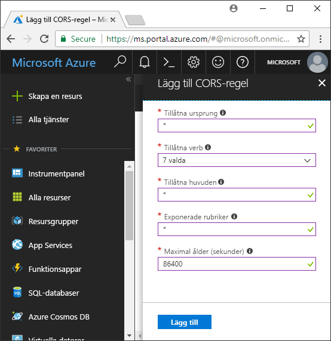

<!-- Customer intent: As a web application developer I want to interface with Azure Blob storage entirely on the client so that I can build a SPA application that is able to upload and delete files on blob storage. -->

# <a name="quickstart-upload-list-and-delete-blobs-using-javascripthtml-in-the-browser"></a>Snabbstart: Ladda upp, lista och ta bort blobar med hjälp av JavaScript/HTML i webbläsaren

Den här snabbstarten visar hur du hanterar blobar från kod som körs helt i webbläsaren. Den metod som används här visar hur du tillämpar de säkerhetsåtgärder som krävs för att garantera säker åtkomst till bloblagringskontot. Du behöver en [Azure-prenumeration](https://azure.microsoft.com/free/?WT.mc_id=A261C142F) för att kunna utföra den här snabbstarten.

## <a name="prerequisites"></a>Nödvändiga komponenter

[!INCLUDE [storage-quickstart-prereq-include](../../../includes/storage-quickstart-prereq-include.md)]

## <a name="setting-up-storage-account-cors-rules"></a>Ställa in CORS-regler för lagringskonto 
Innan webbprogrammet kan komma åt en bloblagring från klienten måste kontot konfigureras så att du aktiverar CORS, [resursdelning mellan ursprung](https://docs.microsoft.com/rest/api/storageservices/cross-origin-resource-sharing--cors--support-for-the-azure-storage-services). 

Återgå till Azure Portal och välj ditt lagringskonto. Om du vill definiera en ny regel för resursdelning mellan ursprung återgår du till avsnittet **Inställningar** och klickar på länken **CORS**. Klicka sedan på knappen **Lägg till** för att öppna fönstret **Lägg till CORS-regel**. För den här snabbstarten skapar du en öppen CORS-regel:



I följande tabell beskrivs varje CORS-inställning och de värden som används för att definiera regeln.

|Inställning  |Värde  | Beskrivning |
|---------|---------|---------|
| Tillåtna ursprung | * | Accepterar en kommaavgränsad lista över domäner som är inställda som godkänt ursprung. Om du anger värdet till `*` ges alla domäner åtkomst till lagringskontot. |
| Tillåtna verb     | delete, get, head, merge, post, options och put | Listar de HTTP-verb som kan köras mot lagringskontot. För den här snabbstarten väljer du alla tillgängliga alternativ. |
| Tillåtna rubriker | * | Definierar en lista över begäranderubriker (inklusive prefixrubriker) som tillåts av lagringskontot. Om du ställer in värdet på `*` får alla rubriker åtkomst. |
| Exponerade rubriker | * | Listar de svarsrubriker som tillåts av kontot. Om du ställer in värdet på `*` får kontot skicka alla rubriker.  |
| Maximal ålder (sekunder) | 86400 | Den maximala tidsperiod som webbläsaren cachelagrar den preliminära OPTIONS-begäran. Ett värde på *86400* innebär cachelagring under ett helt dygn. |

> [!IMPORTANT]
> När du gör inställningar i produktionen ska du alltid använda lägsta möjliga åtkomst till lagringskontot, av säkerhetsskäl. De CORS-inställningar som beskrivs här är lämpliga för en snabbstart eftersom de innebär en flexibel säkerhetsprincip. Inställningarna rekommenderas dock inte i verkliga sammanhang.

Härnäst använder du Azure-molnskalet och skapar en säkerhetstoken.

[!INCLUDE [Open the Azure cloud shell](../../../includes/cloud-shell-try-it.md)]

## <a name="create-a-shared-access-signature"></a>Skapa en signatur för delad åtkomst
SAS, eller signatur för delad åtkomst, används av den kod som körs i webbläsaren för att auktorisera begäranden till bloblagring. Med hjälp av SAS kan klienten auktorisera åtkomst till lagringsresurser utan att ha åtkomstnyckel eller anslutningssträng för kontot. Mer information om SAS finns i [Använda signaturer för delad åtkomst (SAS)](../common/storage-dotnet-shared-access-signature-part-1.md).

Du kan skapa en SAS med hjälp av Azure CLI via Azure-molnskalet eller med Azure Storage Explorer. I följande tabell beskrivs de parametrar du behöver ange värden för om du vill skapa en SAS med CLI.

| Parameter      |Beskrivning  | Platshållare |
|----------------|-------------|-------------|
| *expiry*       | Förfallodatum för åtkomsttoken i formatet YYYY-MM-DD. Ange morgondagens datum under den här snabbstarten. | *FUTURE_DATE* |
| *account-name* | Namnet på lagringskontot. Använd det namn som noterades i ett tidigare steg. | *YOUR_STORAGE_ACCOUNT_NAME* |
| *account-key*  | Nyckeln till lagringskontot. Använd den nyckel som noterades i ett tidigare steg. | *YOUR_STORAGE_ACCOUNT_KEY* |

Följande skript använde Azure CLI för att skapa en signatur för delad åtkomst (SAS) som du kan överföra till en JavaScript-blobtjänst.

> [!NOTE]
> Ta bort extra blanksteg mellan parametrar innan du klistrar in kommandot i Azure-molnskalet för bästa resultat.

```bash
az storage account generate-sas
                    --permissions racwdl
                    --resource-types sco
                    --services b
                    --expiry FUTURE_DATE
                    --account-name YOUR_STORAGE_ACCOUNT_NAME
                    --account-key YOUR_STORAGE_ACCOUNT_KEY
```
Du kan kanske uppleva serien med värden efter varje parameter som lite kryptisk. Dessa parametervärden hämtas från den första bokstaven i respektive behörighet. I följande tabell förklaras var värdena kommer från: 

| Parameter        | Värde   | Beskrivning  |
|------------------|---------|---------|
| *permissions*    | racwdl  | Den här signaturen för delad åtkomst (SAS) kan *läsa*, *bifoga*, *skapa*, *skriva*, *ta bort* och *lista*  funktioner. |
| *resource-types* | sco     | De resurser som påverkas av signaturen för delad åtkomst (SAS) är *tjänst*, *container* och *objekt*. |
| *tjänster*       | b       | Den tjänst som påverkas av signaturen för delad åtkomst är *blob*-tjänsten. |

Nu när signaturen för delad åtkomst genereras kopierar du det värde som returneras i konsolen till en textredigerare. Du ska använda det här värdet i ett kommande steg.

> [!IMPORTANT]
> Under produktionen ska du alltid skicka SAS-token med SSL. SAS-token bör dessutom genereras på servern och skickas till HTML-sidan för att återgå till Azure Blob Storage. En metod du kan överväga är att använda en serverlös funktion när du genererar SAS-tokens. I Azure-portalen finns funktionsmallar som ger möjligheten att generera en SAS med en JavaScript-funktion.

## <a name="implement-the-html-page"></a>Implementera HTML-sidan

### <a name="set-up-the-web-application"></a>Konfigurera webbprogrammet
JavaScript-klientbibliotek för Azure Storage fungerar inte direkt från filsystemet och måste hanteras från en webbserver. I följande steg förklarar vi därför hur du använder en enkel lokal webbserver med Node.js.

> [!NOTE]
> Det här avsnittet visar hur du skapar en lokal webbserver som kräver att Node.js installeras på datorn. Om du inte vill installera Node.js kan du använda något annat sätt för att köra en lokal webbserver.

Skapa först en ny mapp för projektet och ge den namnet *azure-blobs-javascript*. Öppna därefter en kommandotolk i mappen *azure-blobs-javascript* och förbered programmet inför installationen av webbservermodulen genom att skriva in följande kommando:

```bash
npm init -y
```
När du kör *init* läggs filer till som behövs för att hjälpa till att installera en webbservermodul. Ange följande kommando för att installera modulen:

```bash
npm i http-server
```
Redigera därefter filen *package.json* och ersätt den befintliga definitionen av *scripts* (skript) med följande kodavsnitt:

```javascript
"scripts": {
    "start": "http-server"
}
```
Skriv slutligen in `npm start` i kommandotolken för att starta webbservern:

```bash
npm start
```

### <a name="get-the-blob-storage-client-library"></a>Hämta klientbiblioteket för bloblagringen
[Ladda ned JavaScript-klientbiblioteken](https://aka.ms/downloadazurestoragejs), packa upp innehållet i zip-filen och placera skriptfilerna från mappen *bundle* (paket) i en mapp med namnet *scripts* (skript).

### <a name="add-the-client-script-reference-to-the-page"></a>Lägga till klientskriptreferens på sidan
Skapa en HTML-sida i roten på mappen *azure-blobs-javascript* och döp den till *index.html*. När sidan har skapats lägger du till följande markering på sidan.

```html
<!DOCTYPE html>
<html>
    <body>
        <button id="create-button">Create Container</button>

        <input type="file" id="fileinput" />
        <button id="upload-button">Upload</button>

        <button id="list-button">List</button>
        
        <button id="delete-button">Delete</button>
    </body>
    <script src="scripts/azure-storage.blob.min.js" charset="utf-8"></script>
    <script>
        // Blob-related code goes here
    </script>
</html>
```
Sen här markeringen lägger till följande på sidan:

- en referens till *scripts/azure-storage.blob.js*
- knappar för att skapa en container, ladda upp, lista och ta bort blobar
- ett *INPUT*-element (indata) som använd till att ladda upp en fil
- en platshållare för lagringsspecifik kod

### <a name="create-an-instance-of-blobservice"></a>Skapa en instans av BlobService 
Tjänsten [BlobService](https://azure.github.io/azure-storage-node/BlobService.html) tillhandahåller ett gränssnitt för Azure Blob Storage. Om du vill skapa en instans av tjänsten måste du ange lagringskontonamnet och den SAS som genererades i ett tidigare steg.

```javascript
const account = {
    name: YOUR_STORAGE_ACCOUNT_NAME,
    sas:  YOUR_SAS
};

const blobUri = 'https://' + account.name + '.blob.core.windows.net';
const blobService = AzureStorage.Blob.createBlobServiceWithSas(blobUri, account.sas);
```

### <a name="create-a-blob-container"></a>Skapa en blobcontainer
När du har skapat blobtjänsten kan du nu skapa en ny container där du kan lagra en uppladdad blob. Metoden [createContainerIfNotExists](https://azure.github.io/azure-storage-node/BlobService.html#createContainerIfNotExists__anchor) skapar en ny behållare och ger inget felmeddelande om behållaren redan finns.

```javascript
document.getElementById('create-button').addEventListener('click', () => {

    blobService.createContainerIfNotExists('mycontainer',  (error, container) => {
        if (error) {
            // Handle create container error
        } else {
            console.log(container.name);
        }
    });

});
```

### <a name="upload-a-blob"></a>Ladda upp en blob
Om du vill ladda upp en blob från ett HTML-formulär måste du hämta en referens till den valda filen från ett *INPUT*-element. Den valda filen är tillgängliga via matrisen `files` när elementets *typ* är inställd på *fil*.

Via skriptet kan du referera till HTML-element och skicka den valda filen till blobtjänsten.

```javascript
document.getElementById('upload-button').addEventListener('click', () => {

    const file = document.getElementById('fileinput').files[0];

    blobService.createBlockBlobFromBrowserFile('mycontainer', 
                                                file.name, 
                                                file, 
                                                (error, result) => {
                                                    if(error) {
                                                        // Handle blob error
                                                    } else {
                                                        console.log('Upload is successful');
                                                    }
                                                });

});
```

Metoden [createBlockBlobFromBrowserFile](https://azure.github.io/azure-storage-node/BlobService.html#createBlockBlobFromBrowserFile__anchor) använder webbläsarfilen direkt för att ladda upp till en blobcontainer.

### <a name="list-blobs"></a>Lista blobar
När du har överfört en fil till blobcontainern kommer du åt en lista över blobar i containern med hjälp av metoden [listBlobsSegmented](https://azure.github.io/azure-storage-node/BlobService.html#listBlobsSegmented__anchor).

```javascript
document.getElementById('list-button').addEventListener('click', () => {

    blobService.listBlobsSegmented('mycontainer', null, (error, results) => {
        if (error) {
            // Handle list blobs error
        } else {
            results.entries.forEach(blob => {
                console.log(blob.name);
            });
        }
    });
    
});
```

Metoden *listBlobsSegmented* returnerar en samling blobar. Som standard är samlingsantalet 5 000 blobar, men du kan ändra värdet efter dina behov. I [continuation sample](https://github.com/Azure/azure-storage-node/blob/master/examples/samples/continuationsample.js#L132) får du en demonstration av hur du arbetar med ett stort antal blobar och hur klientbiblioteket stöder sidindelning. 


### <a name="delete-blobs"></a>Ta bort blobbar
Du kan ta bort den blob som du laddade upp genom att anropa [deleteBlobIfExists](https://azure.github.io/azure-storage-node/BlobService.html#deleteBlobIfExists__anchor).

```javascript
document.getElementById('delete-button').addEventListener('click', () => {

    var blobName = YOUR_BLOB_NAME;
    blobService.deleteBlobIfExists('mycontainer', blobName, (error, result) => {
        if (error) {
            // Handle delete blob error
        } else {
            console.log('Blob deleted successfully');
        }
    });
    
});
```
> [!WARNING]
> För det här kodexemplet ska fungera måste du ange ett strängvärde för *blobName*.

## <a name="clean-up-resources"></a>Rensa resurser
Om du vill rensa de resurser som skapades under den här snabbstarten öppnar du [Azure-portalen](https://portal.azure.com) igen och väljer ditt lagringskonto. När du valt lagringskontot kan du ta bort det genom att navigera till: **Översikt> Ta bort lagringskonto**.

## <a name="next-steps"></a>Nästa steg
Titta på exemplen och lär dig hur du laddar ned blobar och rapporterar förlopp under filöverföringar.

> [!div class="nextstepaction"]
> [Bloblagringsklientbibliotek](https://github.com/Azure/azure-storage-node/tree/master/browser)
