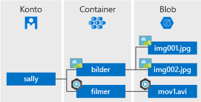

# <a name="quickstart-azure-blob-storage-client-library-v12-for-javascript"></a>Snabb start: klient biblioteket för Azure Blob Storage-V12 för Java Script

Kom igång med Azure Blob Storage-V12 för Java Script. Azure Blob Storage är Microsofts objektlagringslösning för molnet. Följ stegen för att installera paketet och prova exempel koden för grundläggande uppgifter. Blobblagring är optimerat för att lagra stora mängder ostrukturerade data.

> [!NOTE]
> För att komma igång med den tidigare SDK-versionen, se [snabb start: Azure Blob Storage klient bibliotek för Java Script](storage-quickstart-blobs-nodejs-v10.md).

Använd klient biblioteket för Azure Blob Storage-V12 för Java Script för att:

* Skapa en container
* Ladda upp en blob till Azure Storage
* Lista alla blobar i en behållare
* Ladda ned blobben till den lokala datorn
* Ta bort en container

[API Reference-dokumentation](/javascript/api/@azure/storage-blob) | [bibliotekets käll kod](https://github.com/Azure/azure-sdk-for-js/tree/master/sdk/storage/storage-blob) | [paketet (Node Pack Manager)](https://www.npmjs.com/package/@azure/storage-blob/v/12.0.0) | [exempel](https://github.com/Azure/azure-sdk-for-js/tree/master/sdk/storage/storage-blob/samples)

[!INCLUDE [storage-multi-protocol-access-preview](../../../includes/storage-multi-protocol-access-preview.md)]

## <a name="prerequisites"></a>Krav

* Azure-prenumeration – [skapa en kostnads fritt](https://azure.microsoft.com/free/)
* Azure Storage-konto – [skapa ett lagrings konto](https://docs.microsoft.com/azure/storage/common/storage-quickstart-create-account)
* Aktuell [Node. js](https://nodejs.org/en/download/) för ditt operativ system.

## <a name="setting-up"></a>Konfigurera

Det här avsnittet beskriver hur du förbereder ett projekt så att det fungerar med Azure Blob Storage-V12 för Java Script.

### <a name="create-the-project"></a>Skapa projektet

Skapa ett JavaScript-program med namnet *BLOB-snabb start-V12*.

1. Skapa en ny katalog för projektet i ett konsol fönster (till exempel cmd, PowerShell eller bash).

    ```console
    mkdir blob-quickstart-v12
    ```

1. Växla till den nyss skapade *V12-katalogen för BLOB-snabb start* .

    ```console
    cd blob-quickstart-v12
    ```

1. Skapa en ny textfil med namnet *Package. JSON*. Den här filen definierar Node. js-projektet. Spara filen i katalogen *BLOB-snabb start-V12* . Här är filens innehåll:

    ```json
    {
        "name": "blob-quickstart-v12",
        "version": "1.0.0",
        "description": "Use the @azure/storage-blob SDK version 12 to interact with Azure Blob storage",
        "main": "blob-quickstart-v12.js",
        "scripts": {
            "start": "node blob-quickstart-v12.js"
        },
        "author": "Your Name",
        "license": "MIT",
        "dependencies": {
            "@azure/storage-blob": "^12.0.0",
            "@types/dotenv": "^4.0.3",
            "dotenv": "^6.0.0"
        }
    }
    ```
    
    Du kan ange ett eget namn i för fältet `author` om du vill.
   
### <a name="install-the-package"></a>Installera paketet

Medan du fortfarande finns i katalogen *BLOB-snabb start-V12* , installerar du klient biblioteket för Azure Blob Storage för JavaScript-paket med hjälp av kommandot `npm install`. Detta kommando läser filen *Package. JSON* och installerar Azure Blob Storage-V12 för JavaScript-paket och alla bibliotek som det är beroende av.

```console
npm install
```

### <a name="set-up-the-app-framework"></a>Konfigurera app Framework

Från projekt katalogen:

1. Öppna en annan ny textfil i kod redigeraren
1. Lägg till `require` anrop för att läsa in Azure-och Node. js-moduler
1. Skapa strukturen för programmet, inklusive mycket grundläggande undantags hantering

    Här är koden:

    ```javascript
    const { BlobServiceClient } = require('@azure/storage-blob');
    const uuidv1 = require('uuid/v1');
    
    async function main() {
        console.log('Azure Blob storage v12 - Javascript quickstart sample');
        // Quick start code goes here
    }
    
    main().then(() => console.log('Done')).catch((ex) => console.log(ex.message));
    ```

1. Spara den nya filen som *BLOB-QuickStart-V12. js* i katalogen *BLOB-snabb start-V12* .

### <a name="copy-your-credentials-from-the-azure-portal"></a>Kopiera dina autentiseringsuppgifter från Azure-portalen

När exempel programmet gör en begäran för att Azure Storage, måste det vara auktoriserat. Om du vill auktorisera en begäran lägger du till autentiseringsuppgifterna för ditt lagrings konto i programmet som en anslutnings sträng. Visa autentiseringsuppgifterna för lagringskontot genom att följa dessa steg:

1. Logga in på [Azure-portalen](https://portal.azure.com).
2. Leta rätt på ditt lagringskonto.
3. Välj **Åtkomstnycklar** i avsnittet **Inställningar** i lagringskontoöversikten. Här kan du visa åtkomstnycklarna för kontot och den fullständiga anslutningssträngen för varje nyckel.
4. Sök efter värdet för **Anslutningssträng** under **key1** och kopiera anslutningssträngen genom att välja **Kopiera**. Du lägger till strängvärdet för anslutningen till en miljövariabel i nästa steg.

    

### <a name="configure-your-storage-connection-string"></a>Konfigurera anslutningssträngen för lagring

När du har kopierat anslutningssträngen ska du skriva den till en ny miljövariabel på den lokala dator där programmet körs. Konfigurera miljövariabeln genom att öppna ett konsolfönster och följa anvisningarna för ditt operativsystem. Ersätt `<yourconnectionstring>` med den faktiska anslutnings strängen.

#### <a name="windows"></a>Windows

```cmd
setx CONNECT_STR "<yourconnectionstring>"
```

När du har lagt till miljövariabeln i Windows måste du starta en ny instans av kommando fönstret.

#### <a name="linux"></a>Linux

```bash
export CONNECT_STR="<yourconnectionstring>"
```

#### <a name="macos"></a>macOS

```bash
export CONNECT_STR="<yourconnectionstring>"
```

#### <a name="restart-programs"></a>Starta om program

När du har lagt till miljövariabeln startar du om alla program som körs som behöver läsa miljövariabeln. Starta till exempel utvecklings miljön eller redigeraren innan du fortsätter.

## <a name="object-model"></a>Objekt modell

Azure Blob Storage är optimerat för att lagra enorma mängder ostrukturerade data. Ostrukturerade data är data som inte följer en viss datamodell eller definition, till exempel text eller binära data. I blobblagringen finns tre typer av resurser:

* Lagrings kontot
* En behållare i lagrings kontot
* En BLOB i behållaren

Följande diagram visar relationen mellan de här resurserna.



Använd följande JavaScript-klasser för att interagera med dessa resurser:

* [BlobServiceClient](/javascript/api/@azure/storage-blob/blobserviceclient): klassen `BlobServiceClient` gör att du kan ändra Azure Storage resurser och blob-behållare.
* [ContainerClient](/javascript/api/@azure/storage-blob/containerclient): klassen `ContainerClient` gör att du kan ändra Azure Storage behållare och deras blobbar.
* [BlobClient](/javascript/api/@azure/storage-blob/blobclient): klassen `BlobClient` gör att du kan ändra Azure Storage blobbar.

## <a name="code-examples"></a>Kod exempel

I de här exempel kods tycken visas hur du gör följande med klient biblioteket för Azure Blob Storage för Java Script:

* [Hämta anslutnings strängen](#get-the-connection-string)
* [Skapa en behållare](#create-a-container)
* [Ladda upp blobbar till en behållare](#upload-blobs-to-a-container)
* [Visa en lista över blobarna i en behållare](#list-the-blobs-in-a-container)
* [Ladda ned blobbar](#download-blobs)
* [Ta bort en container](#delete-a-container)

### <a name="get-the-connection-string"></a>Hämta anslutningssträngen

Koden nedan hämtar anslutnings strängen för lagrings kontot från den miljö variabel som skapades i avsnittet [Konfigurera din lagrings anslutnings sträng](#configure-your-storage-connection-string) .

Lägg till den här koden i `main`-funktionen:

```javascript
// Retrieve the connection string for use with the application. The storage
// connection string is stored in an environment variable on the machine
// running the application called CONNECT_STR. If the environment variable is
// created after the application is launched in a console or with Visual Studio,
// the shell or application needs to be closed and reloaded to take the
// environment variable into account.
const CONNECT_STR = process.env.CONNECT_STR;
```

### <a name="create-a-container"></a>Skapa en container

Välj ett namn för den nya behållaren. Koden nedan lägger till ett UUID-värde till behållar namnet för att säkerställa att det är unikt.

> [!IMPORTANT]
> Containernamn måste använda gemener. Mer information om namngivning av containrar och blobar finns i [Namngivning och referens av containrar, blobar och metadata](/rest/api/storageservices/naming-and-referencing-containers--blobs--and-metadata).

Skapa en instans av klassen [BlobServiceClient](/javascript/api/@azure/storage-blob/blobserviceclient) genom att anropa [fromConnectionString](/javascript/api/@azure/storage-blob/blobserviceclient#fromconnectionstring-string--storagepipelineoptions-) -metoden. Anropa sedan metoden [getContainerClient](/javascript/api/@azure/storage-blob/blobserviceclient#getcontainerclient-string-) för att hämta en referens till en behållare. [Skapa slutligen ett anrop för](/javascript/api/@azure/storage-blob/containerclient#create-containercreateoptions-) att skapa behållaren i ditt lagrings konto.

Lägg till den här koden i slutet av `main`-funktionen:

```javascript
// Create the BlobServiceClient object which will be used to create a container client
const blobServiceClient = await new BlobServiceClient.fromConnectionString(CONNECT_STR);

// Create a unique name for the container
const containerName = 'quickstart' + uuidv1();

console.log('\nCreating container...');
console.log('\t', containerName);

// Get a reference to a container
const containerClient = await blobServiceClient.getContainerClient(containerName);

// Create the container
await containerClient.create();
```

### <a name="upload-blobs-to-a-container"></a>Ladda upp blobbar till en behållare

Följande kodfragment:

1. Skapar en text sträng som ska överföras till en blob.
1. Hämtar en referens till ett [BlockBlobClient](/javascript/api/@azure/storage-blob/blockblobclient) -objekt genom att anropa metoden [getBlockBlobClient](/javascript/api/@azure/storage-blob/containerclient#getblockblobclient-string-) på [ContainerClient](/javascript/api/@azure/storage-blob/containerclient) från avsnittet [skapa en behållare](#create-a-container) .
1. Överför text Strängs data till blobben genom att anropa [överförings](/javascript/api/@azure/storage-blob/blockblobclient#upload-httprequestbody--number--blockblobuploadoptions-) metoden.

Lägg till den här koden i slutet av `main`-funktionen:

```javascript
// Create a unique name for the blob
const blobName = 'quickstart' + uuidv1() + '.txt';

// Get a block blob client
const blockBlobClient = containerClient.getBlockBlobClient(blobName);

console.log('\nUploading to Azure Storage as blob:\n\t', blobName);

// Upload data to the blob
const data = 'Hello, World!';
await blockBlobClient.upload(data, data.length);
```

### <a name="list-the-blobs-in-a-container"></a>Visa en lista över blobarna i en container

Visa en lista över blobarna i behållaren genom att anropa metoden [listBlobsFlat](/javascript/api/@azure/storage-blob/containerclient#listblobsflat-containerlistblobsoptions-) . I det här fallet har endast en BLOB lagts till i behållaren, så List åtgärden returnerar bara den en blob.

Lägg till den här koden i slutet av `main`-funktionen:

```javascript
console.log('\nListing blobs...');

// List the blob(s) in the container.
for await (const blob of containerClient.listBlobsFlat()) {
    console.log('\t', blob.name);
}
```

### <a name="download-blobs"></a>Ladda ned blobbar

Hämta den tidigare skapade blobben genom att anropa [nedladdnings](/javascript/api/@azure/storage-blob/blockblobclient#download-undefined---number--undefined---number--blobdownloadoptions-) metoden. Exempel koden innehåller en hjälp funktion som kallas `streamToString` som används för att läsa en Node. js-läsbar data ström i en sträng.

Lägg till den här koden i slutet av `main`-funktionen:

```javascript
// Get blob content from position 0 to the end
// In Node.js, get downloaded data by accessing downloadBlockBlobResponse.readableStreamBody
// In browsers, get downloaded data by accessing downloadBlockBlobResponse.blobBody
const downloadBlockBlobResponse = await blockBlobClient.download(0);
console.log('\nDownloaded blob content...');
console.log('\t', await streamToString(downloadBlockBlobResponse.readableStreamBody));
```

Lägg till den här hjälp funktionen *efter* funktionen `main`:

```javascript
// A helper function used to read a Node.js readable stream into a string
async function streamToString(readableStream) {
  return new Promise((resolve, reject) => {
    const chunks = [];
    readableStream.on("data", (data) => {
      chunks.push(data.toString());
    });
    readableStream.on("end", () => {
      resolve(chunks.join(""));
    });
    readableStream.on("error", reject);
  });
}
```

### <a name="delete-a-container"></a>Ta bort en container

Följande kod rensar resurserna som skapats av appen genom att ta bort hela behållaren med [Delete](/javascript/api/@azure/storage-blob/containerclient#delete-containerdeletemethodoptions-) -metoden. Du kan också ta bort de lokala filerna, om du vill.

Lägg till den här koden i slutet av `main`-funktionen:

```javascript
console.log('\nDeleting container...');

// Delete container
await containerClient.delete();
```

## <a name="run-the-code"></a>Kör koden

Den här appen skapar en text sträng och laddar upp den till Blob Storage. I exemplet visas sedan en lista över blobarna i behållaren, laddar ned bloben och visar hämtade data.

Från en konsol tolk navigerar du till katalogen som innehåller filen *BLOB-QuickStart-V12.py* och kör sedan följande `node` kommando för att köra appen.

```console
node blob-quickstart-v12.js
```

Utdata från appen liknar följande exempel:

```output
Azure Blob storage v12 - JavaScript quickstart sample

Creating container...
         quickstart4a0780c0-fb72-11e9-b7b9-b387d3c488da

Uploading to Azure Storage as blob:
         quickstart4a3128d0-fb72-11e9-b7b9-b387d3c488da.txt

Listing blobs...
         quickstart4a3128d0-fb72-11e9-b7b9-b387d3c488da.txt

Downloaded blob content...
         Hello, World!

Deleting container...
Done
```

Gå igenom koden i fel söknings programmet och kontrol lera Azure Portal under hela processen. Kontrol lera att behållaren håller på att skapas. Du kan öppna blobben i behållaren och visa innehållet.

## <a name="next-steps"></a>Nästa steg

I den här snabb starten har du lärt dig att ladda upp, ladda ned och lista blobar med hjälp av Java Script.

Om du vill se exempel appar för Blob Storage fortsätter du till:

> [!div class="nextstepaction"]
> [JavaScript-exempel för Azure Blob Storage SDK V12](https://github.com/Azure/azure-sdk-for-js/tree/master/sdk/storage/storage-blob/samples)

* Mer information finns i [Azure SDK för Java Script](https://github.com/Azure/azure-sdk-for-js/blob/master/sdk/storage/storage-blob/README.md).
* För självstudier, exempel, snabb starter och annan dokumentation går du till [Azure SDK för JavaScript-dokumentation](/azure/javascript/).
