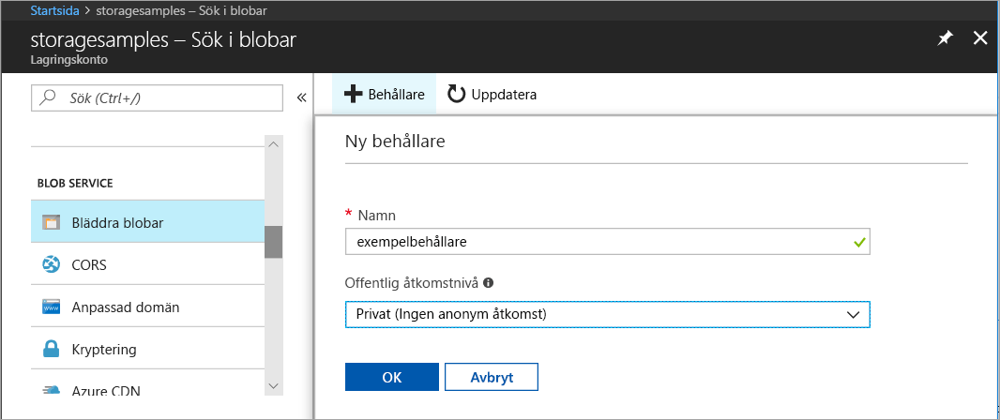
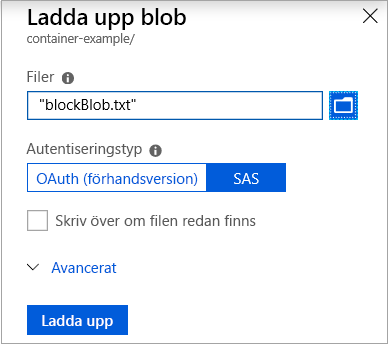
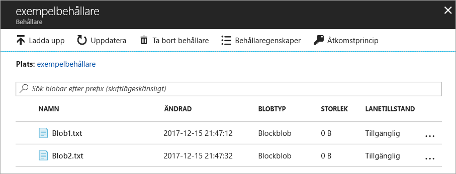
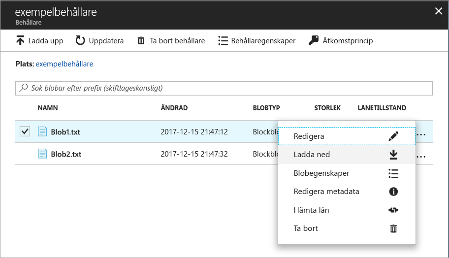
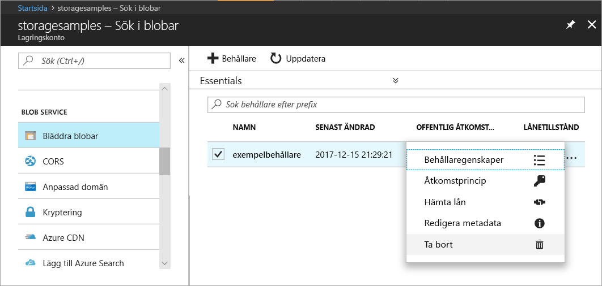

# Snabbstart: Ladda upp, ladda ned och lista blobar med Azure-portalen

I den här snabbstarten får du lära dig att använda [Azure Portal](https://portal.azure.com/) för att skapa en container i Azure Storage, samt ladda upp och ladda ned blockblobar i den containern.

## Nödvändiga komponenter

Om du inte har en Azure-prenumeration kan du skapa ett [kostnadsfritt konto](https://azure.microsoft.com/free/?WT.mc_id=A261C142F) innan du börjar.

[!INCLUDE [storage-create-account-portal-include](../../../includes/storage-create-account-portal-include.md)]

## Skapa en container

Följ dessa steg för att skapa en container i Azure Portal:

1. Navigera till ditt nya lagringskonto i Azure Portal.
2. På den vänstra menyn för lagringskontot bläddrar du till avsnittet **Blob Service** och väljer sedan **Bläddra efter blobar**.
3. Klicka på knappen **Lägg till container**.
4. Ange ett namn för den nya containern. Containernamnet får bara innehålla gemener, måste börja med en bokstav eller siffra och får bara innehålla bokstäver, siffror och bindestreck (-). Mer information om containrar och blobnamn finns i [Namngivning och referens av containrar, blobar och metadata](https://docs.microsoft.com/rest/api/storageservices/naming-and-referencing-containers--blobs--and-metadata).
5. Ställ in nivån för allmän åtkomst till containern. Standardnivån är **Privat (ingen anonym åtkomst)**.
6. Klicka på **OK** för att skapa containern.

    

## Ladda upp en blockblob

Blockblobar består av datablock som har satts samman för att bilda en blob. De flesta scenarier med bloblagring använder blockblobar. Blockblobar är utmärkta för att lagra text eller binära data i molnet, t.ex. filer, avbildningar och videor. Den här snabbstarten visar hur du arbetar med blockblobar. 

Följ de här stegen för att ladda upp en blockblob till den nya containern i Azure Portal:

1. Navigera till den container som du skapade i föregående avsnitt i Azure Portal.
2. Välj containern för att visa en lista över blobar som den innehåller. I det här fallet innehåller den inga blobar än, eftersom du har skapat en ny container.
3. Klicka på knappen **Ladda upp** för att ladda upp en blob till containern.
4. Bläddra i det lokala filsystemet för att hitta en fil att ladda upp som en blockblob, och klicka på **Ladda upp**.
     
    

5. Ladda upp så många blobar du vill på det här sättet. Du kan se att de nya blobarna nu visas i listan i containern.

    

## Ladda ned en blockblob

Du kan ladda ned en blockblob som ska visas i webbläsaren eller spara den i det lokala filsystemet. Följ de här stegen om du vill ladda ned en blockblob:

1. Gå till listan över blobar som du överförde i föregående avsnitt. 
2. Välj den blob som ska laddas ned.
3. Högerklicka på knappen **Mer** (**...**) och välj **Ladda ned**. 

## Rensa resurser

Om du vill ta bort de resurser du har skapat i den här snabbstarten kan du helt enkelt ta bort containern. Alla blobar i containern tas också bort.

Ta bort containern:

1. Gå till listan med containrar i ditt lagringskonto i Azure Portal.
2. Välj den container som ska tas bort.
3. Högerklicka på knappen **Mer** (**...**) och välj **Ta bort**.
4. Bekräfta att du vill ta bort containern.

       

## Nästa steg

I den här snabbstarten har du lärt dig hur du överför filer mellan en lokal disk och Azure Blob Storage med .NET. Om du vill veta mer om att arbeta med Blob Storage kan du fortsätta till anvisningarna om Blob Storage.

> [!div class="nextstepaction"]
> [Anvisningar för Blob Storage-åtgärder](storage-dotnet-how-to-use-blobs.md)

