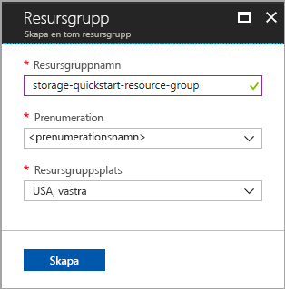
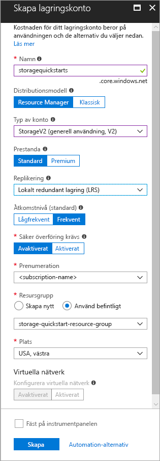

# <a name="create-a-new-storage-account"></a>Skapa ett nytt lagringskonto

Ett Azure Storage-konto tillhandahåller ett unikt namnområde i molnet där du kan lagra och få åtkomst till dina dataobjekt i Azure Storage. Ett lagringskonto innehåller alla blobar, filer, köer, tabeller och diskar som du skapar med det kontot. 

Du måste först skapa ett nytt lagringskonto för att komma igång med Azure Storage. Du kan skapa ett Azure Storage-konto med hjälp av [Azure Portal](https://portal.azure.com/), [Azure PowerShell](https://docs.microsoft.com/powershell/azure/overview) eller [Azure CLI](https://docs.microsoft.com/cli/azure/overview?view=azure-cli-latest). Den här snabbstarten visar hur du använder vart och ett av dessa alternativ för att skapa det nya lagringskontot. 


## <a name="prerequisites"></a>Nödvändiga komponenter

Om du inte har en Azure-prenumeration kan du skapa ett [kostnadsfritt konto](https://azure.microsoft.com/free/) innan du börjar.

# <a name="portaltabportal"></a>[Portal](#tab/portal)

Ingen.

# <a name="powershelltabpowershell"></a>[PowerShell](#tab/powershell)

Den här snabbstarten kräver Azure PowerShell-modul version 3.6 eller senare. Kör `Get-Module -ListAvailable AzureRM` för att hitta din nuvarande version. Om du behöver installera eller uppgradera kan du läsa [Install Azure PowerShell module](/powershell/azure/install-azurerm-ps) (Installera Azure PowerShell-modul).

# <a name="azure-clitabazure-cli"></a>[Azure CLI](#tab/azure-cli)

Du kan logga in på Azure och köra Azure CLI-kommandon på något av två sätt:

- Du kan köra CLI-kommandon från Azure Portal, i Azure Cloud Shell 
- Du kan installera CLI och köra CLI-kommandon lokalt  

### <a name="use-azure-cloud-shell"></a>Använda Azure Cloud Shell

Azure Cloud Shell är ett kostnadsfritt Bash-gränssnitt som du kan köra direkt i Azure Portal. Den har Azure CLI förinstallerat och har konfigurerats för användning med ditt konto. Klicka på knappen **Cloud Shell** på menyn längst upp till höger i Azure Portal:

[](https://portal.azure.com)

Knappen startar ett interaktivt gränssnitt som du kan använda för att köra stegen i den här snabbstarten:

[](https://portal.azure.com)

### <a name="install-the-cli-locally"></a>Installera CLI lokalt

Du kan även installera och använda Azure CLI lokalt. För den här snabbstarten krävs det att du kör Azure CLI version 2.0.4 eller senare. Kör `az --version` för att hitta versionen. Om du behöver installera eller uppgradera kan du läsa [Installera Azure CLI 2.0](/cli/azure/install-azure-cli). 

---

## <a name="log-in-to-azure"></a>Logga in på Azure

# <a name="portaltabportal"></a>[Portal](#tab/portal)

Logga in på [Azure-portalen](https://portal.azure.com).

# <a name="powershelltabpowershell"></a>[PowerShell](#tab/powershell)

Logga in på Azure-prenumerationen med kommandot `Login-AzureRmAccount` och följ anvisningarna på skärmen för att autentisera.

```powershell
Login-AzureRmAccount
```

# <a name="azure-clitabazure-cli"></a>[Azure CLI](#tab/azure-cli)

Starta Azure Cloud Shell genom att logga in på [Azure Portal](https://portal.azure.com).

Logga in på den lokala installationen av CLI genom att köra inloggningskommandot:

```cli
az login
```

---

## <a name="create-a-resource-group"></a>Skapa en resursgrupp

En Azure-resursgrupp är en logisk behållare där Azure-resurser distribueras och hanteras. Mer information om resursgrupper finns i [Översikt över Azure Resource Manager](../../azure-resource-manager/resource-group-overview.md).

# <a name="portaltabportal"></a>[Portal](#tab/portal)

Följ de här stegen för att skapa en resursgrupp i Azure Portal:

1. I Azure Portal expanderar du menyn på vänster sida för att öppna tjänstemenyn och väljer **Resursgrupper**.
2. Klicka på knappen **Lägg till** för att lägga till en ny resursgrupp.
3. Ange ett namn för den nya resursgruppen.
4. Välj den prenumeration där du vill skapa den nya resursgruppen.
5. Välj platsen för resursgruppen.
6. Klicka på knappen **Skapa**.  



# <a name="powershelltabpowershell"></a>[PowerShell](#tab/powershell)

Om du vill skapa en resursgrupp med PowerShell använder du kommandot [New-AzureRmResourceGroup](/powershell/module/azurerm.resources/new-azurermresourcegroup): 

```powershell
# put resource group in a variable so you can use the same group name going forward,
# without hardcoding it repeatedly
$resourceGroup = "storage-quickstart-resource-group"
New-AzureRmResourceGroup -Name $resourceGroup -Location $location 
```

Om du inte vet vilken region du ska ange för parametern `-Location` kan du hämta en lista över regioner som stöds för din prenumeration med kommandot [Get-AzureRmLocation](/powershell/module/azurerm.resources/get-azurermlocation):

```powershell
Get-AzureRmLocation | select Location 
$location = "westus"
```

# <a name="azure-clitabazure-cli"></a>[Azure CLI](#tab/azure-cli)

Om du vill skapa en ny resursgrupp med Azure CLI använder du kommandot [az group create](/cli/azure/group#create). 

```azurecli-interactive
az group create \
    --name storage-quickstart-resource-group \
    --location westus
```

Om du inte vet vilken region du ska ange för parametern `--location` kan du hämta en lista över regioner som stöds för din prenumeration med kommandot [az account list-locations](/cli/azure/account#list).

```azurecli-interactive
az account list-locations \
    --query "[].{Region:name}" \
    --out table
```

---

# <a name="create-a-general-purpose-storage-account"></a>Skapa ett allmänt lagringskonto

Ett allmänt lagringskonto ger åtkomst till alla Azure Storage-tjänster: blobar, filer, köer och tabeller. Ett allmänt lagringskonto kan skapas på standard- eller premiumnivån. Exemplen i den här artikeln visar hur du skapar ett allmänt lagringskonto på standardnivån (standarden). Mer information om alternativ för lagringskontot finns i [Introduktion till Microsoft Azure Storage](storage-introduction.md).

Tänk på dessa regler när du namnger lagringskontot:

- Namnet på ett lagringskonto måste vara mellan 3 och 24 tecken långt och får endast innehålla siffror och gemener.
- Namnet på ditt lagringskonto måste vara unikt i Azure. Det får inte finnas två lagringskonton med samma namn.

# <a name="portaltabportal"></a>[Portal](#tab/portal)

Följ de här stegen för att skapa ett allmänt lagringskonto i Azure Portal:

1. I Azure-portalen, expanderar du menyn på vänster sida för att öppna tjänstemenyn och välj **fler tjänster**. Rulla ned till **lagring** och välj **lagringskonton**. På fönstret **lagringskonton** som visas, väljer du **lägg till**.
2. Ange ett namn för lagringskontot.
3. Behåll standardvärdena för dessa fält: **Distributionsmodell**, **Typ av konto**, **Prestanda**, **Replikering**, **Säker överföring krävs**.
4. Välj den prenumeration där du vill skapa lagringskontot.
5. I avsnittet **Resursgrupp** väljer du **Använd befintlig** och väljer sedan den resursgrupp du skapade i föregående avsnitt.
6. Välj platsen för det nya lagringskontot.
7. Skapa lagringskontot genom att klicka på **Skapa**.      



# <a name="powershelltabpowershell"></a>[PowerShell](#tab/powershell)

Om du vill skapa ett allmänt lagringskonto från PowerShell använder du kommandot [New-AzureRmStorageAccount](/powershell/module/azurerm.storage/New-AzureRmStorageAccount): 

```powershell
New-AzureRmStorageAccount -ResourceGroupName $resourceGroup `
  -Name "storagequickstart" `
  -Location $location `
  -SkuName Standard_LRS `
  -Kind Storage 
```

# <a name="azure-clitabazure-cli"></a>[Azure CLI](#tab/azure-cli)

Om du vill skapa ett allmänt lagringskonto från Azure CLI använder du kommandot [az storage account create](/cli/azure/storage/account#create).

```azurecli-interactive
az storage account create \
    --name storagequickstart \
    --resource-group storage-quickstart-resource-group \
    --location westus \
    --sku Standard_LRS 
```

---

## <a name="clean-up-resources"></a>Rensa resurser

Om du vill rensa de resurser som har skapats med den här snabbstarten kan du helt enkelt ta bort resursgruppen. När du tar bort resursgruppen raderas även det kopplade lagringskontot och eventuella andra resurser som är kopplade till resursgruppen.

# <a name="portaltabportal"></a>[Portal](#tab/portal)

Ta bort en resursgrupp med Azure Portal:

1. I Azure Portal expanderar du menyn på vänster sida för att öppna tjänstemenyn och väljer **Resursgrupper** för att visa listan över dina resursgrupper.
2. Leta reda på den resursgrupp du vill ta bort och högerklicka på knappen **Mer** (**...**) till höger om listan.
3. Välj **Ta bort resursgrupp** och bekräfta.

# <a name="powershelltabpowershell"></a>[PowerShell](#tab/powershell)

Om du vill ta bort resursgruppen och dess kopplade resurser, inklusive det nya lagringskontot, använder du kommandot [Remove-AzureRmResourceGroup](/powershell/module/azurerm.resources/remove-azurermresourcegroup): 

```powershell
Remove-AzureRmResourceGroup -Name $resourceGroup
```

# <a name="azure-clitabazure-cli"></a>[Azure CLI](#tab/azure-cli)

Om du vill ta bort resursgruppen och dess kopplade resurser, inklusive det nya lagringskontot, använder du kommandot [az group delete](/cli/azure/group#delete).

```azurecli-interactive
az group delete --name myResourceGroup
```

---

## <a name="next-steps"></a>Nästa steg

I den här snabbstarten har du skapat ett allmänt standardlagringskonto. Om du vill lära dig hur du laddar upp och ned blobar till och från lagringskontot kan du fortsätta med snabbstarten om Blob Storage.

# <a name="portaltabportal"></a>[Portal](#tab/portal)

> [!div class="nextstepaction"]
> [Överföra objekt till och från Azure Blob Storage med hjälp av Azure Portal](../blobs/storage-quickstart-blobs-portal.md)

# <a name="powershelltabpowershell"></a>[PowerShell](#tab/powershell)

> [!div class="nextstepaction"]
> [Överföra objekt till och från Azure Blob Storage med hjälp av PowerShell](../blobs/storage-quickstart-blobs-powershell.md)

# <a name="azure-clitabazure-cli"></a>[Azure CLI](#tab/azure-cli)

> [!div class="nextstepaction"]
> [Överföra objekt till och från Azure Blob Storage med hjälp av Azure CLI](../blobs/storage-quickstart-blobs-cli.md)

---