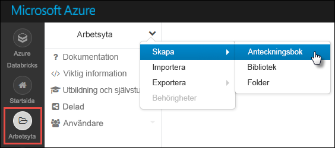
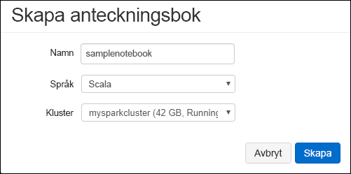

# <a name="tutorial-extract-transform-and-load-data-using-azure-databricks"></a>Självstudier: Extrahera, transformera och läsa in data med Azure Databricks

I den här självstudien får du utföra en ETL-åtgärd (extrahera, transformera och läsa in data) för att flytta data från förhandsversionen av Azure Data Lake Storage Gen2 till Azure SQL Data Warehouse med Azure Databricks.

Följande bild visar programflödet:


Den här självstudien omfattar följande uppgifter:

> [!div class="checklist"]
> * Skapa en Azure Databricks-arbetsyta
> * Skapa ett Spark-kluster i Azure Databricks
> * Skapa ett Azure Data Lake Storage Gen2-kompatibelt konto
> * Ladda upp data till Azure Data Lake Storage Gen2
> * Skapa en anteckningsbok i Azure Databricks
> * Extrahera data från Data Lake Storage Gen2
> * Transformera data med Azure Databricks
> * Läs in data till Azure SQL Data Warehouse

Om du inte har en Azure-prenumeration kan du [skapa ett kostnadsfritt konto ](https://azure.microsoft.com/free/) innan du börjar.

## <a name="prerequisites"></a>Krav

För att slutföra den här självstudien behöver du:

* Skapa ett Azure SQL Data Warehouse, skapa en brandväggsregel på servernivå och anslut till servern som en serveradministratör. Följ anvisningarna i [Snabbstart: Skapa ett Azure SQL Data Warehouse](../../sql-data-warehouse/create-data-warehouse-portal.md)
* Skapa en databashuvudnyckel för Azure SQL Data Warehouse. Följ anvisningarna i [Skapa en databashuvudnyckel](https://docs.microsoft.com/sql/relational-databases/security/encryption/create-a-database-master-key).
* [Skapa ett Azure Data Lake Storage Gen2-konto](quickstart-create-account.md)

## <a name="sign-in-to-the-azure-portal"></a>Logga in på Azure-portalen

Logga in på [Azure-portalen](https://portal.azure.com/).

## <a name="create-an-azure-databricks-workspace"></a>Skapa en Azure Databricks-arbetsyta

I det här avsnittet skapar du en Azure Databricks-arbetsyta med Azure-portalen. 

1. Välj **Skapa en resurs** > **Analys** > **Azure Databricks** i Azure-portalen.

    

2. Under **Azure Databricks-tjänst** anger du värden för att skapa en Databricks-arbetsyta.

    

    Ange följande värden:

    |Egenskap  |Beskrivning  |
    |---------|---------|
    |**Namn på arbetsyta**     | Ange ett namn för Databricks-arbetsytan.        |
    |**Prenumeration**     | I listrutan väljer du din Azure-prenumeration.        |
    |**Resursgrupp**     | Ange om du vill skapa en ny resursgrupp eller använda en befintlig. En resursgrupp är en container som innehåller relaterade resurser för en Azure-lösning. Mer information finns i [översikten över Azure-resursgrupper](../../azure-resource-manager/resource-group-overview.md). |
    |**Plats**     | Välj **USA, västra 2**. För andra tillgängliga regioner läser du informationen om [Azure-tjänsttillgänglighet per region](https://azure.microsoft.com/regions/services/).        |
    |**Prisnivå**     |  Välj mellan **Standard** och **Premium**. Mer information om de här nivåerna finns på [prissättningssidan för Databricks](https://azure.microsoft.com/pricing/details/databricks/).       |

    Välj **Fäst på instrumentpanelen** och välj sedan **Skapa**.

3. Det tar några minuter att skapa kontot. När kontot skapas i portalen visas panelen för att **skicka distribution för Azure Databricks** på höger sida. Du kan behöva rulla åt höger på instrumentpanelen för att se panelen. En förloppsindikator visas även längst upp på skärmen. Båda dessa områden visar förloppet.

    

## <a name="create-a-spark-cluster-in-databricks"></a>Skapa ett Spark-kluster i Databricks

1. I Azure-portalen går du till Databricks-arbetsytan som du skapade. Välj sedan **Starta arbetsyta**.

2. Du omdirigeras till Azure Databricks-portalen. I portalen väljer du **Kluster**.

    

3. På sidan **Nytt kluster** anger du värdena för att skapa ett kluster.

    

    Fyll i värden för följande fält och godkänn standardvärdena för de andra fälten:

    * Ange ett namn för klustret.
    * För den här artikeln skapar du ett kluster med körningen **4.2**.
    * Se till att markera kryssrutan **Avsluta efter ___ minuters inaktivitet**. Ange en varaktighet (i minuter) för att avsluta klustret om klustret inte används.

    Välj **Skapa kluster**. När klustret körs kan du ansluta anteckningsböcker till klustret och köra Spark-jobb.

## <a name="create-storage-account-file-system"></a>Skapa filsystem för lagringskonto

I det här avsnittet skapar du en anteckningsbok på Azure Databricks-arbetsytan och kör sedan kodfragment för att konfigurera lagringskontot.

1. Gå till arbetsytan Azure Databricks som du skapat i [Azure-portalen](https://portal.azure.com). Välj sedan **Starta arbetsyta**.

2. Välj **Arbetsyta** i det vänstra fönstret. I listrutan **Arbetsyta** väljer du **Skapa** > **Anteckningsbok**.

    

3. Ge anteckningsboken ett namn i dialogrutan **Skapa anteckningsbok**. Välj **Scala** som språk och välj sedan det Spark-kluster som du skapade tidigare.

    

    Välj **Skapa**.

4. Ange följande kod i den första cellen och kör koden:

    ```scala
    spark.conf.set("fs.azure.account.key.<ACCOUNT_NAME>.dfs.core.windows.net", "<ACCOUNT_KEY>") 
    spark.conf.set("fs.azure.createRemoteFileSystemDuringInitialization", "true")
    dbutils.fs.ls("abfs://<FILE_SYSTEM_NAME>@<ACCOUNT_NAME>.dfs.core.windows.net/")
    spark.conf.set("fs.azure.createRemoteFileSystemDuringInitialization", "false") 
    ```

    Kör kodcellen genom att trycka på **SKIFT + RETUR**.

    Nu skapas filsystemet för lagringskontot.

## <a name="upload-data-to-the-storage-account"></a>Ladda upp data till lagringskontot

Nästa steg är att ladda upp en exempeldatafil till lagringskontot som senare transformeras i Azure Databricks. 

> [!NOTE]
> Om du inte redan har ett Azure Data Lake Storage-konto med Gen2-funktioner följer du [snabbstarten och skapar ett](./quickstart-create-account.md).

1. Ladda ned (**small_radio_json.json**) från lagringsplatsen [U-SQL Examples and Issue Tracking](https://github.com/Azure/usql/blob/master/Examples/Samples/Data/json/radiowebsite/small_radio_json.json) och notera sökvägen där du sparar filen.

2. Sedan laddar du upp exempeldata på ditt lagringskonto. Metoden du använder för att ladda upp data till ditt lagringskonto skiljer sig åt beroende på om du har den hierarkiska namnrymden aktiverad.

    Om den hierarkiska namnrymden är aktiverad på ditt Azure Storage-konto som skapats för Gen2-kontot kan du använda Azure Data Factory, distp eller AzCopy (version 10) för att hantera uppladdningen. AzCopy version 10 är endast tillgänglig för kunder med förhandsversionen. Använd AzCopy genom att klistra in följande kod i ett kommandofönster:

    ```bash
    set ACCOUNT_NAME=<ACCOUNT_NAME>
    set ACCOUNT_KEY=<ACCOUNT_KEY>
    azcopy cp "<DOWNLOAD_PATH>\small_radio_json.json" https://<ACCOUNT_NAME>.dfs.core.windows.net/data --recursive 
    ```
    
## <a name="extract-data-from-azure-storage"></a>Extrahera data från Azure Storage

Gå tillbaka till DataBricks-anteckningsboken och ange följande kod i en ny cell:

1. Lägg till följande kodfragment i en tom kodcell och ersätt platshållarvärdena med de värden som du sparade från lagringskontot tidigare.

    ```scala
    dbutils.widgets.text("storage_account_name", "STORAGE_ACCOUNT_NAME", "<YOUR_STORAGE_ACCOUNT_NAME>")
    dbutils.widgets.text("storage_account_access_key", "YOUR_ACCESS_KEY", "<YOUR_STORAGE_ACCOUNT_SHARED_KEY>")
    ```

    Kör kodcellen genom att trycka på **SKIFT + RETUR**.

2. Du kan nu läsa in json-exempelfilen som en dataram i Azure Databricks. Klistra in följande kod i en ny cell och tryck sedan på **SKIFT + RETUR** (kom ihåg att ersätta platshållarvärdena):

    ```scala
    val df = spark.read.json("abfs://<FILE_SYSTEM_NAME>@<ACCOUNT_NAME>.dfs.core.windows.net/data/small_radio_json.json")
    ```

3. Kör följande kod om du vill se dataramens innehåll.

    ```scala
    df.show()
    ```

    Du bör se utdata som liknar följande fragment:

    ```bash
    +---------------------+---------+---------+------+-------------+----------+---------+-------+--------------------+------+--------+-------------+---------+--------------------+------+-------------+------+
    |               artist|     auth|firstName|gender|itemInSession|  lastName|   length|  level|            location|method|    page| registration|sessionId|                song|status|           ts|userId|
    +---------------------+---------+---------+------+-------------+----------+---------+-------+--------------------+------+--------+-------------+---------+--------------------+------+-------------+------+
    | El Arrebato         |Logged In| Annalyse|     F|            2|Montgomery|234.57914| free  |  Killeen-Temple, TX|   PUT|NextSong|1384448062332|     1879|Quiero Quererte Q...|   200|1409318650332|   309|
    | Creedence Clearwa...|Logged In|   Dylann|     M|            9|    Thomas|340.87138| paid  |       Anchorage, AK|   PUT|NextSong|1400723739332|       10|        Born To Move|   200|1409318653332|    11|
    | Gorillaz            |Logged In|     Liam|     M|           11|     Watts|246.17751| paid  |New York-Newark-J...|   PUT|NextSong|1406279422332|     2047|                DARE|   200|1409318685332|   201|
    ...
    ...
    ```

Du har nu extraherat data från Azure Data Lake Storage Gen2 till Azure Databricks.

## <a name="transform-data-in-azure-databricks"></a>Transformera data med Azure Databricks

Exempelrådata **small_radio_json.json** fångar målgruppen för en radiostation och har flera olika kolumner. I det här avsnittet kommer du att transformera data så att endast specifika kolumner hämtas från datamängden.

1. Börja med att endast hämta kolumnerna *förnamn*, *efternamn*, *kön*, *plats* och *nivå* från den dataram som du redan har skapat.

    ```scala
    val specificColumnsDf = df.select("firstname", "lastname", "gender", "location", "level")
    ```

    Du får utdata som liknar följande kodfragment:

    ```bash
    +---------+----------+------+--------------------+-----+
    |firstname|  lastname|gender|            location|level|
    +---------+----------+------+--------------------+-----+
    | Annalyse|Montgomery|     F|  Killeen-Temple, TX| free|
    |   Dylann|    Thomas|     M|       Anchorage, AK| paid|
    |     Liam|     Watts|     M|New York-Newark-J...| paid|
    |     Tess|  Townsend|     F|Nashville-Davidso...| free|
    |  Margaux|     Smith|     F|Atlanta-Sandy Spr...| free|
    |     Alan|     Morse|     M|Chicago-Napervill...| paid|
    |Gabriella|   Shelton|     F|San Jose-Sunnyval...| free|
    |   Elijah|  Williams|     M|Detroit-Warren-De...| paid|
    |  Margaux|     Smith|     F|Atlanta-Sandy Spr...| free|
    |     Tess|  Townsend|     F|Nashville-Davidso...| free|
    |     Alan|     Morse|     M|Chicago-Napervill...| paid|
    |     Liam|     Watts|     M|New York-Newark-J...| paid|
    |     Liam|     Watts|     M|New York-Newark-J...| paid|
    |   Dylann|    Thomas|     M|       Anchorage, AK| paid|
    |     Alan|     Morse|     M|Chicago-Napervill...| paid|
    |   Elijah|  Williams|     M|Detroit-Warren-De...| paid|
    |  Margaux|     Smith|     F|Atlanta-Sandy Spr...| free|
    |     Alan|     Morse|     M|Chicago-Napervill...| paid|
    |   Dylann|    Thomas|     M|       Anchorage, AK| paid|
    |  Margaux|     Smith|     F|Atlanta-Sandy Spr...| free|
    +---------+----------+------+--------------------+-----+
    ```

2.  Du kan transformera dessa data ytterligare genom att t.ex. ändra namnet på kolumnen **nivå** till **prenumerationstyp**.

    ```scala
    val renamedColumnsDF = specificColumnsDf.withColumnRenamed("level", "subscription_type")
    renamedColumnsDF.show()
    ```

    Du får utdata som liknar följande kodfragment.

    ```bash
    +---------+----------+------+--------------------+-----------------+
    |firstname|  lastname|gender|            location|subscription_type|
    +---------+----------+------+--------------------+-----------------+
    | Annalyse|Montgomery|     F|  Killeen-Temple, TX|             free|
    |   Dylann|    Thomas|     M|       Anchorage, AK|             paid|
    |     Liam|     Watts|     M|New York-Newark-J...|             paid|
    |     Tess|  Townsend|     F|Nashville-Davidso...|             free|
    |  Margaux|     Smith|     F|Atlanta-Sandy Spr...|             free|
    |     Alan|     Morse|     M|Chicago-Napervill...|             paid|
    |Gabriella|   Shelton|     F|San Jose-Sunnyval...|             free|
    |   Elijah|  Williams|     M|Detroit-Warren-De...|             paid|
    |  Margaux|     Smith|     F|Atlanta-Sandy Spr...|             free|
    |     Tess|  Townsend|     F|Nashville-Davidso...|             free|
    |     Alan|     Morse|     M|Chicago-Napervill...|             paid|
    |     Liam|     Watts|     M|New York-Newark-J...|             paid|
    |     Liam|     Watts|     M|New York-Newark-J...|             paid|
    |   Dylann|    Thomas|     M|       Anchorage, AK|             paid|
    |     Alan|     Morse|     M|Chicago-Napervill...|             paid|
    |   Elijah|  Williams|     M|Detroit-Warren-De...|             paid|
    |  Margaux|     Smith|     F|Atlanta-Sandy Spr...|             free|
    |     Alan|     Morse|     M|Chicago-Napervill...|             paid|
    |   Dylann|    Thomas|     M|       Anchorage, AK|             paid|
    |  Margaux|     Smith|     F|Atlanta-Sandy Spr...|             free|
    +---------+----------+------+--------------------+-----------------+
    ```

## <a name="load-data-into-azure-sql-data-warehouse"></a>Läs in data till Azure SQL Data Warehouse

I det här avsnittet kommer du att överföra de data du transformerade till Azure SQL Data Warehouse. Om du använder Azure SQL Data Warehouse-anslutningen för Azure Databricks kan du överföra en dataram direkt som en tabell i SQL Data Warehouse.

Som tidigare nämnts använder SQL Data Warehouse-anslutningen Azure Blob Storage som temporär lagring vid överföring av data mellan Azure Databricks och Azure SQL Data Warehouse. Så du börjar med att tillhandahålla den konfiguration som ska ansluta till lagringskontot. Du måste redan ha skapat kontot som en del av de nödvändiga förutsättningarna för den här artikeln.

1. Ange konfigurationen så att du får åtkomst till Azure Storage-kontot från Azure Databricks.

    ```scala
    val storageURI = "<STORAGE_ACCOUNT_NAME>.dfs.core.windows.net"
    val fileSystemName = "<FILE_SYSTEM_NAME>"
    val accessKey =  "<ACCESS_KEY>"
    ```

2. Ange en tillfällig mapp som ska användas när du flyttar data mellan Azure Databricks och Azure SQL Data Warehouse.

    ```scala
    val tempDir = "abfs://" + fileSystemName + "@" + storageURI +"/tempDirs"
    ```

3. Kör följande fragment om du vill lagra åtkomstnycklar för Azure Blob Storage i konfigurationen. Detta säkerställer att du inte behöver behålla åtkomstnyckeln i anteckningsboken i oformaterad text.

    ```scala
    val acntInfo = "fs.azure.account.key."+ storageURI
    sc.hadoopConfiguration.set(acntInfo, accessKey)
    ```

4. Ange värdena för att ansluta till Azure SQL Data Warehouse-instansen. Du måste ha skapat ett SQL Data Warehouse som en del av förutsättningarna.

    ```scala
    //SQL Data Warehouse related settings
    val dwDatabase = "<DATABASE NAME>"
    val dwServer = "<DATABASE SERVER NAME>" 
    val dwUser = "<USER NAME>"
    val dwPass = "<PASSWORD>"
    val dwJdbcPort =  "1433"
    val dwJdbcExtraOptions = "encrypt=true;trustServerCertificate=true;hostNameInCertificate=*.database.windows.net;loginTimeout=30;"
    val sqlDwUrl = "jdbc:sqlserver://" + dwServer + ".database.windows.net:" + dwJdbcPort + ";database=" + dwDatabase + ";user=" + dwUser+";password=" + dwPass + ";$dwJdbcExtraOptions"
    val sqlDwUrlSmall = "jdbc:sqlserver://" + dwServer + ".database.windows.net:" + dwJdbcPort + ";database=" + dwDatabase + ";user=" + dwUser+";password=" + dwPass
    ```

5. Kör följande fragment om du vill läsa in den transformerande dataramen **renamedColumnsDF** som en tabell i SQL Data Warehouse. Det här kodfragmentet skapar en tabell med namnet **SampleTable** i SQL-databasen.

    ```scala
    spark.conf.set(
        "spark.sql.parquet.writeLegacyFormat",
        "true")
    
    renamedColumnsDF.write
        .format("com.databricks.spark.sqldw")
        .option("url", sqlDwUrlSmall) 
        .option("dbtable", "SampleTable")
        .option( "forward_spark_azure_storage_credentials","True")
        .option("tempdir", tempDir)
        .mode("overwrite")
        .save()
    ```

6. Anslut till SQL-databasen och verifiera att du ser en **SampleTable**.

    

7. Verifiera tabellens innehåll genom att köra en urvalsfråga. Den bör ha samma data som dataramen **renamedColumnsDF**.

    

## <a name="clean-up-resources"></a>Rensa resurser

När du är klar med självstudien kan du avsluta klustret. Detta gör du genom att välja **Kluster** i det vänstra fönstret i Azure Databricks-arbetsytan. Gå till klustret som du vill avsluta och rör markören över de tre punkterna under kolumnen **Åtgärder**. Välj sedan ikonen **Avsluta**.


Om du inte manuellt avslutar klustret kommer det att stoppas automatiskt, förutsatt att du har markerat kryssrutan **Avsluta efter ___ minuters inaktivitet** när klustret skapades. I sådant fall stoppas klustret automatiskt om det har varit inaktivt under den angivna tiden.

## <a name="next-steps"></a>Nästa steg

I den här självstudiekursen lärde du dig att:

> [!div class="checklist"]
> * Skapa en Azure Databricks-arbetsyta
> * Skapa ett Spark-kluster i Azure Databricks
> * Skapa ett Azure Data Lake Storage Gen2-kompatibelt konto
> * Ladda upp data till Azure Data Lake Storage Gen2
> * Skapa en anteckningsbok i Azure Databricks
> * Extrahera data från Data Lake Storage Gen2
> * Transformera data med Azure Databricks
> * Läs in data till Azure SQL Data Warehouse

Gå vidare till nästa självstudiekurs och lär dig mer om att strömma realtidsdata i Azure Databricks med Azure Event Hubs.

> [!div class="nextstepaction"]
>[Strömma data i Azure Databricks med Event Hubs](../../azure-databricks/databricks-stream-from-eventhubs.md)
