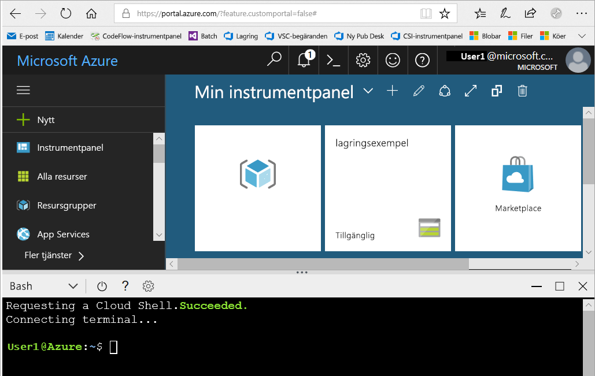
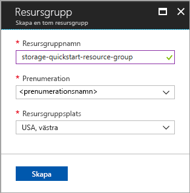
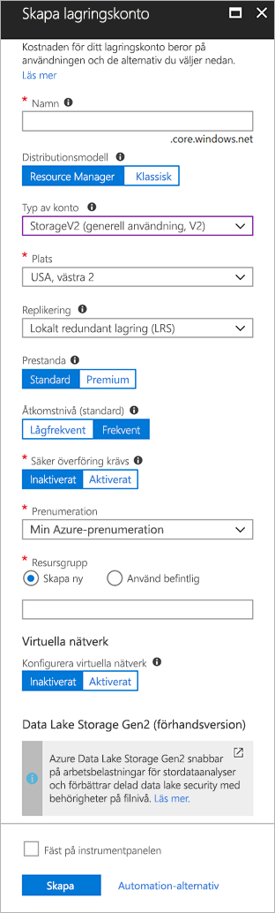

# <a name="quickstart-create-an-azure-data-lake-storage-gen2-preview-storage-account"></a>Snabbstart: Skapa ett Azure Data Lake Storage Gen2-lagringskonto (förhandsversion)

Azure Data Lake Storage Gen2-konton (förhandsversion) [har stöd för en hierarkisk namnområdestjänst](introduction.md) som tillhandahåller ett internt katalogbaserat filsystem som är skräddarsytt för att fungera med HDFS (Hadoop Distributed File System). Du kan komma åt Data Lake Storage Gen2-data från HDFS via [ABFS-drivrutinen](abfs-driver.md).

Om du vill aktivera Data Lake Storage Gen2-funktioner för ditt lagringskonto [fyller du i undersökningen för att begära åtkomst](https://aka.ms/adlsgen2signup). När din begäran har godkänts kan du skapa ett nytt Data Lake Storage Gen2-konto. Den här snabbstarten visar hur du skapar ett konto med [Azure-portalen](https://portal.azure.com/), [Azure PowerShell](https://docs.microsoft.com/powershell/azure/overview) eller [Azure CLI](https://docs.microsoft.com/cli/azure?view=azure-cli-latest).

> [!NOTE]
> Användargränssnittet för att skapa konto i Azure-portalen uppdateras när du har godkänts för att skapa ett Data Lake Storage Gen2-konto. På samma sätt fungerar Data Lake Storage Gen2-relaterade PowerShell- och CLI-argument endast när du har godkänts för förhandsversionen.

## <a name="prerequisites"></a>Krav

Om du inte har en Azure-prenumeration kan du skapa ett [kostnadsfritt konto](https://azure.microsoft.com/free/) innan du börjar.

|           | Krav |
|-----------|--------------|
|Portalen     | Inget         |
|PowerShell | Den här snabbstarten kräver Azure PowerShell-modul version **5.0.4-preview** eller senare. Kör `Get-Module -ListAvailable AzureRM` för att hitta din nuvarande version. Om du behöver installera eller uppgradera kan du läsa [Install Azure PowerShell module](/powershell/azure/install-azurerm-ps) (Installera Azure PowerShell-modul). |
|CLI        | Du kan logga in på Azure och köra Azure CLI-kommandon på något av två sätt: <ul><li>Du kan köra CLI-kommandon från Azure-portalen, i Azure Cloud Shell </li><li>Du kan installera CLI och köra CLI-kommandon lokalt</li></ul>|

När du arbetar på kommandoraden kan du välja om du vill köra Azure Cloud Shell eller installera CLI lokalt.

### <a name="use-azure-cloud-shell"></a>Använda Azure Cloud Shell

Azure Cloud Shell är ett kostnadsfritt Bash-gränssnitt som du kan köra direkt i Azure-portalen. Den har Azure CLI förinstallerat och har konfigurerats för användning med ditt konto. Klicka på knappen **Cloud Shell** på menyn längst upp till höger i Azure-portalen:

[](https://portal.azure.com)

Knappen startar ett interaktivt gränssnitt som du kan använda för att köra stegen i den här snabbstarten:

[](https://portal.azure.com)

### <a name="install-the-cli-locally"></a>Installera CLI lokalt

Du kan även installera och använda Azure CLI lokalt. För den här snabbstarten krävs att du kör Azure CLI version 2.0.38 eller senare. Kör `az --version` för att hitta versionen. Om du behöver installera eller uppgradera kan du läsa [Installera Azure CLI 2.0](/cli/azure/install-azure-cli).

## <a name="overview-of-creating-an-azure-data-lake-storage-gen2-account"></a>Översikt över hur du skapar ett Azure Data Lake Storage Gen2-konto

Innan du skapar ett konto ska du först skapa en resursgrupp som fungerar som en logisk container för lagringskonton eller någon annan Azure-resurs som du skapar. Om du vill rensa de resurser som har skapats med den här snabbstarten kan du helt enkelt ta bort resursgruppen. När du tar bort resursgruppen raderas även det kopplade lagringskontot och eventuella andra resurser som är kopplade till resursgruppen. Mer information om resursgrupper finns i [Översikt över Azure Resource Manager](../../azure-resource-manager/resource-group-overview.md).

> [!NOTE]
> Du måste skapa nya lagringskonton av typen **StorageV2 (generell användning V2)** för att kunna utnyttja Data Lake Storage Gen2-funktionerna.  

Mer information om typer av lagringskonton finns i [Alternativ för Azure Storage-konton](../common/storage-account-options.md).

Tänk på dessa regler när du namnger lagringskontot:

- Namnet på ett lagringskonto måste vara mellan 3 och 24 tecken långt och får endast innehålla siffror och gemener.
- Namnet på ditt lagringskonto måste vara unikt i Azure. Det får inte finnas två lagringskonton med samma namn.

## <a name="create-an-account-using-the-azure-portal"></a>Skapa ett konto med hjälp av Azure-portalen

Logga in på [Azure-portalen](https://portal.azure.com).

### <a name="create-a-resource-group"></a>Skapa en resursgrupp

Följ de här stegen för att skapa en resursgrupp i Azure-portalen:

1. I Azure-portalen expanderar du menyn på vänster sida för att öppna tjänstemenyn och väljer **Resursgrupper**.
2. Klicka på knappen **Lägg till** för att lägga till en ny resursgrupp.
3. Ange ett namn för den nya resursgruppen.
4. Välj den prenumeration där du vill skapa den nya resursgruppen.
5. Välj platsen för resursgruppen.
6. Klicka på knappen **Skapa**.  



### <a name="create-a-general-purpose-v2-storage-account"></a>Skapa ett v2-lagringskonto för generell användning

Följ de här stegen för att skapa ett GPv2-konto för generell användning i Azure-portalen:

> [!NOTE]
> Hierarkiskt namnområde är endast aktiverat i USA, västra 2 och USA, västra centrala. Se till att du anger någon av dessa platser när du skapar lagringskontot.

1. I Azure-portalen expanderar du menyn på vänster sida för att öppna tjänstemenyn och välja **Alla tjänster**. Rulla ned till **lagring** och välj **lagringskonton**. På fönstret **lagringskonton** som visas, väljer du **lägg till**.
2. Ange ett namn för lagringskontot.
3. Lämna **Distributionsmodell** inställt på standardvärdet.
4. Sätt fältet **Typ av konto** till **StorageV2 (generell användning v2)**.
5. Ange **USA, västra 2** som **Plats**
6. Låt fältet **Replikering** stå som **Lokalt redundant lagring (LRS)**.
7. Lämna standardvärdena i dessa fält: **Replikering**. **Prestanda**, **Åtkomstnivå**.
8. Välj den prenumeration där du vill skapa lagringskontot.
9. I avsnittet **Resursgrupp** väljer du **Använd befintlig** och väljer sedan den resursgrupp du skapade i föregående avsnitt.
10. Behåll standardvärdet för **Virtuella nätverk**
11. I avsnittet **Data Lake Storage Gen2 (preview)** väljer du **Aktiverad** för **Hierarkiskt namnområde**.
12. Skapa lagringskontot genom att klicka på **Skapa**.



Nu har ditt lagringskonto skapats via Portal.

### <a name="clean-up-resources"></a>Rensa resurser

Ta bort en resursgrupp med Azure-portalen:

1. I Azure-portalen expanderar du menyn på vänster sida för att öppna tjänstemenyn och väljer **Resursgrupper** för att visa listan över dina resursgrupper.
2. Leta reda på den resursgrupp du vill ta bort och högerklicka på knappen **Mer** (**...**) till höger om listan.
3. Välj **Ta bort resursgrupp** och bekräfta.


## <a name="upgrade-your-powershell-module"></a>Uppgradera din PowerShell-modul

För att kunna interagera med Data Lake Storage Gen2 via PowerShell måste du uppgradera modulen till förhandsversionen.

Det gör du genom att öppna förhöjt PowerShell och ange följande kommando: `Install-Module AzureRM.Storage –Repository PSGallery -RequiredVersion 5.0.4-preview –AllowPrerelease –AllowClobber –Force `

Starta sedan om gränssnittet.

## <a name="create-an-account-using-powershell"></a>Skapa ett lagringskonto med PowerShell

Logga in på Azure-prenumerationen med kommandot `Login-AzureRmAccount` och följ anvisningarna på skärmen för att autentisera.

```powershell
Login-AzureRmAccount
```

### <a name="create-a-resource-group"></a>Skapa en resursgrupp

Om du vill skapa en resursgrupp med PowerShell använder du kommandot [New-AzureRmResourceGroup](/powershell/module/azurerm.resources/new-azurermresourcegroup): 

> [!NOTE]
> Hierarkiskt namnområde är endast aktiverat i USA, västra 2 och USA, västra centrala. Se till att du anger någon av dessa platser när du skapar lagringskontot.

```powershell
# put resource group in a variable so you can use the same group name going forward,
# without hardcoding it repeatedly
$resourceGroup = "storage-quickstart-resource-group"
$location = "westus2"
New-AzureRmResourceGroup -Name $resourceGroup -Location $location
```

### <a name="create-a-general-purpose-v2-storage-account"></a>Skapa ett v2-lagringskonto för generell användning

Om du vill skapa ett GPv2-lagringskonto för generell användning från PowerShell med lokalt redundant lagring (LRS) använder du kommandot [New-AzureRmStorageAccount](/powershell/module/azurerm.storage/New-AzureRmStorageAccount):

```powershell
Get-AzureRmLocation | select Location 
$location = "westus2"

New-AzureRmStorageAccount -ResourceGroupName $resourceGroup `
  -Name "storagequickstart" `
  -Location $location `
  -SkuName Standard_LRS `
  -Kind StorageV2 
  -EnableHierarchicalNamespace $True
```

### <a name="clean-up-resources"></a>Rensa resurser

Om du vill ta bort resursgruppen och dess kopplade resurser, inklusive det nya lagringskontot, använder du kommandot [Remove-AzureRmResourceGroup](/powershell/module/azurerm.resources/remove-azurermresourcegroup): 

```powershell
Remove-AzureRmResourceGroup -Name $resourceGroup
```

## <a name="upgrade-your-cli-module"></a>Uppgradera CLI-modulen

För att kunna interagera med Data Lake Storage Gen2 via CLI måste du lägga till tillägget för gränssnittet.

Det gör du genom att använda Cloud Shell eller ett lokalt gränssnitt och ange följande kommando: `az extension add --name storage-preview`

## <a name="create-an-account-using-azure-cli"></a>Skapa ett konto med Azure CLI 

Starta Azure Cloud Shell genom att logga in på [Azure-portalen](https://portal.azure.com).

Logga in på den lokala installationen av CLI genom att köra inloggningskommandot:

```cli
az login
```

### <a name="create-a-resource-group"></a>Skapa en resursgrupp

Om du vill skapa en ny resursgrupp med Azure CLI använder du kommandot [az group create](/cli/azure/group#az_group_create). 

```azurecli-interactive
az group create \
    --name storage-quickstart-resource-group \
    --location westus2
```

> [!NOTE]
> Hierarkiskt namnområde är endast aktiverat i USA, västra 2 och USA, västra centrala. Se till att du anger någon av dessa platser när du skapar lagringskontot.

### <a name="create-a-general-purpose-v2-storage-account"></a>Skapa ett v2-lagringskonto för generell användning

Om du vill skapa ett allmänt GPv2-lagringskonto för generell användning från Azure CLI med lokalt redundant lagring använder du kommandot [az storage account create](/cli/azure/storage/account#az_storage_account_create).

```azurecli-interactive
az storage account create \
    --name storagequickstart \
    --resource-group storage-quickstart-resource-group \
    --location westus2 \
    --sku Standard_LRS \
    --kind StorageV2 \
    --Enable-hierarchical-namespace true
```

### <a name="clean-up-resources"></a>Rensa resurser

Om du vill ta bort resursgruppen och dess kopplade resurser, inklusive det nya lagringskontot, använder du kommandot [az group delete](/cli/azure/group#az_group_delete).

```azurecli-interactive
az group delete --name myResourceGroup
```

## <a name="next-steps"></a>Nästa steg

I den här snabbstarten har du skapat ett Data Lake Storage Gen2-lagringskonto. Om du vill lära dig hur du laddar upp och ned blobar till och från lagringskontot kan du fortsätta med snabbstarten om Blob Storage.

* [Flytta data till och från Azure Blob Storage med AzCopy](https://docs.microsoft.com/en-us/azure/machine-learning/team-data-science-process/move-data-to-azure-blob-using-azcopy)