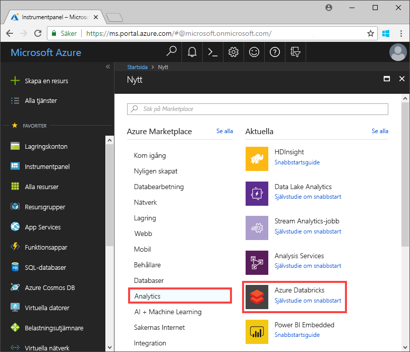
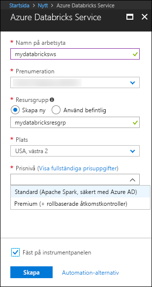
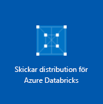
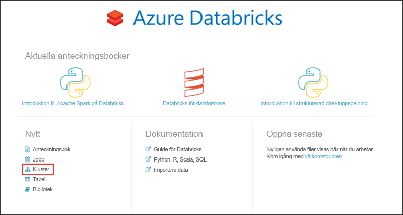
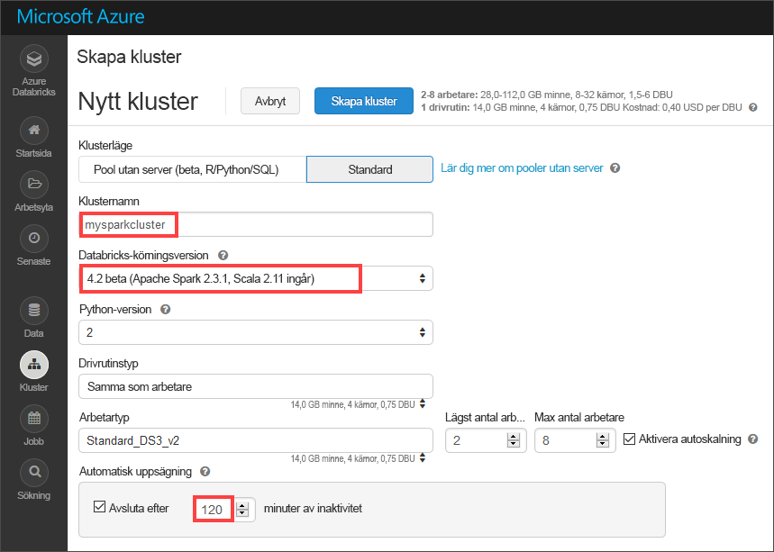
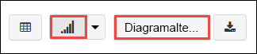
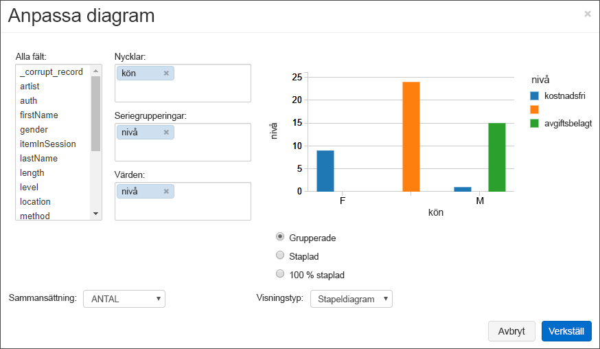
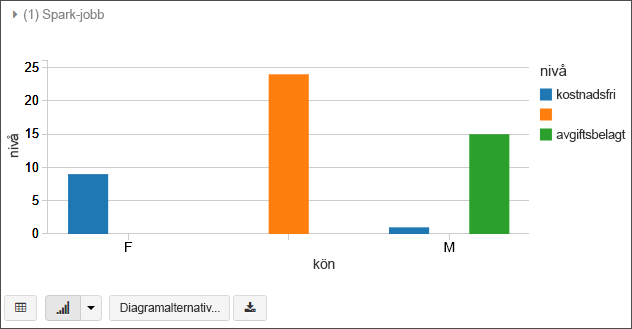
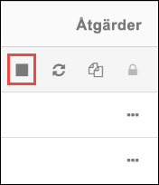

# <a name="quickstart-run-a-spark-job-on-azure-databricks-using-the-azure-portal"></a>Snabbstart: Köra ett Spark-jobb på Azure Databricks med Azure Portal

Den här självstudien visar hur du kör ett Apache Spark-jobb med Azure Databricks för att utföra analyser på data som lagras i Azure Data Lake Storage Gen2 (förhandsversion).

Som en del av Spark-jobbet analyserar du prenumerationsdata för en radiokanal, så att du får insikter om kostnadsfri/betald användning baserat på demografiska data.

Om du inte har en Azure-prenumeration kan du [skapa ett kostnadsfritt konto ](https://azure.microsoft.com/free/) innan du börjar.

## <a name="prerequisites"></a>Nödvändiga komponenter

- [Skapa ett Azure Data Lake Storage Gen2-konto](quickstart-create-account.md)

## <a name="set-aside-storage-account-configuration"></a>Spara lagringskontokonfiguration

> [!IMPORTANT]
> I den här självstudien behöver du ha åtkomst till namnet på ditt lagringskonto samt åtkomstnyckeln. I Azure Portal väljer du **Alla tjänster** och filtrerar på *lagring*. Välj **Lagringskonton** och leta upp det konto som du skapade för den här självstudien.
>
> I **Översikt** kopierar du **namnet** på lagringskontot till ett textredigeringsprogram. Välj sedan **Åtkomstnycklar** och kopiera värdet för **key1** till textredigeringsprogrammet eftersom båda värdena behövs för de kommandon som kommer senare.

## <a name="create-an-azure-databricks-workspace"></a>Skapa en Azure Databricks-arbetsyta

I det här avsnittet skapar du en Azure Databricks-arbetsyta med Azure-portalen.

1. Välj **Skapa en resurs** > **Analys** > **Azure Databricks** i Azure-portalen. 

    

2. Under **Azure Databricks-tjänst** anger du värden för att skapa en Databricks-arbetsyta.

    

    Ange följande värden:
     
    |Egenskap  |Beskrivning  |
    |---------|---------|
    |**Namn på arbetsyta**     | Ange ett namn för Databricks-arbetsytan        |
    |**Prenumeration**     | I listrutan väljer du din Azure-prenumeration.        |
    |**Resursgrupp**     | Ange om du vill skapa en ny resursgrupp eller använda en befintlig. En resursgrupp är en container som innehåller relaterade resurser för en Azure-lösning. Mer information finns i [översikten över Azure-resursgrupper](../../azure-resource-manager/resource-group-overview.md). |
    |**Plats**     | Välj **USA, västra 2**. Du kan välja en annan offentlig region om du vill.        |
    |**Prisnivå**     |  Välj mellan **Standard** och **Premium**. Mer information om de här nivåerna finns på [prissättningssidan för Databricks](https://azure.microsoft.com/pricing/details/databricks/).       |

    Markera **Fäst på instrumentpanelen** och klicka sedan på **Skapa**.

3. Det tar några minuter att skapa arbetsytan. När arbetsytan skapas i portalen visas panelen för att **skicka distribution för Azure Databricks** på höger sida. Du kan behöva rulla åt höger på instrumentpanelen för att se panelen. En förloppsindikator visas även längst upp på skärmen. Båda dessa områden visar förloppet.

    

## <a name="create-a-spark-cluster-in-databricks"></a>Skapa ett Spark-kluster i Databricks

1. I Azure-portalen går du till Databricks-arbetsytan som du skapade. Välj sedan **Starta arbetsyta**.

2. Du omdirigeras till Azure Databricks-portalen. Välj **Nytt** > **Kluster** i Portal.

    

3. På sidan **Nytt kluster** anger du värdena för att skapa ett kluster.

    

    Godkänn alla övriga standardvärden, förutom följande:

    * Ange ett namn för klustret.
    * Skapa ett kluster med körningen **4.2 (beta)**.
    * Se till att markera kryssrutan **Avsluta efter 120 minuters inaktivitet**. Ange en varaktighet (i minuter) för att avsluta klustret om klustret inte används.

4. Välj **Skapa kluster**. När klustret körs kan du ansluta anteckningsböcker till klustret och köra Spark-jobb.

Mer information om att skapa kluster finns i [Skapa ett Spark-kluster i Azure Databricks](https://docs.azuredatabricks.net/user-guide/clusters/create.html).

## <a name="create-storage-account-file-system"></a>Skapa filsystem för lagringskonto

I det här avsnittet skapar du en anteckningsbok på Azure Databricks-arbetsytan och kör sedan kodfragment för att konfigurera lagringskontot.

1. Gå till arbetsytan Azure Databricks som du skapat i [Azure-portalen](https://portal.azure.com). Välj sedan **Starta arbetsyta**.

2. Välj **Arbetsyta** i det vänstra fönstret. I listrutan **Arbetsyta** väljer du **Skapa** > **Anteckningsbok**.

    

3. Ge anteckningsboken ett namn i dialogrutan **Skapa anteckningsbok**. Välj **Scala** som språk och välj sedan det Spark-kluster som du skapade tidigare.

    

    Välj **Skapa**.

4. I följande kod ersätter du texten **ACCOUNT_NAME** och **ACCOUNT_KEY** med de värden som du bevarade i början av den här snabbstarten. Byt även ut texten **FILE_SYSTEM_NAME** med det namn som du vill att ditt filsystem ska ha. Ange sedan koden i den första cellen.

    ```scala
    spark.conf.set("fs.azure.account.key.<ACCOUNT_NAME>.dfs.core.windows.net", "<ACCOUNT_KEY>") 
    spark.conf.set("fs.azure.createRemoteFileSystemDuringInitialization", "true")
    dbutils.fs.ls("abfss://<FILE_SYSTEM_NAME>@<ACCOUNT_NAME>.dfs.core.windows.net/")
    spark.conf.set("fs.azure.createRemoteFileSystemDuringInitialization", "false") 
    ```

    Kör kodcellen genom att trycka på **SKIFT + RETUR**.

    Nu skapas filsystemet för lagringskontot.

## <a name="ingest-sample-data"></a>Mata in exempeldata

Innan du börjar med det här avsnittet måste du slutföra följande krav:

Ange följande kod i en cell i en arbetsbok:

    %sh wget -P /tmp https://raw.githubusercontent.com/Azure/usql/master/Examples/Samples/Data/json/radiowebsite/small_radio_json.json

I cellen trycker du på `Shift` + `Enter` för att köra koden.

I cellen nedanför denna anger du följande (ersätt **FILE_SYSTEM** och **ACCOUNT_NAME** med samma värden som du använde tidigare):

    dbutils.fs.cp("file:///tmp/small_radio_json.json", "abfss://<FILE_SYSTEM>@<ACCOUNT_NAME>.dfs.core.windows.net/")

I cellen trycker du på `Shift` + `Enter` för att köra koden.

## <a name="run-a-spark-sql-job"></a>Köra ett Spark SQL-jobb

Utför följande åtgärder för att köra ett Spark SQL-jobb på data.

1. Kör en SQL-instruktion för att skapa en temporär tabell med data från exempel-JSON-datafilen **small_radio_json.json**. I följande kodfragment ersätter du platshållarens värden med namnet på ditt filsystem och namnet på ditt lagringskonto. Använd anteckningsboken du skapade tidigare för att klistra in följande kodfragment i en kodcell och tryck sedan på SKIFT+RETUR.

    ```sql
    %sql
    DROP TABLE IF EXISTS radio_sample_data;
    CREATE TABLE radio_sample_data
    USING json
    OPTIONS (
     path  "abfss://<FILE_SYSTEM_NAME>@<ACCOUNT_NAME>.dfs.core.windows.net/<PATH>/small_radio_json.json"
    )
    ```

    När kommandot har slutförts har du alla data från JSON-filen som en tabell i Databricks-klustret.

    Med det magiska språkkommandot `%sql` kan du köra en SQL-kod från anteckningsboken även om anteckningsboken är av en annan typ. Mer information finns i [Mixing languages in a notebook](https://docs.azuredatabricks.net/user-guide/notebooks/index.html#mixing-languages-in-a-notebook) (Blanda språk i en anteckningsbok).

2. Nu ska vi titta på en ögonblicksbild av JSON-exempeldata för att bättre förstå den fråga som körs. Klistra in följande kodfragment i kodcellen och tryck på **SKIFT + RETUR**.

    ```sql
    %sql 
    SELECT * from radio_sample_data
    ```

3. Du ser en tabellvy som i följande skärmbild (endast vissa kolumner visas):

    

    Bland annat fångar exempeldata in könet på en radiokanals målgrupp (kolumnnamn, **kön**)  och om deras prenumeration är kostnadsfri eller om den betalas (kolumnnamn, **nivå**).

4. Nu skapar du en visuell representation av dessa data för att visa hur många användare av varje kön som har kostnadsfria konton och hur många som är betalande prenumeranter. Längst ned i tabellvyn klickar du på ikonen **Stapeldiagram** och sedan på **Ritalternativ**.

    

5. I **Anpassa ritning** drar och släpper du värden enligt skärmbilden.

    

    - Ställ in **Nycklar** på **kön**.
    - Ställ in **Seriegrupperingar** på **nivå**.
    - Ställ in **Värden** på **nivå**.
    - Ställ in **Sammansättning** på **COUNT** (Antal).

6. Klicka på **Verkställ**.

7. Utdata visar den visuella representationen som visas i följande skärmbild:

     

## <a name="clean-up-resources"></a>Rensa resurser

Du kan avsluta klustret när du är klar med den här artikeln. I Azure Databricks-arbetsytan väljer du **Kluster** och letar reda på det kluster som du vill avsluta. För markören över de tre punkterna under kolumnen **Åtgärder**. Välj sedan ikonen **Avsluta**.



Om du inte manuellt avslutar klustret kommer det att stoppas automatiskt, förutsatt att du har markerat kryssrutan **Avsluta efter ___ minuters inaktivitet** när klustret skapades. Om du väljer det här alternativet avslutas klustret när det har varit inaktivt i den tid som angetts.

## <a name="next-steps"></a>Nästa steg

I den här artikeln skapade du ett Spark-kluster i Azure Databricks och körde ett Spark-jobb med data i Data Lake Storage Gen2. Du kan också titta på [Spark-datakällor](https://docs.azuredatabricks.net/spark/latest/data-sources/index.html) för att lära dig att importera data från andra datakällor till Azure Databricks. Gå till nästa artikel om du vill lära dig hur du utför en ETL-åtgärd (extrahera, transformera och läsa in data) med Azure Databricks.

> [!div class="nextstepaction"]
>[Extrahera, transformera och läsa in data med Azure Databricks](../../azure-databricks/databricks-extract-load-sql-data-warehouse.md)
